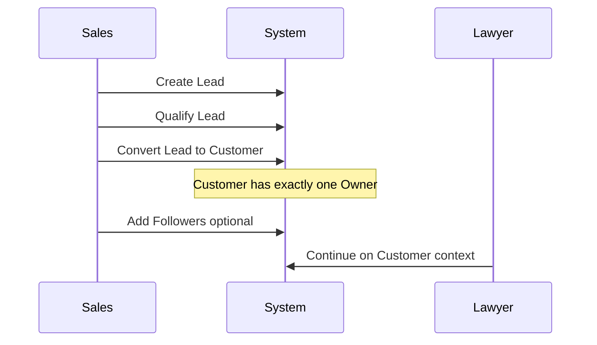
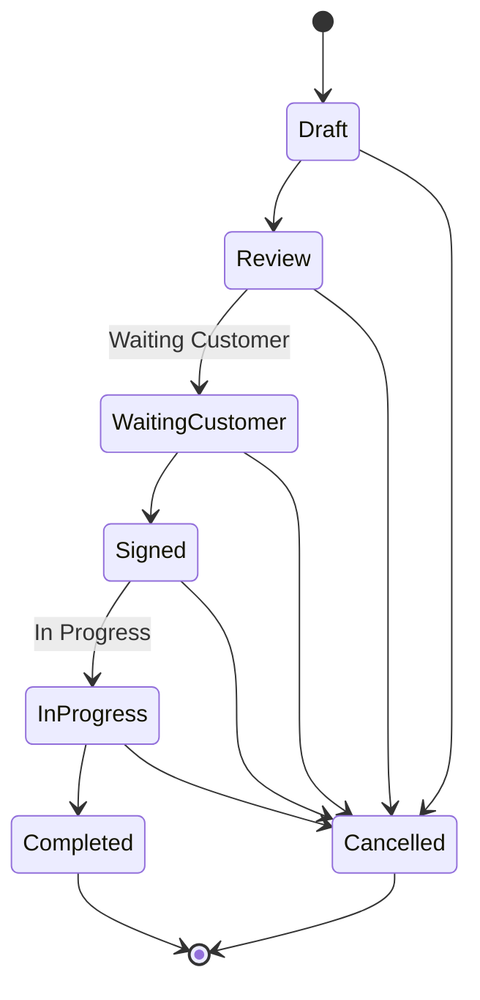
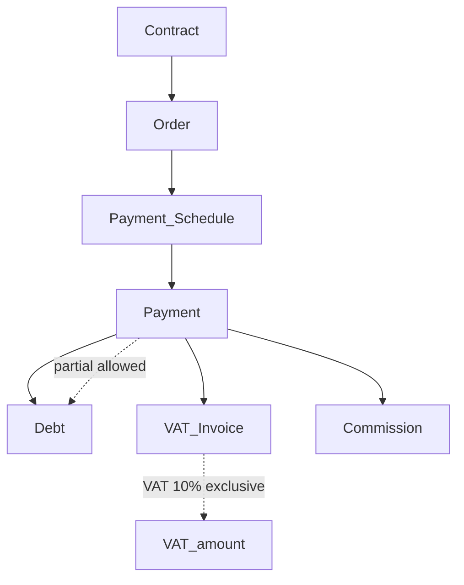

# Business — DYN CRM

> Vietnamese version: [Business.vi.md](./Business.vi.md)

## 1. Purpose

Describe the business context, actors, and end-to-end value streams that DYN CRM supports, without inventing unconfirmed operational policies.

## 2. Scope

| In scope | Out of scope |
|----------|--------------|
| Business actors and responsibilities (role-level) | Detailed permission matrices (auth domain docs) |
| Core value streams | Screen-level UX |
| Relationships between commercial and legal objects | Tax filing / e-invoice authority integration (not confirmed) |

## 3. Background

DYN CRM serves a **law firm** offering **general legal consulting** in MVP. The firm needs coordinated work across sales, legal delivery, accounting, management, and external collaborators (CTV / referral partners).

Approximate scale: **~30 concurrent users** on a single-tenant deployment.

## 4. Design

### 4.1 Business actors

| Actor | Role in firm | Primary system use |
|-------|--------------|--------------------|
| Super Admin | Platform authority | Configuration, users, security |
| Admin | Firm administration | Users, settings, templates |
| Manager | Oversight | Pipelines, workload, KPIs |
| Sales | Acquisition | Leads, qualification, customer handoff |
| Lawyer | Legal delivery | Contracts, workflow, files, timeline |
| Legal Assistant | Delivery support | Tasks, files, customer support data |
| Accounting | Finance | Orders, invoices, VAT, payments |
| Collaborator (CTV) | External referral partner | Collaboration portal: assigned customers, contract requests, referrals, commission, profile |

### 4.2 Core business objects (canonical)

| Object | Business meaning |
|--------|------------------|
| Lead | Potential client before becoming a Customer |
| Customer | Individual or Company client record |
| Contact | Person related to a Customer (and possibly Lead) |
| Contract | Legal agreement with the Customer |
| Order | Financial transaction generated from a Contract |
| Invoice | VAT bill issued **after** Payment (may reference Contract / Milestone / Manual) |
| Payment | Collected money (full or partial) against schedule/obligation — **before** VAT Invoice |
| Commission | Amount owed to entitled party based on collected payment |
| Workflow | Configurable execution path with tasks |
| File | Stored document via StoragePort (MVP: Supabase Storage) |
| Activity / Timeline | Historical record of meaningful actions |

### 4.3 Primary value streams

#### VS-1: Acquire client

#### VS-2: Contract and deliver work

> **Note:** Exact which statuses may transition to Cancelled is **not fully locked**. The diagram shows a conservative working assumption for discussion; final rules belong in `02-domain/Contract.md`.

Workflow templates run in parallel with contract progress: stages, tasks, due dates, assignees, reminders. Kanban is the operational view.

#### VS-3: Finance collection

VAT Invoice is created **after** Payment. Invoice may still reference Contract, Milestone, or Manual context.

#### VS-4: Collaborator commission

1. CTV refers opportunity / is assigned customers (referral linkage details in Collaboration domain).
2. CTV may submit Contract Request; staff approve → Official Contract (LegalOperation).
3. Customer/contract/payment proceeds in CRM (staff roles).
4. On **collected payment**, commission engine applies **configurable %**.
5. CTV views own commission (and scoped portal data) only.

### 4.4 Organizational assumptions (locked)

| Topic | Decision |
|-------|----------|
| Tenancy | One firm (single-tenant) in MVP |
| Consulting scope | General legal consulting |
| Currency | VND |
| VAT | 10% exclusive |
| Commission philosophy | Cash-based (collected payment) |

## 5. Business Rules

1. Lead and Customer are distinct; conversion is an explicit business action.
2. Customer Owner is mandatory and singular; Followers are optional and non-replacing.
3. Contract is legal; Order is financial; do not use one term for both.
4. Payments may be partial; finance views must show remaining balances (calculation rules in domain/finance docs).
5. Commission must not be calculated from unpaid invoice amounts or raw contract value in MVP.
6. CTV must not perform full staff CRM/Legal/Finance operations; Collaboration portal only (assigned customers + contract requests allowed).
7. Unconfirmed policies (discount authority, refunds, credit notes, e-invoice legal export) are **out of documented rules** until decided.

## 6. Best Practices

- When modeling APIs/entities, name fields after Glossary terms.
- Separate “legal status” (Contract) from “work task status” (Workflow Task) to avoid dual sources of truth.
- Keep accounting workflows auditable: who created invoice/payment and when.
- Challenge requests that mix Order semantics into Contract UI without finance review.

### Architect challenge (recorded)

**Contract “In Progress/Completed” vs Workflow completion** can drift. Recommendation for Phase 02:

- Contract status = commercial/legal lifecycle.
- Workflow = operational execution.
- Completion of contract should require explicit business rule (e.g. all mandatory workflow tasks done **or** manager override) — **to be decided**, not implemented as silent auto-complete.

## 7. Examples

**Example A — Individual client**  
Sales creates Lead “Nguyen Van A”, qualifies, converts to Customer (Individual), Owner = Sales user. Lawyer creates Contract (Draft → … → Signed). Admin workflow template assigned. Accounting creates Order and Payment Schedule, records Bank Transfer partial payment, then issues VAT Invoice (exclusive). Commission job accrues % of collected amount to linked CTV if any.

**Example B — Company client**  
Customer type Company with Contacts (signatory, accountant). Same contract/finance chain. Followers include Legal Assistant.

**Example C — CTV**  
CTV logs into Collaboration portal, manages assigned customers, may submit a Contract Request, sees own commission from collected payments. Attempt to open staff Contracts list or create Official Contract directly is denied.

## 8. Future Improvements

| Business capability | Phase |
|---------------------|-------|
| Practice-area specialization | Post-MVP |
| Shared / tier / team commission | Post-MVP |
| Payment gateways | Future |
| Multi-currency engagements | Future |
| Multi-tenant firm isolation | Future |
| English UI for bilingual staff | Phase 2 |

## 9. References

- `Scope.md`
- `Glossary.md`
- `Vision.md`
- Stakeholder decisions 2026-08-02

---

## Suggested related documents

- `Scope.md` — module boundaries
- `02-domain/Customer.md`, `Lead` (Phase 02), `Contract.md`, `Order.md`, `Commission.md`
- `01-architecture/Security.md` — RBAC design

## TODO

- [ ] Confirm law firm legal entity name and branding
- [ ] Confirm Lead → Customer conversion field mapping
- [ ] Confirm how CTV is linked to Lead/Customer/Contract/Payment
- [ ] Confirm refund / credit note / void invoice policy (if any)
- [ ] Confirm e-invoice (HĐĐT) regulatory integration need
- [ ] Lock Cancelled transition matrix for Contract
- [ ] Lock rule linking Contract completion to Workflow completion
