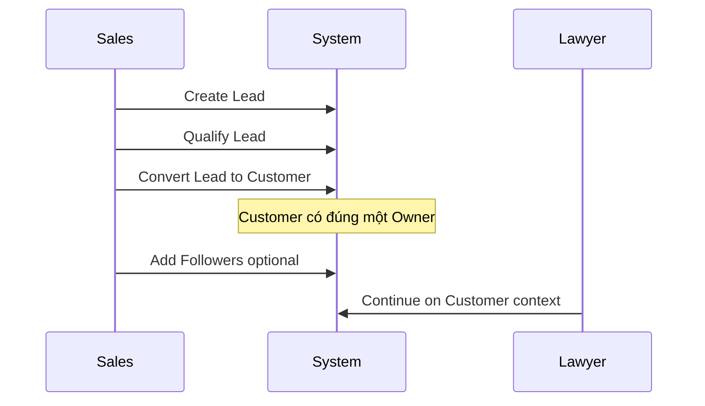
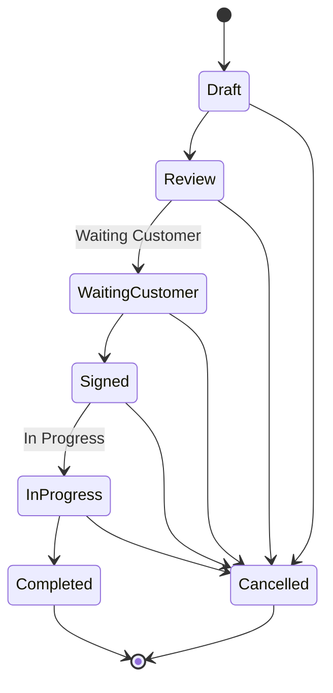
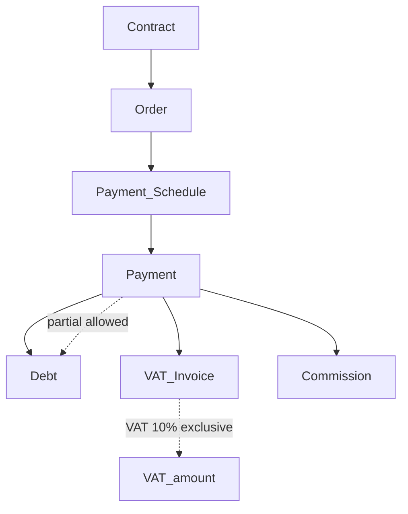

# Nghiệp vụ — DYN CRM

> Bản tiếng Việt của [Business.md](./Business.md). Canonical: bản English.

## 1. Mục đích

Mô tả bối cảnh nghiệp vụ, các actor, và value stream end-to-end mà DYN CRM hỗ trợ — **không bịa** chính sách vận hành chưa được xác nhận.

## 2. Phạm vi

| Trong phạm vi | Ngoài phạm vi |
|---------------|---------------|
| Actor nghiệp vụ và trách nhiệm (mức role) | Ma trận permission chi tiết (auth/domain docs) |
| Value stream lõi | UX cấp màn hình |
| Quan hệ giữa đối tượng thương mại và pháp lý | Kê khai thuế / tích hợp HĐĐT cơ quan thuế (chưa xác nhận) |

## 3. Bối cảnh

DYN CRM phục vụ **văn phòng luật** cung cấp **tư vấn pháp lý tổng quát** trong MVP. Cần phối hợp sales, giao hàng pháp lý, kế toán, quản lý. Portal CTV **SUPERSEDED (2026-08-17)**; tiền CTV (nếu có) là thu/chi hoặc note Finance.

Quy mô ước lượng: **~30 user đồng thời**, triển khai single-tenant.

## 4. Thiết kế

### 4.1 Actor nghiệp vụ

| Actor | Vai trò trong VP | Dùng hệ thống chính |
|-------|------------------|---------------------|
| Super Admin | Quyền nền tảng | Cấu hình, user, bảo mật |
| Admin | Quản trị văn phòng | User, settings, template |
| Manager | Giám sát | Pipeline, workload, KPI |
| Sales | Thu hút khách | Lead, qualify, bàn giao customer |
| Lawyer | Giao hàng pháp lý | Contract, workflow, file, timeline |
| Legal Assistant | Hỗ trợ giao hàng | Task, file, dữ liệu hỗ trợ khách |
| Accounting | Tài chính | Order, invoice, VAT, payment |
| Collaborator (CTV) | Đối tác ngoài (lịch sử) | **Không phải actor hệ thống** trừ khi S6 đảo; tiền qua Finance |

### 4.2 Đối tượng nghiệp vụ lõi (canonical)

| Đối tượng | Ý nghĩa nghiệp vụ |
|-----------|-------------------|
| Lead | Khách tiềm năng trước khi thành Customer |
| Customer | Hồ sơ khách: Cá nhân hoặc Công ty |
| Contact | Người liên quan tới Customer (và có thể Lead) |
| Contract | Thỏa thuận pháp lý với Customer |
| Order | Giao dịch tài chính sinh từ Contract |
| Invoice | Hóa đơn VAT phát hành **sau** Payment (có thể tham chiếu Contract / Milestone / Manual) |
| Payment | Khoản tiền đã thu (toàn phần hoặc một phần) theo lịch/nghĩa vụ — **trước** hóa đơn VAT |
| Commission | Số tiền hoa hồng theo thanh toán đã thu |
| Workflow | Đường thực thi cấu hình được kèm task |
| File | Tài liệu lưu qua StoragePort (MVP: Supabase Storage) |
| Activity / Timeline | Lịch sử hành động có ý nghĩa |

### 4.3 Value stream chính

#### VS-1: Thu hút khách

#### VS-2: Hợp đồng và giao việc

> **Lưu ý:** Status nào được chuyển sang Cancelled **chưa khóa hoàn toàn**. Sơ đồ là giả định làm việc để thảo luận; rule cuối thuộc `02-domain/Contract.md`.

Workflow template chạy song song với tiến độ hợp đồng: stage, task, hạn, assignee, nhắc việc. Kanban là góc nhìn vận hành.

#### VS-3: Thu tiền

Hóa đơn VAT tạo **sau** Payment. Invoice vẫn có thể tham chiếu Contract, Milestone, hoặc Manual.

#### VS-4: Tiền CTV (2026-08-17)

Không funnel portal. Nếu có tiền liên quan CTV, kế toán ghi **Thu/Chi hoặc note** trong Finance. Ngữ nghĩa (thu vs chi vs note) vẫn **Open Question**. Không implement Contract Request hay portal hoa hồng.

### 4.4 Giả định tổ chức (đã khóa)

| Chủ đề | Quyết định |
|--------|------------|
| Tenancy | Một văn phòng (single-tenant) trong MVP |
| Phạm vi tư vấn | Tư vấn pháp lý tổng quát |
| Tiền tệ | VND |
| VAT | 10% exclusive |
| Triết lý hoa hồng | Theo tiền thực thu (collected payment) |

## 5. Quy tắc nghiệp vụ

1. Lead và Customer tách biệt; convert là hành động nghiệp vụ tường minh.
2. Owner của Customer bắt buộc và duy nhất; Follower tùy chọn, không thay Owner.
3. Contract là pháp lý; Order là tài chính; không dùng một từ cho cả hai.
4. Thanh toán có thể một phần; màn hình finance phải hiện số còn lại (cách tính ở domain/finance docs).
5. MVP không tính hoa hồng từ số chưa thu trên invoice hay giá trị hợp đồng thô.
6. Portal CTV **ngoài MVP** chờ khóa lại Scope (2026-08-17).  
7. Chính sách chưa xác nhận (giảm giá, refund, credit note, HĐĐT, lưu Thu/Chi) **không** thành rule cho đến khi quyết.
7. Chính sách chưa xác nhận (giảm giá, hoàn tiền, credit note, xuất HĐĐT) **chưa nằm trong rule đã tài liệu hóa**.

## 6. Best practices

- Khi model API/entity, đặt tên theo Glossary.
- Tách “status pháp lý/thương mại” (Contract) khỏi “status task” (Workflow Task) để tránh hai nguồn sự thật.
- Luồng kế toán phải audit được: ai tạo invoice/payment, khi nào.
- Phản biện request trộn ngữ nghĩa Order vào UI Contract nếu chưa qua finance review.

### Thách thức kiến trúc (đã ghi nhận)

**Contract “In Progress/Completed” vs hoàn thành Workflow** có thể lệch. Đề xuất Phase 02:

- Status Contract = vòng đời thương mại/pháp lý.
- Workflow = thực thi vận hành.
- Hoàn thành Contract cần rule tường minh (vd. hết task bắt buộc **hoặc** manager override) — **cần quyết định**, không auto-complete âm thầm.

## 7. Ví dụ

**Ví dụ A — Khách cá nhân**  
Sales tạo Lead “Nguyễn Văn A”, qualify, convert thành Customer (Individual), Owner = user Sales. Luật sư tạo Contract (Draft → … → Signed). Gán workflow template. Kế toán tạo Order và Payment Schedule, ghi nhận chuyển khoản một phần, rồi xuất hóa đơn VAT (exclusive). Job hoa hồng cộng % số đã thu cho CTV liên kết (nếu có).

**Ví dụ B — Khách công ty**  
Customer loại Company với Contact (người ký, kế toán). Cùng chuỗi contract/finance. Follower gồm Legal Assistant.

**Ví dụ C — CTV (lịch sử, không implement)**  
Portal 2026-08-03 **SUPERSEDED**. Chỉ ghi tiền CTV ở Finance nếu cần.

## 8. Cải tiến tương lai

| Năng lực nghiệp vụ | Phase |
|--------------------|-------|
| Chuyên biệt lĩnh vực | Sau MVP |
| Hoa hồng chia sẻ / tier / team | Sau MVP |
| Cổng thanh toán | Tương lai |
| Engagement đa tiền tệ | Tương lai |
| Cô lập multi-tenant | Tương lai |
| UI English cho nhân sự song ngữ | Phase 2 |

## 9. Tham chiếu

- `Scope.md` / `Scope.vi.md`
- `Glossary.md` / `Glossary.vi.md`
- `Vision.md` / `Vision.vi.md`
- Quyết định stakeholder 2026-08-02

---

## Tài liệu liên quan gợi ý

- `Scope.vi.md` — ranh giới module
- `02-domain/Customer.md`, Lead (Phase 02), `Contract.md`, `Order.md`, `Commission.md`
- `01-architecture/Security.md` — thiết kế RBAC

## TODO

- [ ] Xác nhận tên pháp lý và branding văn phòng luật
- [ ] Xác nhận mapping field Lead → Customer khi convert
- [ ] Khóa lại việc gỡ CTV (S6) vs khôi phục portal
- [ ] Xác nhận chính sách hoàn tiền / credit note / void invoice (nếu có)
- [ ] Xác nhận nhu cầu tích hợp HĐĐT
- [ ] Khóa ma trận chuyển Cancelled cho Contract
- [ ] Khóa rule gắn hoàn thành Contract với hoàn thành Workflow
