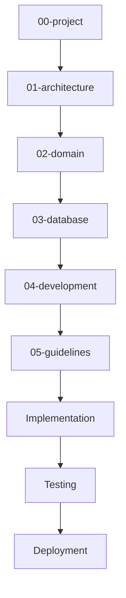

# DYN CRM — Project Documentation Index

> Vietnamese version: [README.vi.md](./README.vi.md)  
> **Canonical technical source:** English. If EN and VI diverge, English wins until synchronized.

## 1. Purpose

This folder is the single entry point for project-level documentation of **DYN CRM**. It answers *why* the product exists, *what* is in scope for MVP, *how* work is phased, and *which terms* the team must use consistently.

## 2. Scope

| In scope | Out of scope |
|----------|--------------|
| Product vision and goals | Detailed domain entity schemas (see `02-domain/`) |
| MVP boundaries and exclusions | Database ERD and Prisma models (see `03-database/`) |
| High-level business model | Coding conventions (see `04-development/`) |
| Timeline and roadmap | Architecture deep-dive (see `01-architecture/`) |
| Shared glossary | Implementation code |

Audience: product owners, tech leads, engineers, QA, and future joiners.

## 3. Background

DYN CRM is a CRM/ERP-style system for a **law firm**. It manages customers and leads, legal contracts, configurable workflows, finance (order → payment → invoice), VAT, dashboards, and notifications. CTV portal is **SUPERSEDED 2026-08-17** pending re-lock.

| Attribute | Decision (locked) |
|-----------|-------------------|
| Product name | DYN CRM |
| Tenancy (MVP) | Single-tenant |
| Tenancy (future) | Multi-tenant ready |
| UI language (MVP) | Vietnamese |
| UI language (Phase 2) | English |
| Technical docs language | English |
| MVP duration | 4–5 months |
| Architecture | Modular monolith (DDD-lite) |
| Repository | Monorepo (`apps/`, `packages/`, `docs/`) |

Documentation is **phase-based**. This folder is **Phase 00**. Later phases must not contradict locked decisions here without an ADR update.

## 4. Design

### 4.1 Documentation map

### 4.2 Documents in this folder

| English | Vietnamese | Role |
|---------|------------|------|
| [README.md](./README.md) | [README.vi.md](./README.vi.md) | Index / entry point |
| [Vision.md](./Vision.md) | [Vision.vi.md](./Vision.vi.md) | Product vision, goals, success criteria |
| [Scope.md](./Scope.md) | [Scope.vi.md](./Scope.vi.md) | MVP in/out of scope, module inventory |
| [Business.md](./Business.md) | [Business.vi.md](./Business.vi.md) | Business context, actors, value streams |
| [Timeline.md](./Timeline.md) | [Timeline.vi.md](./Timeline.vi.md) | 4–5 month MVP schedule |
| [Roadmap.md](./Roadmap.md) | [Roadmap.vi.md](./Roadmap.vi.md) | Post-MVP phases and capability growth |
| [Glossary.md](./Glossary.md) | [Glossary.vi.md](./Glossary.vi.md) | Canonical terminology |

**Sync rule:** Content changes must update **both** EN and VI files in the same change set.

### 4.3 Decision authority

| Topic | Source of truth |
|-------|-----------------|
| Product scope | `Scope.md` |
| Business vocabulary | `Glossary.md` |
| Architecture style | `01-architecture/` + ADRs |
| Domain rules | `02-domain/` (must align with locked MVP decisions) |

## 5. Business Rules

1. Do **not** invent business rules in code or docs. Open items go to **TODO** sections or issue tracker.
2. Changing a locked decision requires: update of the owning doc + ADR (if architectural) + team notification.
3. Domain docs (`02-domain/`) must reference this folder for MVP boundaries.
4. “Future-ready” (multi-tenant, multi-currency, K8s, payment gateways) means **design hooks**, not MVP implementation unless listed in Scope.

## 6. Best Practices

- Read `Vision.md` → `Scope.md` → `Glossary.md` before writing any domain doc.
- Prefer tables and Mermaid over long prose.
- Keep each document’s nine standard sections (Purpose through References).
- Link related docs instead of duplicating content.
- Mark unresolved items under **TODO**, never as placeholder body text.

## 7. Examples

**Onboarding a new developer (Day 1):**

1. Read this README.
2. Read Vision, Scope, Glossary.
3. Skim Timeline and Roadmap.
4. Proceed to `01-architecture/Architecture.md` when Phase 01 is available.

**Changing MVP scope:**

1. Propose change in PR updating `Scope.md`.
2. Adjust `Timeline.md` / `Roadmap.md` if dates shift.
3. If architecture impact exists, add or update an ADR.

## 8. Future Improvements

| Item | Phase |
|------|-------|
| Auto-generated doc index from CI | Phase 2 |
| Keep `.vi.md` pair in sync with English (checklist in PR) | Ongoing |
| Link docs to Linear/Jira epics | When tracker is chosen |

## 9. References

- Locked stakeholder decisions (conversation 2026-08-02)
- Planned: `docs/01-architecture/Architecture.md`
- Planned: `docs/01-architecture/Decisions/ADR-001.md`

---

## Suggested related documents

- `docs/00-project/Vision.md`
- `docs/00-project/Scope.md`
- `docs/00-project/Glossary.md`
- `docs/01-architecture/Architecture.md` (Phase 01)

## TODO

- [ ] Confirm product owner / sponsor name for Vision stakeholders section
- [ ] Confirm official company / law firm legal name for Business.md
- [ ] Confirm target go-live calendar month after MVP kickoff date is set
- [ ] Add link to issue tracker once selected
