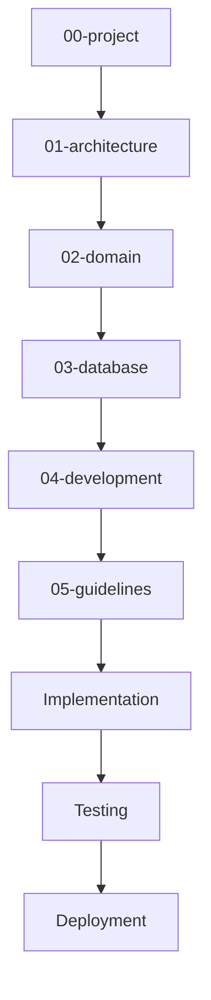

# DYN CRM — Mục lục tài liệu dự án

> Bản tiếng Việt của [README.md](./README.md).  
> **Nguồn kỹ thuật chuẩn (canonical):** bản English. Khi hai bản lệch nhau, ưu tiên bản English cho đến khi được đồng bộ.

## 1. Mục đích

Thư mục này là điểm vào duy nhất cho tài liệu cấp dự án của **DYN CRM**. Trả lời *vì sao* sản phẩm tồn tại, *phạm vi* MVP, *cách* chia giai đoạn, và *thuật ngữ* đội ngũ phải dùng thống nhất.

## 2. Phạm vi

| Trong phạm vi | Ngoài phạm vi |
|---------------|---------------|
| Tầm nhìn và mục tiêu sản phẩm | Schema entity chi tiết (xem `02-domain/`) |
| Ranh giới MVP và phần loại trừ | ERD / Prisma (xem `03-database/`) |
| Mô hình nghiệp vụ mức cao | Coding convention (xem `04-development/`) |
| Timeline và roadmap | Kiến trúc chi tiết (xem `01-architecture/`) |
| Glossary dùng chung | Mã nguồn triển khai |

Đối tượng đọc: product owner, tech lead, engineer, QA, và thành viên mới.

## 3. Bối cảnh

DYN CRM là hệ thống kiểu CRM/ERP cho **văn phòng luật**. Quản lý khách hàng và lead, hợp đồng pháp lý, workflow cấu hình được, tài chính (order → invoice → payment), VAT, hoa hồng CTV, dashboard và thông báo.

| Thuộc tính | Quyết định (đã khóa) |
|------------|----------------------|
| Tên sản phẩm | DYN CRM |
| Tenancy (MVP) | Single-tenant |
| Tenancy (tương lai) | Multi-tenant ready |
| Ngôn ngữ UI (MVP) | Tiếng Việt |
| Ngôn ngữ UI (Phase 2) | English |
| Ngôn ngữ docs kỹ thuật | English (+ bản Việt cho stakeholder) |
| Thời gian MVP | 4–5 tháng |
| Kiến trúc | Modular monolith (DDD-lite) |
| Repository | Monorepo (`apps/`, `packages/`, `docs/`) |

Tài liệu theo **từng phase**. Thư mục này là **Phase 00**. Các phase sau không được mâu thuẫn quyết định đã khóa trừ khi có ADR cập nhật.

## 4. Thiết kế

### 4.1 Sơ đồ tài liệu

### 4.2 Tài liệu trong thư mục này

| File English | File tiếng Việt | Vai trò |
|--------------|-----------------|---------|
| [README.md](./README.md) | [README.vi.md](./README.vi.md) | Mục lục / điểm vào |
| [Vision.md](./Vision.md) | [Vision.vi.md](./Vision.vi.md) | Tầm nhìn, mục tiêu, tiêu chí thành công |
| [Scope.md](./Scope.md) | [Scope.vi.md](./Scope.vi.md) | Phạm vi MVP, inventory module |
| [Business.md](./Business.md) | [Business.vi.md](./Business.vi.md) | Nghiệp vụ, actor, value stream |
| [Timeline.md](./Timeline.md) | [Timeline.vi.md](./Timeline.vi.md) | Lịch MVP 4–5 tháng |
| [Roadmap.md](./Roadmap.md) | [Roadmap.vi.md](./Roadmap.vi.md) | Lộ trình sau MVP |
| [Glossary.md](./Glossary.md) | [Glossary.vi.md](./Glossary.vi.md) | Thuật ngữ chuẩn |

### 4.3 Nguồn chân lý (decision authority)

| Chủ đề | Nguồn chân lý |
|--------|---------------|
| Phạm vi sản phẩm | `Scope.md` / `Scope.vi.md` |
| Thuật ngữ nghiệp vụ | `Glossary.md` / `Glossary.vi.md` |
| Phong cách kiến trúc | `01-architecture/` + ADR |
| Rule domain | `02-domain/` (phải khớp quyết định MVP đã khóa) |

## 5. Quy tắc nghiệp vụ

1. **Không bịa** business rule trong code hoặc docs. Mục chưa rõ ghi vào **TODO** hoặc issue tracker.
2. Đổi quyết định đã khóa cần: cập nhật doc sở hữu + ADR (nếu ảnh hưởng kiến trúc) + thông báo team.
3. Domain docs (`02-domain/`) phải tham chiếu thư mục này về ranh giới MVP.
4. “Future-ready” (multi-tenant, multi-currency, K8s, cổng thanh toán) nghĩa là **design hook**, không phải tính năng MVP trừ khi nằm trong Scope.

## 6. Best practices

- Đọc `Vision` → `Scope` → `Glossary` trước khi viết domain doc.
- Ưu tiên bảng và Mermaid hơn đoạn văn dài.
- Giữ 9 section chuẩn (Purpose/Mục đích → References/Tham chiếu).
- Link tài liệu liên quan thay vì copy nội dung.
- Mục chưa rõ ghi **TODO**, không viết placeholder trong thân tài liệu.
- Sửa nội dung: cập nhật **cả bản EN và VI** trong cùng một thay đổi.

## 7. Ví dụ

**Onboarding developer (Ngày 1):**

1. Đọc README (EN hoặc VI).
2. Đọc Vision, Scope, Glossary.
3. Lướt Timeline và Roadmap.
4. Sang `01-architecture/Architecture.md` khi Phase 01 sẵn sàng.

**Đổi phạm vi MVP:**

1. PR cập nhật `Scope.md` + `Scope.vi.md`.
2. Điều chỉnh Timeline / Roadmap nếu lịch đổi.
3. Nếu ảnh hưởng kiến trúc: thêm/cập nhật ADR.

## 8. Cải tiến tương lai

| Hạng mục | Phase |
|----------|-------|
| Index docs tự sinh từ CI | Phase 2 |
| Bản tóm tắt VI cho stakeholder phi kỹ thuật | Đang làm (bộ `.vi.md`) |
| Link docs tới Linear/Jira epic | Khi chọn tracker |

## 9. Tham chiếu

- Quyết định stakeholder đã khóa (2026-08-02)
- Dự kiến: `docs/01-architecture/Architecture.md`
- Dự kiến: `docs/01-architecture/Decisions/ADR-001.md`

---

## Tài liệu liên quan gợi ý

- `Vision.vi.md`
- `Scope.vi.md`
- `Glossary.vi.md`
- `01-architecture/Architecture.md` (Phase 01)

## TODO

- [ ] Xác nhận tên product owner / sponsor cho phần stakeholder Vision
- [ ] Xác nhận tên pháp lý công ty / văn phòng luật cho Business
- [ ] Xác nhận tháng go-live sau khi khóa ngày kickoff
- [ ] Thêm link issue tracker khi đã chọn
- [ ] Quy ước sync EN/VI trong checklist PR (Phase 04/05)
