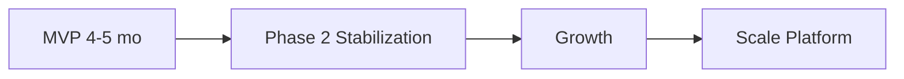

# Roadmap — DYN CRM

> Vietnamese version: [Roadmap.vi.md](./Roadmap.vi.md)

## 1. Purpose

Describe capability growth **after** MVP acceptance, including readiness investments that start in MVP architecture but ship later.

## 2. Scope

| In scope | Out of scope |
|----------|--------------|
| Post-MVP phases and themes | MVP detailed schedule (`Timeline.md`) |
| Dependency notes between future themes | Commitment to exact calendar quarters (until prioritized) |

## 3. Background

MVP delivers a single-tenant law-firm CRM for general legal consulting with Contract → Order → Invoice → Payment, configurable workflows, and CTV commission on collected payments.

Stakeholders explicitly deferred: multi-tenant, multi-currency, practice areas, payment gateways, advanced commission, English UI, Kubernetes, GitHub Actions CI/CD.

## 4. Design

### 4.1 Roadmap overview

| Phase | Theme | Goal |
|-------|-------|------|
| MVP | Operate | Single firm live on Vercel + Railway + Supabase |
| Phase 2 | Stabilize & bilingual | Hardening, CI/CD, English UI |
| Growth | Deepen domain | Practice areas, richer finance/commission |
| Scale Platform | Multi-tenant & cloud ops | Tenant isolation, K8s, gateways |

### 4.2 Phase 2 — Stabilization & bilingual

| Item | Description | Depends on |
|------|-------------|------------|
| GitHub Actions CI/CD | Build, test, lint, image publish | Stable monorepo |
| English UI | i18n for UI strings | VI UI string catalog discipline in MVP |
| Observability polish | Metrics, alert basics | Monitoring baseline from architecture docs |
| Performance pass | Re-validate ~30+ users; query audits | Production metrics |
| Backup/restore drills | Proven RPO/RTO | Deployment runbooks |

### 4.3 Growth — Domain depth

| Item | Description | Notes |
|------|-------------|-------|
| Practice areas | Labor, Civil, Business, IP, Litigation modules | Extend workflow templates per area |
| Advanced commission | Tier, shared, team | Keep cash-based base unless business changes |
| Finance enhancements | Credit notes/refunds if approved; richer milestones | Requires new business rules lock |
| Automation | More notification/email triggers | BullMQ already in stack |
| Reporting packs | Management reports beyond MVP dashboard | Read models / projections |

### 4.4 Scale Platform

| Item | Description | Design hook from MVP |
|------|-------------|----------------------|
| Multi-tenant | Firm isolation, tenant context | Avoid global uniqueness assumptions; keep `tenant_id` extension path |
| Multi-currency | Non-VND contracts/invoices | Money value object / currency column readiness |
| Payment gateways | VNPay, MoMo, Stripe | Payment method enum extensibility; provider ports |
| Kubernetes | Replace Compose for HA | 12-factor config; stateless API/worker |
| Storage option | MinIO / Cloudflare R2 | `StoragePort` already abstracts Supabase Storage |
| Docker Compose on VPS | Self-host alternative to Vercel/Railway | Post-MVP ops path |

### 4.5 Priority guidance (recommended)

| Priority | Item | Why |
|----------|------|-----|
| P0 | CI/CD + backup drills | Protect production stability |
| P1 | English UI | Locked Phase 2 language goal |
| P2 | Advanced commission / finance policies | High business sensitivity — needs rules first |
| P3 | Practice areas | Expand only after core consulting flows are stable |
| P4 | Multi-tenant + K8s + gateways | Platform scale; expensive if premature |

### Architect recommendation

Do **not** schedule multi-tenant and practice-area expansion in the same quarter. Multi-tenant changes cross-cutting auth/data filters; practice areas change domain templates. Sequencing reduces regression risk.

## 5. Business Rules

1. Roadmap items are **not** commitments until pulled into a scoped release with updated Scope/Timeline.
2. MVP code should not implement deferred features “halfway” unless required as an explicit extension point (port/interface, nullable `tenantId` strategy decided in ADR).
3. Any roadmap item that changes money calculation rules requires domain doc + finance stakeholder sign-off.
4. CTV portal remains restricted unless Scope explicitly expands CTV capabilities.

## 6. Best Practices

- Keep a public “Now / Next / Later” view for stakeholders.
- For each Later item, note the MVP extension point (module, port, table).
- Revisit roadmap after MVP UAT with real usage data.
- Prefer extracting a module to a service only when scale or team boundaries demand it (modular monolith first).

## 7. Examples

**Pulling an item forward:** “We need MoMo before multi-tenant.” → Create mini-scope, ADR for payment provider port, update finance domain docs, schedule after Payment model is stable.

**Rejecting premature scale:** “Let’s rebuild as microservices now.” → Reject; ~30 users; modular monolith remains correct until clear scaling/org boundary pressure.

## 8. Future Improvements

| Meta improvement | Purpose |
|------------------|---------|
| Score roadmap by effort/risk/value | Better sequencing |
| Tie each item to epic IDs | Traceability |
| Annual architecture review | Validate monolith vs extraction |

## 9. References

- `Vision.md`
- `Scope.md`
- `Timeline.md`
- Planned ADRs in `01-architecture/Decisions/`

---

## Suggested related documents

- `Timeline.md` — MVP execution
- `01-architecture/Architecture.md` — extension points
- `02-domain/Commission.md` — future formulas (Phase 02)

## TODO

- [ ] After MVP, run roadmap workshop with stakeholders to assign quarters
- [ ] Decide tenant strategy detail (column vs schema) in ADR before Growth/Scale
- [ ] Confirm whether e-invoice compliance appears on Growth finance track
