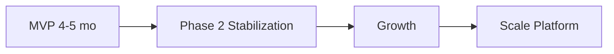

# Lộ trình — DYN CRM

> Bản tiếng Việt của [Roadmap.md](./Roadmap.md). Canonical: bản English.

## 1. Mục đích

Mô tả tăng trưởng năng lực **sau** khi MVP được chấp nhận, gồm các khoản đầu tư sẵn sàng bắt đầu từ kiến trúc MVP nhưng ship sau.

## 2. Phạm vi

| Trong phạm vi | Ngoài phạm vi |
|---------------|---------------|
| Phase và theme sau MVP | Lịch chi tiết MVP (`Timeline`) |
| Ghi chú phụ thuộc giữa theme tương lai | Cam kết quý lịch cụ thể (đến khi ưu tiên hóa) |

## 3. Bối cảnh

MVP giao CRM single-tenant cho tư vấn pháp lý tổng quát với Contract → Order → Payment Schedule → Payment → Debt → VAT Invoice → Commission (hóa đơn sau payment), workflow cấu hình được, và portal Collaboration CTV đã mở rộng.

Stakeholder trì hoãn rõ: multi-tenant, đa tiền tệ, lĩnh vực chuyên biệt, cổng thanh toán, hoa hồng nâng cao, UI English, Kubernetes, CI/CD GitHub Actions.

## 4. Thiết kế

### 4.1 Tổng quan lộ trình

| Phase | Theme | Mục tiêu |
|-------|-------|----------|
| MVP | Operate | Một văn phòng live trên Vercel + Railway + Supabase |
| Phase 2 | Stabilize & bilingual | Hardening, CI/CD, UI English |
| Growth | Deepen domain | Lĩnh vực, finance/commission sâu hơn |
| Scale Platform | Multi-tenant & cloud ops | Cô lập tenant, K8s, gateway |

### 4.2 Phase 2 — Ổn định & song ngữ

| Hạng mục | Mô tả | Phụ thuộc |
|----------|--------|-----------|
| GitHub Actions CI/CD | Build, test, lint, publish image | Monorepo ổn định |
| UI English | i18n chuỗi UI | Kỷ luật catalog chuỗi VI trong MVP |
| Observability polish | Metric, alert cơ bản | Baseline monitoring từ architecture docs |
| Performance pass | Re-validate ~30+ user; audit query | Metric production |
| Backup/restore drills | Chứng minh RPO/RTO | Runbook deploy |

### 4.3 Growth — Làm sâu domain

| Hạng mục | Mô tả | Ghi chú |
|----------|--------|---------|
| Practice areas | Module Lao động, Dân sự, Doanh nghiệp, SHTT, Tranh tụng | Mở rộng workflow template theo lĩnh vực |
| Hoa hồng nâng cao | Tier, chia sẻ, team | Giữ base theo tiền thực thu trừ khi đổi nghiệp vụ |
| Finance nâng cao | Credit note/hoàn tiền nếu được duyệt; milestone phong phú hơn | Cần khóa business rule mới |
| Automation | Thêm trigger notification/email | BullMQ đã có trong stack |
| Reporting packs | Báo cáo quản trị ngoài dashboard MVP | Read model / projection |

### 4.4 Scale Platform

| Hạng mục | Mô tả | Hook thiết kế từ MVP |
|----------|--------|----------------------|
| Multi-tenant | Cô lập văn phòng, tenant context | Tránh giả định uniqueness toàn cục; để đường mở `tenant_id` |
| Multi-currency | Hợp đồng/hóa đơn ngoài VND | Money value object / cột currency sẵn sàng |
| Payment gateways | VNPay, MoMo, Stripe | Enum phương thức mở rộng; provider port |
| Kubernetes | Thay Compose cho HA | 12-factor config; API/worker stateless |
| Storage option | MinIO / Cloudflare R2 | `StoragePort` đã trừu tượng hóa Supabase Storage |
| Docker Compose trên VPS | Self-host thay Vercel/Railway | Đường ops sau MVP |

### 4.5 Hướng dẫn ưu tiên (đề xuất)

| Ưu tiên | Hạng mục | Vì sao |
|---------|----------|--------|
| P0 | CI/CD + diễn tập backup | Bảo vệ ổn định production |
| P1 | UI English | Mục tiêu ngôn ngữ Phase 2 đã khóa |
| P2 | Hoa hồng / chính sách finance nâng cao | Nhạy cảm nghiệp vụ — cần rule trước |
| P3 | Practice areas | Mở rộng sau khi flow tư vấn lõi ổn |
| P4 | Multi-tenant + K8s + gateway | Scale nền tảng; đắt nếu sớm |

### Đề xuất kiến trúc sư

**Không** xếp multi-tenant và mở rộng practice area cùng một quý. Multi-tenant đụng auth/filter dữ liệu xuyên suốt; practice area đổi template domain. Tách lịch giảm rủi ro regression.

## 5. Quy tắc nghiệp vụ

1. Hạng mục roadmap **không** phải cam kết cho đến khi được kéo vào release có Scope/Timeline cập nhật.
2. Code MVP không implement tính năng trì hoãn “nửa vời” trừ khi là extension point tường minh (port/interface, chiến lược `tenantId` nullable quyết trong ADR).
3. Mọi hạng mục đổi cách tính tiền cần domain doc + sign-off stakeholder finance.
4. CTV portal giữ hạn chế trừ khi Scope mở rộng năng lực CTV.

## 6. Best practices

- Giữ góc nhìn “Now / Next / Later” công khai cho stakeholder.
- Với mỗi mục Later, ghi extension point MVP (module, port, bảng).
- Xem lại roadmap sau UAT MVP với dữ liệu dùng thật.
- Chỉ tách module thành service khi scale hoặc ranh giới team đòi hỏi (ưu tiên modular monolith).

## 7. Ví dụ

**Kéo hạng mục lên sớm:** “Cần MoMo trước multi-tenant.” → Tạo mini-scope, ADR payment provider port, cập nhật finance domain docs, xếp lịch sau khi model Payment ổn.

**Từ chối scale sớm:** “Rebuild microservice ngay.” → Từ chối; ~30 user; modular monolith vẫn đúng đến khi có áp lực scale/tổ chức rõ.

## 8. Cải tiến tương lai

| Cải tiến meta | Mục đích |
|---------------|----------|
| Chấm roadmap theo effort/risk/value | Sắp thứ tự tốt hơn |
| Gắn mỗi hạng mục với epic ID | Truy vết |
| Review kiến trúc hàng năm | Xác nhận monolith vs tách service |

## 9. Tham chiếu

- `Vision.md` / `Vision.vi.md`
- `Scope.md` / `Scope.vi.md`
- `Timeline.md` / `Timeline.vi.md`
- ADR dự kiến trong `01-architecture/Decisions/`

---

## Tài liệu liên quan gợi ý

- `Timeline.vi.md` — thực thi MVP
- `01-architecture/Architecture.md` — điểm mở rộng
- `02-domain/Commission.md` — công thức tương lai (Phase 02)

## TODO

- [ ] Sau MVP, workshop roadmap với stakeholder để gán quý
- [ ] Quyết chiến lược tenant (column vs schema) trong ADR trước Growth/Scale
- [ ] Xác nhận tuân thủ HĐĐT có nằm trên track finance Growth không
