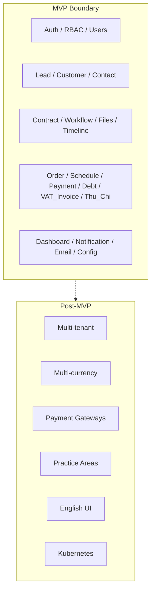

# Scope — DYN CRM MVP

> Vietnamese version: [Scope.vi.md](./Scope.vi.md)

## Scope change — 2026-08-17 (RE-LOCK REQUIRED)

Stakeholder feedback **overrides** the 2026-08-03 CTV Collaboration expansion for implementation until formally re-confirmed.

| Change | Classification |
|--------|----------------|
| Remove CTV operational info; only thu/chi (or note) for CTV | **SCOPE CHANGE** — Collaboration portal **not** MVP unless reversed |
| Tab Thu / Chi; approve **Chi only** (Nhi) | **SCOPE CHANGE** / Open Q on ledger model |
| Order validity + configurable N-month alert | **CONFIRMED** capability |
| Configurable Contract Kanban columns | **CONFIRMED**; Stage vs Status **OPEN** |
| Unique contract number | **CONFIRMED** |
| SePay + invoice | **SCOPE CHANGE** candidate vs “gateways = future” |
| Invoice alerts; CRM export by used-service / industry | **CONFIRMED** capabilities |
| Extra Customer date column | **OPEN** (which date) |

Invoice **after** Payment remains **LOCKED**. Architecture style remains Modular Monolith + DDD-lite.

## 1. Purpose

Define precise **in-scope** and **out-of-scope** boundaries for the DYN CRM MVP (4–5 months) so engineering, product, and QA share one checklist of deliverables.

## 2. Scope

This document covers MVP product scope only. It does not define database schemas, API contracts, or UI layouts.

| Covered | Not covered here |
|---------|------------------|
| Module inventory for MVP | Domain deep-dive rules (`02-domain/`) |
| Explicit exclusions | Architecture internals (`01-architecture/`) |
| Actor access boundaries (high level) | Test plans |

## 3. Background

Stakeholders locked the following MVP constraints on 2026-08-02:

- Single-tenant deployment (multi-tenant **ready**, not implemented)
- Vietnamese UI; English UI deferred
- General legal consulting only (no practice specialization)
- Finance chain: **Contract → Order → Payment Schedule → Payment → Debt → VAT Invoice** (Invoice **after** Payment; locked 2026-08-03). **Commission** as a first-class object is **re-lock 2026-08-17** (CTV commission engine not confirmed).
- CTV **restricted portal / assigned customers / Contract Request** (locked 2026-08-03) is **SUPERSEDED** by 2026-08-17: no CTV operational masters; Finance thu/chi or note only — **pending Scope re-lock**
- Stack: Modular monolith; NestJS BFF + Supabase Auth; Prisma → Supabase PostgreSQL; StoragePort (Supabase Storage and/or MinIO adapter); Redis + BullMQ; Next.js; Docker Compose for local/dev foundation. Production hosting (Vercel + Railway vs Compose) remains the Phase 01 contract unless re-locked.

## 4. Design

### 4.1 MVP module inventory

#### Core

| Module | MVP capability |
|--------|----------------|
| Authentication | Login/logout/refresh via NestJS BFF over Supabase Auth |
| Authorization (RBAC) | Roles + permission checks on NestJS APIs only |
| User Management | Create/update users, assign roles, activate/deactivate |

#### CRM

| Module | MVP capability |
|--------|----------------|
| Lead | Separate entity; qualify toward Customer |
| Customer | Individual and Company; exactly one primary Owner; optional Followers; industry/field + operational export (used service); extra date **OPEN** |
| Contact | People linked to Customer (and Lead where applicable) |

#### Legal

| Module | MVP capability |
|--------|----------------|
| Contract Management | Full status lifecycle (see Business Rules); **unique contract number** |
| Workflow / Kanban | Configurable templates and **configurable columns** (admin/authorized users); no BPMN; columns are data not a hard-coded enum |
| File Management | Upload/download via StoragePort (MVP: Supabase Storage); attach to domain records |
| Timeline / Activity | Chronological activity feed for relevant entities |

#### Finance

| Module | MVP capability |
|--------|----------------|
| Order | Financial transaction from a Contract; **validity period**; configurable expiry alert (N months) |
| Payment Schedule | Planned installments / dues against an Order |
| Payment | Cash, Bank Transfer, QR; partial payments; occurs **before** VAT Invoice; SePay via **PaymentProviderPort** if pulled into MVP |
| Debt | Remaining obligation after payments |
| VAT Invoice | Issued **after** Payment; **invoice alerts** (Communication) |
| VAT | 10% exclusive (MVP fixed rate) |
| Thu / Chi | Staff income/expense tabs; **Chi requires approval**; persistence model **OPEN** |

#### Commission / CTV

| Module | MVP capability |
|--------|----------------|
| Commission | **Re-lock** — percentage of collected payment only if still required; not a CTV portal |
| Collaborator (CTV) | **SUPERSEDED 2026-08-17** — no portal; Finance thu/chi or note only |

#### System

| Module | MVP capability |
|--------|----------------|
| Dashboard | Operational summaries for authorized roles |
| Notification | In-app notifications (event-driven) |
| Email | Transactional email via Resend |
| Configuration | System settings needed for MVP (e.g. commission %, workflow templates) |

### 4.2 Roles in MVP

| Role | Access summary |
|------|----------------|
| Super Admin | Full system configuration and user control |
| Admin | Administrative operations within firm |
| Manager | Oversight of teams/pipelines (details in domain/auth docs) |
| Lawyer | Legal work, contracts, workflows |
| Legal Assistant | Support legal operations |
| Accounting | Orders, schedules, payments, VAT invoices, debt |
| Sales | Leads, customers, pipeline-related work |
| Collaborator (CTV) | **Not an MVP actor** unless S6 is reversed (2026-08-17) |

Previous CTV portal can/cannot list (2026-08-03) is **SUPERSEDED**. Do not implement assigned customers, Contract Request, or CTV commission views.

### 4.3 Platform & delivery scope

| Area | MVP |
|------|-----|
| API | RESTful |
| Auth | NestJS BFF → Supabase Auth (access + refresh via NestJS) |
| Authorization | NestJS RBAC + permissions |
| Storage | Supabase Storage via StoragePort |
| Queue | BullMQ on Railway Redis |
| Cache | Redis on Railway |
| ORM / DB | Prisma → Supabase PostgreSQL |
| Frontend | Next.js + Tailwind + Shadcn UI + TanStack Query + RHF + Zod (hosted on Vercel) |
| Backend | NestJS (+ class-validator where applicable) on Railway |
| Worker | `apps/worker` (BullMQ) on Railway |
| Repo | Monorepo: `apps/backend`, `apps/frontend`, `apps/worker`, `packages/*`, `docs/`, `.cursor/` |
| Deploy | Vercel (frontend) + Railway (API, worker, Redis) + Supabase (Auth, PG, Storage) |
| Future ops | Docker Compose on Ubuntu VPS (post-MVP) |
| CI/CD | Not required for MVP (GitHub Actions in Phase 2) |
| Git | Git Flow; branches `feature/*`, `bugfix/*`, `hotfix/*`, `release/*` |

### 4.4 Explicitly out of scope (MVP)

| Exclusion | Rationale / defer to |
|-----------|----------------------|
| Multi-tenant isolation & billing | Architecture readiness only |
| English UI | Phase 2 |
| Practice-area modules (Labor, Civil, Business, IP, Litigation) | Roadmap |
| BPMN engine | Keep template-based workflow |
| Payment gateways (VNPay, MoMo, Stripe) | Roadmap — **SePay is a separate MVP candidate** (boundary OPEN) |
| Multi-currency transactions | Design for readiness; VND only in MVP |
| Advanced commission (tier, shared, team) | Roadmap |
| Kubernetes production | K8s-ready design later |
| Docker Compose on VPS as MVP **production** hosting | Phase 01: Vercel + Railway; Compose = local/dev + post-MVP path |
| MinIO as the **only** production storage | StoragePort may add a MinIO adapter (local/dev); production adapter re-lock if replacing Supabase Storage |
| Renaming Order → Matter | Rejected; Order stays |
| CTV portal / full CRM for CTV | **Removed pending re-lock** (2026-08-17) |
| Client calling Supabase for business APIs | Forbidden; NestJS is the only business API |

### 4.5 Scope diagram

## 5. Business Rules

1. **Lead is a separate entity** from Customer. Conversion path: Lead → Qualified → Customer.
2. **Customer types**: Individual and Company.
3. **Ownership**: Every Customer has exactly **one** primary Owner; additional users may be Followers.
4. **Contract** is the legal agreement; **Order** is the financial transaction generated from a Contract.
5. **Contract statuses (ordered)**: Draft → Review → Waiting Customer → Signed → In Progress → Completed; or Cancelled (terminal alternative — transition rules detailed in domain docs).
6. **Finance chain (locked 2026-08-03):** Contract → Order → Payment Schedule → Payment → Debt → **VAT Invoice** → Commission. **VAT Invoice is issued after Payment.**
7. **Invoice sources** (what the invoice may reference): Contract, Milestone, or Manual — timing remains after Payment.
8. **VAT**: 10%, tax-exclusive, MVP.
9. **Payments**: Cash, Bank Transfer, QR; partial payments allowed.
10. **Commission base** (if Commission is kept): actual collected payment amount only.
11. **Commission formula (MVP)** (if kept): configurable percentage of collected payment.
12. **Currency**: VND only in MVP.
13. **Workflow**: admin-configurable templates with Tasks, Due Date, Reminder, Assignee; **configurable Kanban columns** as data; no BPMN.
14. **CTV (2026-08-17):** no operational CTV portal; CTV-related money is Finance thu/chi or note only — **re-lock required**. 2026-08-03 portal list is SUPERSEDED.
15. **Contract number** is unique (DB constraint required).
16. **Order** has a validity period; expiry alert N months is configurable.
17. Features listed in section 4.4 must not be implemented as MVP deliverables without Scope revision.

## 6. Best Practices

- Map every user story to a module row in section 4.1.
- When a request sits on the boundary, default to **out of scope** until product confirms.
- Keep finance vocabulary consistent: Contract ≠ Order ≠ Invoice ≠ Payment.
- Do not collapse Lead into Customer “for convenience.”
- Document open transition rules (e.g. when Cancelled is allowed) in `02-domain/Contract.md` — do not invent them here.

## 7. Examples

| Request | Verdict |
|---------|---------|
| “Sales converts qualified lead to company customer with owner.” | In scope |
| “Accounting records partial bank transfer against invoice.” | In scope |
| “Admin creates a workflow template with 5 stages and tasks.” | In scope |
| “CTV logs in and edits another lawyer’s contract.” | Out of scope (forbidden) — portal itself pending removal |
| “Accounting records Chi and Nhi approves.” | In scope capability; model OPEN |
| “Support USD invoices in MVP.” | Out of scope |
| “Integrate MoMo checkout in MVP.” | Out of scope |
| “SePay payment + invoice in MVP.” | Candidate — boundary OPEN |

## 8. Future Improvements

Tracked in `Roadmap.md`. Scope document should be revised when a future item is pulled into an active release.

## 9. References

- `Vision.md`
- `Business.md`
- `Timeline.md`
- `Roadmap.md`
- `Glossary.md`
- Stakeholder decisions 2026-08-02

---

## Suggested related documents

- `Vision.md` — why
- `Timeline.md` — schedule for this scope
- `02-domain/*` — detailed rules per entity (Phase 02)
- `01-architecture/Module.md` — module boundaries (Phase 01)

## TODO

- [x] Record 2026-08-17 stakeholder scope changes (CTV, Thu/Chi, SePay, Kanban, contract number, Order expiry)  
- [ ] Re-lock S6 CTV removal vs restore portal  
- [ ] Detail which Cancelled transitions are legal from each contract status (domain phase)
- [ ] Define Lead mandatory fields and qualification checklist
- [ ] Define Follower permissions vs Owner permissions
- [ ] Define Dashboard widgets per role
- [ ] Confirm Resend templates list (auth, notification, payment receipts, invoice/expiry alerts)
- [ ] Confirm whether Contact can exist on Lead before Customer conversion
