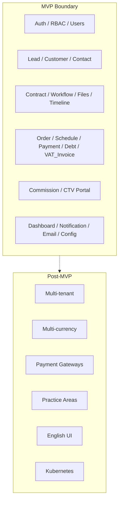

# Phạm vi — DYN CRM MVP

> Bản tiếng Việt của [Scope.md](./Scope.md). Canonical: bản English.

## Thay đổi phạm vi — 2026-08-17 (CẦN KHÓA LẠI)

Phản hồi stakeholder **ghi đè** mở rộng CTV 2026-08-03 cho đến khi xác nhận lại.

| Thay đổi | Phân loại |
|----------|-----------|
| Gỡ thông tin vận hành CTV; chỉ thu/chi (hoặc note) | **SCOPE CHANGE** |
| Tab Thu / Chi; duyệt **chỉ Chi** (Nhi) | **SCOPE CHANGE** / mô hình sổ **OPEN** |
| Thời hạn đơn hàng + alert N tháng cấu hình được | **CONFIRMED** |
| Kanban hợp đồng thêm cột, user được cấu hình | **CONFIRMED**; Stage vs Status **OPEN** |
| Không trùng số hợp đồng | **CONFIRMED** |
| SePay + invoice | **SCOPE CHANGE** candidate |
| Alert hóa đơn; export khách theo đã dùng DV / lĩnh vực | **CONFIRMED** |
| Thêm cột ngày khách hàng | **OPEN** (ngày nào) |

Hóa đơn **sau** Payment vẫn **LOCKED**. Kiến trúc: Modular Monolith + DDD-lite.

## 1. Mục đích

Định nghĩa ranh giới **trong scope** và **ngoài scope** cho MVP DYN CRM (4–5 tháng) để engineering, product và QA dùng chung một checklist deliverable.

## 2. Phạm vi tài liệu này

Chỉ phủ phạm vi sản phẩm MVP. Không định nghĩa schema DB, hợp đồng API, hay layout UI.

| Có trong tài liệu này | Không có ở đây |
|-----------------------|----------------|
| Inventory module MVP | Rule domain sâu (`02-domain/`) |
| Phần loại trừ rõ | Nội thất kiến trúc (`01-architecture/`) |
| Ranh giới truy cập actor (mức cao) | Test plan |

## 3. Bối cảnh

Stakeholder đã khóa các ràng buộc MVP ngày 2026-08-02:

- Deploy single-tenant (multi-tenant **ready**, chưa implement)
- UI tiếng Việt; UI English trì hoãn
- Chỉ tư vấn pháp lý tổng quát (không chuyên biệt lĩnh vực)
- Chuỗi tài chính: **Contract → Order → Payment Schedule → Payment → Debt → VAT Invoice** (Hóa đơn VAT **sau** Payment; khóa 2026-08-03). **Commission** cần khóa lại 2026-08-17.
- Portal CTV / khách gán / Contract Request (khóa 2026-08-03) **SUPERSEDED** 2026-08-17: không master vận hành CTV; chỉ thu/chi hoặc note — **chờ khóa Scope**
- Stack: Modular monolith; NestJS BFF + Supabase Auth; Prisma → Supabase PostgreSQL; StoragePort (Supabase Storage và/hoặc MinIO); Redis + BullMQ; Next.js; Docker Compose cho local/dev. Hosting production (Vercel + Railway) giữ Phase 01 trừ khi khóa lại.

## 4. Thiết kế

### 4.1 Inventory module MVP

#### Core

| Module | Năng lực MVP |
|--------|--------------|
| Authentication | Login/logout/refresh qua NestJS BFF trên Supabase Auth |
| Authorization (RBAC) | Role + kiểm tra permission chỉ trên NestJS API |
| User Management | Tạo/cập nhật user, gán role, bật/tắt |

#### CRM

| Module | Năng lực MVP |
|--------|--------------|
| Lead | Entity riêng; qualify tiến tới Customer |
| Customer | Cá nhân và Công ty; đúng một Owner chính; Follower tùy chọn |
| Contact | Người gắn với Customer (và Lead khi áp dụng) |

#### Legal

| Module | Năng lực MVP |
|--------|--------------|
| Contract Management | Đầy đủ vòng đời status (xem Business Rules) |
| Workflow / Kanban | Template cấu hình được (admin định nghĩa); không BPMN |
| File Management | Upload/download qua StoragePort (MVP: Supabase Storage); đính kèm bản ghi domain |
| Timeline / Activity | Feed hoạt động theo thời gian cho entity liên quan |

#### Finance

| Module | Năng lực MVP |
|--------|--------------|
| Order | Giao dịch tài chính sinh từ Contract |
| Payment Schedule | Lịch/đợt thanh toán theo Order |
| Payment | Tiền mặt, chuyển khoản, QR; thanh toán một phần; **trước** hóa đơn VAT |
| Debt | Nghĩa vụ còn lại sau thanh toán |
| VAT Invoice | Phát hành **sau** Payment; **alert hóa đơn** |
| VAT | 10% exclusive (MVP cố định) |
| Thu / Chi | Tab thu/chi; **Chi cần duyệt**; mô hình lưu **OPEN** |

#### Commission / CTV

| Module | Năng lực MVP |
|--------|--------------|
| Commission | **Khóa lại** — % tiền đã thu chỉ nếu còn cần; không portal CTV |
| Collaborator (CTV) | **SUPERSEDED 2026-08-17** — không portal; Finance thu/chi hoặc note |

#### System

| Module | Năng lực MVP |
|--------|--------------|
| Dashboard | Tóm tắt vận hành theo role được phép |
| Notification | Thông báo in-app (event-driven) |
| Email | Email giao dịch qua Resend |
| Configuration | Cấu hình cần cho MVP (vd. % hoa hồng, workflow template) |

### 4.2 Role trong MVP

| Role | Tóm tắt truy cập |
|------|------------------|
| Super Admin | Cấu hình hệ thống và kiểm soát user toàn quyền |
| Admin | Vận hành quản trị trong văn phòng |
| Manager | Giám sát team/pipeline (chi tiết ở auth/domain docs) |
| Lawyer | Công việc pháp lý, hợp đồng, workflow |
| Legal Assistant | Hỗ trợ vận hành pháp lý |
| Accounting | Order, lịch thanh toán, payment, hóa đơn VAT, nợ |
| Sales | Lead, customer, công việc pipeline |
| Collaborator (CTV) | **Không phải actor MVP** trừ khi S6 đảo (2026-08-17) |

Danh sách CTV được/không được (2026-08-03) **SUPERSEDED**. Không implement khách gán, Contract Request, hay xem hoa hồng CTV.

### 4.3 Phạm vi nền tảng & giao hàng

| Hạng mục | MVP |
|----------|-----|
| API | RESTful |
| Auth | NestJS BFF → Supabase Auth (access + refresh qua NestJS) |
| Authorization | NestJS RBAC + permission |
| Storage | Supabase Storage qua StoragePort |
| Queue | BullMQ trên Railway Redis |
| Cache | Redis trên Railway |
| ORM / DB | Prisma → Supabase PostgreSQL |
| Frontend | Next.js + Tailwind + Shadcn UI + TanStack Query + RHF + Zod (host Vercel) |
| Backend | NestJS (+ class-validator khi phù hợp) trên Railway |
| Worker | `apps/worker` (BullMQ) trên Railway |
| Repo | Monorepo: `apps/backend`, `apps/frontend`, `apps/worker`, `packages/*`, `docs/`, `.cursor/` |
| Deploy | Vercel (frontend) + Railway (API, worker, Redis) + Supabase (Auth, PG, Storage) |
| Future ops | Docker Compose trên Ubuntu VPS (sau MVP) |
| CI/CD | Không bắt buộc MVP (GitHub Actions ở Phase 2) |
| Git | Git Flow; nhánh `feature/*`, `bugfix/*`, `hotfix/*`, `release/*` |

### 4.4 Ngoài phạm vi MVP (rõ ràng)

| Loại trừ | Lý do / chuyển tới |
|----------|---------------------|
| Cô lập & billing multi-tenant | Chỉ sẵn sàng kiến trúc |
| UI English | Phase 2 |
| Module lĩnh vực (Lao động, Dân sự, Doanh nghiệp, SHTT, Tranh tụng) | Roadmap |
| Engine BPMN | Giữ workflow theo template |
| Cổng thanh toán (VNPay, MoMo, Stripe) | Roadmap — **SePay là candidate MVP riêng** (biên OPEN) |
| Docker Compose trên VPS làm hosting **production** MVP | Phase 01: Vercel + Railway; Compose = local/dev + sau MVP |
| MinIO là storage production duy nhất | StoragePort có thể thêm adapter MinIO (local); production khóa lại nếu thay Supabase Storage |
| Portal CTV / full CRM cho CTV | **Gỡ chờ khóa lại** (2026-08-17) |
| Giao dịch đa tiền tệ | Design sẵn sàng; MVP chỉ VND |
| Hoa hồng nâng cao (tier, chia sẻ, team) | Roadmap |
| Production Kubernetes | Design K8s-ready sau |
| Docker Compose trên VPS làm hosting MVP | Hoãn sau MVP; MVP dùng Vercel + Railway |
| MinIO làm storage MVP | Hoãn; StoragePort cho phép MinIO/R2 sau |
| Đổi tên Order → Matter | Từ chối; giữ Order |
| CTV truy cập full CRM | Chỉ portal |
| Client gọi Supabase cho business API | Cấm; chỉ NestJS là business API |

### 4.5 Sơ đồ phạm vi

## 5. Quy tắc nghiệp vụ

1. **Lead là entity riêng** với Customer. Đường chuyển đổi: Lead → Qualified → Customer.
2. **Loại Customer**: Individual và Company.
3. **Ownership**: Mỗi Customer đúng **một** Owner chính; user khác có thể là Follower.
4. **Contract** là thỏa thuận pháp lý; **Order** là giao dịch tài chính sinh từ Contract.
5. **Status Contract (thứ tự)**: Draft → Review → Waiting Customer → Signed → In Progress → Completed; hoặc Cancelled (nhánh kết thúc — chi tiết chuyển trạng thái ở domain docs).
6. **Chuỗi tài chính (khóa 2026-08-03):** Contract → Order → Payment Schedule → Payment → Debt → **VAT Invoice**. **Hóa đơn VAT sau Payment.** Commission **khóa lại** 2026-08-17.
7. **Nguồn Invoice** (hóa đơn có thể tham chiếu): Contract, Milestone, hoặc Manual — thời điểm vẫn sau Payment.
8. **VAT**: 10%, exclusive, MVP.
9. **Payment**: Tiền mặt, chuyển khoản, QR; cho thanh toán một phần.
10. **Cơ sở hoa hồng** (nếu còn Commission): chỉ tiền đã thu.
11. **Công thức hoa hồng (MVP)** (nếu giữ): % cấu hình được trên tiền đã thu.
12. **Tiền tệ**: chỉ VND trong MVP.
13. **Workflow**: template cấu hình được; **cột Kanban là data**; không BPMN.
14. **CTV (2026-08-17):** không portal vận hành; tiền CTV là thu/chi hoặc note Finance — **cần khóa lại**. Danh sách portal 2026-08-03 SUPERSEDED.
15. **Số hợp đồng** duy nhất (ràng buộc DB).
16. **Order** có thời hạn; alert N tháng cấu hình được.
17. Hạng mục mục 4.4 không được làm deliverable MVP nếu chưa sửa Scope.

## 6. Best practices

- Map mọi user story vào một dòng module mục 4.1.
- Request nằm vùng biên: mặc định **ngoài scope** đến khi product xác nhận.
- Giữ từ vựng finance nhất quán: Contract ≠ Order ≠ Invoice ≠ Payment.
- Không gộp Lead vào Customer “cho tiện”.
- Rule chuyển Cancelled ghi ở `02-domain/Contract.md` — không bịa tại đây.

## 7. Ví dụ

| Request | Kết luận |
|---------|----------|
| “Sales convert lead đạt chuẩn thành customer công ty kèm owner.” | Trong scope |
| “Kế toán ghi nhận chuyển khoản một phần cho invoice.” | Trong scope |
| “Admin tạo workflow template 5 stage kèm task.” | Trong scope |
| “CTV đăng nhập và sửa hợp đồng của luật sư khác.” | Ngoài scope (cấm) |
| “Hỗ trợ hóa đơn USD trong MVP.” | Ngoài scope |
| “Tích hợp MoMo checkout trong MVP.” | Ngoài scope |

## 8. Cải tiến tương lai

Theo dõi ở `Roadmap`. Sửa Scope khi hạng mục tương lai được kéo vào release đang làm.

## 9. Tham chiếu

- `Vision.md` / `Vision.vi.md`
- `Business.md` / `Business.vi.md`
- `Timeline.md` / `Timeline.vi.md`
- `Roadmap.md` / `Roadmap.vi.md`
- `Glossary.md` / `Glossary.vi.md`
- Quyết định stakeholder 2026-08-02

---

## Tài liệu liên quan gợi ý

- `Vision.vi.md` — vì sao
- `Timeline.vi.md` — lịch cho phạm vi này
- `02-domain/*` — rule từng entity (Phase 02)
- `01-architecture/Module.md` — ranh giới module (Phase 01)

## TODO

- [ ] Chi tiết Cancelled được phép từ status Contract nào (phase domain)
- [ ] Định field bắt buộc Lead và checklist qualify
- [ ] Định permission Follower vs Owner
- [ ] Định widget Dashboard theo role
- [ ] Xác nhận danh sách template Resend
- [ ] Xác nhận Contact có tồn tại trên Lead trước khi convert Customer không
