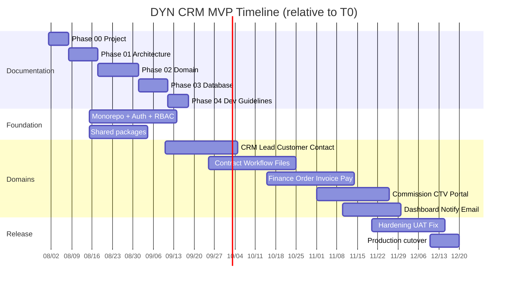
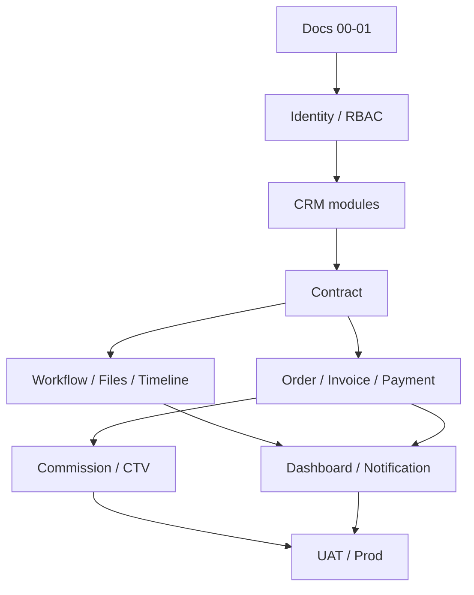

# Timeline — DYN CRM MVP

> Vietnamese version: [Timeline.vi.md](./Timeline.vi.md)

## 1. Purpose

Provide a realistic **4–5 month** delivery timeline for the locked MVP scope, sequenced to match the phase-based documentation and modular monolith delivery strategy.

## 2. Scope

| In scope | Out of scope |
|----------|--------------|
| MVP schedule (months/milestones) | Post-MVP quarterly plan (see Roadmap) |
| Documentation phase alignment | Hour-level task breakdown |
| Dependency order between workstreams | Vendor procurement timelines |

Assumes a small product engineering team. Exact headcount is not locked.

## 3. Background

| Constraint | Value |
|------------|-------|
| MVP window | 4–5 months |
| Docs strategy | Phase-based (no big-bang docs) |
| Architecture | Modular monolith, monorepo |
| Deploy | Docker Compose on Ubuntu VPS (local/dev); production MVP = Vercel + Railway + Supabase |
| CI/CD | GitHub Actions deferred to Phase 2 |

Kickoff date is **not yet locked**. This timeline uses **Month 1–5** relative to kickoff (T0).

## 4. Design

### 4.1 Phase alignment

> Dates in the Gantt are **illustrative relative sequencing** from an example T0 of 2026-08-01. Replace with real calendar dates once kickoff is confirmed.

### 4.2 Month-by-month plan

| Month | Focus | Exit criteria |
|-------|-------|---------------|
| **M1** | Docs Phase 00–01; monorepo skeleton; Identity (NestJS BFF + Supabase Auth, RBAC); Prisma → Supabase PG; StoragePort + Redis/BullMQ on Railway wiring | Users can authenticate via NestJS; protected hello route; Architecture docs approved |
| **M2** | Docs Phase 02–03 (CRM + Contract started); Lead, Customer, Contact CRUD; Owner/Followers; basic Timeline; File upload | CRM core usable by Sales in staging |
| **M3** | Contract lifecycle; Workflow templates + Kanban + Tasks/Due/Assignee/Reminder; continue domain docs | Legal team can run a consulting contract through Signed + workflow tasks |
| **M4** | Order, Invoice (contract/milestone/manual), VAT 10% exclusive, Payment methods + partial pay; Commission % on collected payment; CTV portal MVP | Accounting can invoice and record payments; CTV sees own commission |
| **M5** | Dashboard; Notification; Email templates; Configuration polish; UAT; performance pass for ~30 users; production on Vercel + Railway + Supabase | MVP acceptance signed; production live |

If the program is **4 months**, compress M4–M5 by narrowing Dashboard widgets and deferring non-critical email templates (must update Scope if deferred).

### 4.3 Workstream dependencies

### 4.4 Documentation cadence (mandatory)

| Doc phase | Timing | Gate |
|-----------|--------|------|
| 00 Project | Week 1 | Done before broad coding |
| 01 Architecture | Weeks 1–2 | Before module scaffolding freezes |
| 02 Domain | Weeks 2–4 (iterative) | Before each domain’s API freeze |
| 03 Database | After domain drafts | Before Prisma migrations for that domain |
| 04 Development | Parallel mid-MVP | Before team scale-up |
| 05 Guidelines | Before UAT | Release/review discipline |

## 5. Business Rules

1. Timeline changes that drop MVP modules require `Scope.md` update in the same decision.
2. Finance and Commission must not start without Contract → Order relationship documented.
3. Production cutover requires Security checklist and backup procedure (Phase 01/05 docs).
4. No feature is “done” without matching domain/API documentation for that feature’s phase.

## 6. Best Practices

- Prefer vertical slices (e.g. Lead create→list→convert) over horizontal-only layering.
- Keep a weekly risk review: scope creep, finance ambiguity, workflow/contract dual status.
- Freeze MVP scope at end of M2 except critical defects.
- Use staging on the same Compose topology as production.

## 7. Examples

**Healthy M2 demo:** Sales logs in (VI UI), creates Lead, converts to Company Customer with Owner, uploads a file, sees timeline entry.

**Unhealthy pattern:** Building commission UI before Payment model exists → reject; follow dependency graph.

## 8. Future Improvements

| Improvement | When |
|-------------|------|
| Bind timeline to real sprint board | When tracker chosen |
| Add buffer week for UAT findings | If team &lt; 3 engineers |
| Introduce GitHub Actions | Phase 2 (post-MVP) |

## 9. References

- `Scope.md`
- `Roadmap.md`
- `Vision.md`
- Stakeholder decisions 2026-08-02

---

## Suggested related documents

- `Scope.md` — what must fit this timeline
- `Roadmap.md` — after MVP
- `01-architecture/Deployment.md` — production cutover detail (Phase 01)

## TODO

- [ ] Lock T0 kickoff date and publish absolute calendar
- [ ] Confirm team size (BE/FE/QA) to choose 4 vs 5 month track
- [ ] Define UAT participant list (roles)
- [ ] Define MVP acceptance sign-off owner
