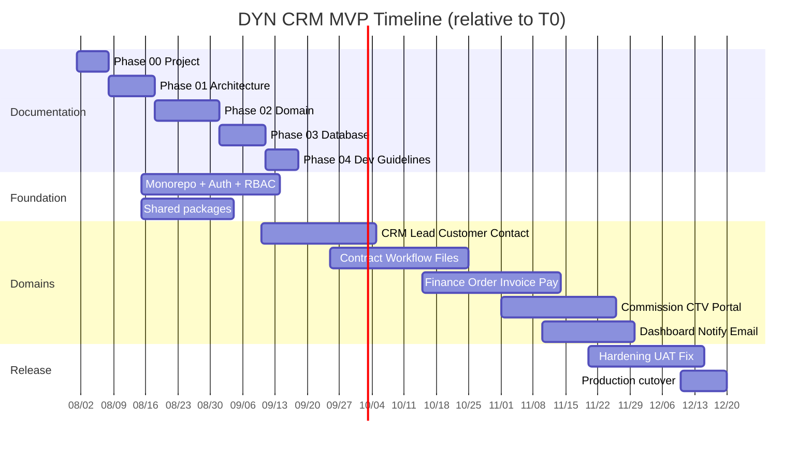
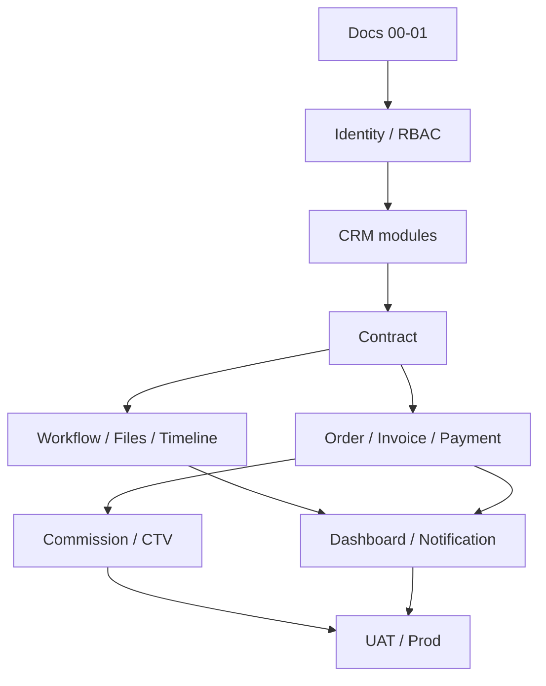

# Lịch trình — DYN CRM MVP

> Bản tiếng Việt của [Timeline.md](./Timeline.md). Canonical: bản English.

## 1. Mục đích

Cung cấp lịch giao hàng **4–5 tháng** thực tế cho phạm vi MVP đã khóa, sắp xếp theo chiến lược tài liệu theo phase và modular monolith.

## 2. Phạm vi

| Trong phạm vi | Ngoài phạm vi |
|---------------|---------------|
| Lịch MVP (tháng/milestone) | Kế hoạch quý sau MVP (xem Roadmap) |
| Căn chỉnh phase tài liệu | Breakdown task theo giờ |
| Thứ tự phụ thuộc workstream | Lịch mua sắm vendor |

Giả định team engineering nhỏ. Headcount chính xác chưa khóa.

## 3. Bối cảnh

| Ràng buộc | Giá trị |
|-----------|---------|
| Cửa sổ MVP | 4–5 tháng |
| Chiến lược docs | Theo phase (không big-bang) |
| Kiến trúc | Modular monolith, monorepo |
| Deploy | Docker Compose trên Ubuntu VPS (local/dev); production MVP = Vercel + Railway + Supabase |
| CI/CD | GitHub Actions để Phase 2 |

Ngày kickoff **chưa khóa**. Timeline dùng **Tháng 1–5** tương đối so với kickoff (T0).

## 4. Thiết kế

### 4.1 Căn chỉnh phase

> Ngày trên Gantt là **minh họa thứ tự tương đối** với ví dụ T0 = 2026-08-01. Thay bằng lịch tuyệt đối khi khóa kickoff.

### 4.2 Kế hoạch theo tháng

| Tháng | Trọng tâm | Điều kiện thoát |
|-------|-----------|-----------------|
| **M1** | Docs Phase 00–01; skeleton monorepo; Identity (NestJS BFF + Supabase Auth, RBAC); Prisma → Supabase PG; StoragePort + Redis/BullMQ trên Railway | User đăng nhập qua NestJS; route bảo vệ hello; Architecture docs được duyệt |
| **M2** | Docs Phase 02–03 (CRM + Contract bắt đầu); CRUD Lead/Customer/Contact; Owner/Followers; Timeline cơ bản; upload file | Sales dùng được CRM lõi trên staging |
| **M3** | Vòng đời Contract; Workflow template + Kanban + Task/Hạn/Assignee/Nhắc; tiếp domain docs | Legal chạy được hợp đồng tư vấn tới Signed + task workflow |
| **M4** | Order, Invoice (contract/milestone/manual), VAT 10% exclusive, phương thức thanh toán + partial; % hoa hồng trên tiền thu; CTV portal MVP | Kế toán xuất HĐ và ghi nhận thanh toán; CTV xem hoa hồng của mình |
| **M5** | Dashboard; Notification; Email template; Configuration; UAT; performance ~30 user; production trên Vercel + Railway + Supabase | Acceptance MVP ký; production live |

Nếu chương trình **4 tháng**: nén M4–M5 bằng cách thu hẹp widget Dashboard và trì hoãn email template không critical (phải cập nhật Scope nếu trì hoãn).

### 4.3 Phụ thuộc workstream

### 4.4 Nhịp tài liệu (bắt buộc)

| Phase docs | Thời điểm | Gate |
|------------|-----------|------|
| 00 Project | Tuần 1 | Xong trước coding rộng |
| 01 Architecture | Tuần 1–2 | Trước khi đóng băng scaffolding module |
| 02 Domain | Tuần 2–4 (lặp) | Trước freeze API từng domain |
| 03 Database | Sau bản nháp domain | Trước migration Prisma domain đó |
| 04 Development | Song song giữa MVP | Trước khi team mở rộng |
| 05 Guidelines | Trước UAT | Kỷ luật release/review |

## 5. Quy tắc nghiệp vụ

1. Đổi timeline làm rớt module MVP phải cập nhật `Scope` trong cùng quyết định.
2. Không bắt đầu Finance/Commission khi chưa có tài liệu quan hệ Contract → Order.
3. Cutover production cần Security checklist và quy trình backup (docs Phase 01/05).
4. Feature chưa “done” nếu thiếu tài liệu domain/API tương ứng phase của feature đó.

## 6. Best practices

- Ưu tiên vertical slice (vd. Lead create→list→convert) hơn chỉ làm layer ngang.
- Review rủi ro hàng tuần: scope creep, mơ hồ finance, dual status workflow/contract.
- Đóng băng phạm vi MVP cuối M2 trừ defect critical.
- Staging cùng topology Compose như production.

## 7. Ví dụ

**Demo M2 khỏe:** Sales đăng nhập (UI VI), tạo Lead, convert thành Company Customer có Owner, upload file, thấy timeline.

**Pattern xấu:** Làm UI commission trước khi có model Payment → từ chối; theo dependency graph.

## 8. Cải tiến tương lai

| Cải tiến | Khi nào |
|----------|---------|
| Gắn timeline vào sprint board thật | Khi chọn tracker |
| Thêm tuần đệm cho phát hiện UAT | Nếu team &lt; 3 engineer |
| Đưa GitHub Actions vào | Phase 2 (sau MVP) |

## 9. Tham chiếu

- `Scope.md` / `Scope.vi.md`
- `Roadmap.md` / `Roadmap.vi.md`
- `Vision.md` / `Vision.vi.md`
- Quyết định stakeholder 2026-08-02

---

## Tài liệu liên quan gợi ý

- `Scope.vi.md` — những gì phải vừa lịch này
- `Roadmap.vi.md` — sau MVP
- `01-architecture/Deployment.md` — chi tiết cutover (Phase 01)

## TODO

- [ ] Khóa ngày kickoff T0 và công bố lịch tuyệt đối
- [ ] Xác nhận size team (BE/FE/QA) để chọn track 4 hay 5 tháng
- [ ] Định danh sách người tham gia UAT (theo role)
- [ ] Định người ký acceptance MVP
