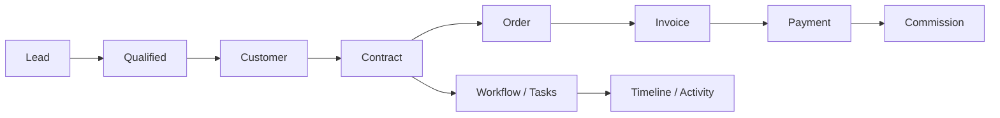

# Vision — DYN CRM

> Vietnamese version: [Vision.vi.md](./Vision.vi.md)

## 1. Purpose

Define the long-term product vision, near-term MVP outcomes, and measurable success criteria so every team member aligns on *why* DYN CRM is built.

## 2. Scope

| In scope | Out of scope |
|----------|--------------|
| Vision statement and principles | Feature-level acceptance criteria |
| Goals for MVP and post-MVP | UX wireframes |
| Success metrics (product & technical) | Detailed SLAs (defined in ops docs later) |
| Non-goals that protect focus | Marketing copy |

## 3. Background

Law firms need a single operational system that connects **client acquisition** (leads), **client records**, **legal contracts**, **work execution** (workflow/kanban), and **money** (order → invoice → payment → commission). Spreadsheet and fragmented tools create data inconsistency, weak auditability, and slow handoffs between sales, lawyers, and accounting.

DYN CRM targets a **single law firm deployment** first (~30 concurrent users), with architecture that can later support multi-tenant SaaS without a rewrite of domain cores.

## 4. Design

### 4.1 Vision statement

> DYN CRM is the operational backbone for a law firm: one system of record from lead to signed contract, from work progress to collected payment and fair collaborator commission — reliable, auditable, and maintainable for 3–5 years.

### 4.2 Product principles

| Principle | Meaning |
|-----------|---------|
| Single source of truth | Customer, contract, finance, and activity data live in one platform |
| Clear module boundaries | Modular monolith with DDD-lite; future microservice extraction possible |
| Money follows collection | Commission is based on **actual collected payment**, not contract value |
| Configurable where it varies | Workflow templates and commission percentage are configurable |
| Secure by default | NestJS BFF auth (Supabase Auth adapter) + RBAC, permission checks, audit for sensitive actions |
| Docs before drift | Phase-based documentation evolves with delivery; no undocumented business rules |

### 4.3 Value chain (target state)

### 4.4 MVP outcomes (4–5 months)

| Outcome | Description |
|---------|-------------|
| Operate core CRM | Create and manage Leads, Customers (individual/company), Contacts |
| Manage legal agreements | Contract lifecycle from Draft through Completed/Cancelled |
| Execute work | Configurable workflow templates with tasks, due dates, assignees, reminders |
| Manage documents | File storage via StoragePort (MVP: Supabase Storage) with contract/work attachment |
| Run finance basics | Order, Invoice (from contract/milestone/manual), VAT 10% exclusive, partial payments |
| Pay collaborators fairly | CTV portal + commission from collected payments |
| Stay informed | Dashboard, in-app notification, email (Resend) |
| Control access | Roles and permissions; CTV restricted portal |

### 4.5 Success criteria

| Category | Metric (MVP target) |
|----------|---------------------|
| Adoption | Core roles (Admin, Lawyer, Accounting, Sales) can complete daily tasks without spreadsheets for in-scope flows |
| Reliability | Production stack (Vercel + Railway + Supabase) stable for ~30 concurrent users |
| Data integrity | No silent finance mutations; payments and invoices reconcilable |
| Security | Authenticated API; RBAC enforced on sensitive routes; CTV cannot access full CRM |
| Maintainability | Clear module folders; docs Phase 00–01 complete before major coding |
| Delivery | MVP accepted within 4–5 months of kickoff |

### 4.6 Explicit non-goals (vision level)

- Becoming a full Legal Practice Management suite with practice-area specialization in MVP
- Multi-tenant SaaS billing and isolation in MVP
- BPMN workflow engine in MVP
- Payment gateway charging (VNPay/MoMo/Stripe) in MVP
- Kubernetes production deployment in MVP

## 5. Business Rules

1. Vision changes that expand MVP require Scope.md and Timeline.md updates in the same change set.
2. Technical choices supporting the vision (NestJS, Prisma, Redis, BullMQ, Supabase as infra via ports, etc.) are locked unless superseded by ADR.
3. UI for MVP is Vietnamese; English UI is Phase 2 and must not block MVP acceptance.
4. “Multi-tenant ready” and “Kubernetes ready” mean architectural readiness, not MVP features.

## 6. Best Practices

- Trace every epic to at least one MVP outcome in section 4.4.
- Reject feature requests that violate non-goals unless Scope is formally revised.
- Prefer measurable acceptance over vague “improve productivity” claims.
- Keep vision stable; put volatility into Roadmap.md.

## 7. Examples

**Aligned request:** “Add milestone-based invoice generation for an active contract.” → Fits Finance MVP outcome.

**Misaligned request:** “Build full litigation case management with court calendar.” → Out of vision for MVP; park on Roadmap under practice-area extensions.

**Aligned technical work:** “Introduce domain events + BullMQ for payment → commission calculation.” → Supports money integrity and modular boundaries.

## 8. Future Improvements

| Vision evolution | Target phase |
|------------------|--------------|
| Multi-tenant SaaS | Post-MVP (design hooks from day one) |
| Multi-currency | Post-MVP |
| Practice-area modules (Labor, Civil, Business, IP, Litigation) | Post-MVP |
| Advanced commission (tier, shared, team) | Post-MVP |
| English UI | Phase 2 |
| CI/CD with GitHub Actions | Phase 2 |
| Payment gateways | Future finance phase |

## 9. References

- `docs/00-project/Scope.md`
- `docs/00-project/Roadmap.md`
- `docs/00-project/Business.md`
- Stakeholder decisions locked 2026-08-02

---

## Suggested related documents

- `Scope.md` — what is built in MVP
- `Timeline.md` — when MVP ships
- `Roadmap.md` — what comes after
- `01-architecture/Architecture.md` — how the system is structured

## TODO

- [ ] Record named product sponsor / law firm stakeholder
- [ ] Define quantitative KPI targets (e.g. invoice cycle time) after baseline measurement exists
- [ ] Confirm concurrent-user assumption (~30) with real license/seat count
