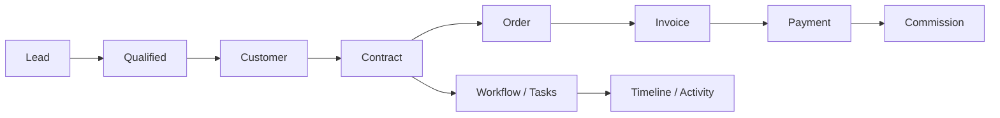

# Tầm nhìn — DYN CRM

> Bản tiếng Việt của [Vision.md](./Vision.md). Canonical: bản English.

## 1. Mục đích

Định nghĩa tầm nhìn dài hạn, kết quả MVP gần, và tiêu chí thành công đo được để toàn đội thống nhất *vì sao* xây DYN CRM.

## 2. Phạm vi

| Trong phạm vi | Ngoài phạm vi |
|---------------|---------------|
| Tuyên bố tầm nhìn và nguyên tắc | Acceptance criteria cấp feature |
| Mục tiêu MVP và sau MVP | Wireframe UX |
| Chỉ số thành công (sản phẩm & kỹ thuật) | SLA chi tiết (ops docs sau) |
| Non-goal bảo vệ focus | Nội dung marketing |

## 3. Bối cảnh

Văn phòng luật cần một hệ thống vận hành gắn **thu hút khách** (lead), **hồ sơ khách**, **hợp đồng pháp lý**, **thực thi công việc** (workflow/kanban), và **dòng tiền** (order → invoice → payment → commission). Excel và công cụ rời rạc gây lệch dữ liệu, kiểm toán yếu, bàn giao chậm giữa sales, luật sư và kế toán.

DYN CRM hướng tới triển khai **một văn phòng luật** trước (~30 user đồng thời), với kiến trúc sau này hỗ trợ multi-tenant SaaS mà không viết lại lõi domain.

## 4. Thiết kế

### 4.1 Tuyên bố tầm nhìn

> DYN CRM là xương sống vận hành của văn phòng luật: một hệ thống ghi nhận duy nhất từ lead đến hợp đồng đã ký, từ tiến độ công việc đến tiền đã thu và hoa hồng CTV công bằng — tin cậy, kiểm toán được, và dễ bảo trì 3–5 năm.

### 4.2 Nguyên tắc sản phẩm

| Nguyên tắc | Ý nghĩa |
|------------|---------|
| Single source of truth | Customer, contract, finance, activity sống trên một nền tảng |
| Ranh giới module rõ | Modular monolith DDD-lite; sau này có thể tách microservice |
| Tiền theo thực thu | Hoa hồng dựa trên **thanh toán đã thu thực tế**, không theo giá trị hợp đồng |
| Cấu hình chỗ biến thiên | Mẫu workflow và % hoa hồng cấu hình được |
| Secure by default | NestJS BFF auth (adapter Supabase Auth) + RBAC, permission, audit hành động nhạy cảm |
| Docs trước khi lệch | Tài liệu theo phase; không có business rule “chỉ nằm trong đầu” |

### 4.3 Chuỗi giá trị (trạng thái mục tiêu)

### 4.4 Kết quả MVP (4–5 tháng)

| Kết quả | Mô tả |
|---------|--------|
| Vận hành CRM lõi | Tạo/quản lý Lead, Customer (cá nhân/công ty), Contact |
| Quản lý thỏa thuận pháp lý | Vòng đời Contract từ Draft đến Completed/Cancelled |
| Thực thi công việc | Workflow template cấu hình được: task, hạn, assignee, nhắc việc |
| Quản lý tài liệu | Lưu file qua StoragePort (MVP: Supabase Storage), đính kèm hợp đồng/công việc |
| Tài chính cơ bản | Order, Invoice (từ contract/milestone/manual), VAT 10% exclusive, thanh toán một phần |
| Hoa hồng CTV công bằng | Cổng CTV + hoa hồng từ tiền đã thu |
| Theo dõi thông tin | Dashboard, notification in-app, email (Resend) |
| Kiểm soát truy cập | Role + permission; CTV chỉ portal hạn chế |

### 4.5 Tiêu chí thành công

| Hạng mục | Chỉ số (mục tiêu MVP) |
|----------|------------------------|
| Adoption | Role lõi (Admin, Lawyer, Accounting, Sales) hoàn thành việc hàng ngày không cần Excel cho flow trong scope |
| Reliability | Stack production (Vercel + Railway + Supabase) ổn định ~30 user đồng thời |
| Data integrity | Không sửa finance “âm thầm”; invoice và payment đối soát được |
| Security | API có auth; RBAC trên route nhạy cảm; CTV không vào full CRM |
| Maintainability | Folder module rõ; docs Phase 00–01 xong trước coding lớn |
| Delivery | MVP được chấp nhận trong 4–5 tháng kể từ kickoff |

### 4.6 Non-goal rõ ràng (cấp tầm nhìn)

- Trở thành bộ Legal Practice Management đầy đủ với chuyên biệt lĩnh vực trong MVP
- Multi-tenant SaaS billing và cô lập tenant trong MVP
- Engine workflow BPMN trong MVP
- Cổng thanh toán (VNPay/MoMo/Stripe) trong MVP
- Deploy production Kubernetes trong MVP

## 5. Quy tắc nghiệp vụ

1. Đổi tầm nhìn làm mở rộng MVP phải cập nhật Scope và Timeline trong cùng một thay đổi.
2. Lựa chọn kỹ thuật phục vụ tầm nhìn (NestJS, Prisma, Redis, BullMQ, Supabase là infra qua ports, …) đã khóa trừ khi ADR thay thế.
3. UI MVP là tiếng Việt; UI English là Phase 2 và không chặn acceptance MVP.
4. “Multi-tenant ready” và “Kubernetes ready” là sẵn sàng kiến trúc, không phải tính năng MVP.

## 6. Best practices

- Mỗi epic phải map tới ít nhất một kết quả MVP ở mục 4.4.
- Từ chối request vi phạm non-goal trừ khi Scope được sửa chính thức.
- Ưu tiên acceptance đo được hơn câu “cải thiện năng suất” chung chung.
- Giữ Vision ổn định; độ biến động để ở Roadmap.

## 7. Ví dụ

**Request đúng hướng:** “Xuất hóa đơn theo milestone cho hợp đồng đang active.” → Khớp Finance MVP.

**Request lệch tầm nhìn:** “Case management tranh tụng đầy đủ kèm lịch tòa.” → Ngoài MVP; để Roadmap phần practice area.

**Việc kỹ thuật đúng hướng:** “Domain event + BullMQ cho payment → tính commission.” → Bảo vệ tính toàn vẹn tiền và ranh giới module.

## 8. Cải tiến tương lai

| Tiến hóa tầm nhìn | Phase mục tiêu |
|-------------------|----------------|
| Multi-tenant SaaS | Sau MVP (hook từ ngày đầu) |
| Đa tiền tệ | Sau MVP |
| Module lĩnh vực (Lao động, Dân sự, Doanh nghiệp, Sở hữu trí tuệ, Tranh tụng) | Sau MVP |
| Hoa hồng nâng cao (tier, chia sẻ, team) | Sau MVP |
| UI English | Phase 2 |
| CI/CD GitHub Actions | Phase 2 |
| Cổng thanh toán | Phase tài chính tương lai |

## 9. Tham chiếu

- `Scope.md` / `Scope.vi.md`
- `Roadmap.md` / `Roadmap.vi.md`
- `Business.md` / `Business.vi.md`
- Quyết định stakeholder khóa 2026-08-02

---

## Tài liệu liên quan gợi ý

- `Scope.vi.md` — xây gì trong MVP
- `Timeline.vi.md` — khi nào ship MVP
- `Roadmap.vi.md` — sau MVP
- `01-architecture/Architecture.md` — cấu trúc hệ thống

## TODO

- [ ] Ghi tên sponsor sản phẩm / stakeholder văn phòng luật
- [ ] Định KPI định lượng (vd. chu kỳ hóa đơn) sau khi có baseline
- [ ] Xác nhận giả định ~30 user đồng thời với số seat thực tế
