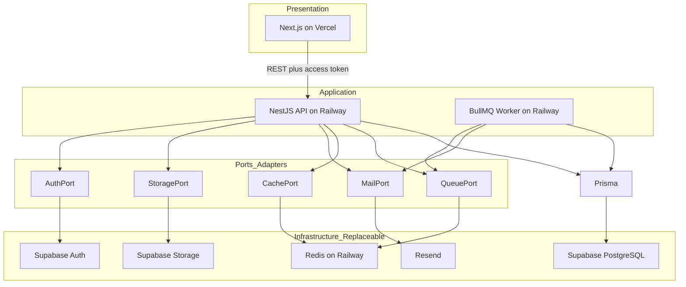
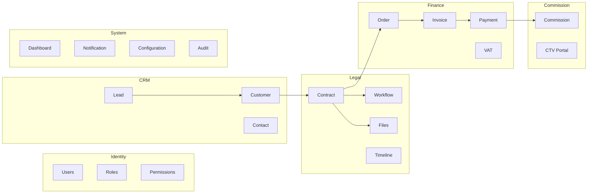
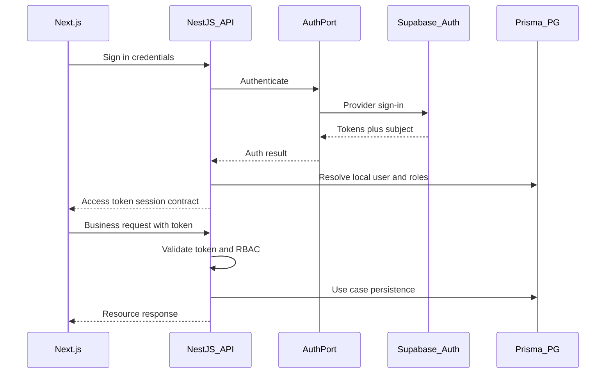
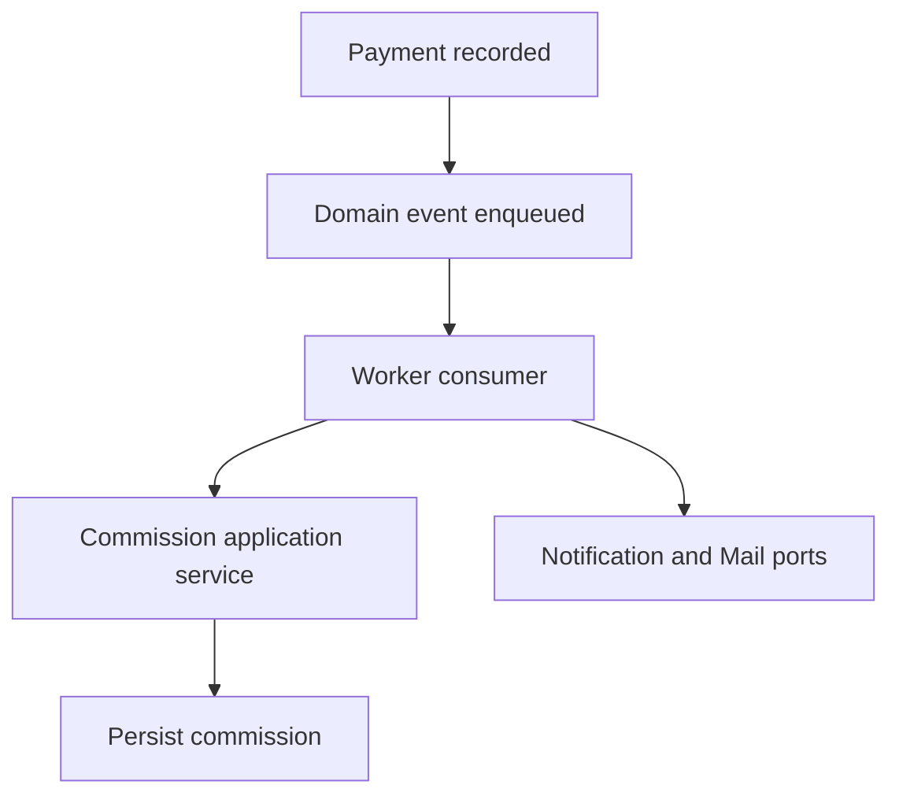
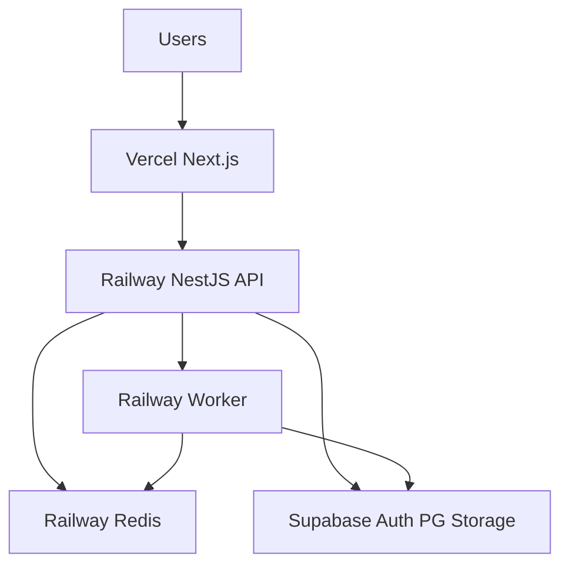
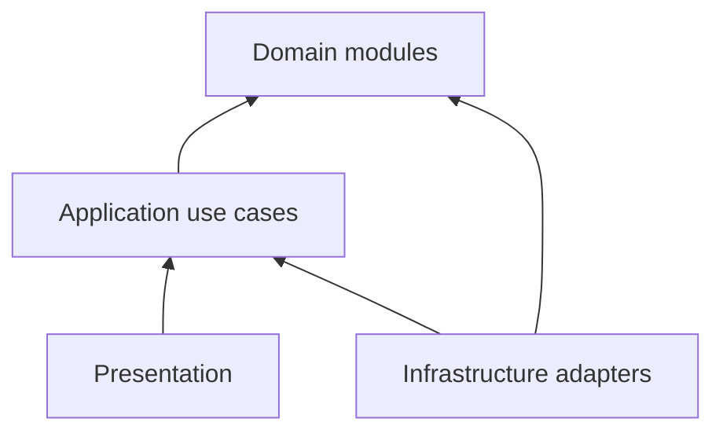

# Architecture — DYN CRM

> Vietnamese version: [Architecture.vi.md](./Architecture.vi.md)  
> **Canonical technical source:** English. Sync EN and VI in the same change set.

## 1. Purpose

Define the system-level software architecture for DYN CRM so that presentation, application, domain, and infrastructure remain cleanly separated, vendor-replaceable, and maintainable for 3–5 years before any broad implementation begins.

## 2. Scope

| In scope | Out of scope |
|----------|--------------|
| Logical layers and deployable units | Framework setup recipes, package versions |
| Modular monolith boundaries (DDD-lite) | Prisma schema, SQL, API payload contracts |
| Auth/authz architectural split | Permission matrix per endpoint |
| Infrastructure ports and replaceability | Exact Railway/Vercel env var lists |
| High-level async and data flows | Monitoring SLOs (see Monitoring.md later) |

Audience: architects, tech leads, backend/frontend engineers, and reviewers of Phase 01.

## 3. Background

Phase 00 locked product scope for a law-firm CRM: Lead → Customer → Contract → Order → Payment Schedule → Payment → Debt → VAT Invoice → Commission (invoice after payment), configurable workflows, CTV Collaboration portal (expanded), Vietnamese UI, single-tenant MVP.

Infrastructure choices were revised for Phase 01 and synced into Phase 00 platform rows:

| Concern | MVP choice | Architectural role |
|---------|------------|--------------------|
| Presentation | Next.js on Vercel | UI only; no business rules |
| Application | NestJS API + BullMQ worker on Railway | All business logic and authorization |
| Persistence | Prisma → Supabase PostgreSQL | DB access only through Prisma |
| Authentication provider | Supabase Auth (via NestJS BFF) | Identity infrastructure |
| Authorization | NestJS RBAC + permissions | Application policy, not vendor |
| Object storage | Supabase Storage via StoragePort | Replaceable adapter |
| Cache / queue | Redis + BullMQ on Railway | Async jobs and cache |
| Email | Resend via MailPort | Replaceable adapter |
| Future ops | Docker Compose on VPS | Post-MVP hosting path |

**Principle:** never design domain modules around a vendor. Supabase, Railway, Vercel, Redis, Resend, and Docker are infrastructure, not business.

## 4. Architecture Decisions

### AD-A1 — Modular monolith (DDD-lite)

One deployable backend codebase with explicit internal modules. No microservice split in MVP. Module boundaries must allow future extraction without rewriting domain rules.

### AD-A2 — Layered responsibilities

| Layer | Technology | Owns |
|-------|------------|------|
| Presentation | Next.js | Screens, forms, client cache (TanStack Query), i18n UI |
| Application | NestJS | Use cases, orchestration, validation at API boundary, RBAC |
| Domain (logical) | NestJS modules | Business invariants, domain events, policies |
| Persistence | Prisma | Mapping to PostgreSQL |
| Infrastructure adapters | Ports + adapters | Auth, storage, mail, cache, queue providers |

### AD-A3 — NestJS as BFF for authentication (Option B)

- Clients call **NestJS auth endpoints only** for sign-in, refresh, and sign-out.
- NestJS implements an **AuthPort**; the Supabase Auth adapter is one implementation.
- Clients **must not** call Supabase for business data or as the authorization authority.
- NestJS validates the access token on protected routes and applies **RBAC + permissions** locally.
- CTV restricted portal is enforced in NestJS, not by Supabase dashboard rules alone.

### AD-A4 — Authorization stays in NestJS

Supabase Auth answers *who is authenticated*. NestJS answers *what they may do*. Dual authorization (NestJS + Supabase RLS as primary policy) is rejected for MVP to avoid drift.

### AD-A5 — Prisma as sole persistence path

Application and domain code persist only through Prisma repositories/adapters. Supabase PostgreSQL is hosted PostgreSQL, not an application API.

### AD-A6 — Replaceable infrastructure via ports

Mandatory ports (logical names):

| Port | MVP adapter | Future alternatives |
|------|-------------|---------------------|
| AuthPort | Supabase Auth | Other IdP / custom JWT issuer |
| StoragePort | Supabase Storage | MinIO, Cloudflare R2 |
| MailPort | Resend | Other transactional email |
| CachePort | Redis | In-memory (dev), other cache |
| QueuePort | BullMQ on Redis | Other job runner |

Domain modules depend on ports, never on vendor SDKs.

### AD-A7 — Async work on Railway

Reminders, notification fan-out, commission calculation after collected payment, and outbound email are processed by `apps/worker` via BullMQ. Worker reuses application/domain services; business rules are not duplicated in the frontend.

### AD-A8 — Monorepo deployables

| App | Host (MVP) | Role |
|-----|------------|------|
| `apps/frontend` | Vercel | Next.js presentation |
| `apps/backend` | Railway | NestJS REST API |
| `apps/worker` | Railway | BullMQ consumers |
| `packages/*` | published/consumed in-repo | shared-types, shared-utils, shared-ui |

### AD-A9 — Single-tenant runtime, multi-tenant ready design

MVP runs one firm per deployment. Avoid hard-coding global uniqueness assumptions that block a later `tenant` dimension (detail in future ADR).

## 5. Diagrams

### 5.1 Logical layers and infrastructure

### 5.2 Modular monolith map

### 5.3 Authentication BFF sequence

### 5.4 Finance to commission async flow

### 5.5 MVP deployment topology

## 6. Responsibilities

| Component | Responsibilities | Must not |
|-----------|------------------|----------|
| Next.js | Render UI, call REST API, hold client session UX | Encode commission/invoice/contract invariants; call Supabase business APIs |
| NestJS API | Use cases, validation, auth BFF, RBAC, enqueue jobs | Embed vendor SDKs inside domain services |
| Worker | Consume jobs, run application services, send mail/notifications | Invent alternate business rules |
| Prisma layer | Persist aggregates/entities | Own authorization decisions |
| AuthPort adapter | Map NestJS auth use cases to Supabase Auth | Decide CRM permissions |
| StoragePort adapter | Upload/download/delete objects | Interpret contract/finance meaning of files |
| Domain modules | Invariants and domain events | Depend on HTTP, Supabase, or Redis clients |

## 7. Dependencies

### 7.1 Allowed dependency direction

Presentation depends on Application (via REST). Application depends on Domain. Infrastructure adapters implement ports required by Application/Domain. Domain never depends on Infrastructure or Presentation.

### 7.2 Inter-module rules

| From | To | Allowed how |
|------|-----|-------------|
| CRM | Identity | Read user/owner references |
| Legal | CRM | Reference Customer |
| Finance | Legal | Order from Contract |
| Commission | Finance | React to collected Payment (events/services) |
| System | All | Read models / notifications by subscription |
| Any module | Sibling domain internals | Forbidden — use public application APIs or events |

### 7.3 External systems

| External | Consumed by | Via |
|----------|-------------|-----|
| Supabase Auth | Backend | AuthPort adapter |
| Supabase PostgreSQL | Backend, Worker | Prisma |
| Supabase Storage | Backend | StoragePort adapter |
| Redis | Backend, Worker | CachePort / QueuePort |
| Resend | Backend, Worker | MailPort |
| Vercel / Railway | Ops | Platform hosting |

## 8. Best Practices

- Keep business rules in NestJS application/domain services, never in React components or Supabase Edge Functions (unless a future ADR explicitly moves a use case).
- One module folder per bounded context; public facade only.
- Prefer domain events on the queue for cross-module side effects (payment → commission, task due → reminder).
- Treat tokens from Supabase as **credentials**, not as permission documents.
- Design StoragePort keys/metadata without leaking Supabase bucket APIs into domain types.
- Keep CTV capabilities behind permission checks in the Commission/Identity boundary.
- Document architecture changes with ADRs; do not silently widen vendor coupling.
- Update Phase 00 platform rows after this document is approved so Scope/Timeline/OVERVIEW match.

## 9. Trade-offs

| Decision | Benefit | Cost |
|----------|---------|------|
| Modular monolith | Simple ops for ~30 users; shared transaction ease | Discipline required to keep boundaries clean |
| NestJS BFF over Supabase Auth | Single policy gate; replaceable IdP; CTV control | Extra hop vs direct Supabase client auth |
| NestJS-only authorization | No dual policy drift | Must implement RBAC thoroughly in API |
| Supabase for Auth + PG + Storage | Fast MVP infra | Vendor concentration — mitigated by ports |
| Vercel + Railway split | Managed DX for frontend/API/worker | Cross-cloud networking/latency; two ops surfaces |
| BullMQ worker separate process | Isolation for async load | Second deployable to operate and observe |
| Defer Compose-on-VPS | Faster MVP hosting | Migration work later for self-host |

### Architect challenges (accepted for MVP)

1. **BFF latency** — accepted for policy centralization.
2. **Supabase Auth user vs CRM User** — requires an identity mapping projection in PostgreSQL (detail in Security.md / Module.md).
3. **RLS** — not the authorization source of truth in MVP; optional defense-in-depth later.
4. **Phase 00 drift** — platform rows outdated until follow-up update.

## 10. Future Improvements

| Item | Trigger |
|------|---------|
| Docker Compose on VPS | Cost control, data residency, or ops preference post-MVP |
| Swap StoragePort to MinIO/R2 | Vendor or cost change |
| Swap AuthPort IdP | Enterprise SSO / exit Supabase Auth |
| Extract Finance or Notification to a service | Team or scale boundary pressure |
| Multi-tenant runtime | Product becomes SaaS |
| Kubernetes | HA / multi-instance beyond Compose |
| Supabase RLS defense-in-depth | After NestJS authz is stable and tested |
| GitHub Actions CI/CD | Phase 2 (per Phase 00 roadmap) |

## 11. References

- [`docs/00-project/Vision.md`](../00-project/Vision.md)
- [`docs/00-project/Scope.md`](../00-project/Scope.md)
- [`docs/00-project/Business.md`](../00-project/Business.md)
- [`docs/00-project/Glossary.md`](../00-project/Glossary.md)
- [`OVERVIEW.md`](../../OVERVIEW.md)
- Stakeholder architecture lock: NestJS BFF (Option B); Redis/BullMQ/worker on Railway; Supabase as infrastructure only

---

## Suggested related documents

| Document | Status | Why |
|----------|--------|-----|
| [TechStack.md](./TechStack.md) | ✅ Locked | Versions, libraries, rationale |
| [Module.md](./Module.md) | ✅ Draft — awaiting approval | Module APIs and ownership |
| [Security.md](./Security.md) | After Module | Token validation, RBAC, identity mapping |
| [Deployment.md](./Deployment.md) | After Security | Vercel + Railway + Supabase topology detail |
| [Monitoring.md](./Monitoring.md) | After Deployment | Logs, metrics, alerts |
| [Decisions/ADR-001.md](./Decisions/ADR-001.md) | After core docs | Modular monolith + ports |
| [Decisions/ADR-002.md](./Decisions/ADR-002.md) | After core docs | Prisma + Supabase PG as system of record |
| Phase 00 Scope / Timeline / Roadmap / OVERVIEW | Update after Architecture approval | Remove MinIO/Compose-MVP/JWT-only contradictions |

## TODO

- [ ] Approve this Architecture document (gate before TechStack.md)
- [ ] Update Phase 00 platform rows (Auth BFF, Supabase storage/PG, Vercel+Railway, Compose future)
- [ ] Define Supabase Auth subject ↔ CRM User mapping fields (Security.md)
- [ ] Decide whether any Supabase RLS is used as defense-in-depth (Security.md)
- [ ] Confirm session contract returned by NestJS BFF (cookie vs bearer) in Security.md
- [ ] Confirm Resend remains the MVP MailPort adapter
- [ ] Draft ADR-001 and ADR-002 after Architecture + TechStack approval
