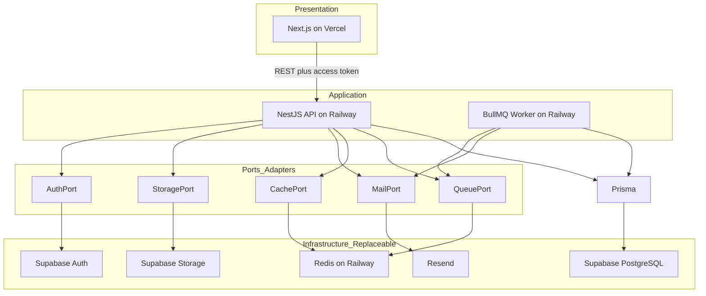
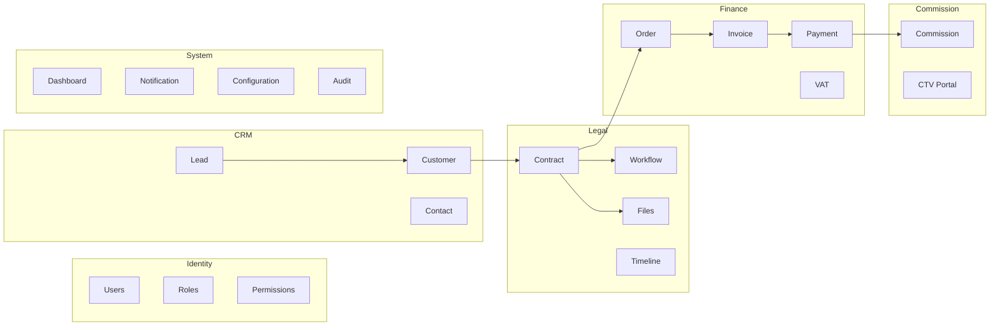
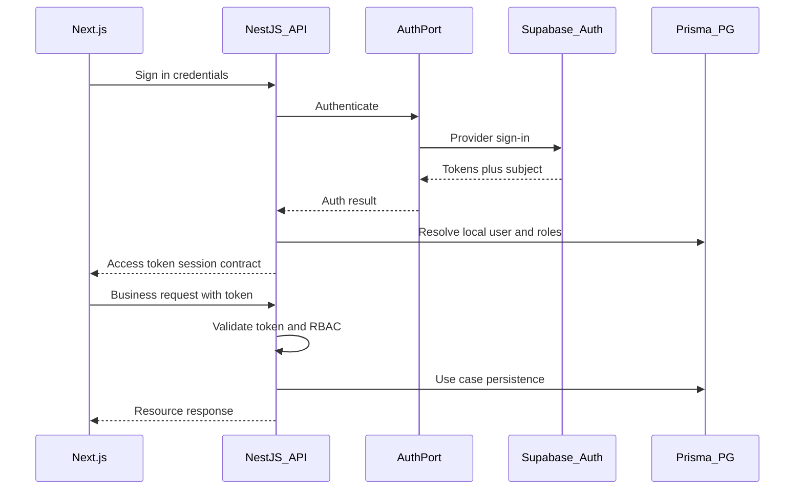
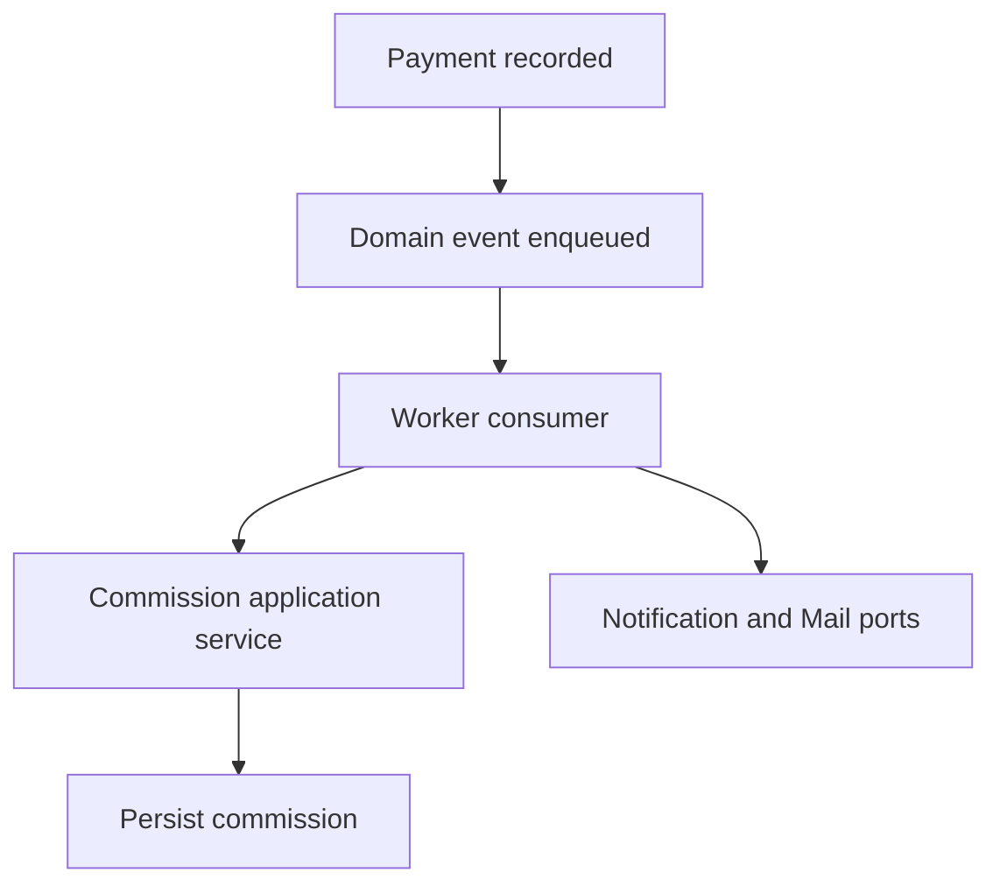
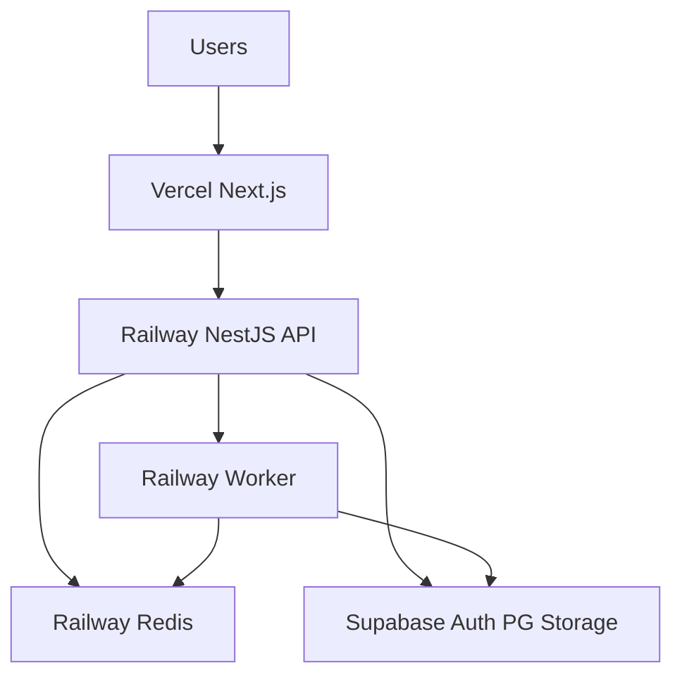
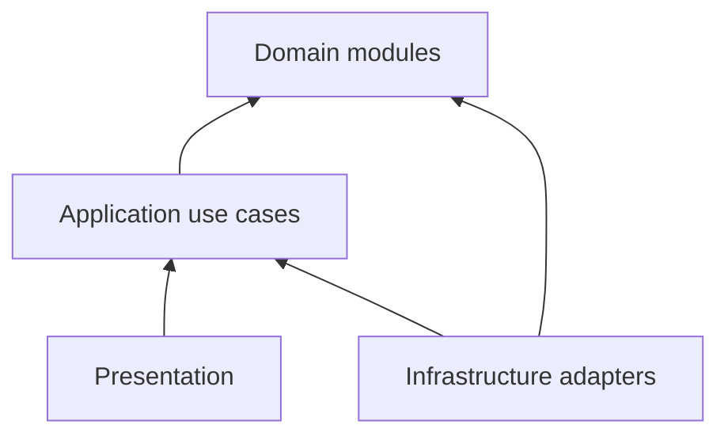

# Kiến trúc — DYN CRM

> Bản tiếng Việt của [Architecture.md](./Architecture.md).  
> **Nguồn kỹ thuật chuẩn (canonical):** bản English. Đồng bộ EN và VI trong cùng một thay đổi.

## 1. Mục đích

Định nghĩa kiến trúc phần mềm cấp hệ thống cho DYN CRM để tách bạch presentation, application, domain và infrastructure; vendor có thể thay thế; bảo trì được 3–5 năm — trước khi triển khai rộng.

## 2. Phạm vi

| Trong phạm vi | Ngoài phạm vi |
|---------------|---------------|
| Layer logic và đơn vị deploy | Công thức setup framework, version package |
| Ranh giới modular monolith (DDD-lite) | Prisma schema, SQL, contract payload API |
| Tách Auth / Authz ở mức kiến trúc | Ma trận permission từng endpoint |
| Port hạ tầng và khả năng thay thế | Danh sách env var Railway/Vercel chi tiết |
| Luồng async và dữ liệu mức cao | SLO monitoring (xem Monitoring.md sau) |

Đối tượng đọc: architect, tech lead, engineer BE/FE, reviewer Phase 01.

## 3. Bối cảnh

Phase 00 đã khóa phạm vi sản phẩm CRM văn phòng luật: Lead → Customer → Contract → Order → Payment Schedule → Payment → Debt → VAT Invoice → Commission (hóa đơn sau payment), workflow cấu hình được, portal Collaboration CTV (đã mở rộng), UI tiếng Việt, single-tenant MVP.

Lựa chọn hạ tầng được điều chỉnh ở Phase 01 và đã đồng bộ vào dòng platform Phase 00:

| Concern | Lựa chọn MVP | Vai trò kiến trúc |
|---------|--------------|-------------------|
| Presentation | Next.js trên Vercel | Chỉ UI; không business rule |
| Application | NestJS API + BullMQ worker trên Railway | Toàn bộ business logic và authorization |
| Persistence | Prisma → Supabase PostgreSQL | Truy cập DB chỉ qua Prisma |
| Authentication provider | Supabase Auth (qua NestJS BFF) | Hạ tầng định danh |
| Authorization | NestJS RBAC + permission | Policy ứng dụng, không phụ thuộc vendor |
| Object storage | Supabase Storage qua StoragePort | Adapter thay thế được |
| Cache / queue | Redis + BullMQ trên Railway | Job async và cache |
| Email | Resend qua MailPort | Adapter thay thế được |
| Ops tương lai | Docker Compose trên VPS | Đường hosting sau MVP |

**Nguyên tắc:** không thiết kế module domain quanh một vendor. Supabase, Railway, Vercel, Redis, Resend và Docker là infrastructure, không phải business.

## 4. Quyết định kiến trúc

### AD-A1 — Modular monolith (DDD-lite)

Một codebase backend deploy được với module nội bộ rõ ràng. Không tách microservice trong MVP. Ranh giới module phải cho phép tách sau mà không viết lại rule domain.

### AD-A2 — Trách nhiệm theo layer

| Layer | Công nghệ | Sở hữu |
|-------|-----------|--------|
| Presentation | Next.js | Màn hình, form, client cache (TanStack Query), i18n UI |
| Application | NestJS | Use case, orchestration, validation biên API, RBAC |
| Domain (logic) | NestJS modules | Bất biến nghiệp vụ, domain event, policy |
| Persistence | Prisma | Ánh xạ PostgreSQL |
| Infrastructure adapters | Ports + adapters | Auth, storage, mail, cache, queue |

### AD-A3 — NestJS là BFF cho authentication (Option B)

- Client chỉ gọi **endpoint auth của NestJS** cho đăng nhập, refresh, đăng xuất.
- NestJS triển khai **AuthPort**; adapter Supabase Auth là một implementation.
- Client **không** gọi Supabase cho business data hay coi Supabase là authority ủy quyền.
- NestJS validate access token trên route bảo vệ và áp dụng **RBAC + permission** nội bộ.
- Portal CTV hạn chế được enforce trong NestJS, không chỉ dựa rule dashboard Supabase.

### AD-A4 — Authorization giữ trong NestJS

Supabase Auth trả lời *ai đã xác thực*. NestJS trả lời *được phép làm gì*. Dual authorization (NestJS + Supabase RLS làm policy chính) bị từ chối ở MVP để tránh lệch policy.

### AD-A5 — Prisma là đường persistence duy nhất

Application/domain chỉ lưu qua Prisma repository/adapter. Supabase PostgreSQL là PostgreSQL được host, không phải application API.

### AD-A6 — Hạ tầng thay thế được qua ports

Port bắt buộc (tên logic):

| Port | Adapter MVP | Thay thế tương lai |
|------|-------------|-------------------|
| AuthPort | Supabase Auth | IdP khác / tự phát JWT |
| StoragePort | Supabase Storage | MinIO, Cloudflare R2 |
| MailPort | Resend | Email giao dịch khác |
| CachePort | Redis | In-memory (dev), cache khác |
| QueuePort | BullMQ trên Redis | Job runner khác |

Module domain phụ thuộc port, không phụ thuộc vendor SDK.

### AD-A7 — Việc async trên Railway

Nhắc việc, fan-out notification, tính hoa hồng sau thanh toán đã thu, và gửi email được xử lý bởi `apps/worker` qua BullMQ. Worker tái sử dụng application/domain service; không nhân đôi business rule ở frontend.

### AD-A8 — Đơn vị deploy trong monorepo

| App | Host (MVP) | Vai trò |
|-----|------------|---------|
| `apps/frontend` | Vercel | Presentation Next.js |
| `apps/backend` | Railway | NestJS REST API |
| `apps/worker` | Railway | BullMQ consumer |
| `packages/*` | dùng trong repo | shared-types, shared-utils, shared-ui |

### AD-A9 — Runtime single-tenant, thiết kế multi-tenant ready

MVP chạy một văn phòng / một deployment. Tránh giả định uniqueness toàn cục chặn chiều `tenant` sau này (chi tiết ADR tương lai).

## 5. Sơ đồ

### 5.1 Layer logic và hạ tầng

### 5.2 Bản đồ modular monolith

### 5.3 Chuỗi authentication BFF

### 5.4 Luồng async Finance → Commission

### 5.5 Topology deploy MVP

## 6. Trách nhiệm

| Thành phần | Trách nhiệm | Không được |
|------------|-------------|------------|
| Next.js | Render UI, gọi REST API, UX session phía client | Encode bất biến commission/invoice/contract; gọi Supabase business API |
| NestJS API | Use case, validation, auth BFF, RBAC, enqueue job | Nhúng vendor SDK trong domain service |
| Worker | Consume job, chạy application service, gửi mail/notification | Bịa business rule khác |
| Prisma layer | Persist aggregate/entity | Sở hữu quyết định authorization |
| AuthPort adapter | Ánh xạ use case auth NestJS sang Supabase Auth | Quyết định permission CRM |
| StoragePort adapter | Upload/download/xóa object | Giải nghĩa ý nghĩa file trong contract/finance |
| Domain modules | Bất biến và domain event | Phụ thuộc HTTP, Supabase, hoặc Redis client |

## 7. Phụ thuộc

### 7.1 Hướng phụ thuộc được phép

Presentation phụ thuộc Application (qua REST). Application phụ thuộc Domain. Infrastructure adapter triển khai port mà Application/Domain cần. Domain không phụ thuộc Infrastructure hay Presentation.

### 7.2 Quy tắc giữa module

| Từ | Tới | Cách được phép |
|----|-----|----------------|
| CRM | Identity | Đọc tham chiếu user/owner |
| Legal | CRM | Tham chiếu Customer |
| Finance | Legal | Order từ Contract |
| Commission | Finance | Phản ứng Payment đã thu (event/service) |
| System | All | Read model / notification theo subscription |
| Bất kỳ module | Nội bộ domain anh em | Cấm — dùng API application công khai hoặc event |

### 7.3 Hệ thống bên ngoài

| Bên ngoài | Được dùng bởi | Qua |
|-----------|---------------|-----|
| Supabase Auth | Backend | AuthPort adapter |
| Supabase PostgreSQL | Backend, Worker | Prisma |
| Supabase Storage | Backend | StoragePort adapter |
| Redis | Backend, Worker | CachePort / QueuePort |
| Resend | Backend, Worker | MailPort |
| Vercel / Railway | Ops | Hosting nền tảng |

## 8. Best practices

- Giữ business rule trong NestJS application/domain service, không đặt trong React component hay Supabase Edge Function (trừ khi ADR tương lai chuyển use case).
- Một folder module / bounded context; chỉ facade công khai.
- Ưu tiên domain event trên queue cho side effect xuyên module (payment → commission, task đến hạn → reminder).
- Token từ Supabase là **credential**, không phải tài liệu permission.
- Thiết kế StoragePort key/metadata không lộ API bucket Supabase vào domain type.
- Năng lực CTV đi sau kiểm tra permission tại biên Commission/Identity.
- Đổi kiến trúc phải có ADR; không âm thầm tăng coupling vendor.
- Cập nhật dòng platform Phase 00 sau khi tài liệu này được duyệt để Scope/Timeline/OVERVIEW khớp.

## 9. Trade-off

| Quyết định | Lợi ích | Chi phí |
|------------|---------|---------|
| Modular monolith | Ops đơn giản ~30 user; transaction dùng chung dễ | Cần kỷ luật giữ ranh giới |
| NestJS BFF trên Supabase Auth | Một cổng policy; IdP thay thế được; kiểm soát CTV | Thêm một hop so với client gọi Supabase trực tiếp |
| Authorization chỉ NestJS | Không lệch dual policy | Phải làm RBAC kỹ trên API |
| Supabase cho Auth + PG + Storage | Hạ tầng MVP nhanh | Tập trung vendor — giảm bằng ports |
| Tách Vercel + Railway | DX managed cho FE/API/worker | Latency mạng cross-cloud; hai bề mặt ops |
| Worker BullMQ process riêng | Cách ly tải async | Thêm một deployable cần vận hành/quan sát |
| Hoãn Compose-on-VPS | Hosting MVP nhanh hơn | Công migration self-host sau |

### Thách thức kiến trúc (chấp nhận cho MVP)

1. **Độ trễ BFF** — chấp nhận để tập trung policy.
2. **Supabase Auth user vs CRM User** — cần projection ánh xạ định danh trong PostgreSQL (chi tiết Security.md / Module.md).
3. **RLS** — không phải nguồn chân lý authorization MVP; defense-in-depth tùy chọn sau.
4. **Lệch Phase 00** — dòng platform cũ cho đến khi cập nhật follow-up.

## 10. Cải tiến tương lai

| Hạng mục | Khi nào |
|----------|---------|
| Docker Compose trên VPS | Kiểm soát chi phí, cư trú dữ liệu, hoặc ưu tiên ops sau MVP |
| Đổi StoragePort sang MinIO/R2 | Đổi vendor hoặc chi phí |
| Đổi AuthPort IdP | Enterprise SSO / thoát Supabase Auth |
| Tách Finance hoặc Notification thành service | Áp lực ranh giới team hoặc scale |
| Runtime multi-tenant | Sản phẩm thành SaaS |
| Kubernetes | HA / multi-instance vượt Compose |
| Supabase RLS defense-in-depth | Sau khi NestJS authz ổn định và được test |
| CI/CD GitHub Actions | Phase 2 (theo roadmap Phase 00) |

## 11. Tham chiếu

- [`docs/00-project/Vision.md`](../00-project/Vision.md)
- [`docs/00-project/Scope.md`](../00-project/Scope.md)
- [`docs/00-project/Business.md`](../00-project/Business.md)
- [`docs/00-project/Glossary.md`](../00-project/Glossary.md)
- [`OVERVIEW.md`](../../OVERVIEW.md)
- Khóa kiến trúc stakeholder: NestJS BFF (Option B); Redis/BullMQ/worker trên Railway; Supabase chỉ là infrastructure

---

## Tài liệu liên quan gợi ý

| Tài liệu | Trạng thái | Vì sao |
|----------|------------|--------|
| [TechStack.md](./TechStack.md) | ✅ Draft — chờ duyệt | Version, thư viện, lý do chọn |
| [Module.md](./Module.md) | Sau TechStack | API module và ownership |
| [Security.md](./Security.md) | Sau Module | Validate token, RBAC, ánh xạ định danh |
| [Deployment.md](./Deployment.md) | Sau Security | Topology Vercel + Railway + Supabase chi tiết |
| [Monitoring.md](./Monitoring.md) | Sau Deployment | Log, metric, alert |
| [Decisions/ADR-001.md](./Decisions/ADR-001.md) | Sau docs lõi | Modular monolith + ports |
| [Decisions/ADR-002.md](./Decisions/ADR-002.md) | Sau docs lõi | Prisma + Supabase PG là system of record |
| Phase 00 Scope / Timeline / Roadmap / OVERVIEW | Cập nhật sau khi duyệt Architecture | Gỡ mâu thuẫn MinIO / Compose-MVP / JWT-only |

## TODO

- [ ] Duyệt tài liệu Architecture này (gate trước TechStack.md)
- [ ] Cập nhật dòng platform Phase 00 (Auth BFF, Supabase storage/PG, Vercel+Railway, Compose tương lai)
- [ ] Định field ánh xạ Supabase Auth subject ↔ CRM User (Security.md)
- [ ] Quyết có dùng Supabase RLS defense-in-depth không (Security.md)
- [ ] Xác nhận session contract NestJS BFF trả về (cookie vs bearer) trong Security.md
- [ ] Xác nhận Resend vẫn là MailPort adapter MVP
- [ ] Soạn ADR-001 và ADR-002 sau khi duyệt Architecture + TechStack
