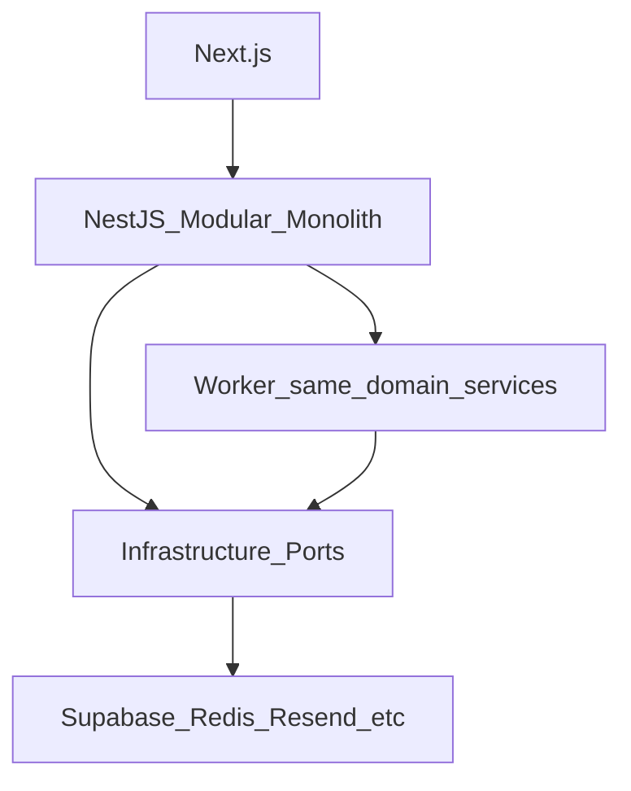

# ADR-001 — Modular Monolith with Replaceable Infrastructure Ports

| Field | Value |
|-------|-------|
| Status | Accepted |
| Date | 2026-08-03 |
| Deciders | DYN CRM architecture (stakeholder-locked Phase 01) |
| Related | [Architecture.md](../Architecture.md), [Module.md](../Module.md), [TechStack.md](../TechStack.md) |

## 1. Purpose

Record the decision to build DYN CRM as a **modular monolith** (DDD-lite) with **mandatory infrastructure ports**, rather than microservices or a vendor-coupled modularization.

## 2. Scope

This ADR covers application shape and module/port boundaries. It does not select cloud vendors (see Architecture / Deployment) or database ORM (see ADR-002).

## 3. Background

DYN CRM targets a single law firm (~30 concurrent users), 4–5 month MVP, and a small engineering team (1 developer, growing to 2–3). Product modules span CRM, legal contracts/workflows, finance, commission/CTV, and system concerns.

The system must remain maintainable for 3–5 years and stay **microservice-ready** without paying microservice tax on day one.

## 4. Architecture Decisions

### Decision

1. Ship **one NestJS modular monolith** (API) plus a **worker process** sharing application/domain services.
2. Organize code into bounded contexts: Identity, CRM, Legal, Finance, Commission, System (see Module.md).
3. Cross-module access only via **public application facades** or **async events** (QueuePort) — no reaching into another module’s persistence internals.
4. All vendor integrations go through ports: AuthPort, StoragePort, MailPort, CachePort, QueuePort.
5. Next.js remains presentation-only; business rules stay in NestJS.

### Consequences

**Positive**

- Simple deploy/ops for MVP scale.
- Easier transactional consistency inside a context.
- Clear extraction seams later (finance/notification) if needed.
- Vendor swaps stay localized behind ports.

**Negative**

- Boundaries are logical — require review discipline.
- A poorly gated “shared” folder can become a dumping ground (forbid domain logic there).

## 5. Diagrams

## 6. Responsibilities

| Party | Responsibility |
|-------|----------------|
| Module owners | Keep facades public; hide Prisma/vendor types |
| Tech lead | Reject PRs that import across module internals |
| Future extractors | Split along existing module + port seams |

## 7. Dependencies

Depends on NestJS modular DI, BullMQ worker co-deployment, and shared-types package for Glossary enums only (no workflows in shared-types).

## 8. Best Practices

- Name modules after Glossary terms.
- Prefer events for cross-module side effects that may lag (payment → commission).
- Prefer sync facade calls when the user needs immediate consistency (contract → order).

## 9. Trade-offs

| Alternative | Why rejected for MVP |
|-------------|----------------------|
| Microservices per domain | Ops and distributed complexity unjustified at ~30 users |
| “Modular” folders without ports | Hidden vendor lock-in |
| Browser calling Supabase for business data | Breaks central AuthZ and module boundaries |

## 10. Future Improvements

- Extract a module to a separate deployable only when team or scale boundaries demand it.
- Add lint/architecture tests for forbidden imports when the codebase grows.

## 11. References

- [Architecture.md](../Architecture.md)
- [Module.md](../Module.md)
- [TechStack.md](../TechStack.md)
- [Deployment.md](../Deployment.md)

---

## Suggested related documents

- ADR-002 — Prisma + PostgreSQL as system of record
- Phase 04 FolderStructure / CodingConvention

## TODO

- [ ] Optional: add import-boundary lint when monorepo scaffolding lands
