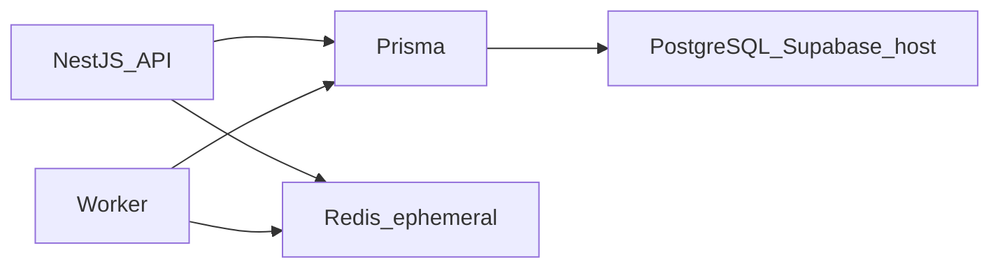

# ADR-002 — Prisma with Supabase PostgreSQL as System of Record

| Field | Value |
|-------|-------|
| Status | Accepted |
| Date | 2026-08-03 |
| Deciders | DYN CRM architecture (stakeholder-locked Phase 01) |
| Related | [Architecture.md](../Architecture.md), [TechStack.md](../TechStack.md), [Deployment.md](../Deployment.md) |

## 1. Purpose

Record the decision that **PostgreSQL** (hosted on Supabase for MVP) is the system of record for business data, accessed **only through Prisma**, with a single schema/migration ownership shared by API and worker.

## 2. Scope

Covers persistence approach and SoR boundaries. Does not define ERD/tables (Phase 03) or authorize via database RLS as source of truth (Security.md).

## 3. Background

Finance and legal CRM data require durable relational storage, migrations, and auditability. Supabase is used as **infrastructure hosting** for PostgreSQL (and separately Auth/Storage via ports). The application must remain able to point Prisma at another PostgreSQL host later.

## 4. Architecture Decisions

### Decision

1. **PostgreSQL** is the system of record for domain entities (Customer, Contract, Order, Invoice, Payment, Commission, etc.).
2. **Prisma** is the sole application persistence toolkit (queries + migrations).
3. API and worker share **one Prisma schema ownership location** — never duplicate schemas.
4. Redis is **not** SoR (cache/jobs only).
5. Object bytes live in StoragePort; **file metadata** and business links live in PostgreSQL.
6. Supabase RLS is **not** the authorization source of truth for MVP (NestJS RBAC is).
7. Exit path for hosting: change connection string / PG host; keep Prisma and domain models.

### Consequences

**Positive**

- Type-safe access and disciplined migrations for a small team.
- Clear SoR for finance reconciliation.
- Portable across PG hosts (Supabase → self-host Compose later).

**Negative**

- Must avoid leaking Prisma types across module public APIs carelessly.
- Schema changes require coordinated API + worker deploys (Deployment.md).

## 5. Diagrams

## 6. Responsibilities

| Component | Responsibility |
|-----------|----------------|
| Prisma layer | Map aggregates/entities; run migrations |
| Domain modules | Express invariants; persist via module repositories/adapters |
| Supabase PG | Availability, backups (platform) |
| Engineers | Never treat Redis or logs as finance SoR |

## 7. Dependencies

- Supabase PostgreSQL (MVP host)
- Railway API + worker processes
- Backup/restore verification on staging before go-live (Deployment TODO)

## 8. Best Practices

- Expand/contract migrations for risky changes (detail in Phase 03 Migration.md).
- Keep money amounts and statuses in PG with audit trails for sensitive transitions.
- Do not query Supabase REST/GraphQL as a parallel write path for domain data.

## 9. Trade-offs

| Alternative | Why rejected for MVP |
|-------------|----------------------|
| TypeORM / multiple ORMs | Extra complexity; Prisma already chosen |
| Document DB as primary SoR | Poor fit for relational finance/legal constraints |
| Supabase client as primary data API from browser | Violates BFF and AuthZ architecture |
| Redis as durable business store | Ephemeral; wrong durability model |

## 10. Future Improvements

- Multi-tenant `tenant_id` (or schema) strategy when SaaS phase starts (separate ADR).
- Read replicas if reporting load demands (unlikely at 30 users).
- Optional RLS defense-in-depth after NestJS AuthZ is proven.

## 11. References

- [Architecture.md](../Architecture.md) — AD-A5
- [TechStack.md](../TechStack.md) — Prisma / Supabase exit order
- [Security.md](../Security.md) — AuthZ SoT
- [Deployment.md](../Deployment.md) — migrations and backups
- ADR-001 — Modular monolith + ports

---

## Suggested related documents

- Phase 03 `ERD.md`, `Schema.md`, `Migration.md`
- ADR-001

## TODO

- [ ] Publish first Prisma baseline migration plan in Phase 03
- [ ] Confirm staging restore drill before production cutover
