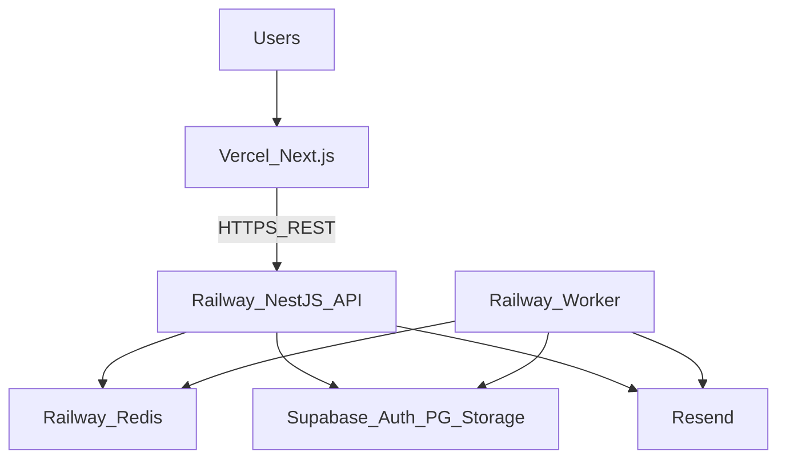
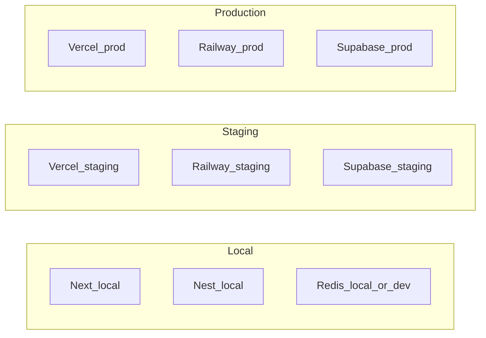
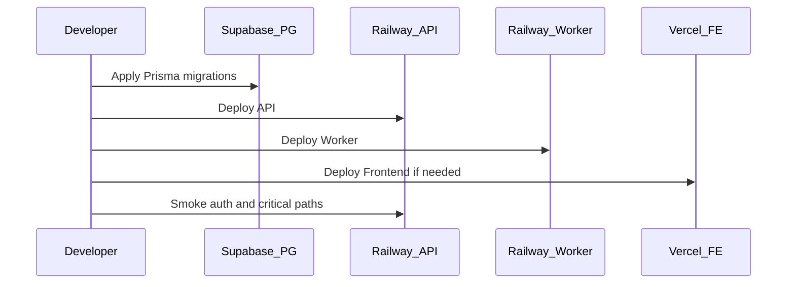

# Deployment — DYN CRM

> Vietnamese version: [Deployment.vi.md](./Deployment.vi.md)  
> **Canonical technical source:** English. Sync EN and VI in the same change set.

## 1. Purpose

Define the MVP deployment topology, environments, process responsibilities, configuration/secrets boundaries, and the post-MVP Compose path — without CI YAML, shell runbooks, or vendor console click-paths.

## 2. Scope

| In scope | Out of scope |
|----------|--------------|
| Deployable units and hosts | Exact Railway/Vercel UI steps |
| Environment definitions (local / staging / production) | GitHub Actions workflows (Phase 2) |
| Network trust: CORS, FE↔API, worker trust | Firewall IP allowlists (ops detail later) |
| Secrets and config classification | Secret rotation calendar procedures |
| Backup/restore expectations (high level) | Full DR playbooks |
| Migration ownership at deploy time | Prisma migration command cheatsheets |

Assumes Architecture, TechStack, Module, and Security are locked.

## 3. Background

MVP hosting (locked):

| Unit | Host |
|------|------|
| `apps/frontend` (Next.js) | Vercel |
| `apps/backend` (NestJS API) | Railway |
| `apps/worker` (BullMQ) | Railway |
| Redis | Railway |
| Auth + PostgreSQL + Storage | Supabase |
| Email | Resend |

Post-MVP path: Docker Compose on Ubuntu VPS (optional self-host).  
CI/CD automation: Phase 2 (GitHub Actions). MVP may deploy manually from main/release branches with discipline.

~30 concurrent users; single-tenant; pragmatic ops for 1–3 developers.

## 4. Architecture Decisions

### AD-D1 — Deployable units (all required for MVP)

| Deployable | Runtime role | Failure if missing |
|------------|--------------|--------------------|
| Frontend | Staff + CTV UI | Users cannot operate |
| API | REST + auth BFF + enqueue | System unusable |
| Worker | Commission, reminders, email jobs | Async side effects stall (payments may still record) |
| Redis | Queue + cache | Jobs/cache degrade |
| Supabase PG | System of record | Full outage |
| Supabase Auth / Storage | IdP / blobs | Auth or files fail |
| Resend | Outbound email | Email delayed; in-app notification remains |

API and worker are **both** required when async finance/legal jobs are in scope (TechStack / Module).

### AD-D2 — Environments

| Environment | Purpose | Data |
|-------------|---------|------|
| Local | Developer machines | Disposable / anonymized seeds |
| Staging | Pre-prod validation | Non-production; prefer scrubbed or synthetic |
| Production | Live firm | Real customer/finance data |

Rules:

1. Production secrets never copied into local repos or chat.
2. Staging should mirror production topology (Vercel + Railway + Supabase projects separated).
3. Prisma migrations apply per environment deliberately — never “shared” prod DB for casual local testing.

### AD-D3 — Topology

```text
Browser → Vercel (Next.js)
       → Railway NestJS API ⇄ Supabase (Auth, PG, Storage)
       → Railway Worker ← Redis (BullMQ)
       → Resend (email)
```

- Frontend knows only the public API base URL (and auth cookie domain rules from Security).
- Worker shares the same PostgreSQL and Redis as API within an environment.
- No direct browser → Supabase business data path.

### AD-D4 — Configuration and secrets

| Class | Examples | Handling |
|-------|----------|----------|
| Public FE config | API base URL, public app name | Safe in FE env (`NEXT_PUBLIC_*` only for truly public values) |
| Server secrets | DB URL, Supabase service keys, Resend API key, cookie secrets | Railway/Vercel/Supabase secret stores only |
| Auth CORS origin | Production/staging FE origins | Server config on API |
| Feature flags | Optional | System Configuration / env — avoid silent prod experiments |

Principles:

- Domain modules never hard-code vendor URLs beyond config ports.
- Separate Supabase projects (or at least separate keys) for staging vs production.
- Rotate credentials when people leave or leaks are suspected (procedure in ops guidelines later).

### AD-D5 — CORS and cookie domain (MVP)

Aligned with Security AD-S2:

- API allows configured FE origins with credentials for auth cookie routes.
- Access token sent as Bearer on business routes.
- Refresh cookie: `HttpOnly`, `Secure`, `SameSite=None` for cross-site Vercel↔Railway.
- Cookie `Domain` must not be over-broad; prefer host-only on API host.

Exact origin list is environment-specific configuration, not hardcoded in docs.

### AD-D6 — Worker trust model

| Rule | Meaning |
|------|---------|
| Enqueue from authenticated use cases | User-facing commands authorize first, then enqueue |
| Worker runs application services | Same domain rules as API — no “god script” bypass |
| No public HTTP for arbitrary job injection | Worker consumes Redis queues only |
| Identity on jobs | Payload carries actor/subject ids needed for audit; worker does not impersonate randomly |

### AD-D7 — Schema migrations

- Single Prisma schema ownership (TechStack).
- Migrations run as a controlled step against the target environment DB (Supabase PG) before or with API release.
- Worker and API must not run incompatible schema generations in production; prefer expand/contract discipline for risky changes (detail in Migration.md Phase 03).

### AD-D8 — Backup and restore expectations

| Asset | MVP expectation |
|-------|-----------------|
| PostgreSQL | Use Supabase automated backups; verify restore path on staging before go-live |
| Object storage | Enable versioning/retention per Supabase capabilities; critical contracts retained |
| Redis | Treat as ephemeral for jobs/cache — not system of record |
| Secrets | Documented in password manager / platform secret UI — not only in one laptop |

Numeric RPO/RTO targets remain a product/ops TODO if not yet locked.

### AD-D9 — Release posture (MVP, pre-CI)

1. Prefer `release/*` or protected `main` as deploy source (Git Flow).
2. Deploy API and worker in coordinated fashion when schema or job payloads change.
3. Frontend can deploy independently when API contract is backward compatible.
4. Smoke: login, one CRM read, one finance write path, one job processed.

GitHub Actions automation arrives in Phase 2 — not a blocker for MVP if manual discipline holds.

### AD-D10 — Future Compose-on-VPS

When exiting Vercel/Railway:

- Map FE/API/worker/Redis to Compose services.
- Point Prisma at self-hosted or remaining Supabase PG via connection string.
- Keep ports (Auth/Storage/Mail) so vendor swaps stay localized.
- Do not rewrite domain modules for hosting changes.

## 5. Diagrams

### 5.1 Production topology



### 5.2 Environment separation



### 5.3 Release coordination



## 6. Responsibilities

| Role / component | Responsibility | Must not |
|------------------|----------------|----------|
| Vercel | Host Next.js; inject public env only | Hold Supabase service role keys |
| Railway API | Serve REST; BFF auth; enqueue jobs | Run long CPU-heavy jobs inline when queue exists |
| Railway Worker | Process BullMQ jobs | Expose public admin without auth |
| Supabase | Provide Auth/PG/Storage infra | Become business API for the browser |
| Developer / tech lead | Coordinate schema + API + worker deploys | Point local tools at production DB casually |
| Resend | Deliver mail | Store CRM domain data |

## 7. Dependencies

| From | To | Deploy relevance |
|------|----|------------------|
| Frontend | API base URL | Must match environment |
| API | Supabase Auth/PG/Storage, Redis, Resend | Secrets required at boot |
| Worker | Same PG + Redis (+ MailPort) | Same env as API |
| Migrations | Supabase PG | Ordered before incompatible API code |

Outage dependency priority for triage: PG → API → Auth → Worker/Redis → Storage → FE → Email.

## 8. Best Practices

- One Supabase project (or clearly isolated) per environment.
- Keep staging FE origin and prod FE origin in separate API CORS allowlists.
- After payment/commission changes, verify a job is consumed on staging before production.
- Prefer additive schema changes during business hours for a single-firm MVP.
- Document rollback: previous API/worker image + forward-fix migrations when possible.
- Never commit `.env` with production secrets.
- Treat Redis flush as safe for cache but disruptive for in-flight jobs — drain or pause workers first.

## 9. Trade-offs

| Decision | Benefit | Cost |
|----------|---------|------|
| Vercel + Railway + Supabase | Fast MVP ops for 1–3 devs | Three vendors; Compose migration later |
| Separate API and Worker processes | Isolation for async load | Coordinated deploys |
| Manual deploy until Phase 2 CI | Less pipeline upkeep early | Human error risk — mitigate with checklist |
| Staging topology ≈ production | Realistic UAT | Extra project cost |
| Redis not backed up as SoR | Simpler | In-flight jobs lost on severe Redis loss |

## 10. Future Improvements

| Item | Phase |
|------|-------|
| GitHub Actions build/test/deploy | Phase 2 |
| Docker Compose production topology | Post-MVP |
| Blue/green or staged Railway rollouts | When downtime sensitivity grows |
| Formal RPO/RTO numbers + restore drills | Before/at go-live hardening |
| Status page for FE vs API vs jobs | Monitoring + ops |
| Multi-region | Out of MVP scope |

## 11. References

- [`Architecture.md`](./Architecture.md)
- [`TechStack.md`](./TechStack.md)
- [`Module.md`](./Module.md)
- [`Security.md`](./Security.md)
- [`docs/00-project/Timeline.md`](../00-project/Timeline.md)
- [`docs/00-project/Roadmap.md`](../00-project/Roadmap.md)

---

## Suggested related documents

| Document | Role |
|----------|------|
| [Monitoring.md](./Monitoring.md) | Next — health, logs, alerts |
| Phase 03 `Migration.md` | Expand/contract migration detail |
| Phase 05 `ReleaseProcess.md` | Human release checklist |
| ADR-001 / ADR-002 | Formalize hosting + SoR decisions |

## TODO

- [x] Approve this Deployment document (gate before Monitoring.md)
- [ ] Lock numeric RPO/RTO with stakeholders
- [ ] Confirm staging will use fully separate Supabase project (recommended: yes)
- [ ] Confirm production custom domains for FE and API
- [ ] Publish go-live smoke checklist before first production cutover
