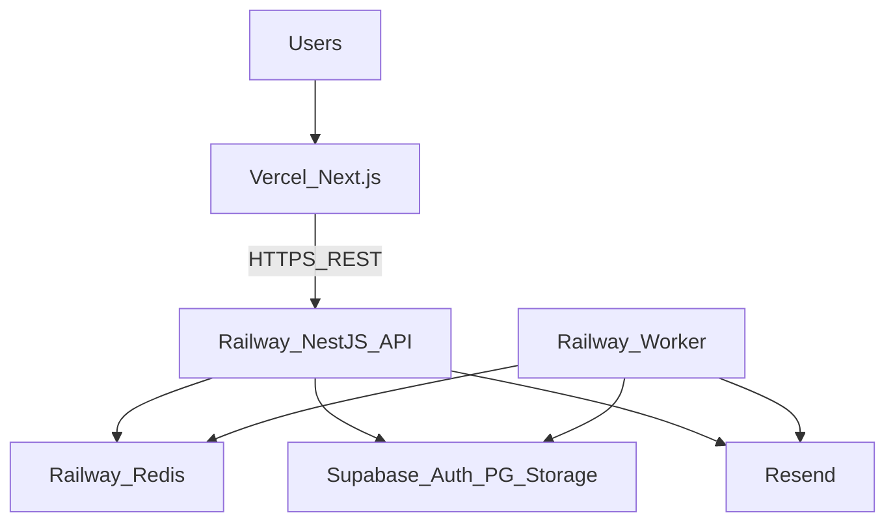
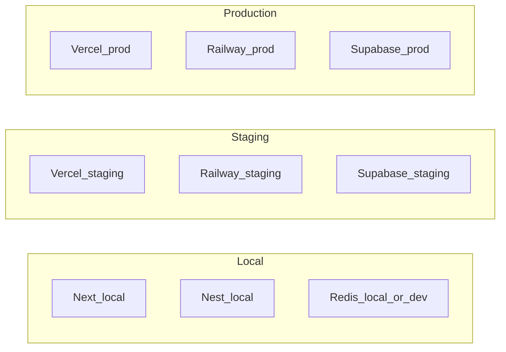
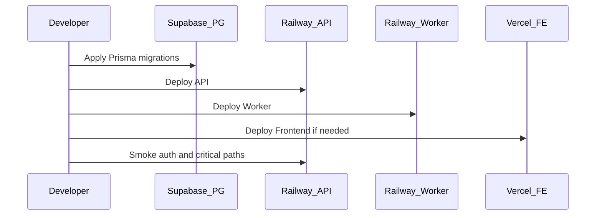

# Triển khai — DYN CRM

> Bản tiếng Việt của [Deployment.md](./Deployment.md).  
> **Nguồn kỹ thuật chuẩn (canonical):** bản English. Đồng bộ EN và VI trong cùng một thay đổi.

## 1. Mục đích

Định nghĩa topology triển khai MVP, môi trường, trách nhiệm process, ranh giới cấu hình/secrets, và đường Compose sau MVP — không gồm YAML CI, shell runbook, hay hướng dẫn click console vendor.

## 2. Phạm vi

| Trong phạm vi | Ngoài phạm vi |
|---------------|---------------|
| Đơn vị deploy và host | Bước UI Railway/Vercel cụ thể |
| Định nghĩa môi trường (local / staging / production) | Workflow GitHub Actions (Phase 2) |
| Tin cậy mạng: CORS, FE↔API, worker trust | Allowlist IP firewall (ops chi tiết sau) |
| Phân loại secrets và config | Lịch xoay secret thủ tục |
| Kỳ vọng backup/restore (mức cao) | Playbook DR đầy đủ |
| Ownership migration lúc deploy | Cheatsheet lệnh Prisma |

Giả định Architecture, TechStack, Module, Security đã khóa.

## 3. Bối cảnh

Hosting MVP (đã khóa):

| Đơn vị | Host |
|--------|------|
| `apps/frontend` (Next.js) | Vercel |
| `apps/backend` (NestJS API) | Railway |
| `apps/worker` (BullMQ) | Railway |
| Redis | Railway |
| Auth + PostgreSQL + Storage | Supabase |
| Email | Resend |

Đường sau MVP: Docker Compose trên Ubuntu VPS.  
CI/CD tự động: Phase 2 (GitHub Actions). MVP có thể deploy thủ công từ nhánh main/release có kỷ luật.

~30 user đồng thời; single-tenant; ops pragmatic cho 1–3 developer.

## 4. Quyết định kiến trúc

### AD-D1 — Đơn vị deploy (tất cả bắt buộc cho MVP)

| Deployable | Vai trò runtime | Nếu thiếu |
|------------|-----------------|-----------|
| Frontend | UI nhân sự + CTV | User không vận hành được |
| API | REST + auth BFF + enqueue | Hệ thống không dùng được |
| Worker | Job commission, reminder, email | Side effect async đình trệ (payment vẫn có thể ghi) |
| Redis | Queue + cache | Job/cache suy giảm |
| Supabase PG | System of record | Outage toàn phần |
| Supabase Auth / Storage | IdP / blob | Auth hoặc file lỗi |
| Resend | Email đi | Email chậm; notification in-app vẫn còn |

API và worker **đều** bắt buộc khi job async finance/legal trong scope (TechStack / Module).

### AD-D2 — Môi trường

| Môi trường | Mục đích | Dữ liệu |
|------------|----------|---------|
| Local | Máy developer | Disposable / seed ẩn danh |
| Staging | Xác nhận pre-prod | Non-production; ưu tiên synthetic hoặc đã scrub |
| Production | Văn phòng live | Dữ liệu khách/finance thật |

Quy tắc:

1. Secret production không copy vào repo local hoặc chat.
2. Staging nên mirror topology production (Vercel + Railway + Supabase tách project).
3. Migration Prisma áp dụng có chủ đích từng môi trường — không “share” DB prod cho test local tùy tiện.

### AD-D3 — Topology

```text
Browser → Vercel (Next.js)
       → Railway NestJS API ⇄ Supabase (Auth, PG, Storage)
       → Railway Worker ← Redis (BullMQ)
       → Resend (email)
```

- Frontend chỉ biết API base URL công khai (và rule cookie auth từ Security).
- Worker dùng cùng PostgreSQL và Redis với API trong một môi trường.
- Không có đường browser → dữ liệu nghiệp vụ Supabase trực tiếp.

### AD-D4 — Cấu hình và secrets

| Hạng | Ví dụ | Xử lý |
|------|-------|--------|
| Public FE config | API base URL, tên app công khai | An toàn trong FE env (`NEXT_PUBLIC_*` chỉ cho giá trị thật sự public) |
| Server secrets | DB URL, Supabase service key, Resend API key, cookie secret | Chỉ secret store Railway/Vercel/Supabase |
| Auth CORS origin | Origin FE production/staging | Server config trên API |
| Feature flags | Tùy chọn | System Configuration / env — tránh thí nghiệm prod âm thầm |

Nguyên tắc:

- Module domain không hard-code URL vendor ngoài config port.
- Tách project Supabase (hoặc ít nhất tách key) cho staging vs production.
- Xoay credential khi người rời team hoặc nghi lộ (thủ tục ở guidelines ops sau).

### AD-D5 — CORS và cookie domain (MVP)

Khớp Security AD-S2:

- API cho phép FE origin đã cấu hình kèm credentials cho route cookie auth.
- Access token gửi Bearer trên route nghiệp vụ.
- Refresh cookie: `HttpOnly`, `Secure`, `SameSite=None` cho cross-site Vercel↔Railway.
- Cookie `Domain` không quá rộng; ưu tiên host-only trên host API.

Danh sách origin Exact là cấu hình theo môi trường, không hardcode trong docs.

### AD-D6 — Mô hình tin cậy worker

| Rule | Ý nghĩa |
|------|---------|
| Enqueue từ use case đã authenticated | Lệnh user authorize trước, rồi enqueue |
| Worker chạy application service | Cùng domain rule với API — không “god script” bypass |
| Không HTTP public inject job tùy ý | Worker chỉ consume Redis queue |
| Identity trên job | Payload mang actor/subject id cần cho audit; worker không impersonate ngẫu nhiên |

### AD-D7 — Schema migration

- Một nơi sở hữu Prisma schema (TechStack).
- Migration chạy có kiểm soát lên DB môi trường đích (Supabase PG) trước hoặc cùng release API.
- Worker và API không chạy thế hệ schema không tương thích trên production; ưu tiên expand/contract cho thay đổi rủi ro (chi tiết Migration.md Phase 03).

### AD-D8 — Kỳ vọng backup và restore

| Tài sản | Kỳ vọng MVP |
|---------|-------------|
| PostgreSQL | Dùng backup tự động Supabase; xác minh đường restore trên staging trước go-live |
| Object storage | Bật versioning/retention theo khả năng Supabase; giữ hợp đồng quan trọng |
| Redis | Ephemeral cho job/cache — không phải system of record |
| Secrets | Ghi trong password manager / secret UI nền tảng — không chỉ trên một laptop |

RPO/RTO số cụ thể vẫn là TODO product/ops nếu chưa khóa.

### AD-D9 — Tư thế release (MVP, trước CI)

1. Ưu tiên `release/*` hoặc `main` được bảo vệ làm nguồn deploy (Git Flow).
2. Deploy API và worker phối hợp khi schema hoặc payload job đổi.
3. Frontend có thể deploy độc lập khi API contract tương thích ngược.
4. Smoke: login, một đọc CRM, một ghi finance, một job được xử lý.

Tự động hóa GitHub Actions ở Phase 2 — không chặn MVP nếu kỷ luật thủ công giữ được.

### AD-D10 — Compose-on-VPS tương lai

Khi thoát Vercel/Railway:

- Map FE/API/worker/Redis sang service Compose.
- Trỏ Prisma tới PG self-host hoặc vẫn Supabase qua connection string.
- Giữ ports (Auth/Storage/Mail) để đổi vendor cục bộ.
- Không viết lại module domain vì đổi hosting.

## 5. Sơ đồ

### 5.1 Topology production



### 5.2 Tách môi trường



### 5.3 Phối hợp release



## 6. Trách nhiệm

| Vai trò / thành phần | Trách nhiệm | Không được |
|----------------------|-------------|------------|
| Vercel | Host Next.js; chỉ inject public env | Giữ Supabase service role key |
| Railway API | Serve REST; BFF auth; enqueue job | Chạy job CPU nặng inline khi đã có queue |
| Railway Worker | Xử lý BullMQ job | Expose admin public không auth |
| Supabase | Cung cấp Auth/PG/Storage | Thành business API cho browser |
| Developer / tech lead | Phối hợp deploy schema + API + worker | Trỏ tool local vào DB production tùy tiện |
| Resend | Gửi mail | Lưu dữ liệu domain CRM |

## 7. Phụ thuộc

| Từ | Tới | Liên quan deploy |
|----|-----|------------------|
| Frontend | API base URL | Phải khớp môi trường |
| API | Supabase Auth/PG/Storage, Redis, Resend | Secret cần lúc boot |
| Worker | Cùng PG + Redis (+ MailPort) | Cùng env với API |
| Migrations | Supabase PG | Thứ tự trước code API không tương thích |

Ưu tiên triage outage: PG → API → Auth → Worker/Redis → Storage → FE → Email.

## 8. Best practices

- Một project Supabase (hoặc tách rõ) mỗi môi trường.
- Origin FE staging và prod nằm trong CORS allowlist API tách biệt.
- Sau thay đổi payment/commission, xác minh job được consume trên staging trước production.
- Ưu tiên schema additive trong giờ làm việc cho MVP một văn phòng.
- Ghi rollback: image API/worker trước + migration forward-fix khi có thể.
- Không commit `.env` kèm secret production.
- Coi flush Redis an toàn cho cache nhưng phá job đang chạy — drain hoặc pause worker trước.

## 9. Trade-off

| Quyết định | Lợi ích | Chi phí |
|------------|---------|---------|
| Vercel + Railway + Supabase | Ops MVP nhanh cho 1–3 dev | Ba vendor; migration Compose sau |
| Tách process API và Worker | Cách ly tải async | Deploy phải phối hợp |
| Deploy thủ công đến Phase 2 CI | Ít bảo trì pipeline sớm | Rủi ro lỗi người — giảm bằng checklist |
| Topology staging ≈ production | UAT thực tế | Chi phí thêm project |
| Redis không backup như SoR | Đơn giản hơn | Mất job đang bay nếu Redis mất nặng |

## 10. Cải tiến tương lai

| Hạng mục | Phase |
|----------|-------|
| GitHub Actions build/test/deploy | Phase 2 |
| Topology Docker Compose production | Post-MVP |
| Blue/green hoặc staged Railway rollout | Khi nhạy cảm downtime tăng |
| Số RPO/RTO chính thức + diễn tập restore | Trước/hardening go-live |
| Status page cho FE vs API vs jobs | Monitoring + ops |
| Multi-region | Ngoài scope MVP |

## 11. Tham chiếu

- [`Architecture.md`](./Architecture.md)
- [`TechStack.md`](./TechStack.md)
- [`Module.md`](./Module.md)
- [`Security.md`](./Security.md)
- [`docs/00-project/Timeline.md`](../00-project/Timeline.md)
- [`docs/00-project/Roadmap.md`](../00-project/Roadmap.md)

---

## Tài liệu liên quan gợi ý

| Tài liệu | Vai trò |
|----------|---------|
| [Monitoring.md](./Monitoring.md) | Tiếp theo — health, log, alert |
| Phase 03 `Migration.md` | Chi tiết expand/contract migration |
| Phase 05 `ReleaseProcess.md` | Checklist release người |
| ADR-001 / ADR-002 | Chính thức hóa hosting + SoR |

## TODO

- [x] Duyệt tài liệu Deployment này (gate trước Monitoring.md)
- [ ] Khóa RPO/RTO số với stakeholder
- [ ] Xác nhận staging dùng project Supabase tách hoàn toàn (khuyến nghị: có)
- [ ] Xác nhận custom domain production cho FE và API
- [ ] Công bố smoke checklist go-live trước cutover production đầu
