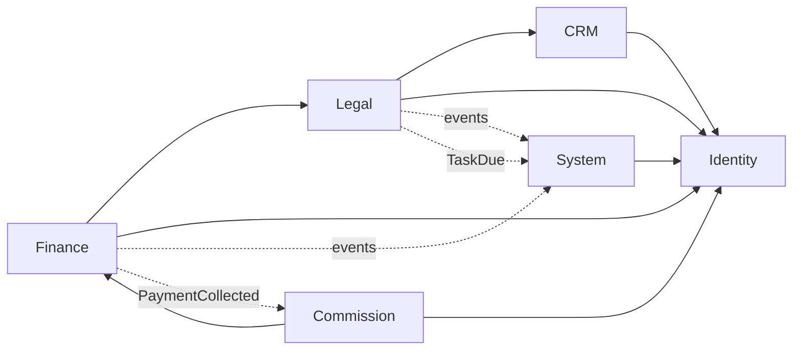
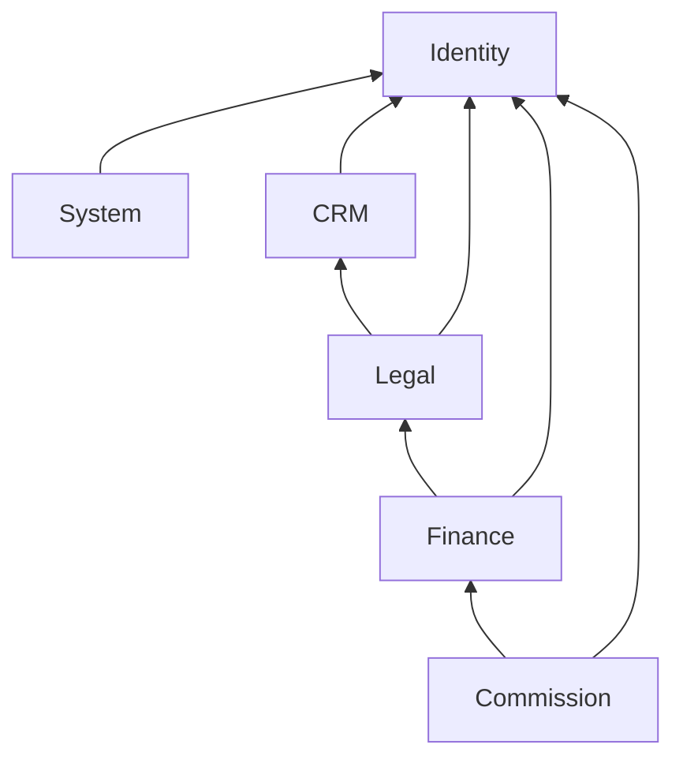
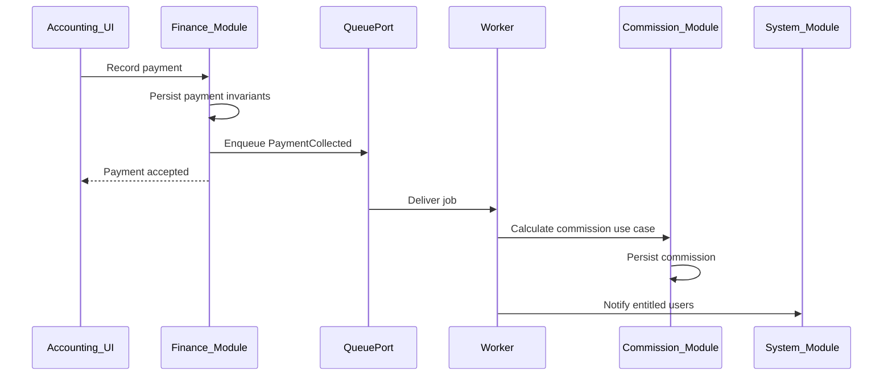
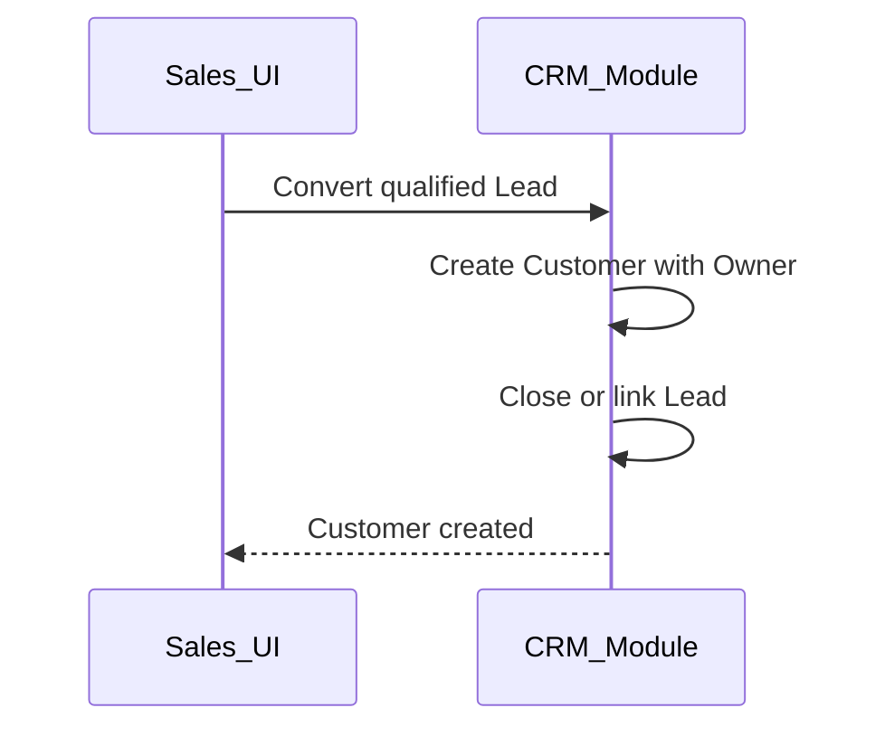

# Module Boundaries — DYN CRM

> Vietnamese version: [Module.vi.md](./Module.vi.md)  
> **Canonical technical source:** English. Sync EN and VI in the same change set.

## 1. Purpose

Define the modular-monolith bounded contexts for DYN CRM: what each module owns, what it exposes, how modules may depend on each other, and where cross-cutting concerns live — without inventing unfinished business rules.

## 2. Scope

| In scope | Out of scope |
|----------|--------------|
| Module inventory and ownership | Prisma models, SQL, folder path conventions |
| Public application capabilities per module | REST path/payload contracts (APIConvention) |
| Allowed dependency directions | Permission matrix per endpoint (Security.md) |
| Cross-module integration style (sync vs events) | Domain invariant detail (Phase 02 domain docs) |
| Identity mapping at module level | Session cookie vs bearer (Security.md) |

Assumes [`Architecture.md`](./Architecture.md) and [`TechStack.md`](./TechStack.md) are locked.

## 3. Background

MVP modules come from Phase 00 Scope, grouped into DDD-lite contexts inside one NestJS modular monolith:

| Context | Owns (product terms) |
|---------|----------------------|
| Identity | Authentication BFF use cases, users, roles, permissions |
| CRM | Lead, Customer, Contact |
| Legal | Contract, Workflow, Files, Timeline |
| Finance | Order, Invoice, Payment, VAT |
| Commission | Commission calculation, CTV portal surface |
| System | Dashboard, Notification, Configuration, Audit |

Presentation (Next.js) is not a domain module; it consumes REST only. Worker consumes the same application services as the API for async use cases.

## 4. Architecture Decisions

### AD-M1 — Six domain contexts + shared kernel

| Module | NestJS responsibility (logical) | System of record entities (conceptual) |
|--------|----------------------------------|----------------------------------------|
| Identity | Auth BFF, user lifecycle, role/permission assignment | User, Role, Permission, UserRole |
| CRM | Lead pipeline, Customer master, Contacts | Lead, Customer, Contact, CustomerFollower |
| Legal | Contracts, workflow templates/instances/tasks, file metadata, timeline | Contract, WorkflowTemplate, Workflow, Task, FileObject, Activity |
| Finance | Orders, invoices, payments, VAT amounts | Order, Invoice, Payment, (VAT as calculated fields/policy) |
| Commission | Commission from collected payment; CTV-restricted views | Commission, CollaboratorProfile / referral link |
| System | Dashboards read models, in-app notifications, configuration, audit trail | Notification, AppConfig, AuditEntry, dashboard queries |

Shared kernel (`packages/shared-types`): Glossary enums, IDs, money/currency shape (VND), common error codes — **no workflows**.

### AD-M2 — One public facade per module

Other modules must not reach into another module’s internal repositories or Prisma models. Cross-module use goes through:

1. **Application service API** of the owning module (in-process for monolith), or  
2. **Domain/integration events** via QueuePort (async side effects).

### AD-M3 — Sync vs async integration

| Interaction | Style | Why |
|-------------|-------|-----|
| Lead → Customer conversion | Sync application call CRM owns | Strong consistency for master data |
| Contract → create Order | Sync Finance API called from Legal/Finance orchestration | Money setup must succeed or fail with the user action |
| Payment recorded → Commission | Async event | Side effect; worker required (TechStack) |
| Task due → Reminder / Notification | Async event | Non-blocking |
| Payment / Contract change → Timeline | Sync write by owning module or async fan-out | Prefer owning module writes its own activity; System may subscribe |
| Config read (VAT %, commission %) | Sync System Configuration read | Small, stable reads |

### AD-M4 — Identity projection

Supabase Auth subject maps to a local **User** owned by Identity. RBAC data lives in Identity. Other modules store only `userId` references (Owner, Assignee, Actor) — never embed Supabase SDK types.

Detail of mapping fields → Security.md / Identity domain doc.

### AD-M5 — Files and Timeline ownership

| Concern | Owner | Note |
|---------|-------|------|
| File bytes | StoragePort (infra) | |
| File metadata + attachment association | Legal (primary for contract/work files); other modules may attach via Legal File API or shared File capability hosted in Legal for MVP | Avoid a seventh module for MVP |
| Timeline / Activity entries | Owning domain writes facts; System may aggregate feeds | Do not invent a second activity store |

### AD-M6 — CTV boundary

Commission module exposes the **CTV portal** capabilities only. CRM/Legal/Finance APIs remain staff-facing and permission-gated. CTV must not gain module-wide CRM access through “convenience” endpoints.

### AD-M7 — Configuration ownership

| Setting | Owner module |
|---------|--------------|
| Workflow templates | Legal |
| Commission percentage (MVP) | Commission (or System Configuration keyed for Commission) |
| VAT rate (MVP fixed 10% exclusive) | Finance policy; future configurability via System Configuration |
| Feature flags / system knobs | System |

Exact config key catalog → Configuration domain / Phase 02 — not invented here.

### AD-M8 — No cyclic module dependencies

Dependency graph must remain acyclic at the module level. If A needs B and B needs A, introduce an application orchestrator in a higher layer or an event — do not create a cycle.

## 5. Diagrams

### 5.1 Module map and primary flows

Solid arrows: sync allowed dependencies (consumer → provider).  
Dashed arrows: async events (producer → consumer).

### 5.2 Allowed dependency direction

### 5.3 Payment to commission (module view)

### 5.4 Lead conversion (module view)

Conversion field mapping remains a Phase 02 TODO — not specified here.

## 6. Responsibilities

| Module | Must | Must not |
|--------|------|----------|
| Identity | Authenticate via AuthPort; manage users/roles/permissions; resolve current user | Own Customer/Contract money rules; call Supabase outside AuthPort adapter |
| CRM | Own Lead/Customer/Contact; enforce one Owner | Create Orders or Invoices |
| Legal | Own Contract lifecycle, workflow, file metadata, contract-related timeline | Calculate commission; bypass Finance for invoicing |
| Finance | Own Order/Invoice/Payment/VAT calculation application | Own CTV portal; store files as source of truth |
| Commission | Own commission from collected payment; CTV-limited views | Edit CRM/Legal staff data |
| System | Notifications, dashboard aggregation, audit, shared configuration keys | Become a dumping ground for domain rules |
| Next.js | UI only | Encode domain invariants |
| Worker | Run application use cases for async jobs | Duplicate alternate business rules |

## 7. Dependencies

### 7.1 Hard rules

1. Domain modules depend **inward** on shared-types and ports — never on Next.js or vendor SDKs.
2. Upstream modules may call downstream public application APIs (see §5.2).
3. Downstream modules must not import upstream modules (e.g. Identity must not depend on Finance).
4. Cross-cutting notifications/audit: producers emit events or call System’s public API; System does not own finance invariants.
5. Prisma access is through each module’s persistence adapters; **one schema ownership location** (TechStack) shared by API and worker processes.

### 7.2 Forbidden couplings

| Forbidden | Prefer |
|-----------|--------|
| Finance importing CRM internal Lead tables for reports | CRM/Finance public query API or read model owned explicitly |
| Commission reading Invoice unpaid amounts to accrue | Only PaymentCollected (cash-based rule) |
| Frontend calling Supabase Storage/Auth for business flows | NestJS BFF + StoragePort via API |
| Workflow auto-completing Contract without an explicit rule | Documented rule in Contract domain (still open) |

### 7.3 External ports used by modules

| Port | Typical consuming modules |
|------|---------------------------|
| AuthPort | Identity |
| StoragePort | Legal (files) |
| MailPort | System, Identity (auth emails), possibly Finance receipts |
| CachePort | Identity sessions/permissions cache, System as needed |
| QueuePort | Finance, Legal, System, Commission (via worker) |

## 8. Best Practices

- Name modules and public services after Glossary terms (Customer, Contract, Order — not Matter).
- Keep permission checks at the NestJS application boundary of each module (guards), with permission codes owned conceptually by Identity.
- Prefer events for side effects that can lag seconds (commission, email, reminders).
- Prefer sync calls when the user must see a consistent result in one request (create order from contract).
- When adding a feature, state **owning module** in the PR description.
- Do not create a new bounded context for MVP convenience (e.g. separate “Milestone” module) — milestones stay under Finance/Legal as documented in domain phase.
- Challenge dual writes: one write model owner per fact.

## 9. Trade-offs

| Decision | Benefit | Cost |
|----------|---------|------|
| Six contexts in one monolith | Clear ownership without microservice ops | Requires discipline; easy to “reach across” |
| Files under Legal for MVP | Avoid extra module | Non-contract attachments must still go through Legal File API |
| Async commission | Resilient API latency | Worker is mandatory; eventual consistency window |
| System as notification hub | Single inbox model | Risk of System becoming a god module — guard with “no domain rules” |
| In-process facades (not HTTP between modules) | Simple, transactional options | Boundaries are logical — lint/review must enforce |

### Architect challenges (open, not invented)

1. **Contract completion vs Workflow completion** — still unlocked (Business.md TODO); Legal must not silently auto-complete.
2. **Cancelled transition matrix** — Contract domain.
3. **CTV referral linkage** — which entity links to Collaborator (Lead/Customer/Contract/Payment) — Commission + CRM domain.
4. **Follower vs Owner permissions** — Identity + CRM; detail in Security.md.

## 10. Future Improvements

| Item | When |
|------|------|
| Extract Finance or Notification to a separate deployable | Clear team/scale boundary |
| Dedicated File/Document context | If non-legal documents dominate |
| Multi-tenant module filters | SaaS phase |
| Richer read-model module for reporting | After MVP dashboards prove insufficient |
| Formal ACL diagrams per role | Security.md + Phase 02 |

## 11. References

- [`Architecture.md`](./Architecture.md)
- [`TechStack.md`](./TechStack.md)
- [`docs/00-project/Scope.md`](../00-project/Scope.md)
- [`docs/00-project/Business.md`](../00-project/Business.md)
- [`docs/00-project/Glossary.md`](../00-project/Glossary.md)

---

## Suggested related documents

| Document | Role |
|----------|------|
| [Security.md](./Security.md) | Next after Module approval — RBAC, identity mapping, session |
| [Deployment.md](./Deployment.md) | Process topology for API vs worker |
| Phase 02 `02-domain/*` | Per-entity business rules |
| ADR-001 | Modular monolith + module facades |

## TODO

- [x] Approve this Module document (gate before Security.md)
- [ ] Lock Contract↔Workflow completion rule (domain)
- [ ] Lock Cancelled transition matrix (domain)
- [ ] Lock CTV referral linkage model (domain)
- [ ] Lock Owner vs Follower permission difference (Security + CRM)
- [ ] Confirm whether non-contract files share Legal File API or need a thin System file facade later
- [ ] Confirm Configuration key ownership split (Commission % vs System)
