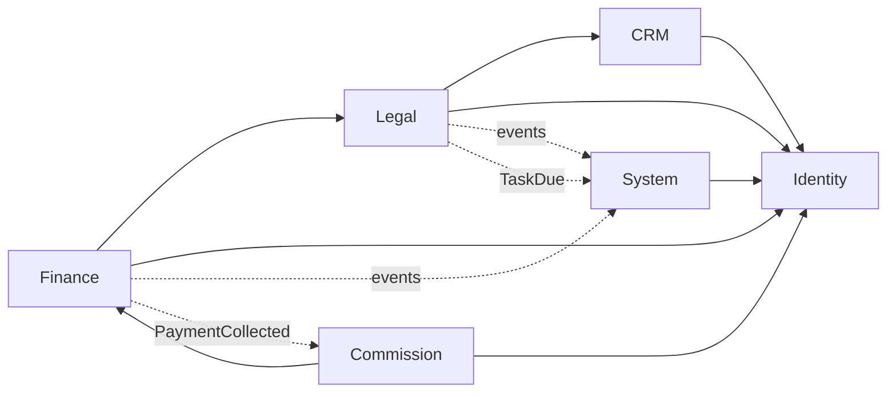
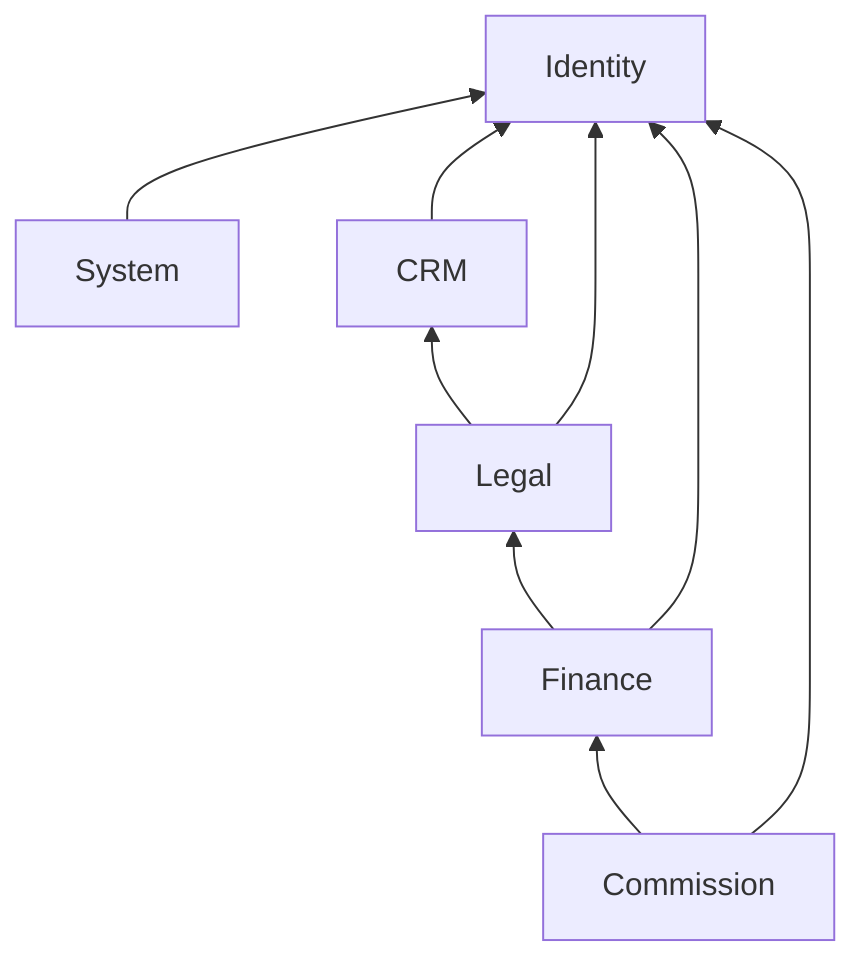
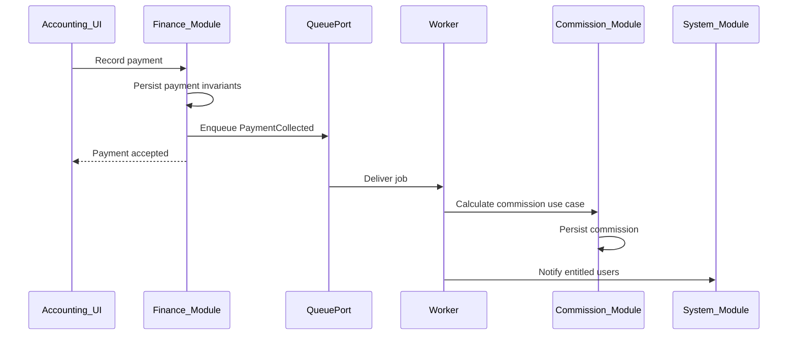
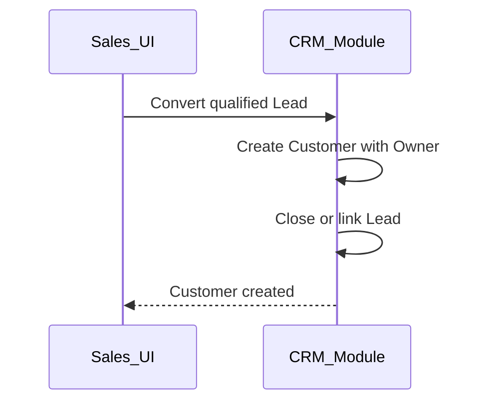

# Ranh giới Module — DYN CRM

> Bản tiếng Việt của [Module.md](./Module.md).  
> **Nguồn kỹ thuật chuẩn (canonical):** bản English. Đồng bộ EN và VI trong cùng một thay đổi.

## 1. Mục đích

Định nghĩa bounded context trong modular monolith DYN CRM: mỗi module sở hữu gì, expose gì, được phụ thuộc thế nào, và cross-cutting nằm đâu — **không bịa** business rule chưa khóa.

## 2. Phạm vi

| Trong phạm vi | Ngoài phạm vi |
|---------------|---------------|
| Inventory module và ownership | Prisma model, SQL, quy ước đường dẫn folder |
| Năng lực application công khai theo module | Contract path/payload REST (APIConvention) |
| Hướng phụ thuộc được phép | Ma trận permission từng endpoint (Security.md) |
| Cách tích hợp xuyên module (sync vs event) | Chi tiết bất biến domain (docs Phase 02) |
| Ánh xạ Identity ở mức module | Session cookie vs bearer (Security.md) |

Giả định [`Architecture.md`](./Architecture.md) và [`TechStack.md`](./TechStack.md) đã khóa.

## 3. Bối cảnh

Module MVP từ Phase 00 Scope, nhóm thành context DDD-lite trong một NestJS modular monolith:

| Context | Sở hữu (thuật ngữ sản phẩm) |
|---------|------------------------------|
| Identity | Use case Auth BFF, user, role, permission |
| CRM | Lead, Customer, Contact |
| Legal | Contract, Workflow, Files, Timeline |
| Finance | Order, Invoice, Payment, VAT |
| Commission | Tính hoa hồng, bề mặt portal CTV |
| System | Dashboard, Notification, Configuration, Audit |

Presentation (Next.js) không phải domain module; chỉ consume REST. Worker dùng cùng application service với API cho use case async.

## 4. Quyết định kiến trúc

### AD-M1 — Sáu context domain + shared kernel

| Module | Trách nhiệm NestJS (logic) | Entity system of record (khái niệm) |
|--------|----------------------------|-------------------------------------|
| Identity | Auth BFF, vòng đời user, gán role/permission | User, Role, Permission, UserRole |
| CRM | Pipeline Lead, master Customer, Contact | Lead, Customer, Contact, CustomerFollower |
| Legal | Hợp đồng, template/instance/task workflow, metadata file, timeline | Contract, WorkflowTemplate, Workflow, Task, FileObject, Activity |
| Finance | Order, invoice, payment, số VAT | Order, Invoice, Payment, (VAT như field/policy tính toán) |
| Commission | Hoa hồng từ tiền đã thu; view hạn chế CTV | Commission, CollaboratorProfile / liên kết referral |
| System | Read model dashboard, notification in-app, cấu hình, audit | Notification, AppConfig, AuditEntry, dashboard queries |

Shared kernel (`packages/shared-types`): enum Glossary, ID, shape tiền (VND), mã lỗi chung — **không workflow**.

### AD-M2 — Một facade công khai mỗi module

Module khác không được đụng repository/Prisma nội bộ của module khác. Cross-module đi qua:

1. **Application service API** của module sở hữu (in-process trong monolith), hoặc  
2. **Domain/integration event** qua QueuePort (side effect async).

### AD-M3 — Tích hợp sync vs async

| Tương tác | Kiểu | Vì sao |
|-----------|------|--------|
| Lead → convert Customer | Sync, CRM sở hữu | Nhất quán mạnh cho master data |
| Contract → tạo Order | Sync gọi Finance API | Thiết lập tiền phải thành/công hoặc fail cùng hành động user |
| Payment ghi nhận → Commission | Event async | Side effect; bắt buộc worker (TechStack) |
| Task đến hạn → Reminder / Notification | Event async | Không chặn request |
| Đổi Payment / Contract → Timeline | Module sở hữu ghi sync hoặc fan-out async | Ưu tiên module sở hữu tự ghi activity; System có thể subscribe |
| Đọc Config (VAT %, commission %) | Sync đọc System Configuration | Đọc nhỏ, ổn định |

### AD-M4 — Projection Identity

Subject Supabase Auth map sang **User** local do Identity sở hữu. Dữ liệu RBAC nằm ở Identity. Module khác chỉ lưu tham chiếu `userId` (Owner, Assignee, Actor) — không nhúng type SDK Supabase.

Chi tiết field ánh xạ → Security.md / domain Identity.

### AD-M5 — Ownership Files và Timeline

| Concern | Owner | Ghi chú |
|---------|-------|---------|
| Byte file | StoragePort (infra) | |
| Metadata file + liên kết đính kèm | Legal (chính cho file hợp đồng/công việc); module khác gắn qua Legal File API hoặc năng lực File dùng chung host trong Legal cho MVP | Tránh module thứ bảy trong MVP |
| Timeline / Activity | Domain sở hữu ghi sự kiện; System có thể tổng hợp feed | Không bịa kho activity thứ hai |

### AD-M6 — Ranh giới CTV

Module Commission expose năng lực **portal CTV** thôi. API CRM/Legal/Finance vẫn dành cho nhân sự và gắn permission. CTV không được “편의” endpoint để vào full CRM.

### AD-M7 — Ownership Configuration

| Setting | Module sở hữu |
|---------|---------------|
| Workflow template | Legal |
| % hoa hồng (MVP) | Commission (hoặc System Configuration keyed cho Commission) |
| Thuế VAT (MVP cố định 10% exclusive) | Policy Finance; cấu hình sau qua System Configuration |
| Feature flag / knob hệ thống | System |

Catalog key cấu hình → domain Configuration / Phase 02 — không bịa tại đây.

### AD-M8 — Không phụ thuộc vòng giữa module

Đồ thị phụ thuộc cấp module phải acyclic. Nếu A cần B và B cần A: orchestrator tầng cao hơn hoặc event — không tạo cycle.

## 5. Sơ đồ

### 5.1 Bản đồ module và luồng chính

Mũi tên đặc: phụ thuộc sync được phép (consumer → provider).  
Mũi tên nét đứt: event async (producer → consumer).

### 5.2 Hướng phụ thuộc được phép

### 5.3 Payment → commission (góc module)

### 5.4 Convert Lead (góc module)

Mapping field convert vẫn là TODO Phase 02 — không chỉ định tại đây.

## 6. Trách nhiệm

| Module | Phải | Không được |
|--------|------|------------|
| Identity | Xác thực qua AuthPort; quản lý user/role/permission; resolve user hiện tại | Sở hữu rule tiền Customer/Contract; gọi Supabase ngoài AuthPort adapter |
| CRM | Sở hữu Lead/Customer/Contact; enforce một Owner | Tạo Order hoặc Invoice |
| Legal | Sở hữu vòng đời Contract, workflow, metadata file, timeline liên quan hợp đồng | Tính commission; bỏ qua Finance để xuất hóa đơn |
| Finance | Sở hữu Order/Invoice/Payment/tính VAT | Sở hữu portal CTV; coi file là nguồn sự thật |
| Commission | Sở hữu hoa hồng từ tiền đã thu; view hạn chế CTV | Sửa dữ liệu nhân sự CRM/Legal |
| System | Notification, tổng hợp dashboard, audit, key cấu hình dùng chung | Trở thành bãi chứa domain rule |
| Next.js | Chỉ UI | Encode bất biến domain |
| Worker | Chạy application use case cho job async | Nhân đôi business rule khác |

## 7. Phụ thuộc

### 7.1 Rule cứng

1. Domain module phụ thuộc **hướng vào** shared-types và ports — không phụ thuộc Next.js hay vendor SDK.
2. Module upstream được gọi public application API của downstream (xem §5.2).
3. Module downstream không import module upstream (vd. Identity không phụ thuộc Finance).
4. Notification/audit xuyên suốt: producer emit event hoặc gọi public API System; System không sở hữu bất biến finance.
5. Truy cập Prisma qua persistence adapter từng module; **một nơi sở hữu schema** (TechStack) dùng chung bởi API và worker.

### 7.2 Coupling cấm

| Cấm | Nên |
|-----|-----|
| Finance import bảng Lead nội bộ CRM cho báo cáo | Public query API CRM/Finance hoặc read model tường minh |
| Commission đọc số Invoice chưa thu để cộng dồn | Chỉ PaymentCollected (rule theo tiền thực thu) |
| Frontend gọi Supabase Storage/Auth cho business flow | NestJS BFF + StoragePort qua API |
| Workflow tự Completed Contract không có rule | Rule đã tài liệu hóa ở domain Contract (vẫn mở) |

### 7.3 Port ngoài dùng bởi module

| Port | Module tiêu thụ điển hình |
|------|---------------------------|
| AuthPort | Identity |
| StoragePort | Legal (files) |
| MailPort | System, Identity (email auth), có thể Finance receipt |
| CachePort | Cache session/permission Identity, System khi cần |
| QueuePort | Finance, Legal, System, Commission (qua worker) |

## 8. Best practices

- Đặt tên module và public service theo Glossary (Customer, Contract, Order — không Matter).
- Kiểm tra permission tại biên application NestJS của từng module (guard); mã permission thuộc khái niệm Identity.
- Ưu tiên event cho side effect có thể chậm vài giây (commission, email, reminder).
- Ưu tiên sync khi user cần kết quả nhất quán trong một request (tạo order từ contract).
- Khi thêm feature, nêu **module sở hữu** trong mô tả PR.
- Không tạo bounded context mới vì tiện MVP (vd. module “Milestone” riêng) — milestone thuộc Finance/Legal theo domain phase.
- Phản biện dual write: mỗi sự kiện/fact một write-model owner.

## 9. Trade-off

| Quyết định | Lợi ích | Chi phí |
|------------|---------|---------|
| Sáu context trong một monolith | Ownership rõ, không ops microservice | Cần kỷ luật; dễ “với tay sang” |
| File dưới Legal cho MVP | Tránh thêm module | Attachment ngoài hợp đồng vẫn qua Legal File API |
| Commission async | API ít bị chậm | Worker bắt buộc; cửa sổ eventual consistency |
| System làm hub notification | Một mô hình inbox | Rủi ro System thành god module — giữ “không domain rule” |
| Facade in-process (không HTTP giữa module) | Đơn giản, có thể transactional | Ranh giới logic — lint/review phải enforce |

### Thách thức kiến trúc (mở, không bịa)

1. **Hoàn thành Contract vs hoàn thành Workflow** — chưa khóa (Business.md TODO); Legal không được auto-complete âm thầm.
2. **Ma trận Cancelled** — domain Contract.
3. **Liên kết referral CTV** — entity nào gắn Collaborator — Commission + CRM domain.
4. **Permission Follower vs Owner** — Identity + CRM; chi tiết Security.md.

## 10. Cải tiến tương lai

| Hạng mục | Khi nào |
|----------|---------|
| Tách Finance hoặc Notification thành deployable riêng | Ranh giới team/scale rõ |
| Context File/Document riêng | Nếu tài liệu ngoài pháp lý chiếm đa số |
| Filter multi-tenant theo module | Phase SaaS |
| Read-model module báo cáo giàu hơn | Sau khi dashboard MVP không đủ |
| Sơ đồ ACL theo role | Security.md + Phase 02 |

## 11. Tham chiếu

- [`Architecture.md`](./Architecture.md)
- [`TechStack.md`](./TechStack.md)
- [`docs/00-project/Scope.md`](../00-project/Scope.md)
- [`docs/00-project/Business.md`](../00-project/Business.md)
- [`docs/00-project/Glossary.md`](../00-project/Glossary.md)

---

## Tài liệu liên quan gợi ý

| Tài liệu | Vai trò |
|----------|---------|
| [Security.md](./Security.md) | Tiếp theo sau khi duyệt Module — RBAC, ánh xạ identity, session |
| [Deployment.md](./Deployment.md) | Topology process API vs worker |
| Phase 02 `02-domain/*` | Business rule từng entity |
| ADR-001 | Modular monolith + module facade |

## TODO

- [x] Duyệt tài liệu Module này (gate trước Security.md)
- [ ] Khóa rule hoàn thành Contract↔Workflow (domain)
- [ ] Khóa ma trận Cancelled (domain)
- [ ] Khóa mô hình liên kết referral CTV (domain)
- [ ] Khóa khác biệt permission Owner vs Follower (Security + CRM)
- [ ] Xác nhận file ngoài hợp đồng dùng chung Legal File API hay facade System mỏng sau này
- [ ] Xác nhận tách ownership key Configuration (% hoa hồng vs System)
