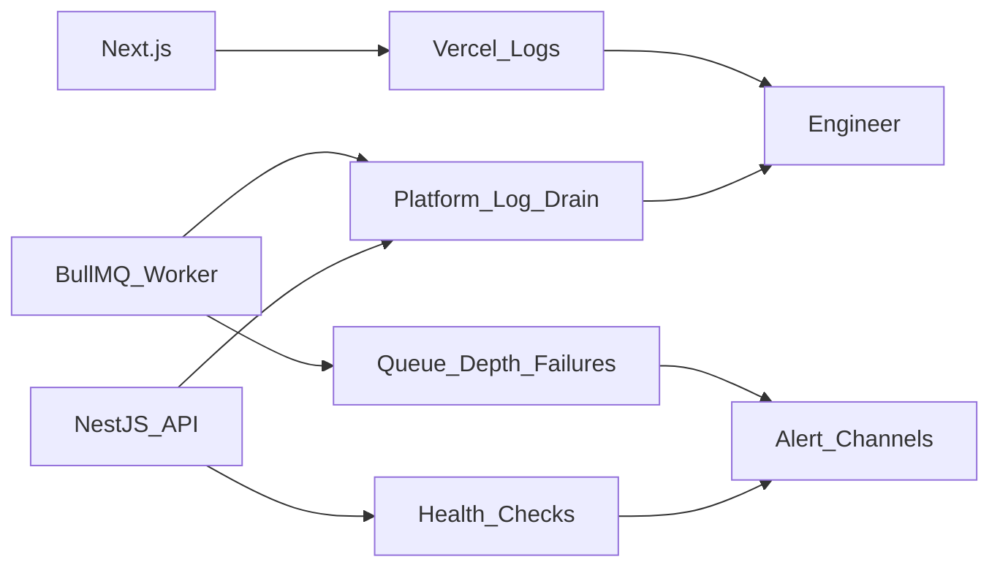
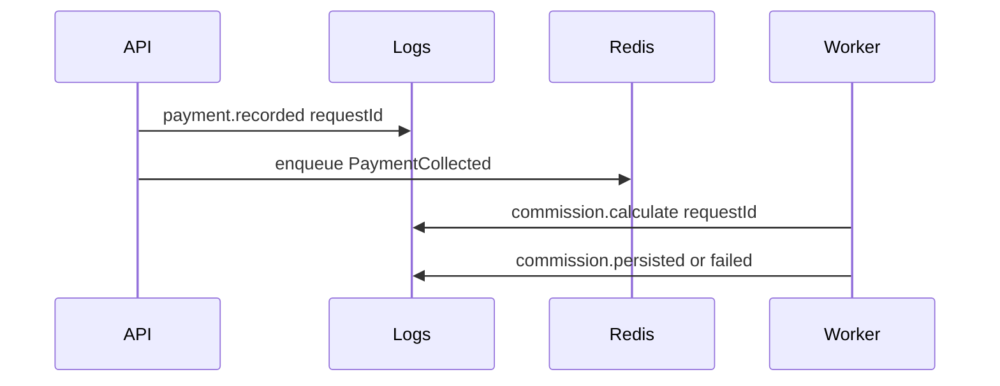

# Monitoring — DYN CRM

> Vietnamese version: [Monitoring.vi.md](./Monitoring.vi.md)  
> **Canonical technical source:** English. Sync EN and VI in the same change set.

## 1. Purpose

Define a pragmatic observability baseline for DYN CRM MVP: what to log, what to health-check, what to alert on, and what to defer — sized for ~30 concurrent users and a 1–3 developer team.

## 2. Scope

| In scope | Out of scope |
|----------|--------------|
| Logging, health, metrics, alert principles | Full APM vendor selection bake-off |
| Correlation and audit vs operational logs | SIEM / SOC procedures |
| Job/queue observability expectations | Pixel-perfect dashboard UX |
| Ownership of signals per deployable | Alert tooling click-paths |

Assumes Deployment and Security are locked. Detailed incident runbooks belong in Phase 05 guidelines.

## 3. Background

Runtime pieces that must be observable:

| Component | Host |
|-----------|------|
| Next.js | Vercel |
| NestJS API | Railway |
| BullMQ worker | Railway |
| Redis | Railway |
| PostgreSQL / Auth / Storage | Supabase |
| Email | Resend |

TechStack locks **structured JSON application logs** from API and worker; metrics/APM detail lives here at architecture level only.

Philosophy: **Pragmatic Enterprise** — prefer platform-native logs + a few actionable alerts over a heavy observability stack.

## 4. Architecture Decisions

### AD-O1 — Three signal classes

| Class | Purpose | MVP approach |
|-------|---------|--------------|
| Logs | Debug and forensics | Structured JSON on API + worker; platform log drains (Railway/Vercel) |
| Health | Liveness/readiness | HTTP health on API; worker heartbeat via queue/process metrics |
| Alerts | Wake a human | Few high-signal alerts only (see AD-O5) |

Distributed tracing / full APM: **deferred** until pain justifies cost (post-MVP / Phase 2 hardening).

### AD-O2 — Structured logging rules

| Field (conceptual) | Required |
|--------------------|----------|
| timestamp | Yes |
| level | Yes (`debug`/`info`/`warn`/`error`) |
| service | Yes (`api` \| `worker` \| `frontend` where applicable) |
| requestId / correlationId | Yes on API request path |
| actorUserId | When authenticated (no secrets) |
| module / action | Recommended |
| error code / message | On failures (safe messages) |

Rules:

1. Never log access tokens, refresh tokens, passwords, or full payment card data (N/A for MVP methods, but keep the rule).
2. Prefer stable error codes aligned with shared-types over free-text-only errors.
3. Auth failures logged at `warn` without account-enumeration detail beyond Security guidance.
4. Frontend: rely primarily on Vercel analytics/logs + API correlation; avoid shipping PII to third-party trackers in MVP.

### AD-O3 — Health endpoints

| Check | Owner | Expectation |
|-------|-------|-------------|
| API liveness | NestJS | Process up |
| API readiness | NestJS | Can reach PG (and optionally Redis) |
| Worker process | Railway process health | Process up; optional “last job processed” metric later |
| Frontend | Vercel | Platform availability |

Readiness failing should remove API from traffic if the platform supports it; do not pretend healthy when DB is down.

### AD-O4 — Metrics (minimal MVP set)

Track at least conceptually (platform metrics and/or simple app counters):

| Signal | Why |
|--------|-----|
| HTTP 5xx rate (API) | User-facing breakage |
| HTTP latency p95 (API) | Experience / regressions |
| Auth login failure spike | Attack or misconfig |
| BullMQ failed jobs / backlog depth | Commission/reminders stalling |
| Worker process restarts | Instability |
| DB connection errors | SoR risk |

Business KPI dashboards (revenue, conversion) belong in product Dashboard module — not ops monitoring.

### AD-O5 — Alerting policy (wake-up worthy)

| Alert | Severity |
|-------|----------|
| API down / sustained 5xx | Critical |
| PostgreSQL unreachable from API | Critical |
| Worker down or queue backlog growing beyond threshold | High |
| Auth provider errors sustained | High |
| Email provider failures sustained | Medium (in-app notification may still work) |

No pager noise for: single 4xx, expected validation errors, one-off job retries that succeed.

Threshold numbers are set at go-live using staging baselines (TODO).

### AD-O6 — Audit vs operational logs

| Type | Owner | Audience |
|------|-------|----------|
| Operational logs | API/worker logging | Engineers debugging |
| Audit trail | System Audit module | Compliance / “who changed money/contract” |

Do not overload audit tables with debug noise. Do not use only logs as the finance audit of record.

### AD-O7 — Correlation across FE → API → worker

1. API generates/propagates `requestId`.
2. Enqueued jobs carry `requestId` / `causationId` when spawned from a request.
3. Worker logs include the same ids for payment→commission traces.

### AD-O8 — Vendor status surfaces

Subscribe/check status pages for Vercel, Railway, Supabase, Resend during incidents before deep-diving app code.

## 5. Diagrams

### 5.1 Signal flow

### 5.2 Payment to commission observability

## 6. Responsibilities

| Component | Monitoring duty | Must not |
|-----------|-----------------|----------|
| API | Structured logs, health, HTTP metrics hooks | Silent catch without log |
| Worker | Job success/fail logs, backlog visibility | Swallow failures without failed-job state |
| Frontend | Report client bootstrap failures sparingly | Log secrets or full form dumps |
| Engineer on-call (even if informal) | Triage Critical/High alerts | Disable alerts permanently to “keep quiet” |
| Platforms | Retain logs per plan limits | Be the only store for audit facts |

## 7. Dependencies

| Dependency | Observability role |
|------------|--------------------|
| Railway logs/metrics | API + worker + Redis signals |
| Vercel logs/analytics | FE availability |
| Supabase dashboard | PG/Auth/Storage health |
| Resend dashboard | Email delivery |
| System Audit DB | Business-sensitive change history |

## 8. Best Practices

- Alert only on symptoms a human must act on.
- Keep a one-page “first 15 minutes” triage note (PG → API → Auth → Worker → FE → Email) matching Deployment dependency order.
- After each production incident, add one missing signal if detection was blind.
- Test restore of logs access on staging accounts before go-live.
- Prefer sampling debug logs in production; keep `info`/`warn`/`error` meaningful.

## 9. Trade-offs

| Decision | Benefit | Cost |
|----------|---------|------|
| Platform logs first | Zero extra vendor for MVP | Retention/query limits by plan |
| Defer full APM/tracing | Less cost/complexity | Harder deep latency analysis |
| Few alerts | Less fatigue | Must tune thresholds once |
| Separate audit store | Finance/legal integrity | Two places to look (ops vs audit) |

## 10. Future Improvements

| Item | Phase |
|------|-------|
| Error tracking SaaS (e.g. Sentry-class) | When error volume justifies |
| OpenTelemetry traces FE→API→worker | Post-MVP if latency issues |
| Slack/email alert routing | Go-live hardening |
| SLOs with formal error budgets | After stable baseline |
| Status page for customers/staff | Optional |

## 11. References

- [`Deployment.md`](./Deployment.md)
- [`TechStack.md`](./TechStack.md) — logging row
- [`Security.md`](./Security.md) — auth failure logging
- [`Module.md`](./Module.md) — Audit ownership
- [`Architecture.md`](./Architecture.md)

---

## Suggested related documents

| Document | Role |
|----------|------|
| [Decisions/ADR-001.md](./Decisions/ADR-001.md) | Modular monolith decision record |
| [Decisions/ADR-002.md](./Decisions/ADR-002.md) | Prisma + PG system of record |
| Phase 05 Release / Security checklists | Human ops checklists |

## TODO

- [x] Monitoring document delivered with Phase 01 completion batch
- [ ] Set numeric alert thresholds from staging baseline before go-live
- [ ] Choose alert channel (email/chat) for Critical/High
- [ ] Confirm log retention days on Railway/Vercel plans
