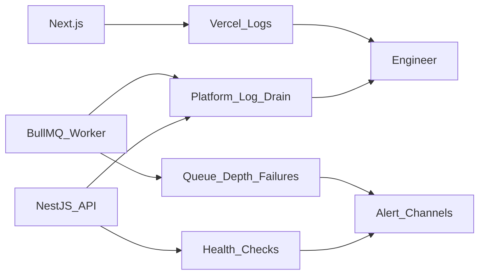
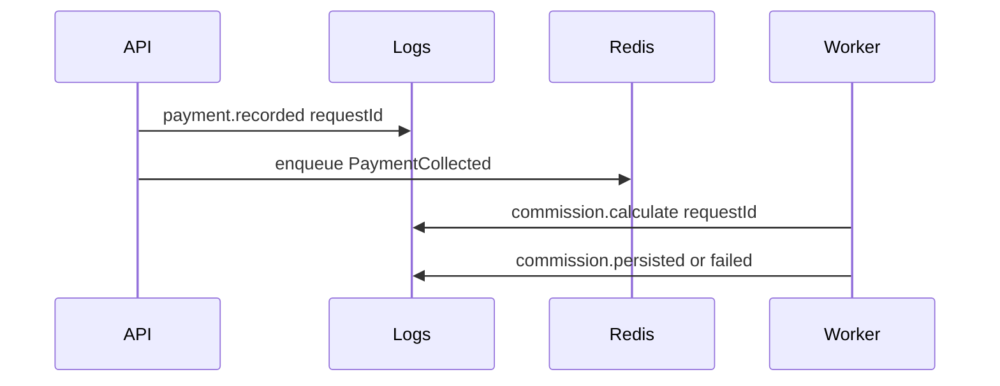

# Giám sát — DYN CRM

> Bản tiếng Việt của [Monitoring.md](./Monitoring.md).  
> **Nguồn kỹ thuật chuẩn (canonical):** bản English. Đồng bộ EN và VI trong cùng một thay đổi.

## 1. Mục đích

Định nghĩa baseline observability pragmatic cho MVP DYN CRM: log gì, health-check gì, alert gì, và trì hoãn gì — phù hợp ~30 user đồng thời và team 1–3 developer.

## 2. Phạm vi

| Trong phạm vi | Ngoài phạm vi |
|---------------|---------------|
| Nguyên tắc logging, health, metric, alert | Bake-off chọn vendor APM đầy đủ |
| Correlation và audit vs log vận hành | Thủ tục SIEM / SOC |
| Kỳ vọng quan sát job/queue | UX dashboard pixel-perfect |
| Ownership tín hiệu theo deployable | Click-path tool alert |

Giả định Deployment và Security đã khóa. Runbook sự cố chi tiết thuộc Phase 05 guidelines.

## 3. Bối cảnh

Thành phần runtime cần quan sát:

| Thành phần | Host |
|------------|------|
| Next.js | Vercel |
| NestJS API | Railway |
| BullMQ worker | Railway |
| Redis | Railway |
| PostgreSQL / Auth / Storage | Supabase |
| Email | Resend |

TechStack khóa **structured JSON application logs** từ API và worker; chi tiết metric/APM ở mức kiến trúc thuộc tài liệu này.

Philosophy: **Pragmatic Enterprise** — ưu tiên log nền tảng + vài alert actionable hơn stack observability nặng.

## 4. Quyết định kiến trúc

### AD-O1 — Ba lớp tín hiệu

| Lớp | Mục đích | Cách MVP |
|-----|----------|----------|
| Logs | Debug và forensics | JSON có cấu trúc trên API + worker; log drain nền tảng (Railway/Vercel) |
| Health | Liveness/readiness | HTTP health trên API; heartbeat worker qua queue/process metric |
| Alerts | Đánh thức người | Chỉ vài alert tín hiệu cao (xem AD-O5) |

Distributed tracing / APM đầy đủ: **hoãn** đến khi đau đủ để trả chi phí (post-MVP / hardening Phase 2).

### AD-O2 — Quy tắc structured logging

| Field (khái niệm) | Bắt buộc |
|-------------------|----------|
| timestamp | Có |
| level | Có (`debug`/`info`/`warn`/`error`) |
| service | Có (`api` \| `worker` \| `frontend` khi áp dụng) |
| requestId / correlationId | Có trên đường request API |
| actorUserId | Khi đã authenticated (không secret) |
| module / action | Khuyến nghị |
| error code / message | Khi lỗi (message an toàn) |

Quy tắc:

1. Không bao giờ log access/refresh token, password, hay dữ liệu thẻ đầy đủ.
2. Ưu tiên mã lỗi ổn định khớp shared-types hơn chỉ free-text.
3. Auth fail log mức `warn` không enumeration tài khoản vượt hướng dẫn Security.
4. Frontend: chủ yếu Vercel logs/analytics + correlation API; tránh đẩy PII sang tracker bên thứ ba trong MVP.

### AD-O3 — Health endpoint

| Check | Owner | Kỳ vọng |
|-------|-------|---------|
| API liveness | NestJS | Process sống |
| API readiness | NestJS | Chạm được PG (và tùy chọn Redis) |
| Worker process | Railway process health | Process sống; metric “job gần nhất” tùy chọn sau |
| Frontend | Vercel | Availability nền tảng |

Readiness fail nên rút API khỏi traffic nếu nền tảng hỗ trợ; không báo healthy khi DB down.

### AD-O4 — Metric (bộ MVP tối thiểu)

Theo dõi khái niệm (metric nền tảng và/hoặc counter app đơn giản):

| Tín hiệu | Vì sao |
|----------|--------|
| Tỷ lệ HTTP 5xx (API) | Hỏng phía user |
| Latency HTTP p95 (API) | Trải nghiệm / regression |
| Spike login auth fail | Tấn công hoặc misconfig |
| BullMQ failed jobs / độ sâu backlog | Commission/reminder đình trệ |
| Worker process restart | Bất ổn |
| Lỗi kết nối DB | Rủi ro SoR |

KPI nghiệp vụ (doanh thu, conversion) thuộc Dashboard sản phẩm — không phải ops monitoring.

### AD-O5 — Chính sách alert (đáng đánh thức)

| Alert | Mức |
|-------|-----|
| API down / 5xx kéo dài | Critical |
| PostgreSQL không tới từ API | Critical |
| Worker down hoặc backlog queue tăng vượt ngưỡng | High |
| Lỗi Auth provider kéo dài | High |
| Lỗi Email provider kéo dài | Medium (notification in-app vẫn có thể hoạt động) |

Không ồn ào vì: một 4xx lẻ, lỗi validation mong đợi, job retry một lần rồi thành công.

Ngưỡng số đặt lúc go-live dựa baseline staging (TODO).

### AD-O6 — Audit vs log vận hành

| Loại | Owner | Đối tượng |
|------|-------|-----------|
| Operational logs | Logging API/worker | Engineer debug |
| Audit trail | Module System Audit | Tuân thủ / “ai đổi tiền/hợp đồng” |

Không nhồi audit bằng debug noise. Không dùng chỉ logs làm sổ audit finance.

### AD-O7 — Correlation FE → API → worker

1. API tạo/propagate `requestId`.
2. Job enqueue mang `requestId` / `causationId` khi sinh từ request.
3. Worker log cùng id cho dấu vết payment→commission.

### AD-O8 — Bề mặt status vendor

Subscribe/kiểm status page Vercel, Railway, Supabase, Resend khi sự cố trước khi đào sâu code app.

## 5. Sơ đồ

### 5.1 Luồng tín hiệu

### 5.2 Quan sát payment → commission

## 6. Trách nhiệm

| Thành phần | Nhiệm vụ monitoring | Không được |
|------------|---------------------|------------|
| API | Structured log, health, hook metric HTTP | Catch im lặng không log |
| Worker | Log success/fail job, thấy backlog | Nuốt fail không có trạng thái failed-job |
| Frontend | Báo lỗi bootstrap client dè dặt | Log secret hoặc dump form đầy đủ |
| Engineer on-call (dù informal) | Triage Critical/High | Tắt alert vĩnh viễn cho “yên” |
| Platforms | Giữ log theo hạn plan | Là kho duy nhất cho sự kiện audit |

## 7. Phụ thuộc

| Phụ thuộc | Vai trò observability |
|-----------|------------------------|
| Railway logs/metrics | Tín hiệu API + worker + Redis |
| Vercel logs/analytics | Availability FE |
| Supabase dashboard | Sức khỏe PG/Auth/Storage |
| Resend dashboard | Giao email |
| System Audit DB | Lịch sử đổi nhạy cảm nghiệp vụ |

## 8. Best practices

- Chỉ alert triệu chứng người phải xử lý.
- Giữ ghi chú triage “15 phút đầu” một trang (PG → API → Auth → Worker → FE → Email) khớp thứ tự Deployment.
- Sau mỗi sự cố production, thêm một tín hiệu nếu trước đó bị mù.
- Kiểm tra quyền xem log trên staging trước go-live.
- Ưu tiên sample debug ở production; giữ `info`/`warn`/`error` có nghĩa.

## 9. Trade-off

| Quyết định | Lợi ích | Chi phí |
|------------|---------|---------|
| Platform logs trước | Không thêm vendor MVP | Hạn retention/query theo plan |
| Hoãn APM/tracing đầy đủ | Ít chi phí/phức tạp | Phân tích latency sâu khó hơn |
| Ít alert | Ít mệt | Phải chỉnh ngưỡng một lần |
| Tách kho audit | Toàn vẹn finance/legal | Hai nơi cần xem (ops vs audit) |

## 10. Cải tiến tương lai

| Hạng mục | Phase |
|----------|-------|
| Error tracking SaaS (kiểu Sentry) | Khi volume lỗi đủ lý do |
| OpenTelemetry traces FE→API→worker | Post-MVP nếu latency đau |
| Định tuyến alert Slack/email | Hardening go-live |
| SLO kèm error budget | Sau baseline ổn định |
| Status page cho khách/nhân sự | Tùy chọn |

## 11. Tham chiếu

- [`Deployment.md`](./Deployment.md)
- [`TechStack.md`](./TechStack.md) — hàng logging
- [`Security.md`](./Security.md) — log auth fail
- [`Module.md`](./Module.md) — ownership Audit
- [`Architecture.md`](./Architecture.md)

---

## Tài liệu liên quan gợi ý

| Tài liệu | Vai trò |
|----------|---------|
| [Decisions/ADR-001.md](./Decisions/ADR-001.md) | Ghi nhận quyết định modular monolith |
| [Decisions/ADR-002.md](./Decisions/ADR-002.md) | Prisma + PG system of record |
| Phase 05 Release / Security checklists | Checklist ops người |

## TODO

- [x] Tài liệu Monitoring giao trong batch hoàn tất Phase 01
- [ ] Đặt ngưỡng alert số từ baseline staging trước go-live
- [ ] Chọn kênh alert (email/chat) cho Critical/High
- [ ] Xác nhận số ngày retention log trên plan Railway/Vercel
