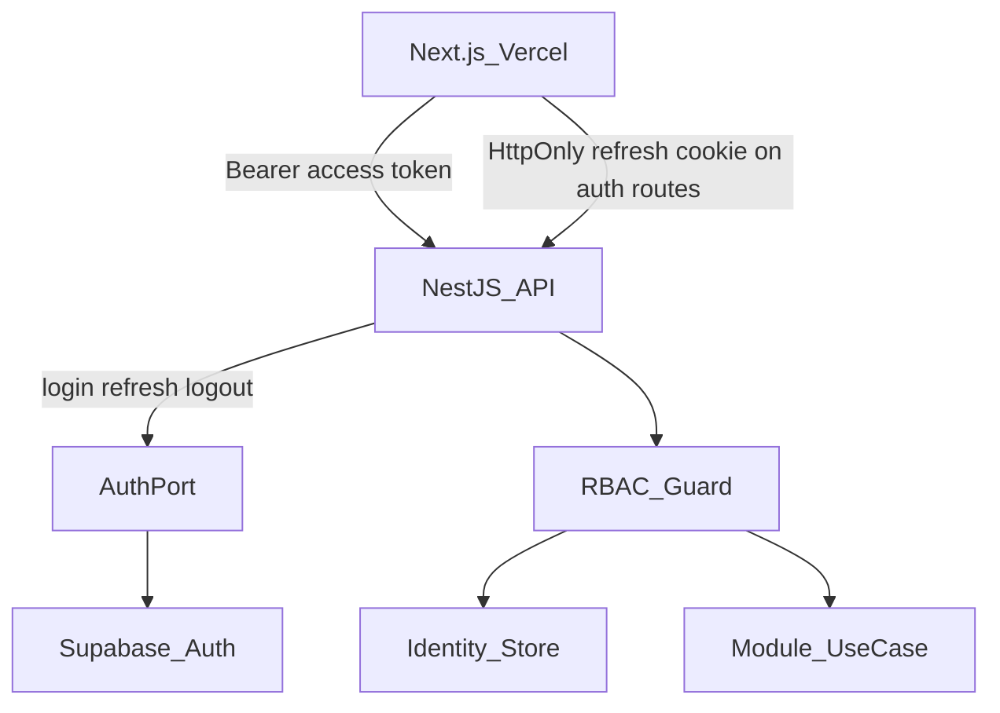
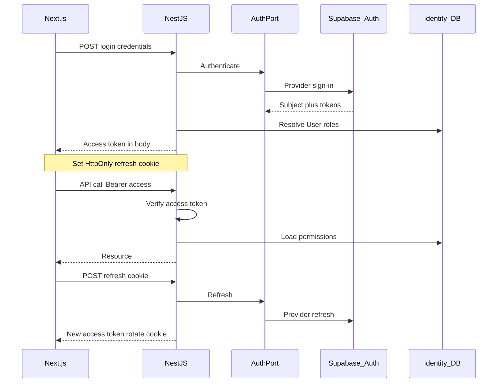
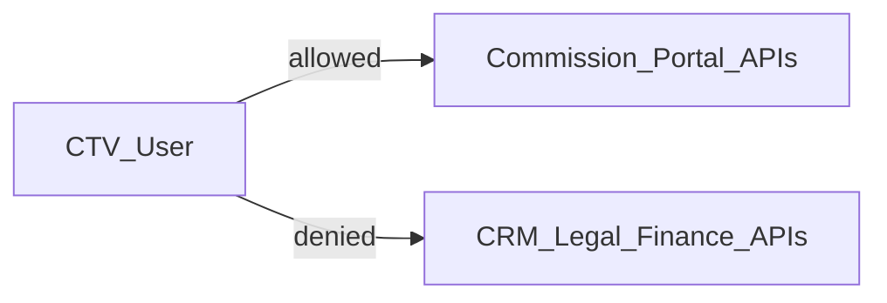

# Security — DYN CRM

> Vietnamese version: [Security.vi.md](./Security.vi.md)  
> **Canonical technical source:** English. Sync EN and VI in the same change set.

## 1. Purpose

Define the security architecture for DYN CRM: authentication (NestJS BFF + Supabase Auth), authorization (NestJS RBAC + permissions), identity mapping, session contract, CTV isolation, and baseline audit — without prescribing implementation code or inventing unfinished domain permissions.

## 2. Scope

| In scope | Out of scope |
|----------|--------------|
| AuthN / AuthZ architecture | Exact JWT claim parsing code |
| Session/token contract (cookie vs bearer) | Full endpoint × permission matrix |
| Identity mapping (Supabase subject ↔ User) | OWASP checklist procedures (guidelines later) |
| Role model and permission naming rules | Penetration-test playbooks |
| CTV portal isolation principles | Secrets rotation runbooks (Deployment) |
| Audit expectations for sensitive actions | RLS SQL policies |

Assumes Architecture, TechStack, and Module are locked.

## 3. Background

Locked constraints:

- Clients authenticate only through **NestJS BFF**; Supabase Auth is behind **AuthPort**.
- **Authorization** is NestJS-only; Supabase RLS is not the authorization source of truth for MVP.
- Roles: Super Admin, Admin, Manager, Lawyer, Legal Assistant, Accounting, Sales, Collaborator (CTV).
- CTV: restricted portal — own referrals, commission, profile; no full CRM.
- Frontend on Vercel and API on Railway are **cross-origin** in MVP.
- Redis available on Railway for session/cache support.

## 4. Architecture Decisions

### AD-S1 — Authentication vs authorization split

| Concern | Owner | Meaning |
|---------|-------|---------|
| Authentication (who) | NestJS AuthPort → Supabase Auth | Verify identity and issue/refresh credentials |
| Authorization (what) | NestJS Identity + guards | Roles and permission codes on every protected use case |
| Data access policy | Application services | Owner/Follower and module rules — not Supabase RLS as SoT |

### AD-S2 — Session / token contract (locked for MVP)

Cross-origin Vercel → Railway makes pure same-site cookie sessions awkward. MVP contract:

| Credential | Transport | Notes |
|------------|-----------|-------|
| Access token | `Authorization: Bearer <access_token>` | Short-lived; validated by NestJS (provider JWKS / AuthPort verify) |
| Refresh credential | **HttpOnly** + `Secure` + `SameSite=None` cookie set by NestJS on refresh/login responses | Browser sends cookie only to NestJS auth endpoints with CORS credentials; refresh token material must not be readable by JavaScript |
| Logout | NestJS invalidates refresh side (cookie clear + server-side revoke/blacklist as designed) | |

Rules:

1. Next.js must not call Supabase Auth directly for login/refresh/logout.
2. Access token is treated as a **credential**, never as an authorization document (no trusting custom “role” claims from the IdP for CRM permissions).
3. CORS on NestJS allows the Vercel origin with credentials for auth cookie flows; business APIs use Bearer access token.

### AD-S3 — Identity mapping

| Concept | Definition |
|---------|------------|
| Auth subject | Stable identifier from Supabase Auth (provider user id) |
| CRM User | Row owned by Identity module |
| Mapping | Exactly one active CRM User per auth subject in single-tenant MVP |

On first successful auth (or admin provisioning):

1. Resolve or create CRM User linked to auth subject.
2. Load roles/permissions from Identity store.
3. Reject access if User is deactivated even if IdP login succeeds.

Provisioning of staff users vs CTV self-registration detail → Identity domain TODO (not invented here).

### AD-S4 — RBAC + permission codes

| Layer | Rule |
|-------|------|
| Role | Coarse assignment to users (Glossary roles) |
| Permission | Fine-grained string codes checked on use cases |
| Enforcement | NestJS guards/interceptors at application boundary per Module.md |

Permission naming convention (canonical):

```text
<resource>.<action>
```

Examples (illustrative, not a complete matrix): `customer.read`, `customer.write`, `contract.sign`, `invoice.create`, `payment.record`, `commission.read_own`, `user.manage`.

- Super Admin / Admin may receive broad permission sets via role bundles.
- CTV role receives only a minimal permission set aligned with portal capabilities.
- Unknown permission ⇒ deny.

### AD-S5 — Role capability map (MVP, high level)

| Role | Typical capability areas |
|------|--------------------------|
| Super Admin | All configuration and user administration |
| Admin | Firm administration within policy |
| Manager | Oversight of pipelines/workload (read-heavy + limited writes per domain rules) |
| Lawyer | Contracts, workflows, files, related customers |
| Legal Assistant | Support tasks/files under legal operations |
| Accounting | Orders, invoices, payments, VAT |
| Sales | Leads, customers, pipeline |
| Collaborator (CTV) | Own referrals, own commission, own profile only |

This is **not** the final endpoint matrix. Endpoint binding happens in implementation against permission codes; disputed Owner/Follower rules remain TODO.

### AD-S6 — CTV isolation

1. CTV-authenticated principals only hit Commission (and Identity profile) public APIs intended for portal.
2. Staff CRM/Legal/Finance routes deny CTV role even if a URL is guessed.
3. Data scoping: CTV reads are filtered to **self** (own referrals/commissions) — never unscoped list endpoints.
4. Do not reuse staff list APIs with a “soft” filter only in the UI.

### AD-S7 — Owner and Follower (baseline pending final lock)

**Recommended baseline for implementation until product locks otherwise:**

| Relation | Baseline access on Customer |
|----------|-----------------------------|
| Owner | Full customer-scoped operations allowed by the user’s role permissions |
| Follower | Read-oriented follow of the customer; writes require Owner or elevated role |

Final Owner vs Follower permission difference remains an open product decision (Module TODO). Do not silently grant Followers Owner-equivalent write.

### AD-S8 — Defense in depth (MVP)

| Control | MVP stance |
|---------|------------|
| TLS | Required on Vercel, Railway, Supabase endpoints |
| Secrets | Env/secret store only; never in repo |
| Supabase RLS | Optional later; **not** AuthZ SoT in MVP |
| Input validation | NestJS boundary (TechStack AD-T6) |
| File access | Authorized metadata check in Legal before StoragePort signed URL / stream |
| Least privilege DB | App DB role limited; no vendor dashboard credentials in runtime |

### AD-S9 — Audit

System Audit (Module.md) must record at least:

- Auth: login success/failure, logout, refresh anomalies (as available)
- Identity: role/permission changes, user activate/deactivate
- Finance: invoice create/void (if any), payment create
- Commission: commission create/adjust (if adjust exists later)
- Legal: contract status transitions

Exact audit schema → domain/database phase. Principle: **who, what, when, subject id**.

## 5. Diagrams

### 5.1 AuthN / AuthZ layers



### 5.2 Login and refresh



### 5.3 CTV deny path



## 6. Responsibilities

| Component | Responsibility | Must not |
|-----------|----------------|----------|
| Next.js | Hold access token for Bearer calls; rely on browser cookie jar for refresh cookie | Store refresh token in localStorage; call Supabase Auth for business login |
| NestJS Identity | BFF auth endpoints; map subject→User; expose permission resolution | Trust IdP custom claims as CRM RBAC |
| AuthPort adapter | Talk to Supabase Auth only | Encode Customer/Contract permissions |
| Module guards | Enforce permission codes | Skip checks for “internal” HTTP from same app without auth context |
| StoragePort usage | After authz on file metadata | Issue public unlisted URLs for private docs without expiry/policy |
| Worker jobs | Run with explicit service identity / trusted internal context | Bypass audit for finance side effects |

Worker trust model (service-level) is detailed further in Deployment; principle: workers execute already-authorized domain commands enqueued by authenticated use cases.

## 7. Dependencies

| Dependency | Security role |
|------------|---------------|
| Supabase Auth | IdP only |
| Prisma / PG | Stores User, roles, permissions, audit |
| Redis | Optional refresh session store / permission cache |
| Vercel ↔ Railway CORS | Must allow credentialed auth routes from FE origin |
| Resend | Auth/notification emails — no secrets in templates |

Module dependency rules from Module.md still apply: only Identity owns auth mapping tables.

## 8. Best Practices

- Default deny on missing permission.
- Prefer permission checks on use cases, not only on UI route guards.
- Short access-token TTL; refresh via BFF only.
- Log auth failures without leaking whether email exists (consistent messages) where product allows.
- Separate CTV UI routes and staff UI routes; never share staff layout with CTV by hiding buttons alone.
- Review any new endpoint for: auth required?, permission code?, CTV scope?, audit?
- Do not enable Supabase Realtime channels as a backdoor around NestJS authz.

## 9. Trade-offs

| Decision | Benefit | Cost |
|----------|---------|------|
| Bearer access + HttpOnly refresh cookie | Fits cross-origin MVP; JS cannot read refresh | CORS credentials complexity; cookie SameSite=None requirements |
| NestJS-only AuthZ | Single policy brain | All routes must be guarded diligently |
| No RLS as SoT | Avoid dual policy | DB credential compromise is higher impact — protect secrets |
| Role + permission codes | Flexible without rewriting roles | Needs disciplined permission catalog |
| CTV hard isolation | Reduces data leak risk | More API surface design care |

### Alternatives considered

| Alternative | Why not for MVP |
|-------------|-----------------|
| All cookies (access + refresh) only | Cross-site CSRF/CORS pain with Vercel≠Railway |
| Bearer refresh in localStorage | XSS can steal long-lived refresh |
| Direct Supabase client auth in browser | Violates BFF lock; weakens central AuthZ |
| RLS as primary AuthZ | Dual brain with NestJS; hard to reason |

## 10. Future Improvements

| Item | Phase |
|------|-------|
| Formal permission matrix spreadsheet per endpoint | Before wide QA |
| Optional Supabase RLS defense-in-depth | After NestJS AuthZ stable |
| SSO / enterprise IdP via AuthPort | When required |
| Step-up auth for destructive finance actions | Post-MVP if needed |
| Device/session inventory UI | Post-MVP |
| Security checklist in `05-guidelines` | Phase 05 |

## 11. References

- [`Architecture.md`](./Architecture.md) — AD-A3, AD-A4
- [`TechStack.md`](./TechStack.md) — AuthPort, validation ownership
- [`Module.md`](./Module.md) — Identity, CTV boundary
- [`docs/00-project/Scope.md`](../00-project/Scope.md) — roles
- [`docs/00-project/Glossary.md`](../00-project/Glossary.md)

---

## Suggested related documents

| Document | Role |
|----------|------|
| [Deployment.md](./Deployment.md) | Next — secrets, CORS origins, worker trust |
| [Monitoring.md](./Monitoring.md) | Auth failure metrics / alerts |
| Phase 02 Identity / CRM domain | Provisioning, Owner/Follower final rules |
| `05-guidelines/SecurityChecklist.md` | Release-time checks |

## TODO

- [x] Approve this Security document (gate before Deployment.md)
- [ ] Lock final Owner vs Follower permission difference with product
- [ ] Publish MVP permission catalog (codes + role bundles) before implementation freeze
- [ ] Confirm staff user provisioning flow (admin-only invite vs other)
- [ ] Confirm CTV account provisioning flow
- [ ] Confirm access-token TTL and refresh rotation policy numerically at implementation kickoff
