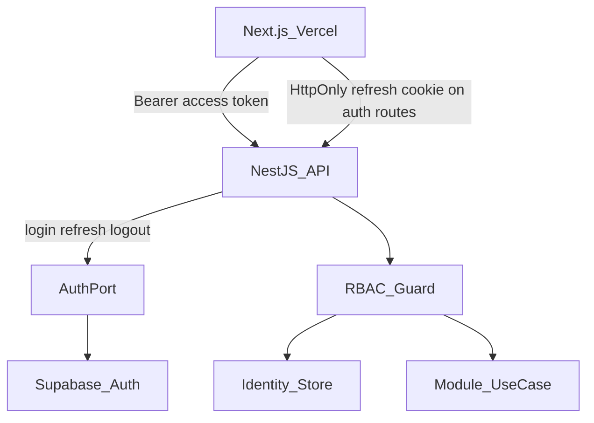
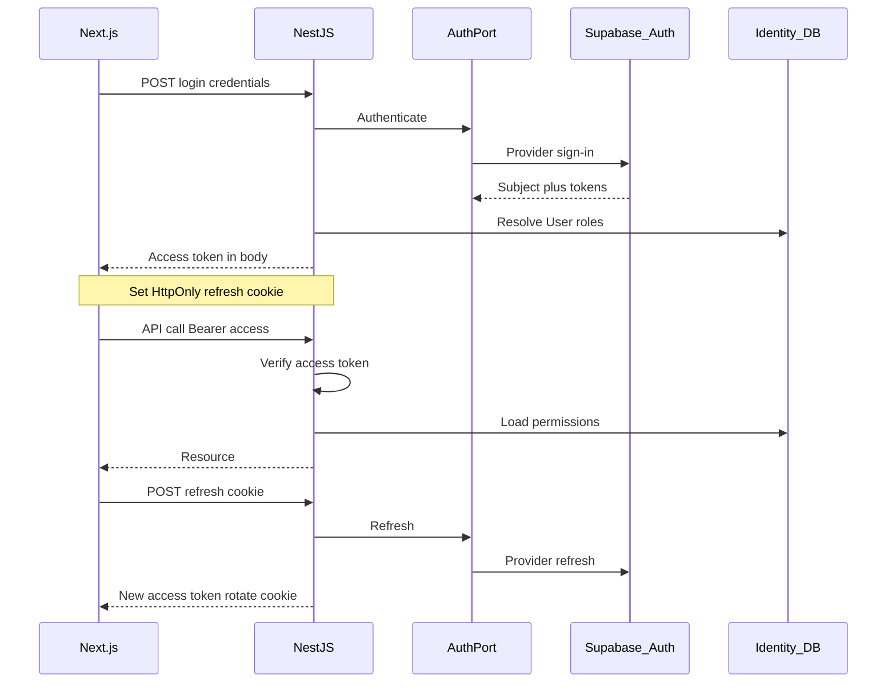
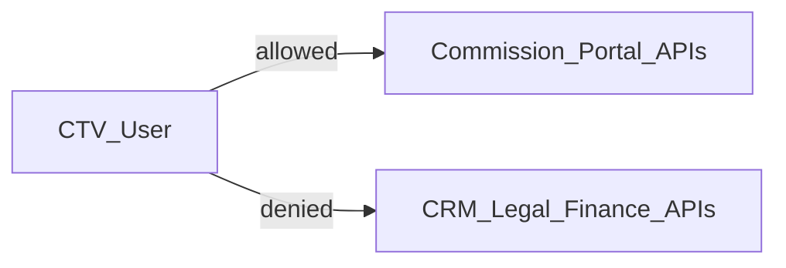

# Bảo mật — DYN CRM

> Bản tiếng Việt của [Security.md](./Security.md).  
> **Nguồn kỹ thuật chuẩn (canonical):** bản English. Đồng bộ EN và VI trong cùng một thay đổi.

## 1. Mục đích

Định nghĩa kiến trúc bảo mật DYN CRM: authentication (NestJS BFF + Supabase Auth), authorization (NestJS RBAC + permission), ánh xạ identity, hợp đồng session, và audit tối thiểu — không kê code triển khai và không bịa permission domain chưa khóa.

**2026-08-17:** Cô lập portal CTV **không** còn là yêu cầu implement trừ khi S6 đảo. Unknown permission ⇒ deny và user deactivated vẫn áp dụng.

## 2. Phạm vi

| Trong phạm vi | Ngoài phạm vi |
|---------------|---------------|
| Kiến trúc AuthN / AuthZ | Code parse JWT chi tiết |
| Hợp đồng session/token (cookie vs bearer) | Ma trận endpoint × permission đầy đủ |
| Ánh xạ identity (Supabase subject ↔ User) | Checklist OWASP thủ tục (guidelines sau) |
| Mô hình role và quy tắc đặt tên permission | Playbook pentest |
| Nguyên tắc cô lập portal CTV | Runbook xoay secrets (Deployment) |
| Kỳ vọng audit cho hành động nhạy cảm | Policy SQL RLS |

Giả định Architecture, TechStack, Module đã khóa.

## 3. Bối cảnh

Ràng buộc đã khóa:

- Client chỉ xác thực qua **NestJS BFF**; Supabase Auth nằm sau **AuthPort**.
- **Authorization** chỉ NestJS; Supabase RLS không phải nguồn chân lý AuthZ MVP.
- Role: Super Admin, Admin, Manager, Lawyer, Legal Assistant, Accounting, Sales, Collaborator (CTV).
- CTV: portal hạn chế — referral/hoa hồng/hồ sơ của mình; không full CRM.
- Frontend Vercel và API Railway là **cross-origin** trong MVP.
- Redis trên Railway sẵn cho session/cache.

## 4. Quyết định kiến trúc

### AD-S1 — Tách authentication và authorization

| Concern | Owner | Ý nghĩa |
|---------|-------|---------|
| Authentication (ai) | NestJS AuthPort → Supabase Auth | Xác minh định danh và cấp/refresh credential |
| Authorization (được làm gì) | NestJS Identity + guard | Role và mã permission trên mọi use case được bảo vệ |
| Policy truy cập dữ liệu | Application service | Rule Owner/Follower và module — không lấy RLS Supabase làm SoT |

### AD-S2 — Hợp đồng session / token (khóa cho MVP)

Cross-origin Vercel → Railway khiến session cookie same-site thuần bất tiện. Hợp đồng MVP:

| Credential | Vận chuyển | Ghi chú |
|------------|------------|---------|
| Access token | `Authorization: Bearer <access_token>` | TTL ngắn; NestJS verify (JWKS provider / AuthPort verify) |
| Refresh credential | Cookie **HttpOnly** + `Secure` + `SameSite=None` do NestJS set khi login/refresh | Browser chỉ gửi cookie tới endpoint auth NestJS kèm CORS credentials; JS không đọc được refresh |
| Logout | NestJS vô hiệu hóa phía refresh (xóa cookie + revoke/blacklist phía server theo thiết kế) | |

Quy tắc:

1. Next.js không gọi trực tiếp Supabase Auth cho login/refresh/logout.
2. Access token là **credential**, không phải tài liệu ủy quyền (không tin custom claim “role” từ IdP cho permission CRM).
3. CORS NestJS cho phép origin Vercel kèm credentials cho luồng cookie auth; API nghiệp vụ dùng Bearer access token.

### AD-S3 — Ánh xạ identity

| Khái niệm | Định nghĩa |
|-----------|------------|
| Auth subject | Định danh ổn định từ Supabase Auth (provider user id) |
| CRM User | Bản ghi do module Identity sở hữu |
| Mapping | Đúng một CRM User active / auth subject trong single-tenant MVP |

Khi auth thành công lần đầu (hoặc admin provision):

1. Resolve hoặc tạo CRM User gắn auth subject.
2. Load role/permission từ Identity store.
3. Từ chối nếu User deactivated dù IdP login thành công.

Chi tiết provision nhân sự vs CTV → TODO domain Identity (không bịa tại đây).

### AD-S4 — RBAC + mã permission

| Layer | Rule |
|-------|------|
| Role | Gán thô cho user (role Glossary) |
| Permission | Chuỗi fine-grained kiểm trên use case |
| Enforcement | Guard/interceptor NestJS tại biên application theo Module.md |

Quy ước đặt tên permission (canonical):

```text
<resource>.<action>
```

Ví dụ (minh họa, không phải ma trận đủ): `customer.read`, `customer.write`, `contract.sign`, `invoice.create`, `payment.record`, `commission.read_own`, `user.manage`.

- Super Admin / Admin có thể nhận bộ permission rộng qua role bundle.
- Role CTV chỉ nhận bộ tối thiểu khớp portal.
- Permission không biết ⇒ deny.

### AD-S5 — Bản đồ năng lực theo role (MVP, mức cao)

| Role | Vùng năng lực điển hình |
|------|-------------------------|
| Super Admin | Mọi cấu hình và quản trị user |
| Admin | Quản trị văn phòng trong policy |
| Manager | Giám sát pipeline/workload (đọc nhiều + ghi hạn chế theo domain) |
| Lawyer | Hợp đồng, workflow, file, khách liên quan |
| Legal Assistant | Hỗ trợ task/file vận hành pháp lý |
| Accounting | Order, invoice, payment, VAT |
| Sales | Lead, customer, pipeline |
| Collaborator (CTV) | Chỉ referral / hoa hồng / hồ sơ của mình |

Đây **không** phải ma trận endpoint cuối. Gắn endpoint khi implement theo mã permission; rule Owner/Follower còn TODO.

### AD-S6 — Cô lập CTV

1. Principal CTV chỉ gọi API portal Commission (và profile Identity) dành cho portal.
2. Route CRM/Legal/Finance nhân sự từ chối role CTV dù đoán URL.
3. Phạm vi dữ liệu: đọc CTV lọc **self** — không list endpoint không scope.
4. Không tái sử dụng API list nhân sự rồi “lọc mềm” chỉ trên UI.

### AD-S7 — Owner và Follower (baseline chờ khóa cuối)

**Baseline đề xuất đến khi product khóa khác:**

| Quan hệ | Truy cập baseline trên Customer |
|---------|----------------------------------|
| Owner | Thao tác customer-scoped đầy đủ trong giới hạn permission role |
| Follower | Theo dõi thiên về đọc; ghi cần Owner hoặc role nâng cao |

Khác biệt Owner vs Follower vẫn là quyết định product mở (Module TODO). Không âm thầm cho Follower quyền ghi ngang Owner.

### AD-S8 — Defense in depth (MVP)

| Kiểm soát | Lập trường MVP |
|-----------|----------------|
| TLS | Bắt buộc trên Vercel, Railway, Supabase |
| Secrets | Chỉ env/secret store; không trong repo |
| Supabase RLS | Tùy chọn sau; **không** AuthZ SoT MVP |
| Input validation | Biên NestJS (TechStack AD-T6) |
| Truy cập file | Kiểm authz metadata Legal trước signed URL / stream StoragePort |
| Least privilege DB | Role DB app hạn chế; không credential dashboard vendor trong runtime |

### AD-S9 — Audit

System Audit (Module.md) phải ghi nhận tối thiểu:

- Auth: login thành/công/fail, logout, bất thường refresh (khi có)
- Identity: đổi role/permission, bật/tắt user
- Finance: tạo/void invoice (nếu có), tạo payment
- Commission: tạo/điều chỉnh commission (nếu có adjust sau)
- Legal: chuyển status contract

Schema audit Exact → phase domain/database. Nguyên tắc: **ai, làm gì, khi nào, subject id**.

## 5. Sơ đồ

### 5.1 Layer AuthN / AuthZ



### 5.2 Login và refresh



### 5.3 Đường từ chối CTV



## 6. Trách nhiệm

| Thành phần | Trách nhiệm | Không được |
|------------|-------------|------------|
| Next.js | Giữ access token cho Bearer; dựa cookie jar cho refresh | Cất refresh trong localStorage; gọi Supabase Auth cho login nghiệp vụ |
| NestJS Identity | Endpoint auth BFF; map subject→User; resolve permission | Tin custom claim IdP như RBAC CRM |
| AuthPort adapter | Chỉ nói chuyện với Supabase Auth | Encode permission Customer/Contract |
| Module guard | Enforce mã permission | Bỏ check cho HTTP “internal” cùng app không có auth context |
| Dùng StoragePort | Sau authz metadata file | Public URL không hạn cho tài liệu riêng tư |
| Job worker | Chạy với service identity / trusted internal context tường minh | Bỏ audit side effect finance |

Mô hình tin cậy worker chi tiết hơn ở Deployment; nguyên tắc: worker thực thi lệnh domain đã được use case authenticated enqueue.

## 7. Phụ thuộc

| Phụ thuộc | Vai trò bảo mật |
|-----------|-----------------|
| Supabase Auth | Chỉ IdP |
| Prisma / PG | Lưu User, role, permission, audit |
| Redis | Store session refresh / cache permission (tùy chọn) |
| CORS Vercel ↔ Railway | Phải cho credentialed auth route từ FE origin |
| Resend | Email auth/notification — không secret trong template |

Rule phụ thuộc Module.md vẫn áp dụng: chỉ Identity sở hữu bảng ánh xạ auth.

## 8. Best practices

- Default deny khi thiếu permission.
- Prefer check permission trên use case, không chỉ guard route UI.
- Access-token TTL ngắn; refresh chỉ qua BFF.
- Log auth fail không lộ email có tồn tại hay không (message nhất quán) khi product cho phép.
- Tách route UI CTV và nhân sự; không chia sẻ layout nhân sự với CTV chỉ bằng ẩn nút.
- Mọi endpoint mới review: cần auth?, mã permission?, scope CTV?, audit?
- Không bật Supabase Realtime như cửa hậu vượt NestJS authz.

## 9. Trade-off

| Quyết định | Lợi ích | Chi phí |
|------------|---------|---------|
| Bearer access + HttpOnly refresh cookie | Khớp MVP cross-origin; JS không đọc refresh | CORS credentials phức tạp hơn; yêu cầu SameSite=None |
| AuthZ chỉ NestJS | Một bộ não policy | Mọi route phải được guard kỹ |
| Không RLS làm SoT | Tránh dual policy | Compromise credential DB nặng hơn — bảo vệ secret |
| Role + permission code | Linh hoạt không viết lại role | Cần kỷ luật catalog permission |
| Cô lập cứng CTV | Giảm rủi ro lộ dữ liệu | Cần thiết kế API surface cẩn thận |

### Phương án đã xét

| Phương án | Vì sao không cho MVP |
|-----------|----------------------|
| Chỉ cookie (access + refresh) | Đau CSRF/CORS cross-site khi Vercel≠Railway |
| Refresh Bearer trong localStorage | XSS lấy refresh dài hạn |
| Auth client Supabase trực tiếp trên browser | Phá khóa BFF; làm yếu AuthZ tập trung |
| RLS làm AuthZ chính | Hai bộ não với NestJS; khó suy luận |

## 10. Cải tiến tương lai

| Hạng mục | Phase |
|----------|-------|
| Spreadsheet ma trận permission theo endpoint | Trước QA rộng |
| Supabase RLS defense-in-depth tùy chọn | Sau khi NestJS AuthZ ổn định |
| SSO / IdP doanh nghiệp qua AuthPort | Khi có yêu cầu |
| Step-up auth cho hành động finance phá hủy | Post-MVP nếu cần |
| UI inventory device/session | Post-MVP |
| Security checklist trong `05-guidelines` | Phase 05 |

## 11. Tham chiếu

- [`Architecture.md`](./Architecture.md) — AD-A3, AD-A4
- [`TechStack.md`](./TechStack.md) — AuthPort, ownership validation
- [`Module.md`](./Module.md) — Identity, ranh giới CTV
- [`docs/00-project/Scope.md`](../00-project/Scope.md) — roles
- [`docs/00-project/Glossary.md`](../00-project/Glossary.md)

---

## Tài liệu liên quan gợi ý

| Tài liệu | Vai trò |
|----------|---------|
| [Deployment.md](./Deployment.md) | Tiếp theo — secrets, CORS origin, worker trust |
| [Monitoring.md](./Monitoring.md) | Metric / alert auth fail |
| Phase 02 Identity / CRM domain | Provisioning, rule Owner/Follower cuối |
| `05-guidelines/SecurityChecklist.md` | Check lúc release |

## TODO

- [x] Duyệt tài liệu Security này (gate trước Deployment.md)
- [ ] Khóa khác biệt permission Owner vs Follower với product
- [ ] Công bố catalog permission MVP (mã + role bundle) trước freeze implementation
- [ ] Xác nhận luồng provision user nhân sự (invite admin-only vs khác)
- [ ] Xác nhận luồng provision tài khoản CTV
- [ ] Xác nhận TTL access-token và chính sách xoay refresh bằng số lúc kickoff implementation
