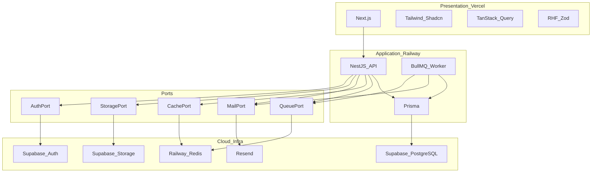
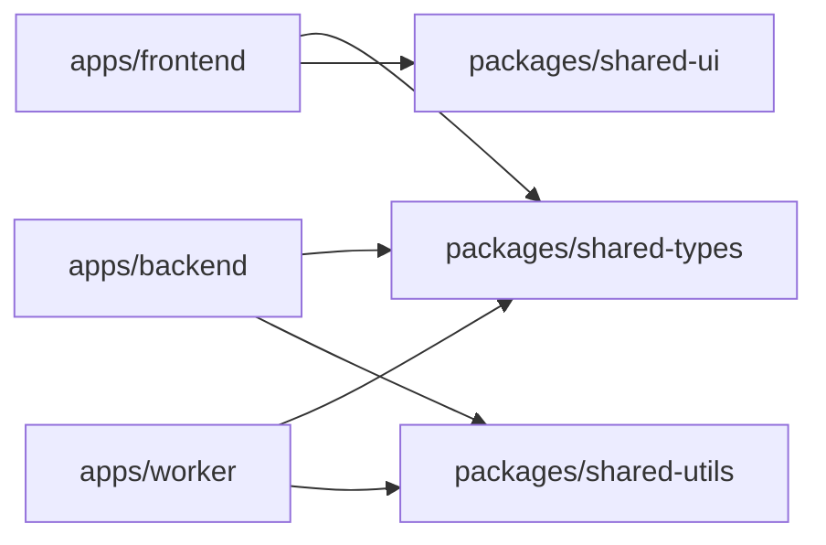
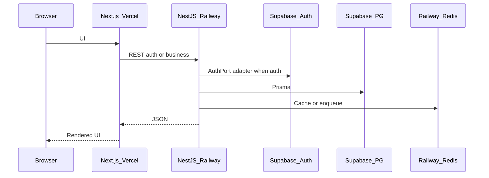

# Tech Stack — DYN CRM

> Vietnamese version: [TechStack.vi.md](./TechStack.vi.md)  
> **Canonical technical source:** English. Sync EN and VI in the same change set.

## 1. Purpose

Record the approved technology choices for DYN CRM, map each technology to an architectural layer or port, and justify selections against maintainability, replaceability, and MVP constraints (~30 concurrent users).

## 2. Scope

| In scope | Out of scope |
|----------|--------------|
| Languages, frameworks, platforms, infra products for MVP | Full package version matrix appendix (published at implementation kickoff) |
| Mapping tech → layer / port | Module internal folder layout (Module.md) |
| Rationale and rejected alternatives | Security token cookie/bearer detail (Security.md) |
| High-level integration topology | CI pipeline YAML (Phase 2) |
| Version policy, validation ownership, replaceability strategy | Testing strategy, coding conventions, deployment procedures, monitoring implementation |

This document assumes [`Architecture.md`](./Architecture.md) is approved.

## 3. Background

Locked architecture:

- Modular monolith, DDD-lite, REST
- NestJS BFF over Supabase Auth; NestJS owns RBAC
- Prisma → Supabase PostgreSQL
- StoragePort → Supabase Storage
- Redis + BullMQ + worker on Railway
- Next.js on Vercel
- Docker Compose on VPS deferred to post-MVP

Phase 00 product stack (UI libraries, validation) remains: Tailwind, Shadcn UI, TanStack Query, React Hook Form, Zod, class-validator on NestJS where applicable, Resend for email.

## 4. Architecture Decisions

### AD-T1 — Stack by layer

| Layer | Technology | Decision |
|-------|------------|----------|
| Presentation | Next.js App Router | CRM UI hosted on Vercel |
| UI system | Tailwind CSS + Shadcn UI | Consistent, accessible components without a heavy design-system build |
| UI i18n | next-intl | Vietnamese message catalogs from day one; English locale enabled in Phase 2 |
| Client data | TanStack Query | Server-state cache; no Redux for MVP |
| Client forms | React Hook Form + Zod | Shared schema mindset with API validation |
| Application API | NestJS | Modular DI, guards, pipes; natural modular monolith host |
| API validation | class-validator / class-transformer (+ Zod in shared packages where useful) | NestJS-native request DTOs; shared types via `packages/shared-types` |
| Domain persistence | Prisma | Type-safe access to PostgreSQL; migrations as system of record schema tool |
| Database host | Supabase PostgreSQL | Managed PG; treated as infrastructure only |
| Auth provider | Supabase Auth | Behind AuthPort; clients use NestJS BFF only |
| Object storage | Supabase Storage | Behind StoragePort |
| Cache | Redis (Railway) | Behind CachePort |
| Jobs | BullMQ | Behind QueuePort; `apps/worker` consumer |
| Email | Resend | Behind MailPort |
| Logging | Structured JSON application logs | Emit from NestJS API and worker; platform log drains on Railway/Vercel; log schema, metrics, and APM belong in Monitoring.md |
| Frontend host | Vercel | MVP presentation hosting |
| Backend / worker / Redis host | Railway | MVP application + async hosting |
| Package manager | pnpm workspaces | Single lockfile for the monorepo; no Turborepo/Nx until build time becomes a proven pain |
| Repo layout | Monorepo (`apps/*`, `packages/*`, `docs/`) | Shared types and one PR surface |

### AD-T2 — Ports remain mandatory

| Port | MVP technology | Must not leak into domain |
|------|----------------|---------------------------|
| AuthPort | Supabase Auth SDK / Admin APIs used only in adapter | Supabase client types in domain entities |
| StoragePort | Supabase Storage (+ MinIO adapter for local/dev) | Bucket SDK calls in domain services |
| MailPort | Resend | Provider templates as domain invariants |
| CachePort | Redis | Redis commands in domain |
| QueuePort | BullMQ | Queue library types in domain event payloads (prefer plain DTOs) |
| PaymentProviderPort | SePay adapter **candidate** | SePay SDK types in Finance domain |

**2026-08-17 implementation foundation:** local **Docker Compose** may run Redis and **MinIO** (StoragePort adapter) for development. This does **not** by itself replace production Vercel + Railway + Supabase unless Scope/Deployment are re-locked. MinIO in production MVP remains a StoragePort option, not a silent swap.

### AD-T3 — Language

| Area | Language |
|------|----------|
| Backend, worker, shared packages | TypeScript |
| Frontend | TypeScript |
| Docs | Markdown + Mermaid (EN canonical + `.vi.md`) |

### AD-T4 — Explicitly not in MVP stack

| Technology | Status |
|------------|--------|
| GraphQL | Out — REST only |
| MinIO (runtime) | Out of MVP hosting; allowed later via StoragePort |
| Docker Compose production | Post-MVP |
| Kubernetes | Not planned for MVP or near-term phases; reassess only if multi-instance HA exceeds the Compose path |
| VNPay / MoMo / Stripe SDKs | Future finance |
| NestJS microservices transport | Not required for monolith MVP |
| Supabase Realtime as business event bus | Out — BullMQ owns async |

### AD-T5 — Local development stance

Developers may use containerized Redis and local Next/Nest processes; production topology remains Vercel + Railway + Supabase. Local Compose is a **dev convenience**, not the MVP production contract.

### AD-T6 — Validation ownership

| Surface | Tool | Rule |
|---------|------|------|
| NestJS HTTP boundary | class-validator (MVP) | Authoritative validation for API security and request invariants |
| Next.js forms | Zod + React Hook Form | UX validation only; never the sole security gate |
| `packages/shared-types` | TypeScript types / enums | Shared shapes and Glossary enums only — no workflows |

Do not maintain divergent copies of the same business rule in both Zod and class-validator.

### AD-T7 — Version policy (lightweight)

- Exact versions are pinned by the monorepo lockfile (pnpm).
- Runtime target: current Node.js LTS at implementation kickoff; record `engines` in the root manifest then.
- Prefer stable majors; justify any brand-new major adoption in writing before merge.
- The detailed version matrix lives at kickoff — not inside this document.

## 5. Diagrams

### 5.1 Tech mapped to architecture

### 5.2 Monorepo package map

### 5.3 Request path (tech view)

## 6. Responsibilities

| Technology | Responsibility | Boundary |
|------------|----------------|----------|
| Next.js | Presentation, routing, VI UI | No commission/invoice invariants |
| NestJS | Use cases, BFF auth, RBAC, REST | No direct Supabase calls outside adapters |
| Prisma | Schema migrations and queries | No authorization decisions |
| Supabase Auth | Identity provider | Not permission matrix owner |
| Supabase PG | Durable business data | Accessed only via Prisma |
| Supabase Storage | Blob bytes | Accessed only via StoragePort |
| Redis / BullMQ | Cache and jobs | No alternate business ledger |
| Resend | Transactional email delivery | Templates triggered by application events |
| Vercel / Railway | Hosting/runtime | Swappable post-MVP (Compose path) |

## 7. Dependencies

### 7.1 Runtime dependency direction

Presentation → NestJS REST → (Domain/Application) → Ports → Vendor SDKs.  
Worker → Application services → Ports / Prisma.

### 7.2 Critical external dependencies

| Dependency | Failure impact | Mitigation |
|------------|----------------|------------|
| Supabase Auth | Login/refresh unavailable | AuthPort allows future IdP; status page / ops runbook in Deployment |
| Supabase PG | Full outage | Backups/restore (Deployment/Monitoring) |
| Railway Redis | Jobs/cache degrade | Queue backlog alerts; sync fallback only if ADR allows |
| Vercel | UI down | API may still be healthy; separate status |
| Resend | Email delay | In-app notification remains source for MVP urgency |

### 7.3 Internal package dependencies

| Package | Consumers | Contents (conceptual) |
|---------|-----------|------------------------|
| `shared-types` | FE, BE, worker | DTO/enum contracts aligned with Glossary |
| `shared-utils` | BE, worker (FE as needed) | Pure helpers |
| `shared-ui` | FE | Design-system wrappers around Shadcn |

## 8. Best Practices

- Prefer versions that are LTS/stable at implementation kickoff; pin in lockfile then — not in this architecture doc.
- Keep Supabase SDK imports inside `infrastructure/` (or equivalent) adapters only.
- Align enum names with [`Glossary.md`](../00-project/Glossary.md).
- Use TanStack Query for server state; avoid duplicating NestJS business rules in the client.
- Validate at the NestJS boundary; treat Zod on the client as UX validation, not security (see AD-T6).
- One worker process family for MVP; split queues by concern (mail, commission, reminder) logically.
- BullMQ worker (`apps/worker`) is part of the MVP application stack whenever async jobs are used (commission, reminders, email); do not design those flows as API-process-only.
- Prisma schema and migrations have a single ownership location consumed by both API and worker — never duplicate schemas.
- Do not introduce a second ORM or a second auth client path “for convenience.”

## 9. Trade-offs

| Choice | Why | Trade-off |
|--------|-----|-----------|
| Supabase Auth + PG + Storage | Speed to MVP | Vendor concentration — ports mandatory |
| NestJS BFF | Central RBAC / CTV control | Extra hop vs direct Supabase JS client |
| Prisma | DX and migrations | Must avoid leaking Prisma types across module public APIs carelessly |
| Vercel + Railway | Managed DX | Two clouds; Compose migration later |
| BullMQ + Redis | Proven Node job stack | Another moving part vs sync-only MVP |
| Shadcn + Tailwind | Fast VI CRM UI | Design consistency requires conventions |
| class-validator + Zod | Fit Nest + FE | Two validators — converge via shared schemas over time |

**Supabase exit order (if required later):** (1) StoragePort → MinIO/R2, (2) move PostgreSQL to another host via connection string (Prisma remains), (3) AuthPort IdP last — identity migration is hardest.

### Rejected alternatives (MVP)

| Alternative | Why rejected for MVP |
|-------------|----------------------|
| GraphQL | Extra complexity for ~30 users and clear REST resources |
| TypeORM | Team prefers Prisma; one ORM only |
| MinIO in production MVP | Supabase Storage chosen; MinIO remains StoragePort option |
| Self-hosted Compose as MVP prod | Deferred; slower ops for current team goal |
| Direct browser → Supabase data APIs | Breaks BFF/authz architecture |

## 10. Future Improvements

| Item | Phase |
|------|-------|
| Exact version matrix in repo `engines` / docs appendix | Implementation kickoff |
| GitHub Actions CI | Phase 2 |
| StoragePort → MinIO or R2 | When exiting Supabase Storage |
| AuthPort → enterprise IdP / SSO | When required |
| Docker Compose production topology | Post-MVP |
| Unify validation on Zod end-to-end | When shared schema package matures |
| OpenAPI generation from NestJS | With APIConvention (Phase 04) |

## 11. References

- [`Architecture.md`](./Architecture.md)
- [`docs/00-project/Scope.md`](../00-project/Scope.md)
- [`docs/00-project/Glossary.md`](../00-project/Glossary.md)
- Stakeholder locks: Architecture approved 2026-08-03; BFF Option B; Railway queue/cache

---

## Suggested related documents

| Document | Role |
|----------|------|
| [Module.md](./Module.md) | Next after TechStack approval |
| [Security.md](./Security.md) | Token/session and RBAC detail |
| [Deployment.md](./Deployment.md) | Vercel / Railway / Supabase wiring |
| [Monitoring.md](./Monitoring.md) | Observability stack choices |
| ADR-001 / ADR-002 | Formalize monolith + Prisma SoR after core docs |

## TODO

- [x] Approve this TechStack document (gate before Module.md)
- [ ] At implementation kickoff: publish concrete version matrix and root `engines`
- [x] Next.js App Router locked
- [x] Package manager: pnpm workspaces (locked)
- [ ] Confirm whether OpenAPI is generated in MVP or Phase 04 only
- [ ] Test runner choice deferred to Testing.md (candidate: Vitest + NestJS testing utilities)
