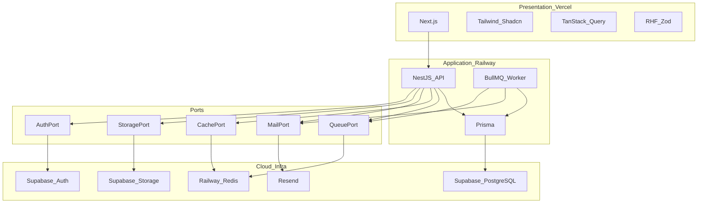
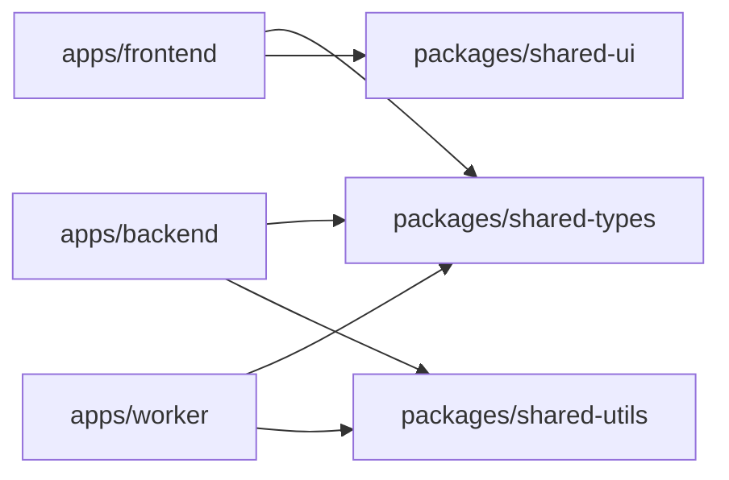
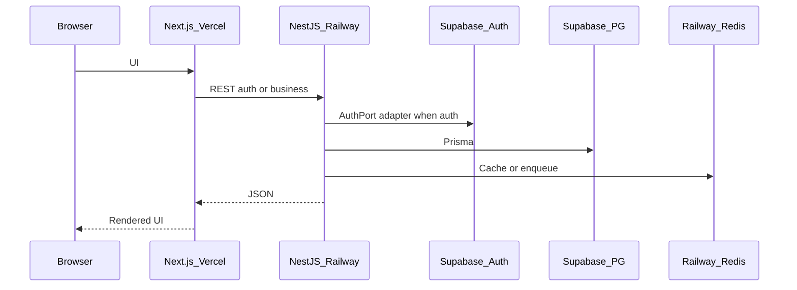

# Tech Stack — DYN CRM

> Bản tiếng Việt của [TechStack.md](./TechStack.md).  
> **Nguồn kỹ thuật chuẩn (canonical):** bản English. Đồng bộ EN và VI trong cùng một thay đổi.

## 1. Mục đích

Ghi nhận lựa chọn công nghệ đã duyệt cho DYN CRM, map từng công nghệ vào layer/port kiến trúc, và giải thích lựa chọn theo khả năng bảo trì, thay thế được, và ràng buộc MVP (~30 user đồng thời).

## 2. Phạm vi

| Trong phạm vi | Ngoài phạm vi |
|---------------|---------------|
| Ngôn ngữ, framework, nền tảng, sản phẩm infra cho MVP | Phụ lục ma trận version package đầy đủ (công bố lúc kickoff implementation) |
| Map tech → layer / port | Layout folder nội bộ module (Module.md) |
| Lý do chọn và phương án bị từ chối | Chi tiết cookie/bearer token (Security.md) |
| Topology tích hợp mức cao | YAML pipeline CI (Phase 2) |
| Version policy, ownership validation, chiến lược thay thế vendor | Testing strategy, coding convention, quy trình deploy, implementation monitoring |

Tài liệu này giả định [`Architecture.md`](./Architecture.md) đã được duyệt.

## 3. Bối cảnh

Kiến trúc đã khóa:

- Modular monolith, DDD-lite, REST
- NestJS BFF trên Supabase Auth; NestJS sở hữu RBAC
- Prisma → Supabase PostgreSQL
- StoragePort → Supabase Storage
- Redis + BullMQ + worker trên Railway
- Next.js trên Vercel
- Docker Compose trên VPS trì hoãn sau MVP

Stack sản phẩm Phase 00 (thư viện UI, validation) giữ nguyên: Tailwind, Shadcn UI, TanStack Query, React Hook Form, Zod, class-validator trên NestJS khi phù hợp, Resend cho email.

## 4. Quyết định kiến trúc

### AD-T1 — Stack theo layer

| Layer | Công nghệ | Quyết định |
|-------|-----------|------------|
| Presentation | Next.js App Router | UI CRM host trên Vercel |
| UI system | Tailwind CSS + Shadcn UI | Component nhất quán, không build design system nặng |
| UI i18n | next-intl | Catalog chuỗi tiếng Việt từ ngày đầu; locale English bật ở Phase 2 |
| Client data | TanStack Query | Cache server-state; không Redux cho MVP |
| Client forms | React Hook Form + Zod | Cùng tư duy schema với API validation |
| Application API | NestJS | DI module, guard, pipe; host modular monolith tự nhiên |
| API validation | class-validator / class-transformer (+ Zod trong shared packages khi hữu ích) | DTO NestJS; type dùng chung qua `packages/shared-types` |
| Domain persistence | Prisma | Truy cập PG type-safe; migration là công cụ schema |
| Database host | Supabase PostgreSQL | PG managed; chỉ là infrastructure |
| Auth provider | Supabase Auth | Sau AuthPort; client chỉ dùng NestJS BFF |
| Object storage | Supabase Storage | Sau StoragePort |
| Cache | Redis (Railway) | Sau CachePort |
| Jobs | BullMQ | Sau QueuePort; consumer `apps/worker` |
| Email | Resend | Sau MailPort |
| Logging | Structured JSON application logs | Emit từ NestJS API và worker; log drain nền tảng trên Railway/Vercel; log schema, metric và APM thuộc Monitoring.md |
| Frontend host | Vercel | Hosting presentation MVP |
| Backend / worker / Redis host | Railway | Hosting application + async MVP |
| Package manager | pnpm workspaces | Một lockfile cho monorepo; không Turborepo/Nx đến khi build time thành pain đã chứng minh |
| Repo layout | Monorepo (`apps/*`, `packages/*`, `docs/`) | Shared types và một bề mặt PR |

### AD-T2 — Ports bắt buộc

| Port | Công nghệ MVP | Không được lộ vào domain |
|------|---------------|--------------------------|
| AuthPort | Supabase Auth SDK / Admin API chỉ trong adapter | Type client Supabase trong entity domain |
| StoragePort | Supabase Storage | Gọi SDK bucket trong domain service |
| MailPort | Resend | Template provider như bất biến domain |
| CachePort | Redis | Lệnh Redis trong domain |
| QueuePort | BullMQ | Type thư viện queue trong thiết kế payload domain event (ưu tiên DTO thuần) |
| PaymentProviderPort | Adapter SePay **candidate** | Type SDK SePay trong domain Finance |

**2026-08-17:** Docker Compose local có thể chạy Redis + MinIO (adapter StoragePort). Không tự thay production Vercel + Railway + Supabase trừ khi khóa lại Deployment.

### AD-T3 — Ngôn ngữ

| Khu vực | Ngôn ngữ |
|---------|----------|
| Backend, worker, shared packages | TypeScript |
| Frontend | TypeScript |
| Docs | Markdown + Mermaid (EN canonical + `.vi.md`) |

### AD-T4 — Không nằm trong stack MVP

| Công nghệ | Trạng thái |
|-----------|------------|
| GraphQL | Ngoài — chỉ REST |
| MinIO (runtime) | Không host MVP; cho phép sau qua StoragePort |
| Docker Compose production | Sau MVP |
| Kubernetes | Không lên kế hoạch cho MVP hay phase gần; chỉ xét lại nếu HA multi-instance vượt khả năng đường Compose |
| SDK VNPay / MoMo / Stripe | Finance tương lai |
| NestJS microservices transport | Không cần cho monolith MVP |
| Supabase Realtime làm event bus nghiệp vụ | Ngoài — BullMQ sở hữu async |

### AD-T5 — Lập trường local development

Developer có thể dùng Redis container hóa và process Next/Nest local; topology production vẫn Vercel + Railway + Supabase. Compose local là **tiện ích dev**, không phải hợp đồng production MVP.

### AD-T6 — Ownership validation

| Bề mặt | Tool | Rule |
|--------|------|------|
| Biên NestJS HTTP | class-validator (MVP) | Validation có thẩm quyền cho bảo mật API và bất biến request |
| Form Next.js | Zod + React Hook Form | Chỉ UX validation; không bao giờ là cổng bảo mật duy nhất |
| `packages/shared-types` | TypeScript types / enums | Chỉ shared shape và enum Glossary — không workflow |

Không duy trì hai bản copy lệch nhau của cùng một business rule ở cả Zod và class-validator.

### AD-T7 — Version policy (nhẹ)

- Version exact được pin bởi lockfile monorepo (pnpm).
- Runtime mục tiêu: Node.js LTS hiện hành lúc kickoff implementation; ghi `engines` vào root manifest lúc đó.
- Ưu tiên major ổn định; mọi major brand-new phải được giải thích bằng văn bản trước khi merge.
- Ma trận version chi tiết sống ở kickoff — không nằm trong tài liệu này.

## 5. Sơ đồ

### 5.1 Tech map vào kiến trúc

### 5.2 Bản đồ package monorepo

### 5.3 Đường request (góc tech)

## 6. Trách nhiệm

| Công nghệ | Trách nhiệm | Ranh giới |
|-----------|-------------|-----------|
| Next.js | Presentation, routing, UI VI | Không bất biến commission/invoice |
| NestJS | Use case, BFF auth, RBAC, REST | Không gọi Supabase trực tiếp ngoài adapter |
| Prisma | Migration schema và query | Không quyết định authorization |
| Supabase Auth | Nhà cung cấp định danh | Không sở hữu ma trận permission |
| Supabase PG | Dữ liệu nghiệp vụ bền vững | Chỉ qua Prisma |
| Supabase Storage | Blob | Chỉ qua StoragePort |
| Redis / BullMQ | Cache và job | Không phải sổ cái nghiệp vụ thay thế |
| Resend | Gửi email giao dịch | Template kích hoạt bởi application event |
| Vercel / Railway | Hosting/runtime | Có thể đổi sau MVP (đường Compose) |

## 7. Phụ thuộc

### 7.1 Hướng phụ thuộc runtime

Presentation → NestJS REST → (Domain/Application) → Ports → Vendor SDK.  
Worker → Application service → Ports / Prisma.

### 7.2 Phụ thuộc ngoài quan trọng

| Phụ thuộc | Tác động khi lỗi | Giảm thiểu |
|-----------|------------------|------------|
| Supabase Auth | Login/refresh không dùng được | AuthPort cho IdP tương lai; runbook ở Deployment |
| Supabase PG | Outage toàn hệ | Backup/restore (Deployment/Monitoring) |
| Railway Redis | Job/cache suy giảm | Alert backlog; fallback sync chỉ khi có ADR |
| Vercel | UI down | API vẫn có thể khỏe; status tách |
| Resend | Email chậm | Notification in-app vẫn là kênh gấp cho MVP |

### 7.3 Phụ thuộc package nội bộ

| Package | Consumer | Nội dung (khái niệm) |
|---------|----------|----------------------|
| `shared-types` | FE, BE, worker | Hợp đồng DTO/enum khớp Glossary |
| `shared-utils` | BE, worker (FE khi cần) | Helper thuần |
| `shared-ui` | FE | Wrapper design-system quanh Shadcn |

## 8. Best practices

- Ưu tiên version LTS/ổn định lúc kickoff implementation; pin trong lockfile lúc đó — không pin trong doc kiến trúc này.
- Giữ import Supabase SDK chỉ trong adapter `infrastructure/` (hoặc tương đương).
- Khớp tên enum với [`Glossary.md`](../00-project/Glossary.md).
- Dùng TanStack Query cho server state; không nhân đôi business rule NestJS ở client.
- Validate tại biên NestJS; Zod trên client là UX validation, không phải security (xem AD-T6).
- Một họ worker process cho MVP; tách queue logic theo concern (mail, commission, reminder).
- BullMQ worker (`apps/worker`) là một phần của application stack MVP khi dùng job async (commission, reminder, email); không thiết kế các flow đó chỉ chạy trong process API.
- Prisma schema và migration có một nơi sở hữu duy nhất, được API và worker cùng dùng — không nhân đôi schema.
- Không đưa ORM thứ hai hoặc đường auth client thứ hai “cho tiện”.

## 9. Trade-off

| Lựa chọn | Vì sao | Đánh đổi |
|----------|--------|----------|
| Supabase Auth + PG + Storage | Nhanh tới MVP | Tập trung vendor — ports bắt buộc |
| NestJS BFF | RBAC / CTV tập trung | Thêm hop so với client Supabase trực tiếp |
| Prisma | DX và migration | Tránh lộ Prisma type qua public API module bất cẩn |
| Vercel + Railway | DX managed | Hai cloud; migration Compose sau |
| BullMQ + Redis | Job stack Node đã chứng minh | Thêm thành phần so với MVP sync-only |
| Shadcn + Tailwind | UI CRM VI nhanh | Cần convention để nhất quán |
| class-validator + Zod | Khớp Nest + FE | Hai validator — hội tụ qua shared schema dần |

**Thứ tự thoát Supabase (nếu cần sau này):** (1) StoragePort → MinIO/R2, (2) chuyển PostgreSQL sang host khác qua connection string (giữ Prisma), (3) AuthPort IdP cuối cùng — migration định danh khó nhất.

### Phương án bị từ chối (MVP)

| Phương án | Vì sao từ chối MVP |
|-----------|---------------------|
| GraphQL | Phức tạp thêm với ~30 user và resource REST rõ |
| TypeORM | Team chọn Prisma; chỉ một ORM |
| MinIO production MVP | Đã chọn Supabase Storage; MinIO vẫn là option StoragePort |
| Compose self-host làm prod MVP | Hoãn; chậm ops so với mục tiêu hiện tại |
| Browser → Supabase data API trực tiếp | Phá kiến trúc BFF/authz |

## 10. Cải tiến tương lai

| Hạng mục | Phase |
|----------|-------|
| Ma trận version cụ thể trong `engines` / phụ lục docs | Kickoff implementation |
| GitHub Actions CI | Phase 2 |
| StoragePort → MinIO hoặc R2 | Khi thoát Supabase Storage |
| AuthPort → IdP / SSO doanh nghiệp | Khi có yêu cầu |
| Topology Docker Compose production | Sau MVP |
| Thống nhất validation Zod end-to-end | Khi shared schema package chín |
| Sinh OpenAPI từ NestJS | Cùng APIConvention (Phase 04) |

## 11. Tham chiếu

- [`Architecture.md`](./Architecture.md)
- [`docs/00-project/Scope.md`](../00-project/Scope.md)
- [`docs/00-project/Glossary.md`](../00-project/Glossary.md)
- Khóa stakeholder: Architecture duyệt 2026-08-03; BFF Option B; queue/cache Railway

---

## Tài liệu liên quan gợi ý

| Tài liệu | Vai trò |
|----------|---------|
| [Module.md](./Module.md) | Tiếp theo sau khi duyệt TechStack |
| [Security.md](./Security.md) | Token/session và RBAC chi tiết |
| [Deployment.md](./Deployment.md) | Wiring Vercel / Railway / Supabase |
| [Monitoring.md](./Monitoring.md) | Lựa chọn observability |
| ADR-001 / ADR-002 | Chính thức hóa monolith + Prisma SoR sau docs lõi |

## TODO

- [x] Duyệt tài liệu TechStack này (gate trước Module.md)
- [ ] Lúc kickoff implementation: công bố ma trận version cụ thể và root `engines`
- [x] Next.js App Router đã khóa
- [x] Package manager: pnpm workspaces (đã khóa)
- [ ] Xác nhận OpenAPI sinh trong MVP hay chỉ Phase 04
- [ ] Lựa chọn test runner để ở Testing.md (ứng viên: Vitest + NestJS testing utilities)
