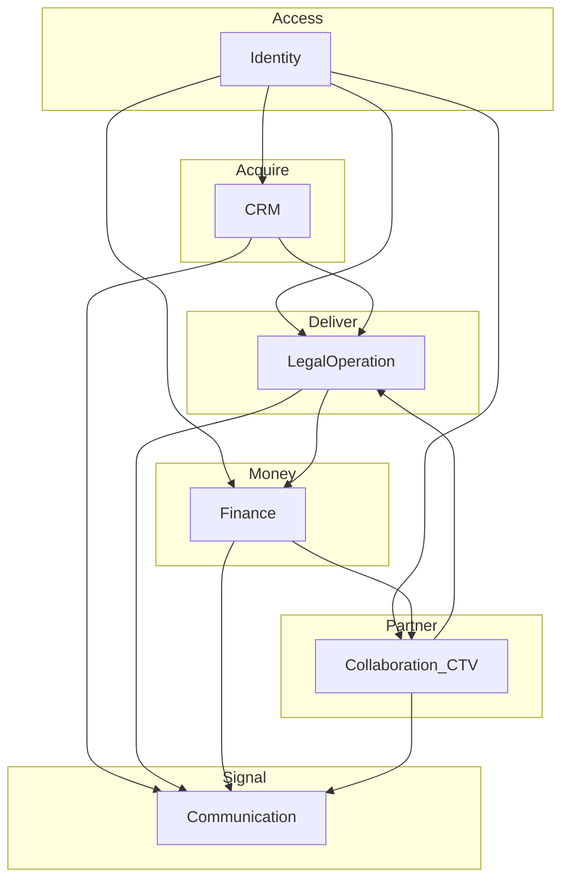
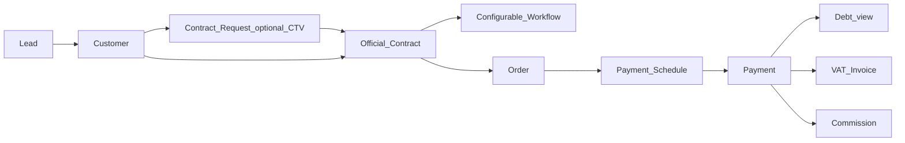
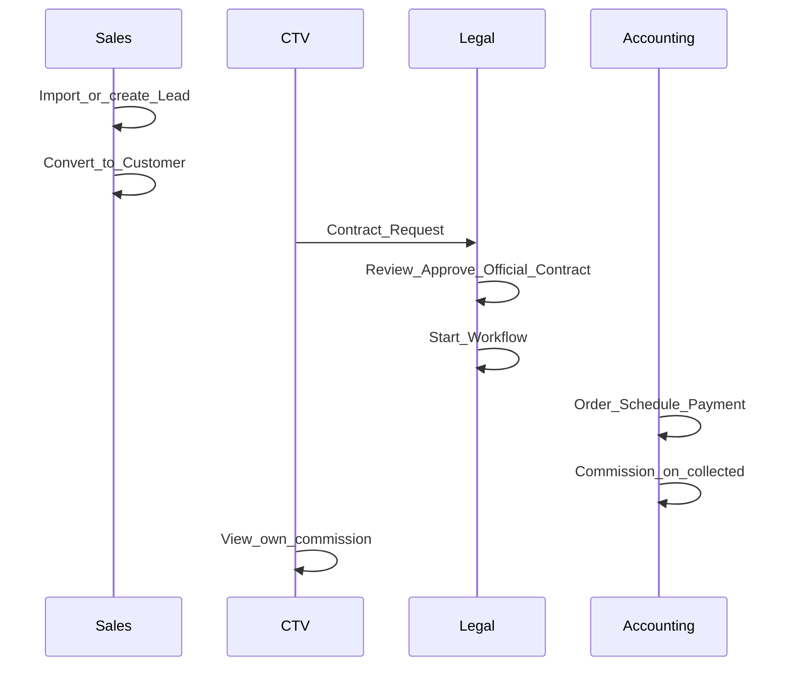
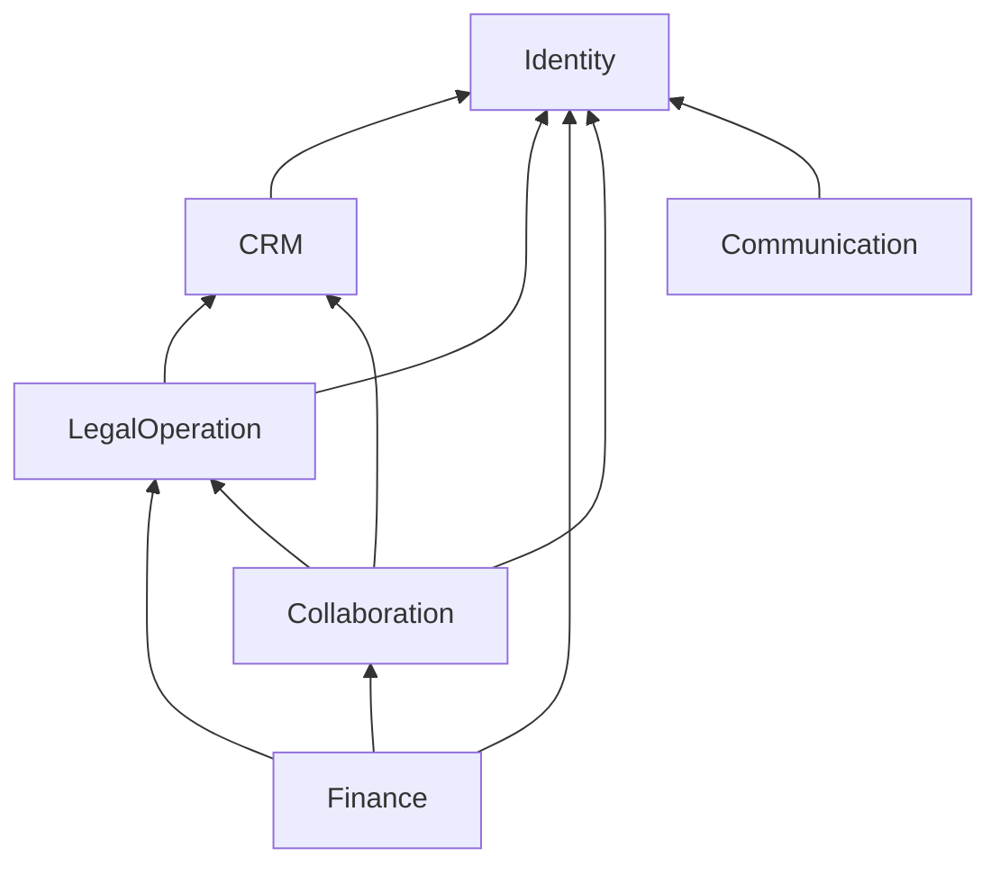

# Business Capability Map — DYN CRM

> Vietnamese version: [BusinessCapabilityMap.vi.md](./BusinessCapabilityMap.vi.md)

## 1. Purpose

Provide a single map of business capabilities, end-to-end value streams, and domain ownership so readers understand the platform before diving into each domain document.

## 2. Scope

| In scope | Out of scope |
|----------|--------------|
| Capability catalog and relationships | Entity field catalogs |
| E2E flows across domains | UI wireframes |
| Mapping to Phase 01 modules | Infrastructure vendors |

## 3. Business Capability

### 3.1 Capability catalog

| Capability | Document | Primary Phase 01 module |
|------------|----------|-------------------------|
| Identity & access | Identity.md | Identity |
| CRM acquisition & customer master | CRM.md | CRM |
| Collaborator (CTV) partnership | Collaboration.md | Commission (+ Legal for requests) |
| Legal delivery | LegalOperation.md | Legal |
| Money & commission | Finance.md | Finance + Commission |
| Notifications & email | Communication.md | System |

### 3.2 Capability map

## 4. Actors (platform-level)

| Actor | Type | Primary capabilities |
|-------|------|----------------------|
| Super Admin / Admin | Internal | Identity, configuration |
| Manager | Internal | Oversight across CRM/Legal/Finance |
| Sales | Internal | CRM |
| Lawyer / Legal Assistant | Internal | LegalOperation |
| Accounting | Internal | Finance |
| Collaborator (CTV) | External partner | Collaboration portal (see Open Questions vs Phase 00) |
| Customer (party) | External | Not a system login in MVP unless later decided |

## 5. Business Lifecycle — platform value chain

> **Locked finance chain (2026-08-03):** Contract → Order → Payment Schedule → Payment → Debt → **VAT Invoice** → Commission. Invoice is issued **after** Payment. Commission base remains **collected payment**. CTV Collaboration expansion (assigned customers + Contract Request) is **locked**.

## 6. Main Business Objects (cross-domain)

| Object | Owning capability |
|--------|-------------------|
| Lead, Customer, Contact | CRM |
| Contract Request | Collaboration |
| Contract, Workflow, Task, Document | LegalOperation |
| Order, Payment Schedule, Payment, Debt, VAT Invoice, Commission | Finance |
| User, Role, Permission | Identity |
| Notification, Reminder, Email message | Communication |

## 7. Business Rules (platform)

1. Glossary English terms are canonical in all domain docs.  
2. Lead is a separate entity from Customer (Phase 00).  
3. Official Contract is created by staff — not unilaterally by CTV (Collaboration).  
4. Commission calculates from **actual collected payment** only (Phase 00).  
5. Workflow is template-based, not BPMN (Phase 00 / 01).  
6. Authorization is NestJS RBAC with `resource.action` permissions (Phase 01).

## 8. Permission Matrix (capability-level)

| Capability | Staff roles (typical) | CTV |
|------------|----------------------|-----|
| CRM | Sales, Manager, Admin, Lawyer (read as needed) | Assigned customers only (scoped portal) |
| Collaboration portal | — | Yes (limited) |
| LegalOperation | Lawyer, Legal Assistant, Manager, Admin | No official contract create |
| Finance | Accounting, Manager, Admin | Commission view own only |
| Identity | Admin, Super Admin | Profile self only |
| Communication | System-driven + role inboxes | Own notifications |

Detailed matrices live inside each domain doc.

## 9. Business Events (platform)

| Event | From | To |
|-------|------|-----|
| LeadConverted | CRM | Legal / Communication |
| ContractRequestSubmitted | Collaboration | Legal / Communication |
| ContractSigned | Legal | Finance / Communication |
| PaymentCollected | Finance | Finance(Commission) / Communication |
| WorkflowStageCompleted | Legal | Communication |
| TaskOverdue | Legal | Communication |

## 10. Interaction with Other Domains

See §3.2 and each domain §10. Infrastructure (AuthPort, StoragePort, QueuePort) is Phase 01 — not redrawn here.

## 11. Future Extension

| Extension | Notes |
|-----------|-------|
| Practice-area packs | Labor, Civil, Business, IP, Litigation |
| Sepay automatic payment verification | Finance / Legal stage requirement |
| Multi-tenant | Identity + all masters |
| Marketing automation | Explicitly out — Communication stays transactional |

## 12. Mermaid Diagrams

### 12.1 Swimlane E2E (staff vs CTV)

### 12.2 Domain dependency (acyclic intent)

## 13. Open Questions

1. Is “Customer” ever a login principal in MVP? (Assumed no.)  
2. Remaining domain Open Questions in CRM / LegalOperation / Finance (Cancelled matrix, etc.)

## 14. TODO

- [x] Close Invoice-vs-Payment and CTV Collaboration expansion (2026-08-03)  
- [ ] Stakeholder workshop on remaining §13 / per-domain Open Questions  
- [ ] Trace each capability to Phase 03 aggregate list  
