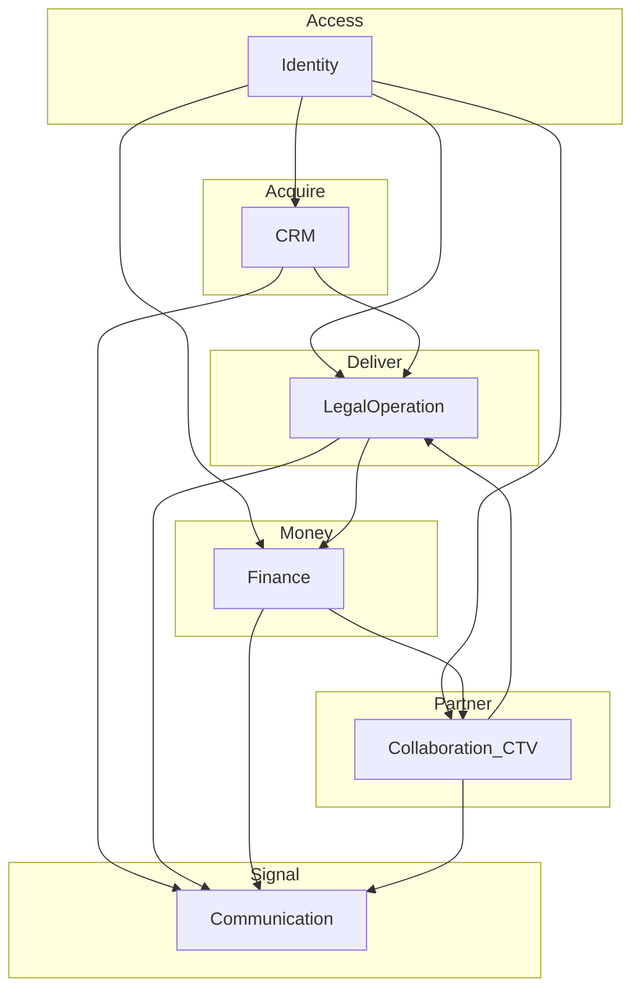
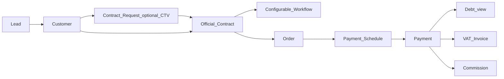
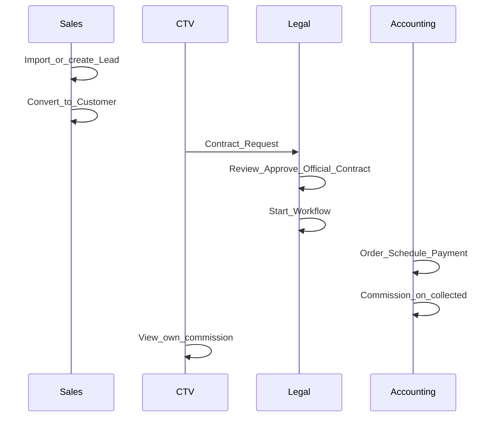
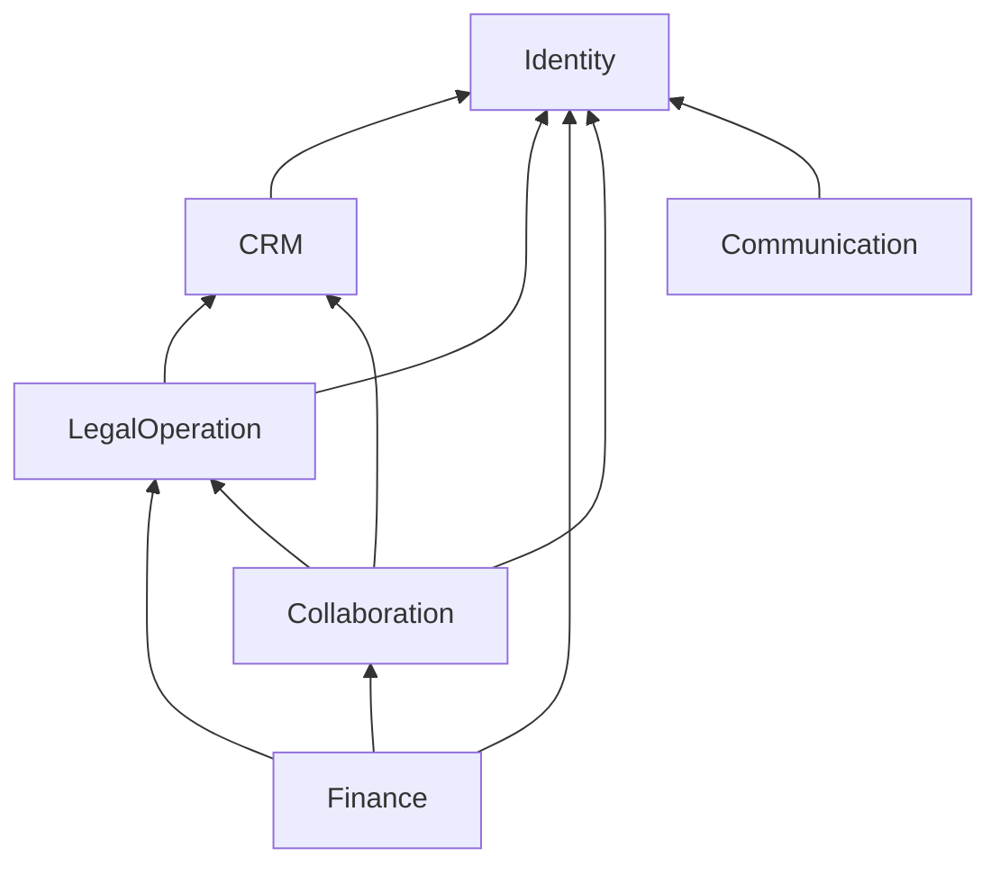

# Bản đồ năng lực nghiệp vụ — DYN CRM

> Bản tiếng Việt của [BusinessCapabilityMap.md](./BusinessCapabilityMap.md). Canonical: English.

## 1. Mục đích

Cung cấp một bản đồ năng lực nghiệp vụ, value stream end-to-end và ownership domain trước khi đọc từng tài liệu domain.

## 2. Phạm vi

| Trong phạm vi | Ngoài phạm vi |
|---------------|---------------|
| Catalog capability và quan hệ | Catalog field entity |
| Luồng E2E xuyên domain | Wireframe UI |
| Ánh xạ module Phase 01 | Vendor hạ tầng |

## 3. Năng lực nghiệp vụ

### 3.1 Catalog

| Năng lực | Tài liệu | Module Phase 01 chính |
|----------|----------|------------------------|
| Định danh & truy cập | Identity.md | Identity |
| CRM thu hút & master khách | CRM.md | CRM |
| Hợp tác CTV | Collaboration.md | Commission (+ Legal cho request) |
| Giao hàng pháp lý | LegalOperation.md | Legal |
| Tiền & hoa hồng | Finance.md | Finance + Commission |
| Thông báo & email | Communication.md | System |

### 3.2 Bản đồ capability

## 4. Actor (cấp nền tảng)

| Actor | Loại | Năng lực chính |
|-------|------|----------------|
| Super Admin / Admin | Nội bộ | Identity, cấu hình |
| Manager | Nội bộ | Giám sát CRM/Legal/Finance |
| Sales | Nội bộ | CRM |
| Lawyer / Legal Assistant | Nội bộ | LegalOperation |
| Accounting | Nội bộ | Finance |
| Collaborator (CTV) | Đối tác ngoài | Portal Collaboration (xem Open Questions vs Phase 00) |
| Customer (đối tượng) | Ngoài | Không login hệ thống MVP trừ khi quyết định sau |

## 5. Vòng đời — chuỗi giá trị nền tảng

> **Chuỗi tài chính đã khóa (2026-08-03):** Contract → Order → Payment Schedule → Payment → Debt → **VAT Invoice** → Commission. Hóa đơn phát hành **sau** Payment. Hoa hồng vẫn trên **tiền đã thu**. Mở rộng Collaboration CTV (khách gán + Contract Request) **đã khóa**.

## 6. Đối tượng nghiệp vụ chính (xuyên domain)

| Đối tượng | Capability sở hữu |
|-----------|-------------------|
| Lead, Customer, Contact | CRM |
| Contract Request | Collaboration |
| Contract, Workflow, Task, Document | LegalOperation |
| Order, Payment Schedule, Payment, Debt, VAT Invoice, Commission | Finance |
| User, Role, Permission | Identity |
| Notification, Reminder, Email | Communication |

## 7. Quy tắc nghiệp vụ (nền tảng)

1. Thuật ngữ English Glossary là canonical.  
2. Lead tách entity khỏi Customer (Phase 00).  
3. Hợp đồng chính thức do nhân sự tạo — CTV không tự ban hành (Collaboration).  
4. Hoa hồng chỉ từ **tiền đã thu** (Phase 00).  
5. Workflow theo template, không BPMN.  
6. Ủy quyền NestJS RBAC `resource.action` (Phase 01).

## 8. Ma trận permission (cấp capability)

| Capability | Role nhân sự (điển hình) | CTV |
|------------|--------------------------|-----|
| CRM | Sales, Manager, Admin, Lawyer (đọc khi cần) | Chỉ khách được gán (portal có scope) |
| Collaboration portal | — | Có (hạn chế) |
| LegalOperation | Lawyer, Legal Assistant, Manager, Admin | Không tạo hợp đồng chính thức |
| Finance | Accounting, Manager, Admin | Chỉ xem hoa hồng của mình |
| Identity | Admin, Super Admin | Chỉ profile bản thân |
| Communication | Hệ thống + hộp thư theo role | Notification của mình |

## 9. Business Events (nền tảng)

| Event | Từ | Tới |
|-------|-----|-----|
| LeadConverted | CRM | Legal / Communication |
| ContractRequestSubmitted | Collaboration | Legal / Communication |
| ContractSigned | Legal | Finance / Communication |
| PaymentCollected | Finance | Finance(Commission) / Communication |
| WorkflowStageCompleted | Legal | Communication |
| TaskOverdue | Legal | Communication |

## 10. Tương tác domain khác

Xem §3.2 và §10 từng domain. Hạ tầng (AuthPort, StoragePort, QueuePort) thuộc Phase 01.

## 11. Mở rộng tương lai

| Mở rộng | Ghi chú |
|---------|---------|
| Gói lĩnh vực | Lao động, Dân sự, DN, SHTT, Tranh tụng |
| Sepay xác minh thanh toán tự động | Finance / requirement stage Legal |
| Multi-tenant | Identity + mọi master |
| Marketing automation | Ngoài scope — Communication chỉ transactional |

## 12. Sơ đồ Mermaid

### 12.1 Swimlane E2E

### 12.2 Phụ thuộc domain

## 13. Open Questions

1. Customer có phải principal login trong MVP không? (Giả định không.)  
2. Open Questions còn lại ở CRM / LegalOperation / Finance (Cancelled, …)

## 14. TODO

- [x] Đóng Invoice-vs-Payment và mở rộng Collaboration CTV (2026-08-03)  
- [ ] Workshop stakeholder cho Open Questions còn lại  
- [ ] Trace từng capability sang danh sách aggregate Phase 03  
