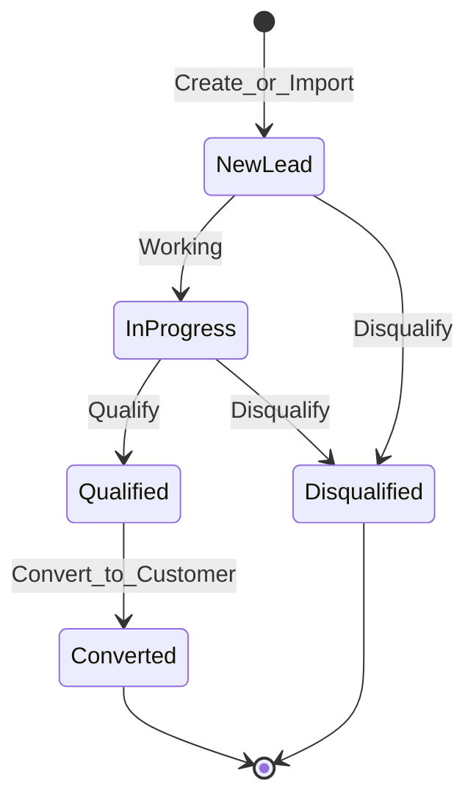
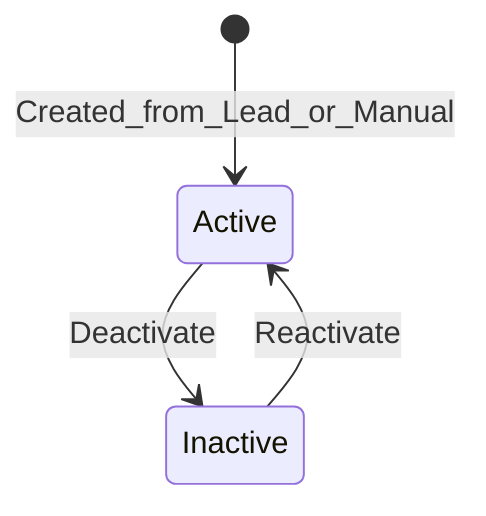
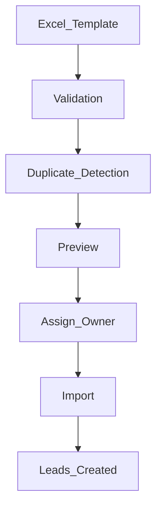
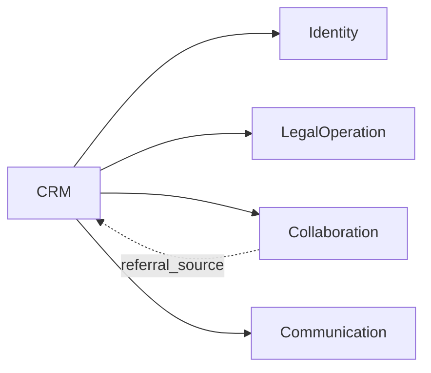
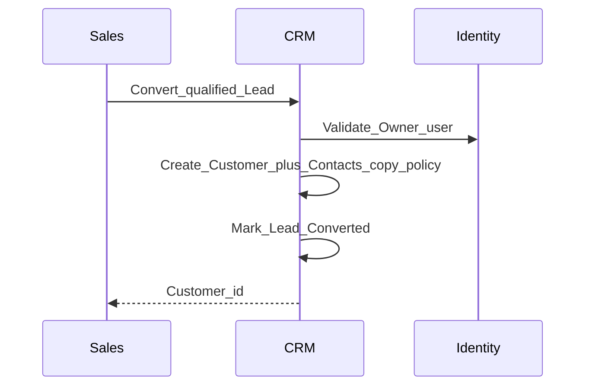
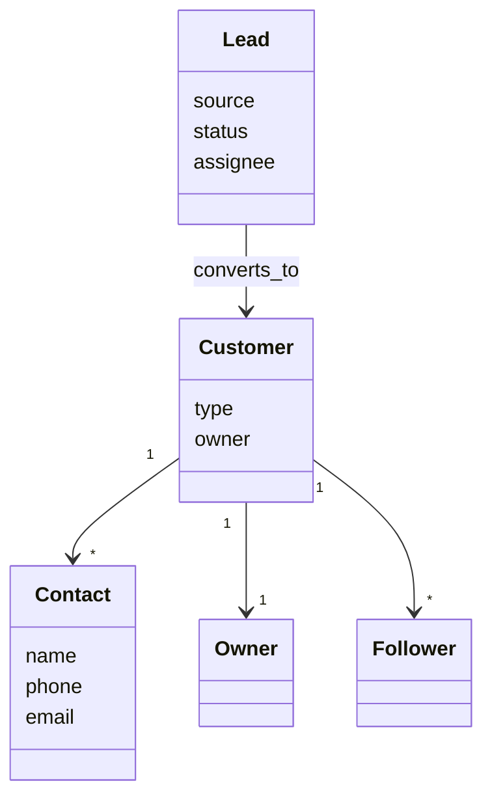
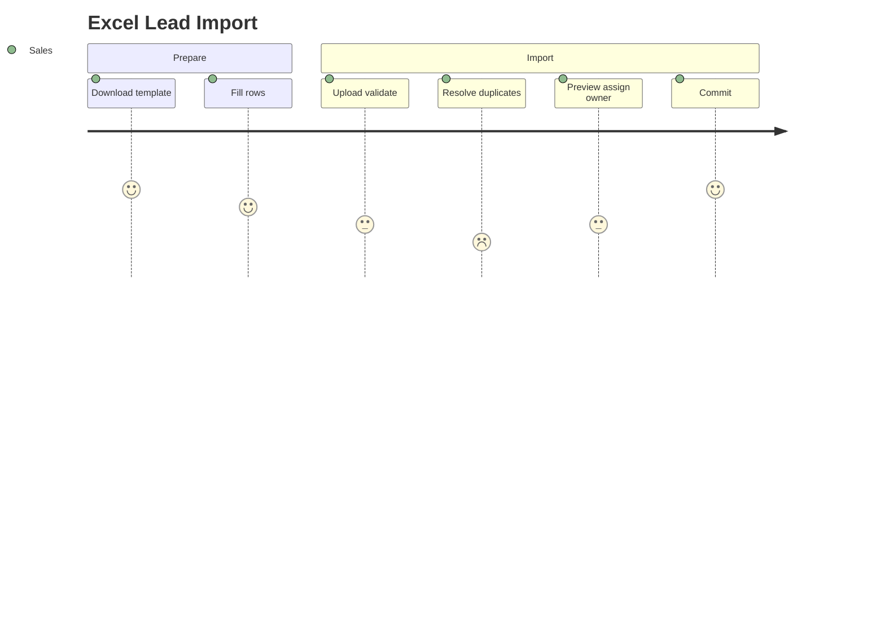

# CRM — DYN CRM

> Vietnamese version: [CRM.vi.md](./CRM.vi.md)

## 1. Purpose

Define the **CRM** business capability: acquiring and managing Leads, converting to Customers, maintaining Contacts, assignment, follow-up, activity history, and the foundation for search/filter/analytics — without implementation detail.

## 2. Scope

| In scope | Out of scope |
|----------|--------------|
| Lead / Customer / Contact lifecycles | Official Contract issuance (LegalOperation) |
| Excel import pipeline (MVP) | Metadata mapping engine |
| Owner / Followers, notes, timeline | Payment and commission |
| Search/filter/analytics *foundation* | Full BI warehouse |

## 3. Business Capability

| Capability | MVP |
|------------|-----|
| Lead import (Excel template) | Yes |
| Lead management & qualification | Yes |
| Lead assignment | Yes |
| Customer management (Individual / Company) | Yes |
| Contact management | Yes |
| Follow-up | Yes |
| Timeline / activity history / notes | Yes |
| Search & filter | Yes |
| Analytics foundation | Yes (basic counts/pipelines — not full BI) |

### Lead sources (locked list for MVP)

| Source |
|--------|
| Facebook |
| Google |
| Website |
| Landing Page |
| Referral |
| Excel |
| Manual |

## 4. Actors

| Actor | CRM role |
|-------|----------|
| Sales | Primary create/qualify/convert/import |
| Manager | Oversight, reassignment |
| Admin | Configuration support |
| Lawyer / Legal Assistant | Often read/follow after conversion |
| Accounting | Read as needed for billing context |
| CTV | **No full CRM** per Phase 00 (see Collaboration for portal scope) |

## 5. Business Lifecycle

### 5.1 Lead → Customer

> Exact Lead status enum beyond Qualified/Converted/Disqualified → Open Questions.

### 5.2 Customer

### 5.3 Excel import pipeline (MVP)

**Extension point:** future dynamic column mapping. **Do not** build a metadata engine in MVP.

## 6. Main Business Objects

| Object | Meaning |
|--------|---------|
| Lead | Prospective client before Customer (separate entity — Phase 00) |
| Customer | Individual or Company client master |
| Contact | Person linked to Customer (and optionally Lead) |
| Owner | Exactly one primary responsible user per Customer |
| Follower | Optional additional users following a Customer |
| Note | Free-text business note on Lead/Customer |
| Activity / Timeline entry | Chronological CRM-relevant facts |
| Import batch | Record of an Excel import run |

## 7. Business Rules

1. Lead ≠ Customer; conversion is an explicit action (Phase 00).  
2. Customer types: Individual | Company (Phase 00).  
3. Every Customer has exactly **one** Owner; Followers optional (Phase 00).  
4. Duplicate detection runs before import commit (rules for match keys → Open Questions).  
5. Import must assign Owner before commit (MVP flow).  
6. Referral source may link to Collaboration/CTV (attribution model still Open Question).  
7. CTV has scoped assigned-customer access via Collaboration portal — not full CRM (locked 2026-08-03).

## 8. Permission Matrix

| Permission (illustrative) | Sales | Manager | Admin | Lawyer | CTV |
|---------------------------|-------|---------|-------|--------|-----|
| `lead.read` | Y | Y | Y | Y | N |
| `lead.write` | Y | Y | Y | Limited/Open Q | N |
| `lead.import` | Y | Y | Y | N | N |
| `lead.convert` | Y | Y | Y | Open Q | N |
| `customer.read` | Y | Y | Y | Y | N* |
| `customer.write` | Y | Y | Y | Open Q | N |
| `contact.write` | Y | Y | Y | Open Q | N |

\*CTV sees **assigned** customers only via Collaboration portal (locked 2026-08-03) — not full CRM.

Owner vs Follower write rights: baseline in Security.md; **final lock still Open Question**.

## 9. Business Events

| Event | When |
|-------|------|
| `LeadCreated` | Manual or import |
| `LeadAssigned` | Owner/assignee set |
| `LeadQualified` | Qualification action |
| `LeadConverted` | Customer created from Lead |
| `LeadDisqualified` | Closed lost |
| `CustomerCreated` | Convert or manual |
| `CustomerOwnerChanged` | Reassignment |
| `ImportCompleted` | Batch finished |
| `NoteAdded` / `ActivityRecorded` | Timeline |

## 10. Interaction with Other Domains

| Domain | Interaction |
|--------|-------------|
| Identity | Owner / Follower users |
| LegalOperation | Customer referenced by Contract |
| Collaboration | Referral / CTV-related customer visibility (if approved) |
| Finance | Customer on Order/Invoice |
| Communication | Follow-up reminders, assignment notices |

## 11. Future Extension

| Item | Notes |
|------|-------|
| Dynamic import mapping UI | Extension point only in MVP |
| Merge duplicate tool | Post-MVP |
| Practice-area tags on Customer | With legal specialization |
| Full analytics warehouse | Out of MVP |

## 12. Mermaid Diagrams

### 12.1 Convert sequence

### 12.2 Objects (conceptual)

### 12.3 Import journey

## 13. Open Questions

1. Full Lead status set (beyond New / InProgress / Qualified / Converted / Disqualified)?  
2. Duplicate match keys (phone, email, tax id, name+phone)? Soft warn vs hard block?  
3. On convert: which Lead fields map to Customer/Contact?  
4. Can Contact exist on Lead before conversion? (Phase 00 TODO)  
5. Owner vs Follower exact write permissions?  
6. May Lawyers convert leads?  
7. Referral Lead → mandatory CTV link?

## 14. TODO

- [ ] Lock Lead status enum  
- [ ] Lock duplicate policy  
- [ ] Lock conversion field map  
- [ ] Publish Excel template column list  
- [ ] Align CTV customer visibility with Collaboration decision  
