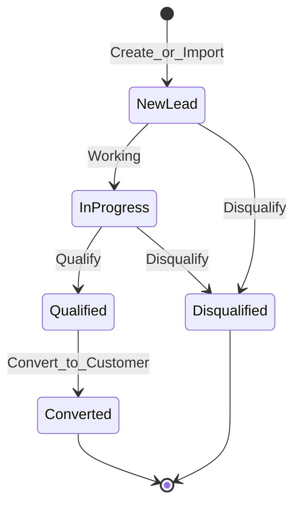
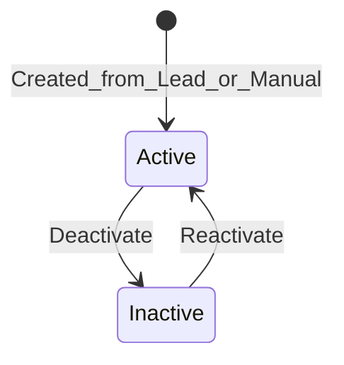
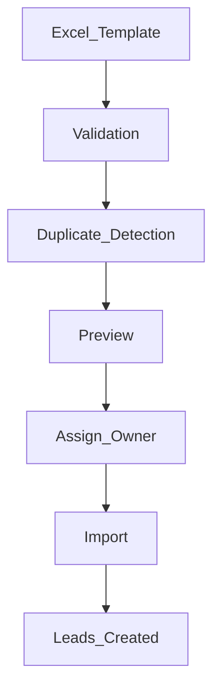
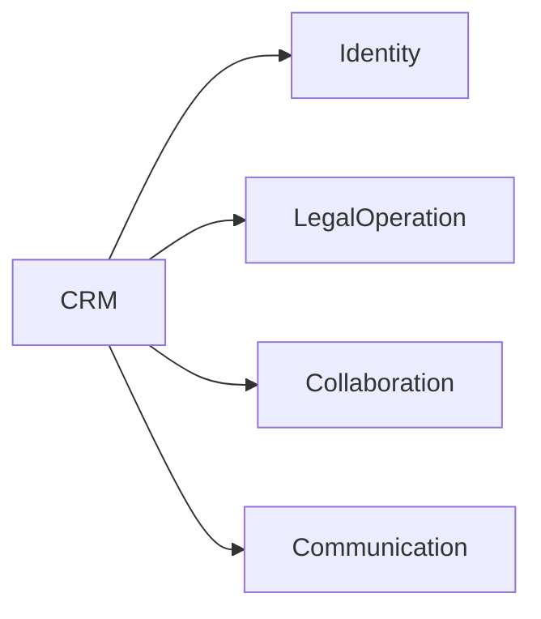
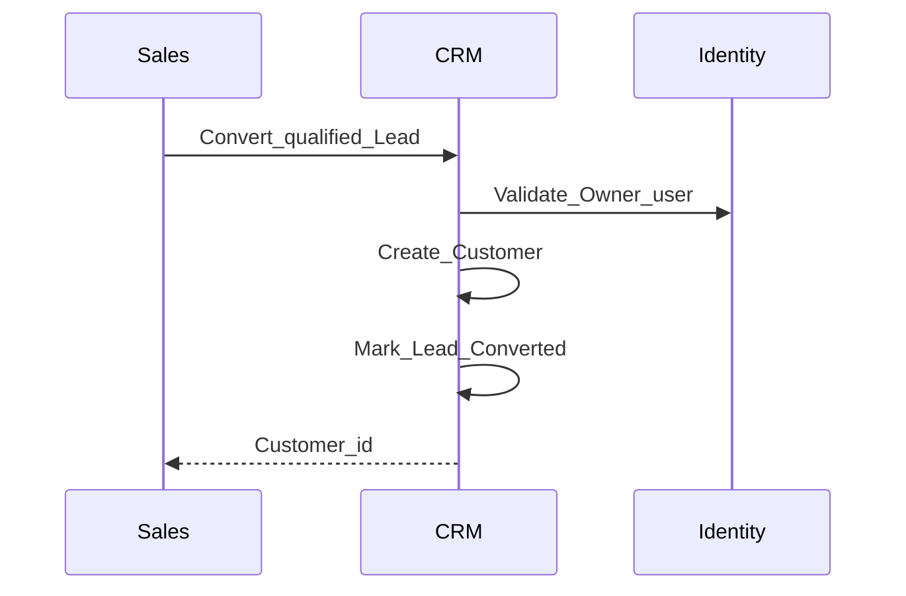
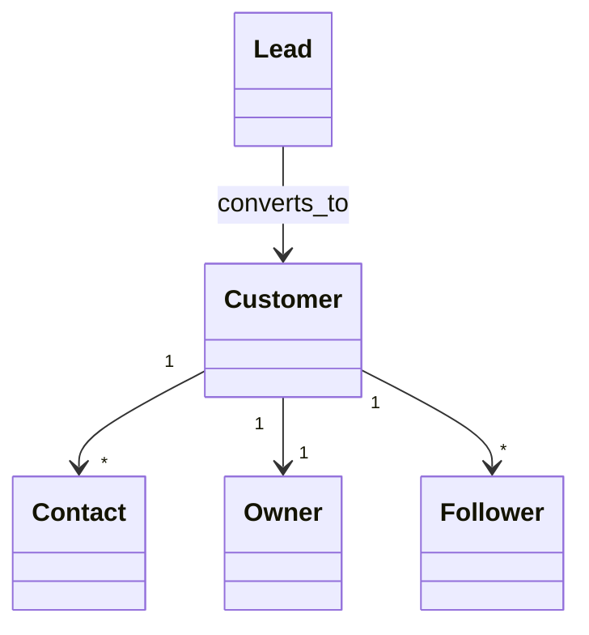

# CRM — DYN CRM

> Bản tiếng Việt của [CRM.md](./CRM.md). Canonical: English.

## 1. Mục đích

Định nghĩa năng lực **CRM**: thu hút và quản lý Lead, convert sang Customer, Contact, phân công, follow-up, lịch sử hoạt động, nền tảng search/filter/analytics — không chi tiết triển khai.

## 2. Phạm vi

| Trong phạm vi | Ngoài phạm vi |
|---------------|---------------|
| Vòng đời Lead / Customer / Contact | Ban hành hợp đồng chính thức (LegalOperation) |
| Pipeline import Excel (MVP) | Engine metadata mapping |
| Owner / Followers, notes, timeline | Payment và commission |
| Nền tảng search/filter/analytics | Kho BI đầy đủ |

## 3. Năng lực nghiệp vụ

| Năng lực | MVP |
|----------|-----|
| Import Lead (mẫu Excel) | Có |
| Quản lý & qualify Lead | Có |
| Phân công Lead | Có |
| Quản lý Customer (Cá nhân / Công ty) | Có |
| Quản lý Contact | Có |
| Follow-up | Có |
| Timeline / hoạt động / ghi chú | Có |
| Search & filter | Có |
| Nền tảng analytics | Có (đếm/pipeline cơ bản) |

### Nguồn Lead (MVP)

Facebook, Google, Website, Landing Page, Referral, Excel, Manual.

## 4. Actor

| Actor | Vai trò CRM |
|-------|-------------|
| Sales | Tạo/qualify/convert/import chính |
| Manager | Giám sát, đổi Owner |
| Admin | Hỗ trợ cấu hình |
| Lawyer / Legal Assistant | Thường đọc/follow sau convert |
| Accounting | Đọc khi cần ngữ cảnh thanh toán |
| CTV | **Không full CRM** (Phase 00) |

## 5. Vòng đời nghiệp vụ

### 5.1 Lead → Customer

### 5.2 Customer

### 5.3 Import Excel (MVP)

**Điểm mở rộng:** mapping cột động sau này. **Không** làm metadata engine trong MVP.

## 6. Đối tượng nghiệp vụ chính

Lead, Customer, Contact, Owner, Follower, Note, Activity/Timeline, Import batch — định nghĩa như bản English.

## 7. Quy tắc nghiệp vụ

1. Lead ≠ Customer; convert tường minh.  
2. Customer: Individual | Company.  
3. Đúng một Owner; Follower tùy chọn.  
4. Phát hiện trùng trước khi commit import.  
5. Import phải gán Owner trước commit.  
6. Nguồn Referral có thể liên kết CTV sau (Open Questions).  
7. CTV không vào full CRM (Phase 00 / Security).

## 8. Ma trận permission

| Permission (minh họa) | Sales | Manager | Admin | Lawyer | CTV |
|----------------------|-------|---------|-------|--------|-----|
| `lead.read` | Y | Y | Y | Y | N |
| `lead.write` | Y | Y | Y | Hạn chế/Open Q | N |
| `lead.import` | Y | Y | Y | N | N |
| `lead.convert` | Y | Y | Y | Open Q | N |
| `customer.read` | Y | Y | Y | Y | N* |
| `customer.write` | Y | Y | Y | Open Q | N |

\*CTV chỉ thấy khách được gán nếu Collaboration được duyệt mở rộng.

## 9. Business Events

`LeadCreated`, `LeadAssigned`, `LeadQualified`, `LeadConverted`, `LeadDisqualified`, `CustomerCreated`, `CustomerOwnerChanged`, `ImportCompleted`, `NoteAdded` / `ActivityRecorded`.

## 10. Tương tác domain khác

## 11. Mở rộng tương lai

Mapping import động; merge trùng; tag lĩnh vực; kho analytics — sau MVP / khi có nhu cầu.

## 12. Sơ đồ Mermaid

## 13. Open Questions

1. Bộ status Lead đầy đủ?  
2. Khóa trùng (phone/email/…); soft vs hard?  
3. Mapping field Lead → Customer/Contact?  
4. Contact trên Lead trước convert?  
5. Quyền ghi Owner vs Follower?  
6. Lawyer được convert Lead?  
7. Lead Referral bắt buộc gắn CTV?

## 14. TODO

- [ ] Khóa enum status Lead  
- [ ] Khóa chính sách trùng  
- [ ] Khóa map convert  
- [ ] Công bố cột mẫu Excel  
- [ ] Khớp visibility CTV với quyết định Collaboration  
