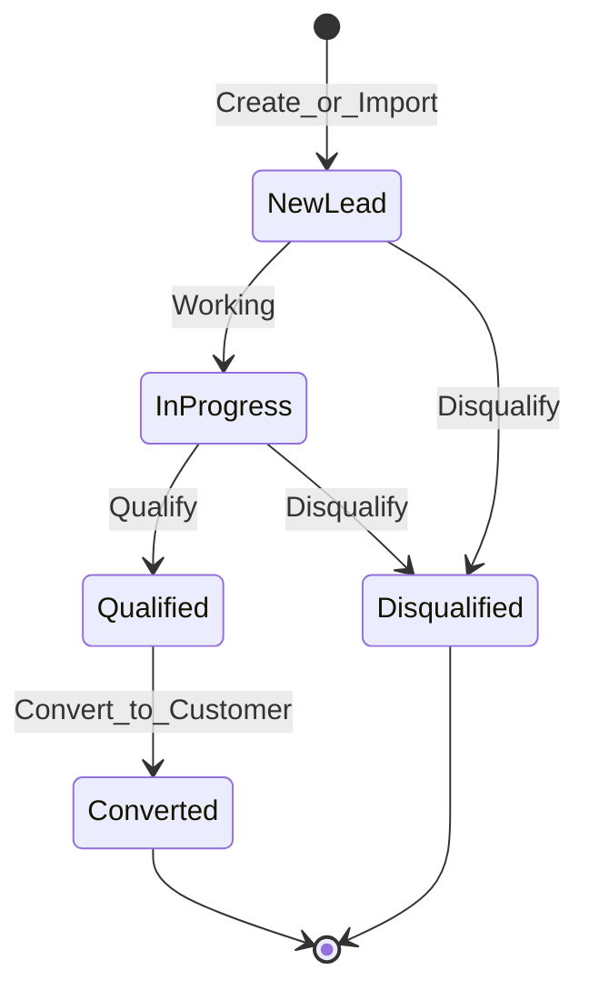
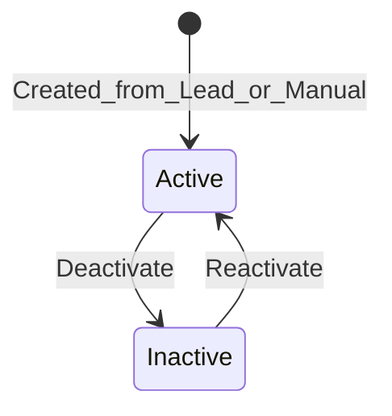
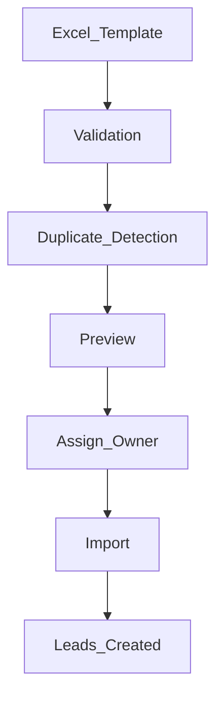
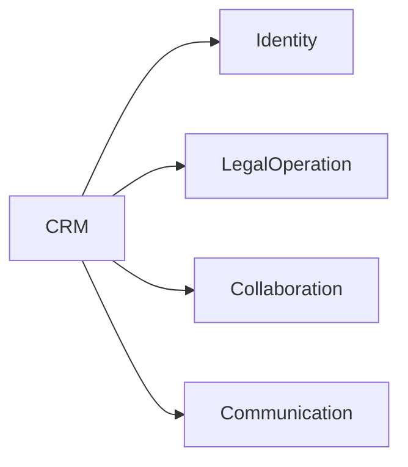
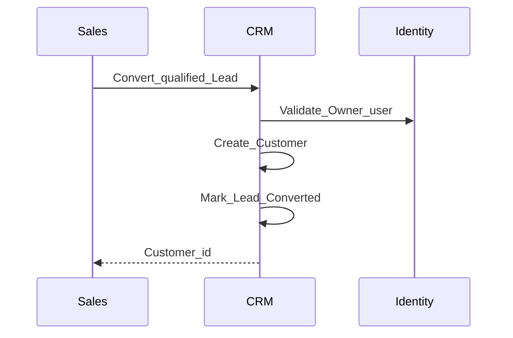
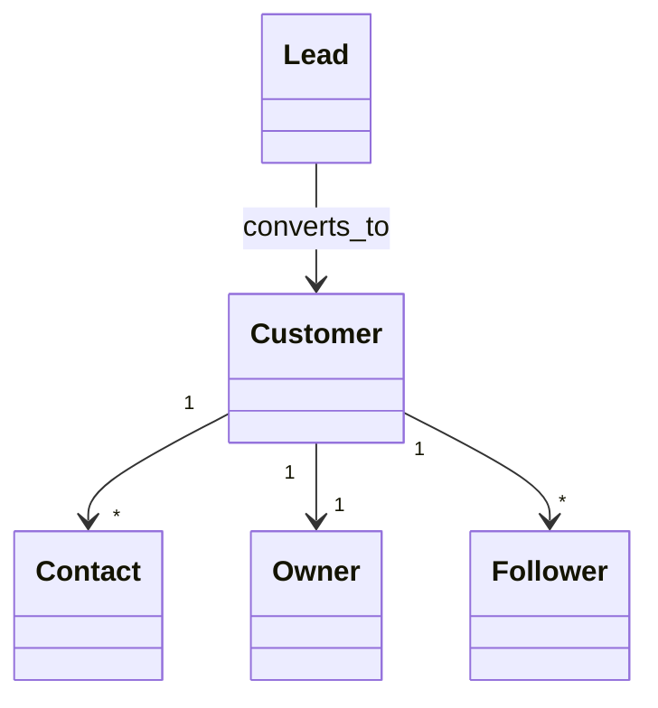

# CRM — DYN CRM

> Bản tiếng Việt của [CRM.md](./CRM.md). Canonical: English.

**2026-08-17:** Export khách theo (1) đã dùng dịch vụ / chưa, (2) lĩnh vực — năng lực vận hành, không BI. **OPEN:** “đã dùng dịch vụ” derive từ Contract/Order/Payment thế nào; catalog lĩnh vực. **Cột ngày** khách hàng: **không đoán** — Open Question (ngày tạo / ngày bắt đầu DV / ngày DV đầu / ngày sinh / ngày thành lập / khác). Portal CTV / khách gán **SUPERSEDED**.

## 1. Mục đích

Định nghĩa năng lực **CRM**: thu hút và quản lý Lead, convert sang Customer, Contact, phân công, follow-up, lịch sử hoạt động, nền tảng search/filter/analytics — không chi tiết triển khai.

## 2. Phạm vi

| Trong phạm vi | Ngoài phạm vi |
|---------------|---------------|
| Vòng đời Lead / Customer / Contact | Ban hành hợp đồng chính thức (LegalOperation) |
| Pipeline import Excel (MVP) | Engine metadata mapping |
| Owner / Followers, notes, timeline | Payment và commission |
| Nền tảng search/filter/analytics | Kho BI đầy đủ |

## 3. Năng lực nghiệp vụ

| Năng lực | MVP |
|----------|-----|
| Import Lead (mẫu Excel) | Có |
| Quản lý & qualify Lead | Có |
| Phân công Lead | Có |
| Quản lý Customer (Cá nhân / Công ty) | Có |
| Quản lý Contact | Có |
| Follow-up | Có |
| Timeline / hoạt động / ghi chú | Có |
| Search & filter | Có |
| Nền tảng analytics | Có (đếm/pipeline cơ bản) |

### Nguồn Lead (MVP)

Facebook, Google, Website, Landing Page, Referral, Excel, Manual.

## 4. Actor

| Actor | Vai trò CRM |
|-------|-------------|
| Sales | Tạo/qualify/convert/import chính |
| Manager | Giám sát, đổi Owner |
| Admin | Hỗ trợ cấu hình |
| Lawyer / Legal Assistant | Thường đọc/follow sau convert |
| Accounting | Đọc khi cần ngữ cảnh thanh toán |
| CTV | **Không full CRM** (Phase 00) |

## 5. Vòng đời nghiệp vụ

### 5.1 Lead → Customer

### 5.2 Customer

### 5.3 Import Excel (MVP)

**Điểm mở rộng:** mapping cột động sau này. **Không** làm metadata engine trong MVP.

## 6. Đối tượng nghiệp vụ chính

Lead, Customer, Contact, Owner, Follower, Note, Activity/Timeline, Import batch — định nghĩa như bản English.

## 7. Quy tắc nghiệp vụ

1. Lead ≠ Customer; convert tường minh.  
2. Customer: Individual | Company.  
3. Đúng một Owner; Follower tùy chọn.  
4. Phát hiện trùng trước khi commit import.  
5. Import phải gán Owner trước commit.  
6. Nguồn Referral có thể liên kết CTV sau (Open Questions).  
7. CTV không vào full CRM (Phase 00 / Security).

## 8. Ma trận permission

| Permission (minh họa) | Sales | Manager | Admin | Lawyer | CTV |
|----------------------|-------|---------|-------|--------|-----|
| `lead.read` | Y | Y | Y | Y | N |
| `lead.write` | Y | Y | Y | Hạn chế/Open Q | N |
| `lead.import` | Y | Y | Y | N | N |
| `lead.convert` | Y | Y | Y | Open Q | N |
| `customer.read` | Y | Y | Y | Y | N* |
| `customer.write` | Y | Y | Y | Open Q | N |

\*CTV chỉ thấy khách được gán nếu Collaboration được duyệt mở rộng.

## 9. Business Events

`LeadCreated`, `LeadAssigned`, `LeadQualified`, `LeadConverted`, `LeadDisqualified`, `CustomerCreated`, `CustomerOwnerChanged`, `ImportCompleted`, `NoteAdded` / `ActivityRecorded`.

## 10. Tương tác domain khác

## 11. Mở rộng tương lai

Mapping import động; merge trùng; tag lĩnh vực; kho analytics — sau MVP / khi có nhu cầu.

## 12. Sơ đồ Mermaid

## 13. Open Questions

1. Bộ status Lead đầy đủ?  
2. Khóa trùng (phone/email/…); soft vs hard?  
3. Mapping field Lead → Customer/Contact?  
4. Contact trên Lead trước convert?  
5. Quyền ghi Owner vs Follower?  
6. Lawyer được convert Lead?  
7. **Cột ngày** trên thông tin khách hàng là ngày nào? Chỉ ví dụ làm rõ — **không chọn hộ**: ngày tạo; ngày bắt đầu DV; ngày DV đầu; ngày sinh; ngày thành lập công ty; khác.  
8. “Đã dùng dịch vụ” derive thế nào nếu không unambiguous từ Contract/Order/Payment?  
9. Lĩnh vực: catalog cố định hay free text?

## 14. TODO

- [ ] Khóa enum status Lead  
- [ ] Khóa chính sách trùng  
- [ ] Khóa map convert  
- [ ] Công bố cột mẫu Excel  
- [x] Visibility khách CTV khớp khóa Collaboration (2026-08-03)

## 15. Aggregate Boundaries

| Aggregate Root | Con / thành phần | Quy tắc ranh giới |
|----------------|------------------|-------------------|
| **Lead** | Ghi chú Lead, timeline Lead, thành viên import-batch | Thay đổi Lead nằm trong Lead; convert *tạo* Customer |
| **Customer** | Contacts, notes, timeline, Followers | Đúng một Owner; Follower không sở hữu aggregate |
| **ImportBatch** | Dòng đã validate chờ commit | Batch sở hữu preview/trùng đến khi commit tạo Lead |

Contact không tồn tại như master mồ côi không có Customer (trừ khi Open Q cho phép contact trên Lead trước convert).

## 16. Domain Invariants

| ID | Invariant |
|----|-----------|
| CRM-I1 | Customer luôn có đúng **một** Owner |
| CRM-I2 | `type` Customer bắt buộc (Individual \| Company) |
| CRM-I3 | Lead không convert quá một lần |
| CRM-I4 | Lead đã Converted không convert lại |
| CRM-I5 | Lead và Customer là thực thể tách biệt |
| CRM-I6 | Commit import bắt buộc gán Owner |
| CRM-I7 | CTV không nhận truy cập CRM nhân sự không scoped |

## 17. Primary Business Use Cases

| ID | Use case |
|----|----------|
| UC01 | Import Lead (pipeline Excel) |
| UC02 | Tạo / cập nhật Lead thủ công |
| UC03 | Gán Lead / đổi Owner Customer |
| UC04 | Qualify / disqualify Lead |
| UC05 | Convert Lead → Customer |
| UC06 | Thêm / cập nhật Contact |
| UC07 | Thêm Note / Timeline |
| UC08 | Tìm / lọc Lead & Customer |
| UC09 | Follow Customer (Follower) |
| UC10 | Merge trùng (tương lai) |

## 18. Ownership Matrix

| Đối tượng | Domain sở hữu | Được tham chiếu bởi |
|-----------|---------------|---------------------|
| Lead | CRM | Collaboration, Communication |
| Customer | CRM | Legal, Finance, Collaboration |
| Contact | CRM | Legal (context) |
| ImportBatch | CRM | — |
| Note / Activity (CRM) | CRM | Communication (tuỳ chọn) |

## 19. Domain Event Matrix

| Event | Producer | Consumers |
|-------|----------|-----------|
| `LeadCreated` | CRM | Communication |
| `LeadAssigned` | CRM | Communication |
| `LeadQualified` | CRM | Communication (tuỳ chọn) |
| `LeadConverted` | CRM | Legal, Communication, Dashboard |
| `LeadDisqualified` | CRM | Communication (tuỳ chọn) |
| `CustomerCreated` | CRM | Collaboration, Communication |
| `CustomerOwnerChanged` | CRM | Communication |
| `ImportCompleted` | CRM | Communication (tuỳ chọn) |

## 20. Business Constraints

| Ràng buộc |
|-----------|
| Lead đã Converted không xóa cứng tùy tiện — giữ lịch sử terminal |
| Customer gắn Official Contract nên deactivate, không xóa cứng tùy tiện |
| ImportBatch đã commit không mở lại như cùng batch preview |
| Đổi Owner là hành động nghiệp vụ tường minh |

## 21. Dynamic Features

| Tính năng | Lập trường MVP |
|-----------|----------------|
| Nguồn Lead | Danh sách cố định; mở rộng cấu hình sau |
| Import Excel | Template cố định; điểm mở mapping động — **không** metadata engine |
| Analytics | Chỉ metrics nền (§22) |

## 22. Business Metrics

| Metric | Mục đích |
|--------|----------|
| Tỷ lệ convert Lead | Sức khỏe pipeline |
| Phân bố nguồn | Mix kênh |
| Tỷ lệ follow-up / activity | Kỷ luật bán hàng |
| Lead mở theo owner | Workload |
| Import thành công vs trùng | Chất lượng dữ liệu |

## 23. Cross Domain Dependency

| | Domain |
|--|--------|
| **Phụ thuộc** | Identity |
| **Cung cấp cho** | Legal (Customer), Finance (Customer), Collaboration, Communication |
| **Không sở hữu** | Vòng đời Contract, Payment, Commission |
