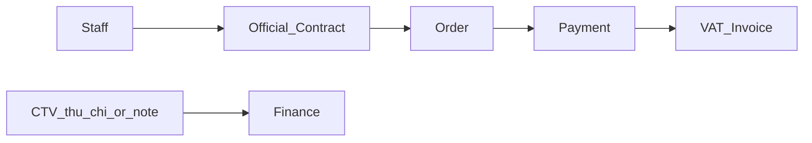
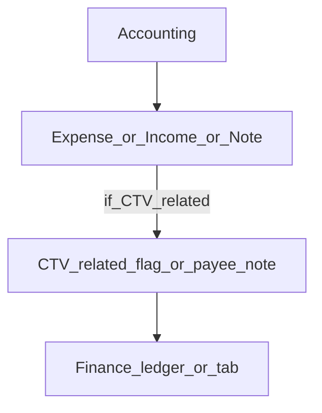

# Collaboration — DYN CRM

> Vietnamese version: [Collaboration.vi.md](./Collaboration.vi.md)

## Scope change — 2026-08-17 (RE-LOCK REQUIRED)

Stakeholder feedback: **remove CTV-specific operational information**; record only a **thu/chi (income/expense) entry / note related to CTV** when money is involved.

This **conflicts** with the Collaboration expansion locked on 2026-08-03. The 2026-08-03 portal model is **SUPERSEDED for implementation**. It is retained as a historical record in the Appendix so the change is explicit — **do not implement the portal**.

| Previous capability (2026-08-03) | 2026-08-17 proposed stance |
|----------------------------------|----------------------------|
| CTV portal login | **Removed** unless re-approved |
| Assigned customers | **Removed** |
| Contract Request + staff approval | **Removed** |
| Referral attribution model | **Removed** |
| Own-commission portal visibility | **Removed** (Finance may still record money) |
| Collaborator profile / `COLLABORATOR` role | **Removed** unless Identity re-approves |
| Dedicated Collaboration operational domain | **Not in Phase 03 aggregate order** unless re-confirmed |
| CTV-related money | **Finance** income/expense entry or note only |

**Ambiguity kept (do not invent accounting semantics):** “khoản thu chi cho CTV” does not specify whether the entry is **Thu (income)**, **Chi (expense)**, both, or a non-posting note. See Finance Open Questions.

Until stakeholders **re-lock** this change into Phase 00 Scope, treat Collaboration as **out of the implementation path**.

---

## 1. Purpose

Record the **simplified CTV stance** after 2026-08-17: no operational CTV domain in MVP unless re-approved. CTV-related money, if any, is a Finance concern.

## 2. Scope

| In scope (proposed MVP) | Out of scope (proposed MVP) |
|-------------------------|-----------------------------|
| Pointer to Finance for CTV-related thu/chi | CTV portal |
| Explicit list of removed capabilities | Assigned customers, Contract Request, referral graph |
| Historical 2026-08-03 model (appendix) | BPMN, CTV networks, KYC onboarding |

## 3. Business Capability (proposed)

| Capability | Status |
|------------|--------|
| CTV as a first-class operational actor | **Deferred / removed pending re-lock** |
| CTV money as Finance Chi/Thu or note | **Proposed** — semantics **OPEN** |
| Staff create Official Contract | Unchanged (LegalOperation) |

No CTV portal in this flow.

## 4. Actors

| Actor | Stance after 2026-08-17 |
|-------|-------------------------|
| Staff (Sales, Lawyer, Accounting, Admin) | Own CRM / Legal / Finance as before |
| Collaborator (CTV) as login principal | **Not assumed** until re-approved |
| Named expense approver (“Nhi”) | Finance approval — not a CTV actor |

## 5. Business Lifecycle

None for Collaboration in the proposed MVP. Official Contract lifecycle stays in LegalOperation. Money lifecycle stays in Finance.

## 6. Main Business Objects

| Object | Owner after re-lock | Notes |
|--------|---------------------|-------|
| CTV thu/chi or note | **Finance** | Exact object **OPEN** |
| Collaborator Profile | **Not modeled** unless re-approved | |
| Contract Request | **Not modeled** unless re-approved | |
| Referral Attribution | **Not modeled** unless re-approved | |

## 7. Business Rules

1. Do not implement CTV portal, assigned-customer scope, or Contract Request until Scope is re-locked **back** to the 2026-08-03 model.  
2. Do not store CTV operational masters “just in case.”  
3. If a CTV payment must be recorded, use Finance Chi/Thu (or note) — do not recreate a Collaboration aggregate.  
4. Commission as a **calculated partner payout object** is **not confirmed** by 2026-08-17 feedback — Finance re-lock.

## 8. Permission Matrix

No CTV portal permissions in the proposed MVP. Staff Finance permissions cover thu/chi (see Finance.md). Expense approval (“Nhi”) is a Finance/Identity Open Question.

## 9. Business Events

| Event | Status |
|-------|--------|
| `ContractRequestSubmitted` / `Approved` / `Rejected` | **Do not emit** unless Collaboration is re-approved |
| `CommissionVisibleToCtv` | **Do not emit** unless portal is re-approved |
| Finance expense/income events | Owned by Finance |

## 10. Interaction with Other Domains

| Domain | Interaction (proposed) |
|--------|------------------------|
| Finance | Only remaining CTV touch: thu/chi or note |
| LegalOperation | Staff-created Official Contract; **no** request handoff |
| CRM | **No** assigned-customer or mandatory referral link |
| Identity | `COLLABORATOR` role **not** required unless re-approved |
| Communication | No CTV portal inbox |

## 11. Future Extension

If stakeholders later re-approve a portal, restore Appendix capabilities behind a new Scope revision — do not silently revive them in Prisma now.

## 12. Mermaid Diagrams

### 12.1 Proposed money-only CTV touch

Exact shape is a Finance Open Question.

## 13. Open Questions

1. Confirm **removal** of CTV portal / Contract Request / assigned customers / Collaborator role (schema-critical).  
2. Is “khoản thu chi cho CTV” an **Expense**, **Income**, both, or a **non-posting note**?  
3. Is a payee name/free text enough, or is a CTV master still required?  
4. Does **Commission** remain a first-class Finance object for staff (e.g. lawyer %) or is it dropped with the portal?

## 14. TODO

- [ ] Stakeholder re-lock S6 into Phase 00 Scope (EN/VI)  
- [x] Mark 2026-08-03 Collaboration expansion as SUPERSEDED for implementation (2026-08-17)  
- [ ] After re-lock: remove `COLLABORATOR` from Glossary roles **or** restore portal  
- [ ] Exclude Collaboration from Phase 03 aggregate order until re-confirmed  

## 15–23. Architectural reference (proposed MVP)

| § | Content |
|---|---------|
| 15 Aggregate Boundaries | **None** for Collaboration in proposed MVP |
| 16 Invariants | Do not implement removed portal invariants |
| 17 Use cases | None (Finance records CTV-related thu/chi) |
| 18 Ownership | CTV money → Finance |
| 19 Events | None from this domain |
| 20 Constraints | Do not ship portal tables |
| 21 Dynamic features | None |
| 22 Metrics | N/A |
| 23 Depends on / Provides to | Depends on Finance decision; provides nothing |

---

## Appendix A — Historical model (2026-08-03) — SUPERSEDED — DO NOT IMPLEMENT

Locked 2026-08-03 and **must not** be copied into Prisma while S6 stands:

- Collaborator profile linked to Identity User (`COLLABORATOR`)
- Limited portal: referrals, **assigned customers**, Contract Request, own commission, profile
- Contract Request states: Draft → Submitted → InReview → Approved / Rejected / NeedsInfo
- Staff approval required before Official Contract
- CTV cannot create Official Contract or access staff CRM/Legal/Finance
- Events: `ContractRequestSubmitted`, `ContractRequestApproved`, `ContractRequestRejected`, `OfficialContractCreatedFromRequest`, `CommissionVisibleToCtv`
- Open Questions at that time: referral anchor, who approves, request fields, assignment rules

Full prior section text lived in this file before 2026-08-17 and remains recoverable from git history.
