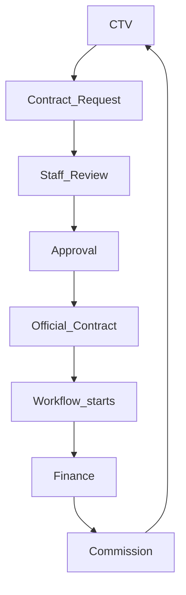
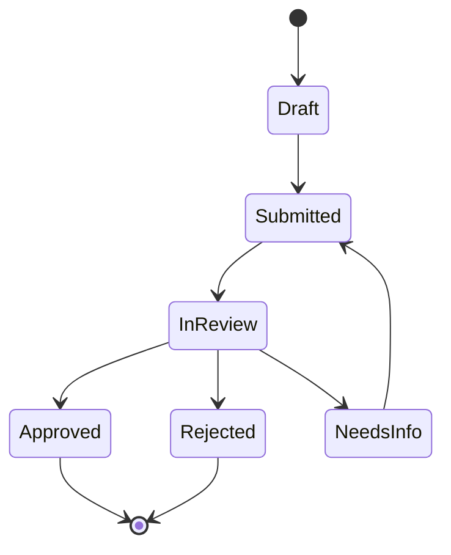
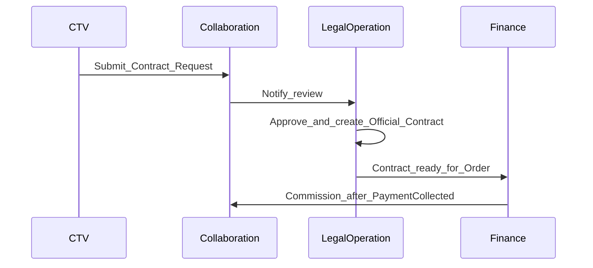
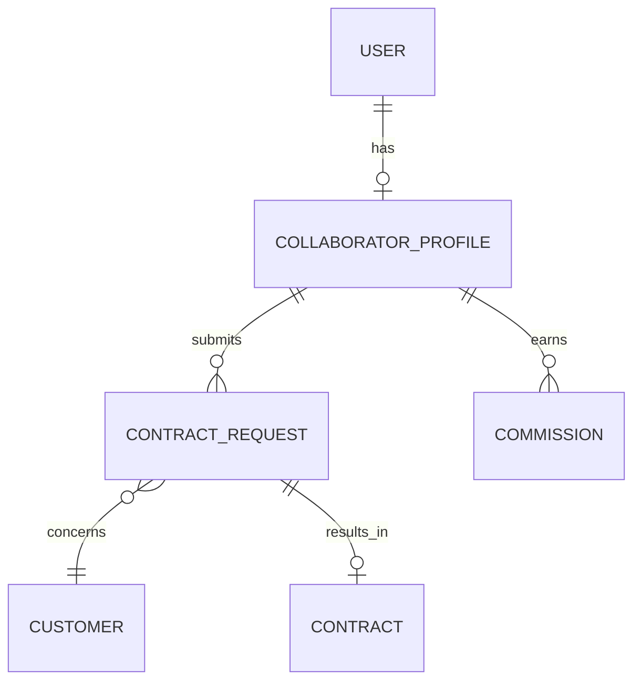
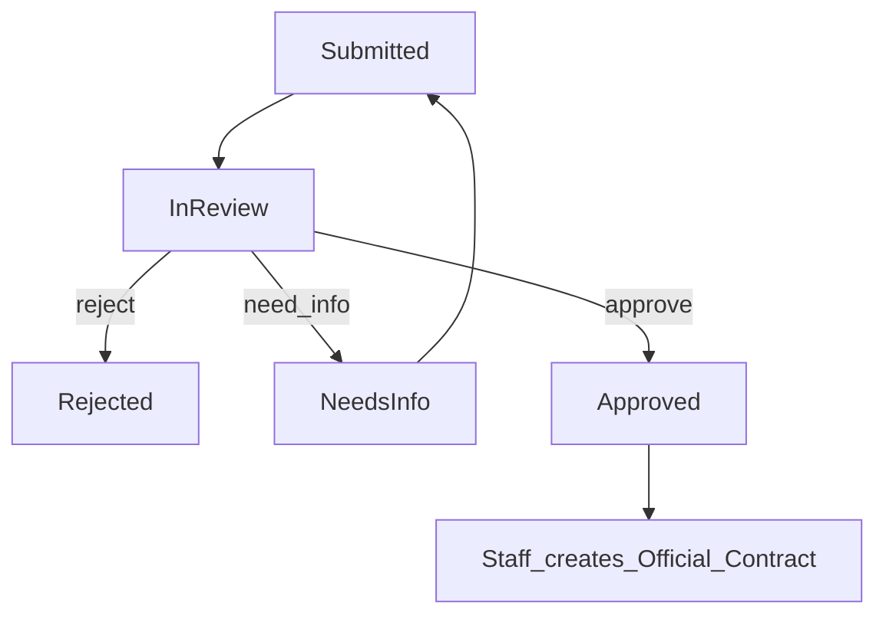

# Collaboration — DYN CRM

> Vietnamese version: [Collaboration.vi.md](./Collaboration.vi.md)

## 1. Purpose

Define the **Collaboration** capability: how internal staff partner with **Collaborators (CTV)** — external referral partners with a limited portal — including contract requests that become official contracts only after staff approval.

## 2. Scope

| In scope | Out of scope |
|----------|--------------|
| CTV portal business capabilities | Full CRM for CTV |
| Contract Request lifecycle | CTV creating official Contract unilaterally |
| Handoff into LegalOperation / Finance / Commission | BPMN for partner flows |

## 3. Business Capability

| Capability | Description | Status |
|------------|-------------|--------|
| CTV identity | Login via Identity; role `COLLABORATOR` | Locked |
| Limited portal | Restricted surfaces only (not full CRM) | Locked |
| Assigned customers | Manage customers **assigned** to the CTV (scoped) | **Locked 2026-08-03** (Collaboration expansion) |
| Contract Request | CTV submits request; staff review/approve before Official Contract | **Locked 2026-08-03** |
| Commission visibility | View own commission (Finance event) | Locked |
| Profile | Update own profile | Locked |

CTV **cannot** create Official Contracts unilaterally or access staff CRM/Legal/Finance modules.
## 4. Actors

| Actor | Type | Notes |
|-------|------|-------|
| Collaborator (CTV) | External | Not an employee |
| Sales / Lawyer / Admin | Internal | Review and approve requests |
| Accounting | Internal | Commission after collected payment |

## 5. Business Lifecycle

### 5.1 Target partner → money flow

### 5.2 Contract Request states (proposed)

Approved request enables staff to create **Official Contract** in LegalOperation (CTV still cannot publish the official contract alone).

## 6. Main Business Objects

| Object | Meaning |
|--------|---------|
| Collaborator profile | CTV business profile linked to Identity User |
| Referral attribution | Link between CTV and Lead/Customer/Request (exact anchor → Open Q) |
| Contract Request | CTV-initiated request for a potential engagement |
| Request attachment | Files submitted with request (via StoragePort later) |

## 7. Business Rules

1. CTV is **not** an employee (Phase 00 / Glossary).  
2. CTV **cannot** create official Contracts (this document + LegalOperation).  
3. Commission remains based on **collected payment** (Phase 00) — Collaboration does not redefine the formula.  
4. Portal remains permission-scoped; no staff CRM APIs (Security).  
5. Staff approval is mandatory between Contract Request and Official Contract.  
6. Do not grant full CRM module to CTV “for convenience.”

## 8. Permission Matrix

| Permission (illustrative) | CTV | Sales | Lawyer | Admin | Accounting |
|---------------------------|-----|-------|--------|-------|------------|
| `portal.login` | Y | — | — | — | — |
| `ctv.profile.update` | Y | N | N | Y | N |
| `ctv.referral.read_own` | Y | Y* | Y* | Y | Y* |
| `ctv.commission.read_own` | Y | N | N | Y | Y |
| `contract_request.create` | Y | — | — | — | — |
| `contract_request.review` | N | Y | Y | Y | N |
| `contract_request.approve` | N | Open Q | Y | Y | N |
| `customer.read_assigned_ctv` | Y | — | — | — | — |
| `customer.write_assigned_ctv` | Y (scoped) | — | — | — | — |

\*Staff visibility into referrals for operations — exact scope Open Question.

## 9. Business Events

| Event | When |
|-------|------|
| `ContractRequestSubmitted` | CTV submits |
| `ContractRequestApproved` | Staff approves |
| `ContractRequestRejected` | Staff rejects |
| `OfficialContractCreatedFromRequest` | LegalOperation creates contract |
| `CommissionVisibleToCtv` | After Finance calculates from payment |

## 10. Interaction with Other Domains

| Domain | Interaction |
|--------|-------------|
| Identity | CTV user + role |
| CRM | Customer / referral anchors |
| LegalOperation | Official Contract after approval |
| Finance | Commission from collected payment |
| Communication | Request status notifications |

## 11. Future Extension

| Item | Notes |
|------|-------|
| Tier / shared / team commission | Phase 00 roadmap |
| CTV multi-level networks | Out of MVP |
| Self-serve onboarding KYC | Open Question |

## 12. Mermaid Diagrams

### 12.1 Permission relationship (conceptual)

### 12.2 Rejection path

## 13. Open Questions

1. Referral attribution anchor: Lead, Customer, Contract Request, Contract, and/or Payment?  
2. Who may approve Contract Requests besides Lawyer/Admin (may Sales approve)?  
3. Required fields on Contract Request?  
4. Can one request spawn multiple Contracts?  
5. CTV onboarding: admin invite only?  
6. Exact rules for “assigned customer” (who assigns; can CTV create Customer)?

## 14. TODO

- [x] Stakeholder accepted Collaboration expansion vs original Phase 00 portal (2026-08-03)  
- [x] Scope.md / Scope.vi.md updated  
- [ ] Lock referral attribution model  
- [ ] Lock Contract Request field list & statuses  
- [ ] Lock assigned-customer assignment rules  
