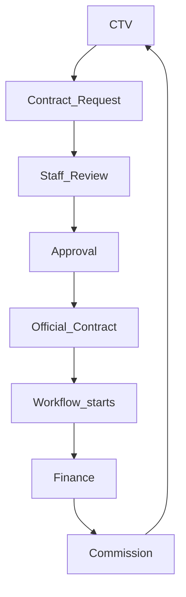
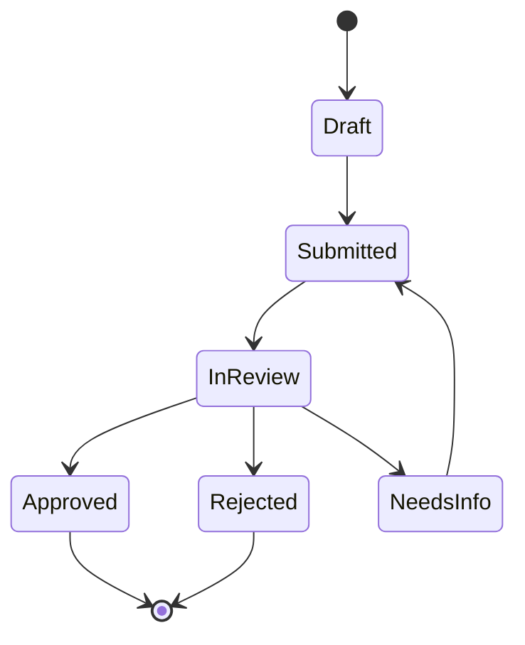

# Collaboration — DYN CRM

> Bản tiếng Việt của [Collaboration.md](./Collaboration.md). Canonical: English.

## 1. Mục đích

Định nghĩa năng lực **Collaboration**: nhân sự hợp tác với **CTV** qua portal hạn chế — gồm khách được gán và Contract Request (đã khóa mở rộng 2026-08-03).

## 2. Phạm vi

| Trong phạm vi | Ngoài phạm vi |
|---------------|---------------|
| Năng lực portal CTV | Full CRM cho CTV |
| Vòng đời Contract Request | CTV tự tạo Official Contract một mình |
| Bàn giao Legal / Finance / Commission | BPMN luồng đối tác |

## 3. Năng lực nghiệp vụ (đã khóa)

| Năng lực | Mô tả | Trạng thái |
|----------|-------|------------|
| Identity CTV | Login qua Identity; role `COLLABORATOR` | Locked |
| Portal hạn chế | Chỉ bề mặt được phép (không full CRM) | Locked |
| Khách được gán | Quản lý khách **được gán** cho CTV (scoped) | **Locked 2026-08-03** |
| Contract Request | CTV gửi; staff duyệt trước Official Contract | **Locked 2026-08-03** |
| Xem hoa hồng | Xem hoa hồng của mình (event Finance) | Locked |
| Profile | Cập nhật profile của mình | Locked |

CTV **không** tự tạo Official Contract; không vào module CRM/Legal/Finance nhân sự.

## 4. Actor

| Actor | Loại | Ghi chú |
|-------|------|---------|
| Collaborator (CTV) | Ngoài | Không phải nhân viên |
| Sales / Lawyer / Admin | Nội bộ | Duyệt request |
| Accounting | Nội bộ | Commission sau tiền đã thu |

## 5. Vòng đời nghiệp vụ

### 5.1 Luồng đối tác → tiền

### 5.2 Trạng thái Contract Request (đề xuất)

Request đã duyệt cho phép staff tạo **Official Contract** trong LegalOperation (CTV vẫn không tự publish).

## 6. Đối tượng nghiệp vụ chính

| Đối tượng | Ý nghĩa |
|-----------|---------|
| Collaborator profile | Hồ sơ CTV gắn User Identity |
| Referral attribution | Liên kết CTV ↔ Lead/Customer/Request (neo chính xác → Open Q) |
| Contract Request | Yêu cầu CTV khởi tạo cho engagement tiềm năng |
| Request attachment | File kèm request (qua StoragePort sau) |

## 7. Quy tắc nghiệp vụ

1. CTV **không** phải nhân viên (Phase 00 / Glossary).  
2. CTV **không** tạo Official Contract.  
3. Hoa hồng vẫn dựa **tiền đã thu** (Phase 00) — Collaboration không đổi công thức.  
4. Portal scoped permission; không API CRM nhân sự (Security).  
5. Bắt buộc staff duyệt giữa Contract Request và Official Contract.  
6. Không cấp full CRM cho CTV “cho tiện”.

## 8. Ma trận permission

| Permission (minh họa) | CTV | Sales | Lawyer | Admin | Accounting |
|-----------------------|-----|-------|--------|-------|------------|
| `portal.login` | Y | — | — | — | — |
| `ctv.profile.update` | Y | N | N | Y | N |
| `ctv.referral.read_own` | Y | Y* | Y* | Y | Y* |
| `ctv.commission.read_own` | Y | N | N | Y | Y |
| `contract_request.create` | Y | — | — | — | — |
| `contract_request.review` | N | Y | Y | Y | N |
| `contract_request.approve` | N | Open Q | Y | Y | N |
| `customer.read_assigned_ctv` | Y | — | — | — | — |
| `customer.write_assigned_ctv` | Y (scoped) | — | — | — | — |

\*Staff xem referral vận hành — phạm vi chính xác Open Question.

## 9. Business Events

| Event | Khi |
|-------|-----|
| `ContractRequestSubmitted` | CTV gửi |
| `ContractRequestApproved` | Staff duyệt |
| `ContractRequestRejected` | Staff từ chối |
| `OfficialContractCreatedFromRequest` | Legal tạo contract |
| `CommissionVisibleToCtv` | Sau khi Finance tính từ payment |

## 10. Tương tác domain khác

| Domain | Tương tác |
|--------|-----------|
| Identity | User CTV + role |
| CRM | Neo Customer / referral |
| LegalOperation | Official Contract sau duyệt |
| Finance | Commission từ tiền đã thu |
| Communication | Thông báo trạng thái request |

## 11. Mở rộng tương lai

| Mục | Ghi chú |
|-----|---------|
| Hoa hồng tier / shared / team | Roadmap Phase 00 |
| Mạng CTV đa cấp | Ngoài MVP |
| Onboarding KYC self-serve | Open Question |

## 12. Sơ đồ Mermaid

Giữ sơ đồ như bản English (§12.1 permission relationship, §12.2 rejection path).

## 13. Open Questions

1. Neo attribution referral: Lead, Customer, Contract Request, Contract, và/hoặc Payment?  
2. Ai được approve Request ngoài Lawyer/Admin (Sales?).  
3. Field bắt buộc trên Contract Request?  
4. Một request → nhiều Contract?  
5. Onboarding CTV: chỉ admin invite?  
6. Rule “khách được gán” (ai gán; CTV có tạo Customer không)?

## 14. TODO

- [x] Stakeholder chấp nhận mở rộng Collaboration (2026-08-03)  
- [x] Cập nhật Scope  
- [ ] Khóa mô hình attribution referral  
- [ ] Khóa field & status Contract Request  
- [ ] Khóa rule gán khách cho CTV  

## 15. Aggregate Boundaries

| Aggregate Root | Con / thành phần | Quy tắc ranh giới |
|----------------|------------------|-------------------|
| **Collaborator Profile** | Link identity portal, field hồ sơ | Gắn User Identity role CTV |
| **Contract Request** | Attachment, ghi chú duyệt, status | Collaboration sở hữu đến khi Official Contract ở Legal |
| **Referral Attribution** | Link CTV ↔ Lead/Customer/Request (Open Q) | Collaboration sở hữu ngữ nghĩa attribution |
| **Assigned Customer scope** | Gán CTV ↔ Customer | Chỉ scope đọc/ghi — master Customer thuộc CRM |

## 16. Domain Invariants

| ID | Invariant |
|----|-----------|
| COL-I1 | CTV không tự tạo Official Contract |
| COL-I2 | Bắt buộc staff duyệt giữa Request và Official Contract |
| COL-I3 | CTV không nhận CRM / Legal / Finance nhân sự không scoped |
| COL-I4 | CTV chỉ xem hoa hồng **của mình**; công thức thuộc Finance |
| COL-I5 | Truy cập khách được gán là scoped — không phải cả thư mục Customer |

## 17. Primary Business Use Cases

| ID | Use case |
|----|----------|
| UC01 | CTV login / cập nhật profile |
| UC02 | Xem / quản lý khách được gán (scoped) |
| UC03 | Gửi Contract Request |
| UC04 | Staff review / yêu cầu bổ sung |
| UC05 | Duyệt / từ chối Contract Request |
| UC06 | Staff tạo Official Contract từ duyệt |
| UC07 | CTV xem hoa hồng của mình |
| UC08 | Xem referral của mình (theo mô hình attribution) |

## 18. Ownership Matrix

| Đối tượng | Domain sở hữu | Được tham chiếu bởi |
|-----------|---------------|---------------------|
| Collaborator Profile | Collaboration | Identity |
| Contract Request | Collaboration | LegalOperation, Communication |
| Referral Attribution | Collaboration | CRM, Finance (context) |
| Assigned Customer link | Collaboration | CRM (master Customer) |
| Official Contract | LegalOperation | Collaboration (chỉ nguồn gốc) |
| Commission | Finance | Collaboration (đọc) |

## 19. Domain Event Matrix

| Event | Producer | Consumers |
|-------|----------|-----------|
| `ContractRequestSubmitted` | Collaboration | Legal (notify), Communication |
| `ContractRequestApproved` | Collaboration | Legal, Communication |
| `ContractRequestRejected` | Collaboration | Communication |
| `OfficialContractCreatedFromRequest` | LegalOperation | Collaboration, Communication |
| `CommissionVisibleToCtv` | Finance | Collaboration, Communication |

## 20. Business Constraints

| Ràng buộc |
|-----------|
| Request đã duyệt không tự publish Official Contract nếu chưa có hành động Legal của staff |
| Request bị Rejected không mở lại Approved nếu chưa đi path gửi lại |
| CTV không duyệt toàn bộ Customer chưa gán |
| Collaboration không đổi base hoa hồng (tiền đã thu) |

## 21. Dynamic Features

| Tính năng | Lập trường |
|-----------|------------|
| Bề mặt portal | Catalog MVP cố định (khách gán, request, hoa hồng, profile) |
| Status request | Label cấu hình sau; MVP đề xuất ở §5.2 |
| Mô hình attribution | Phải khóa trước Phase 03 (Open Q) |

## 22. Business Metrics

| Metric | Mục đích |
|--------|----------|
| CTV đang active | Năng lực đối tác |
| Request gửi / duyệt / từ chối | Funnel |
| Convert Request → Official Contract | Hiệu quả đối tác |
| Commission tới CTV | Khối lượng chi trả |
| Khách gán / CTV | Cân bằng workload |

## 23. Cross Domain Dependency

| | Domain |
|--|--------|
| **Phụ thuộc** | Identity, CRM (Customer), Finance (đọc commission), Legal (tạo contract sau duyệt) |
| **Cung cấp cho** | Legal (Request đã duyệt), Communication |
| **Không sở hữu** | Official Contract, Payment, vòng đời master Customer |
