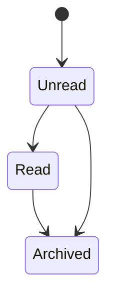
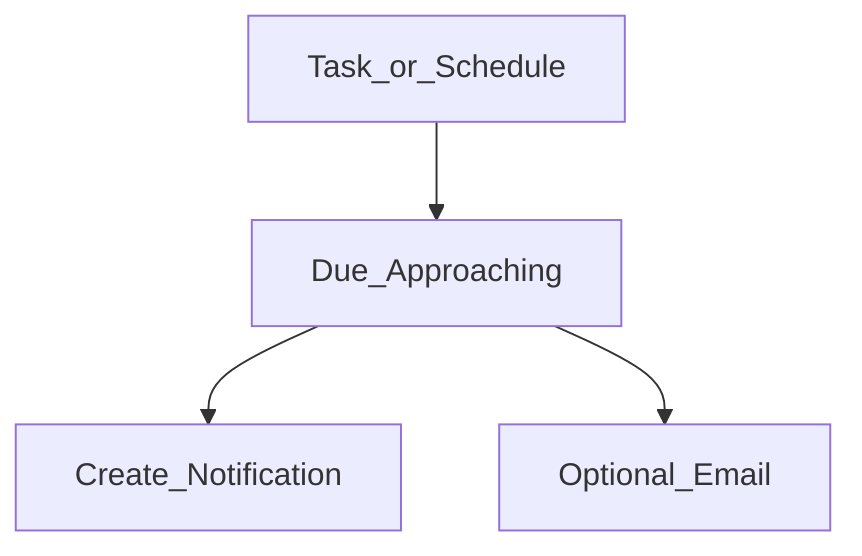
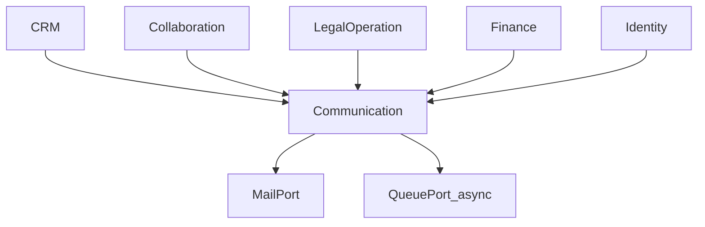
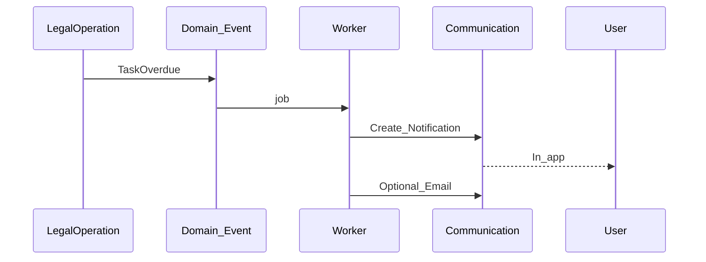
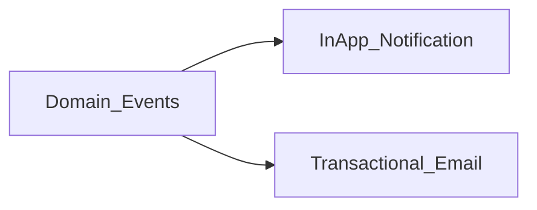

# Communication — DYN CRM

> Vietnamese version: [Communication.vi.md](./Communication.vi.md)

## 1. Purpose

Define the **Communication** capability: internal notifications/reminders/workflow alerts and external transactional email — **not** marketing automation.

## 2. Scope

| In scope | Out of scope |
|----------|--------------|
| In-app Notification | Marketing campaigns / automation |
| Reminder (tasks, schedules) | SMS / Zalo (unless later scoped) |
| Workflow notifications | Push mobile OS (unless later) |
| Transactional Email (Resend via MailPort) | Newsletter blasts |

## 3. Business Capability

### Internal

| Capability | Trigger examples |
|------------|------------------|
| Notification | Assignment, request status, payment recorded |
| Reminder | Task due, payment schedule due |
| Workflow notification | Stage entered, requirement blocked |

### External

| Capability | Trigger examples |
|------------|------------------|
| Email | Auth-related, payment receipts (if approved), staff digests |
| Customer notification | Only if product later allows customer email — Open Question |

## 4. Actors

| Actor | Inbox |
|-------|-------|
| All authenticated users | Own notifications |
| CTV | Own portal notifications only |
| System / Worker | Emits messages via events |

Customers are **not** assumed to have logins in MVP (BusinessCapabilityMap Open Question).

## 5. Business Lifecycle

### Notification

### Reminder

## 6. Main Business Objects

| Object | Meaning |
|--------|---------|
| Notification | In-app alert for a user |
| Reminder | Time-based intent tied to Task/Schedule |
| Email message (outbound log) | Record that MailPort was invoked |
| Notification preference | Optional per-user settings — Open Question for MVP depth |

## 7. Business Rules

1. No marketing automation in MVP (brief).  
2. Notifications are event-driven from CRM / Collaboration / Legal / Finance / Identity.  
3. Reminders support Workflow tasks and may support payment schedule dues (Finance).  
4. Email goes through MailPort (Resend adapter) — domain does not couple to vendor (Phase 01).  
5. CTV only receives notifications allowed by portal permissions.  
6. Do not put secrets in email/notification bodies.

## 8. Permission Matrix

| Permission (illustrative) | All users | Admin | CTV |
|---------------------------|-----------|-------|-----|
| `notification.read_own` | Y | Y | Y |
| `notification.manage_all` | N | Y | N |
| `email.template.manage` | N | Y | N |

## 9. Business Events (consumed)

| Upstream event | Communication action |
|----------------|----------------------|
| `LeadAssigned` | Notify assignee |
| `ContractRequestSubmitted` | Notify reviewers |
| `ContractStatusChanged` | Notify watchers / owner |
| `TaskOverdue` | Reminder + notify assignee |
| `PaymentCollected` | Notify accounting / CTV commission ready |
| `UserInvited` | Email invite (if used) |

## 10. Interaction with Other Domains

Delivery is typically async via worker (Phase 01).

## 11. Future Extension

| Item | Notes |
|------|-------|
| Customer-facing email templates | If customers remain non-users |
| SMS / Zalo | New channel ports |
| Digest emails | Manager daily summary |
| Marketing automation | Explicitly rejected for now |

## 12. Mermaid Diagrams

### 12.1 Event to inbox

### 12.2 Channels

## 13. Open Questions

1. Which emails are mandatory in MVP (auth only vs payment receipts vs request updates)?  
2. User notification preferences in MVP or later?  
3. Are Customers emailed without portal accounts?  
4. Retention period for notifications?  
5. Real-time transport (polling vs websocket) — implementation choice; prefer Open Question only if product cares.

## 14. TODO

- [ ] Lock MVP email template list with product  
- [ ] Lock which events create in-app vs email  
- [ ] Confirm CTV notification catalog  
- [ ] Confirm reminder lead times (e.g. 24h before due)  
