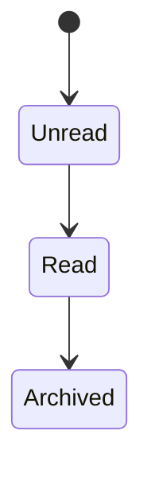
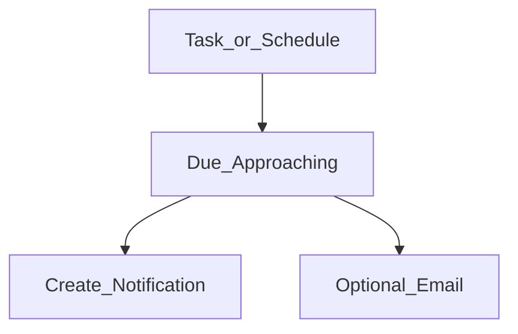
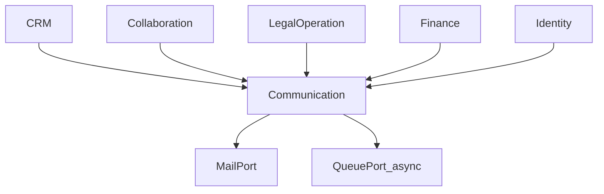
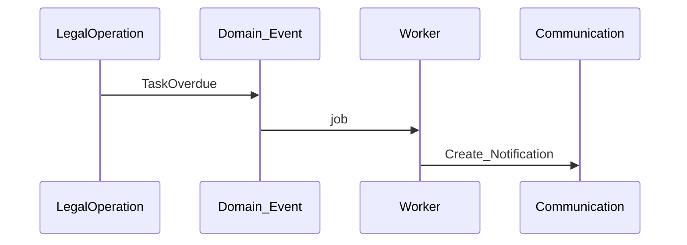

# Communication — DYN CRM

> Bản tiếng Việt của [Communication.md](./Communication.md). Canonical: English.

**2026-08-17:** Alert hóa đơn (`InvoiceIssued`; `InvoiceDueSoon` chỉ nếu có hạn; `InvoiceOverdue` OPEN). Alert hết hạn Order (N tháng, cấu hình). Finance/Legal **không** gửi notification — chỉ emit event. Inbox portal CTV **gỡ** trừ khi Collaboration khôi phục.

## 1. Mục đích

Định nghĩa năng lực **Communication**: notification/reminder/cảnh báo workflow nội bộ và email transactional bên ngoài — **không** marketing automation.

## 2. Phạm vi

In-app Notification; Reminder; Workflow notification; Email qua MailPort. Ngoài: marketing; SMS/Zalo (chưa scope); push mobile (chưa).

## 3. Năng lực

**Nội bộ:** Notification, Reminder, Workflow notification.  
**Ngoài:** Email transactional; thông báo khách chỉ nếu product cho phép sau (Open Question).

## 4. Actor

Mọi user đã login (hộp thư của mình); CTV chỉ notification portal; System/Worker phát event.

## 5. Vòng đời

## 6. Đối tượng chính

Notification, Reminder, Email outbound log, Notification preference (độ sâu MVP = Open Question).

## 7. Quy tắc

Không marketing; event-driven; reminder cho task và có thể lịch thanh toán; email qua MailPort; CTV theo permission portal; không secret trong nội dung.

## 8. Permission

`notification.read_own` (mọi user); `notification.manage_all` / `email.template.manage` (Admin).

## 9. Events tiêu thụ

`LeadAssigned`, `ContractRequestSubmitted`, `ContractStatusChanged`, `TaskOverdue`, `PaymentCollected`, `UserInvited`, …

## 10. Tương tác

## 11. Mở rộng

Email khách; SMS/Zalo; digest; marketing (từ chối hiện tại).

## 12. Sơ đồ

## 13. Open Questions

1. Email bắt buộc MVP nào?  
2. Preference thông báo trong MVP?  
3. Email khách khi chưa có portal?  
4. Retention notification?  
5. Realtime vs polling — chỉ hỏi nếu product quan tâm.

## 14. TODO

- [ ] Khóa danh sách template email MVP  
- [ ] Khóa event → in-app vs email  
- [ ] Khóa người nhận alert hóa đơn + hết hạn Order (in-app vs email)  
- [x] Catalog notification CTV — gỡ trừ khi S6 đảo (2026-08-17)  
- [ ] Lead time reminder (task vd. 24h; Order expiry = N tháng từ config Finance)  

## 15. Aggregate Boundaries

| Aggregate Root | Con / thành phần | Quy tắc ranh giới |
|----------------|------------------|-------------------|
| **Notification** | Trạng thái đọc/lưu trữ; user nhận | Sở hữu theo inbox từng user |
| **Reminder** | Ref nguồn (Task/Schedule), cửa sổ hạn | Ý định thông báo — không sở hữu Task/Schedule |
| **Outbound Email log** | Template key, người nhận, trạng thái gửi | Ghi nhận gọi MailPort |
| **Notification preference** | Tuỳ chọn theo user | Open Q về độ sâu MVP |

## 16. Domain Invariants

| ID | Invariant |
|----|-----------|
| COM-I1 | Không marketing automation trong MVP |
| COM-I2 | Notification theo event — Communication không bịa state nghiệp vụ upstream |
| COM-I3 | Không đưa secret vào body notification/email |
| COM-I4 | Không đưa secret vào body notification/email |
| COM-I5 | Email qua MailPort — domain không gắn vendor |

## 17. Primary Business Use Cases

| ID | Use case |
|----|----------|
| UC01 | Tạo Notification in-app từ domain event |
| UC02 | Đánh dấu đọc / archive Notification |
| UC03 | Lên Reminder cho Task / Payment Schedule |
| UC04 | Gửi Email giao dịch |
| UC05 | Admin quản lý template email (độ sâu MVP Open Q) |
| UC06 | Giao notification portal CTV |

## 18. Ownership Matrix

| Đối tượng | Domain sở hữu | Được tham chiếu bởi |
|-----------|---------------|---------------------|
| Notification | Communication | Mọi domain (phát event) |
| Reminder | Communication | Legal (Task), Finance (Schedule) |
| Outbound Email log | Communication | Monitoring |
| Email template (nội dung nghiệp vụ) | Communication | Identity (email auth) |

## 19. Domain Event Matrix

| Event (tiêu thụ) | Producer | Hành động Communication |
|------------------|----------|-------------------------|
| `LeadAssigned` | CRM | Thông báo người được gán |
| `ContractRequestSubmitted` | Collaboration | Thông báo reviewer |
| `ContractStatusChanged` | Legal | Thông báo watcher / owner |
| `TaskOverdue` | Legal | Reminder + thông báo |
| `PaymentCollected` | Finance | Thông báo kế toán / CTV sẵn sàng hoa hồng |
| `UserInvited` | Identity | Email mời (nếu dùng) |

Communication chủ yếu là **consumer**; có thể phát tín hiệu delivery/failure cho Monitoring (không phải business domain event).

## 20. Business Constraints

| Ràng buộc |
|-----------|
| Không gửi marketing blast |
| Email thất bại phải quan sát được (Monitoring) — không nuốt silent mail auth bắt buộc |
| User chỉ thấy notification của mình (trừ admin manage-all) |
| Reminder không đổi ownership Task/Payment Schedule |

## 21. Dynamic Features

| Tính năng | Lập trường |
|-----------|------------|
| Map event → kênh | Catalog cấu hình sau; danh sách MVP khóa trong TODO |
| Template | Template giao dịch do Admin quản |
| Kênh | In-app + Email MVP; SMS/Zalo sau |

## 22. Business Metrics

| Metric | Mục đích |
|--------|----------|
| Khối lượng giao notification | Tải hệ thống / engagement |
| Email thất bại | Độ tin cậy |
| Backlog chưa đọc | Rủi ro chú ý |
| Tần suất reminder | Nhịp vận hành |

## 23. Cross Domain Dependency

| | Domain |
|--|--------|
| **Phụ thuộc** | Identity; tiêu thụ event từ CRM, Collaboration, Legal, Finance |
| **Cung cấp cho** | User (inbox), Monitoring (sức khỏe giao) |
| **Không sở hữu** | Vòng đời nghiệp vụ upstream |
