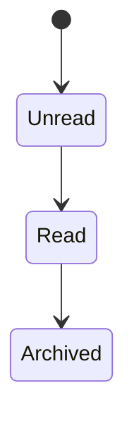
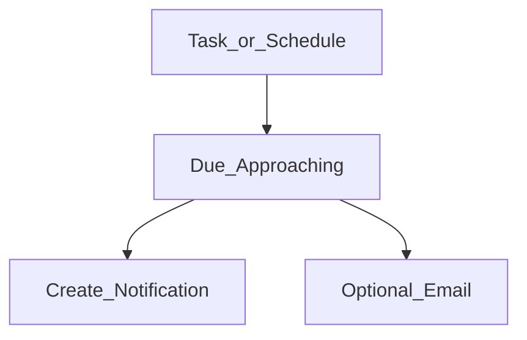
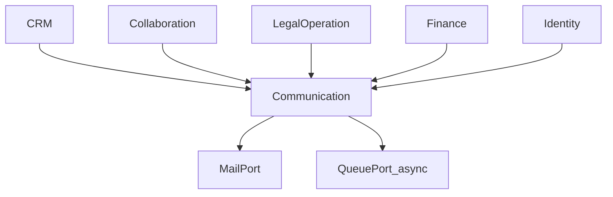
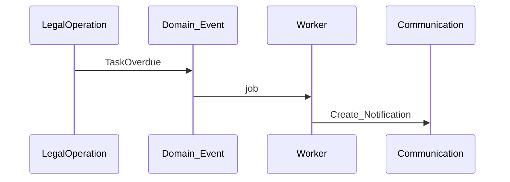

# Communication — DYN CRM

> Bản tiếng Việt của [Communication.md](./Communication.md). Canonical: English.

## 1. Mục đích

Định nghĩa năng lực **Communication**: notification/reminder/cảnh báo workflow nội bộ và email transactional bên ngoài — **không** marketing automation.

## 2. Phạm vi

In-app Notification; Reminder; Workflow notification; Email qua MailPort. Ngoài: marketing; SMS/Zalo (chưa scope); push mobile (chưa).

## 3. Năng lực

**Nội bộ:** Notification, Reminder, Workflow notification.  
**Ngoài:** Email transactional; thông báo khách chỉ nếu product cho phép sau (Open Question).

## 4. Actor

Mọi user đã login (hộp thư của mình); CTV chỉ notification portal; System/Worker phát event.

## 5. Vòng đời

## 6. Đối tượng chính

Notification, Reminder, Email outbound log, Notification preference (độ sâu MVP = Open Question).

## 7. Quy tắc

Không marketing; event-driven; reminder cho task và có thể lịch thanh toán; email qua MailPort; CTV theo permission portal; không secret trong nội dung.

## 8. Permission

`notification.read_own` (mọi user); `notification.manage_all` / `email.template.manage` (Admin).

## 9. Events tiêu thụ

`LeadAssigned`, `ContractRequestSubmitted`, `ContractStatusChanged`, `TaskOverdue`, `PaymentCollected`, `UserInvited`, …

## 10. Tương tác

## 11. Mở rộng

Email khách; SMS/Zalo; digest; marketing (từ chối hiện tại).

## 12. Sơ đồ

## 13. Open Questions

1. Email bắt buộc MVP nào?  
2. Preference thông báo trong MVP?  
3. Email khách khi chưa có portal?  
4. Retention notification?  
5. Realtime vs polling — chỉ hỏi nếu product quan tâm.

## 14. TODO

- [ ] Khóa danh sách template email MVP  
- [ ] Khóa event → in-app vs email  
- [ ] Catalog notification CTV  
- [ ] Lead time reminder (vd. 24h trước hạn)  
