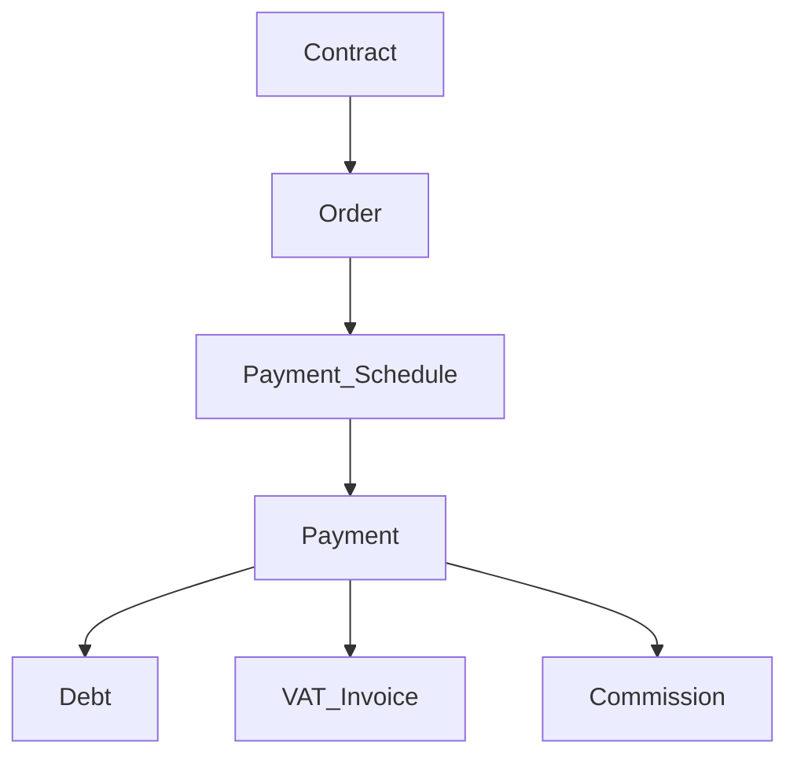
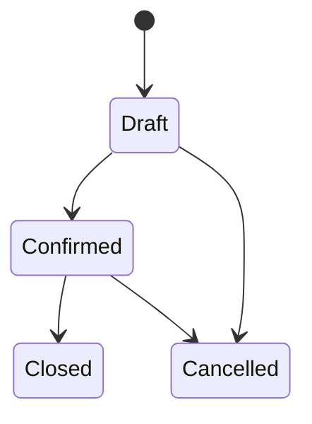
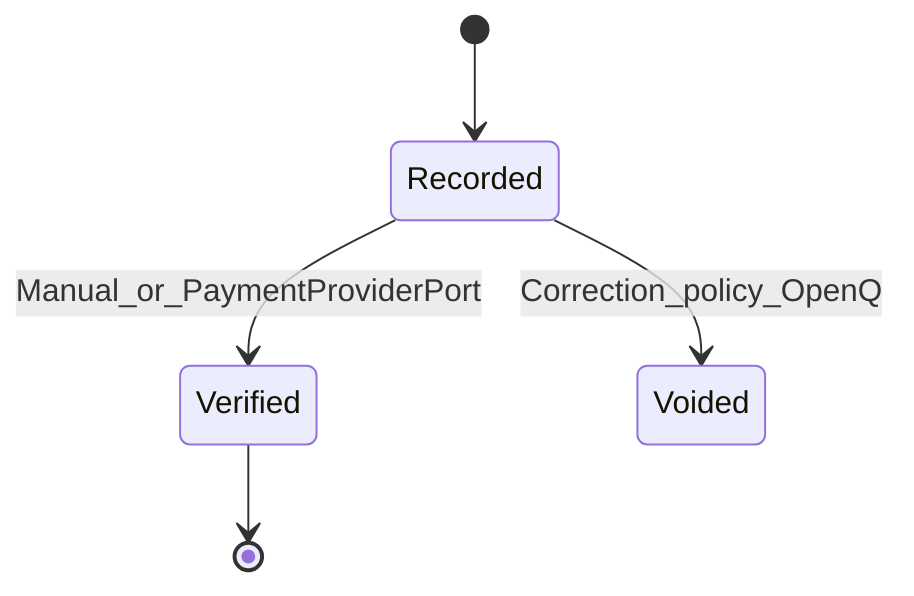
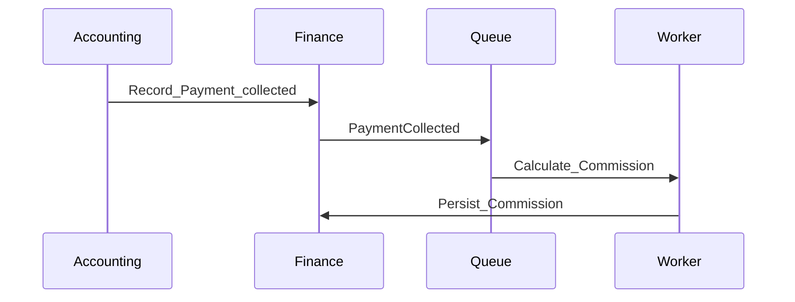
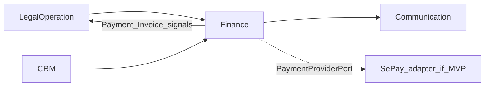
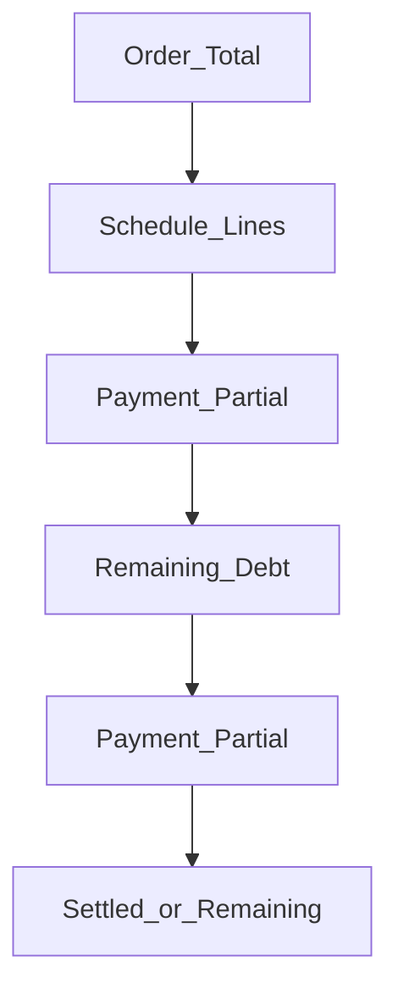
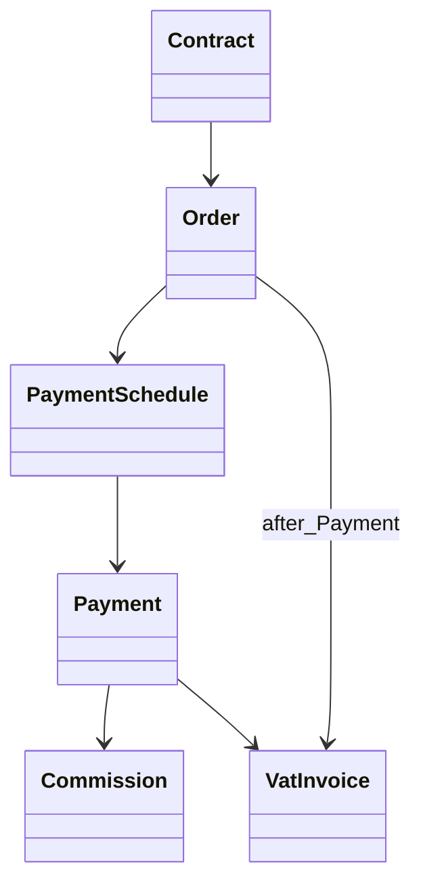

# Finance — DYN CRM

> Vietnamese: [Finance.vi.md](./Finance.vi.md)  
> DB contract: `orders`, `payment_*`, `payments`, `vat_invoices`, `expenses`, `commissions` — see SchemaDesign.

## Re-lock 2026-09-05

| Topic | Status |
|-------|--------|
| Commission table | **In schema** — based on collected payment |
| Expense | **Order-scoped**; PENDING/APPROVED/REJECTED |
| Debt table | **None** — derived outstanding |
| Income table | **None** — Thu ≈ payments |
| Order | Rich operational fields; `stage` text (not enum) |
| Service | Order.service_id; agreed value on Order ≠ service.unit_price |
| Payment ↔ Invoice | payment_id nullable; not forced 1:1 |
| VAT | DRAFT/ISSUED/CANCELLED; issue_date nullable in DRAFT |
| SePay | Opaque provider* on payments only |

## 1. Purpose

Monetize legal work: Order → schedule → Payment → VAT Invoice; Expense (Chi); Commission on collected payment; CTV attribution via `orders.collaborator_id`.

Invoice **after** Payment remains the business rule for **issue**; DRAFT invoice may exist earlier (OPEN whether Payment required before DRAFT).

## 2. Chain

```text
Contract → Order (+ Service, optional Collaborator)
        → PaymentSchedule → Lines
        → Payment (partial OK)
        → VatInvoice (order required; payment optional FK)
        → Commission (from payment)
        → Expense (per order)
```

Outstanding = total_gross − sum(non-voided payments).

## 3. Commands (API)

`order.assign|change-stage|approve` · `payment.verify|void` · `vat.issue|cancel` · `expense.approve` · `commission.calculate|approve|pay`

## 4. Open

- Meaning of `orders.contract_number` (int) vs contracts.contract_number (text)  
- Order stage catalog values  
- Global vs per-order expiry N  
- VAT rate flexibility vs fixed 10% MVP policy  


## Stakeholder re-lock — 2026-08-17

| Topic | Classification |
|-------|----------------|
| Tab **Thu** / **Chi** | **SCOPE CHANGE** — capability confirmed; data model **OPEN** |
| Duyệt **chỉ Chi** (với Nhi) | Capability confirmed; approver identity **OPEN** |
| Order statuses | Requested — set **not enumerated** (**OPEN**) |
| Order validity period + alert **N months** (N configurable) | **CONFIRMED** |
| SePay + invoice | **SCOPE CHANGE** vs “SePay = future”; MVP boundary **OPEN** |
| Invoice alerts | **CONFIRMED** capability; who/when/channel **OPEN** |
| CTV money as thu/chi or note | **SCOPE CHANGE** — see Collaboration; semantics **OPEN** |
| Commission object | **RE-LOCK** — not mentioned in 2026-08-17 notes; do not assume CTV commission engine |
| Invoice **after** Payment | Still **LOCKED** (2026-08-03) |

Do not couple Finance to a SePay SDK. Use a **PaymentProviderPort** (Phase 01 style).

## 1. Purpose

Define the **Finance** capability: monetizing legal work from Contract through Order, payment schedule, payments, debt visibility, VAT invoicing, income/expense visibility, and (if re-confirmed) commission on collected funds.

## 2. Scope

| In scope | Out of scope |
|----------|--------------|
| Order, Payment Schedule, Payment, Debt, VAT Invoice | VNPay / MoMo / Stripe in MVP |
| Partial payment, VAT 10% exclusive (MVP) | Multi-currency posting |
| Order validity (start/end) + configurable expiry alert | Full general ledger / ERP accounting |
| Thu / Chi tabs (staff finance UI concept) | Duplicating Payment as a second income row without a decision |
| Expense approval (Chi only) | CTV portal (removed pending re-lock) |
| SePay as a **provider adapter** if pulled into MVP | SePay-specific types in domain |
| Invoice alerts (events → Communication) | Notification implementation inside Finance |
| Commission % of collected payment | **Only if re-locked** — not assumed for CTV |

## 3. Business Capability

### Proposed operational flow



### Consistency with Phase 00 (re-locked 2026-08-03)

| Rule | Status |
|------|--------|
| Contract → Order → **Payment Schedule → Payment → Debt → VAT Invoice** → Commission | **Locked** — Invoice **after** Payment |
| Invoice may reference Contract / Milestone / Manual | Locked (timing after Payment) |
| Commission on **collected payment** | Locked |
| VAT 10% exclusive; VND; partial payment | Locked |
| Methods: Cash, Bank Transfer, QR | Locked |
| Schedule & Debt | Locked as MVP finance objects |
| Commission on collected payment | **Re-lock 2026-08-17** — CTV commission engine not confirmed |
| Thu / Chi + Chi approval | Capability 2026-08-17 — model **OPEN** |
| SePay | Candidate MVP — boundary **OPEN** |

## 4. Actors

| Actor | Responsibility |
|-------|----------------|
| Accounting | Orders, schedules, payments, invoices, debt, thu/chi entries |
| Named Chi approver (“Nhi”) | Approve **expenses only** — mapping to User/Role **OPEN** |
| Manager / Admin | Oversight; configuration (expiry N, commission % if kept) |
| Lawyer | Read context; does not own ledger |
| CTV as portal user | **Not in Finance** unless Collaboration is restored |

## 5. Business Lifecycle

### 5.1 Order



> **Working assumption only.** Stakeholder asked for Order statuses (2026-08-17) but did **not** enumerate them. Do not freeze a Prisma enum until the set is locked. An **Expired** status is an Open Question (see §24).

### 5.1.1 Order validity (CONFIRMED)

Each Order/service has a validity period. Staff must be alerted **N months** before expiration. **N is configurable** (do not hard-code).

| Aspect | Documented rule | Open |
|--------|-----------------|------|
| Owner of start/end dates | **Order** (stakeholder: thời hạn **đơn hàng**) | Whether Contract also stores a legal term |
| Alert concept | Configurable expiration notification | Global N vs per-Order N |
| Channel | Communication consumes an event — Finance does not send mail | In-app vs email |
| Recipients | Staff who must know the service is ending | Which roles |
| After expiry | Not invented | Status? Block work? Allow extend? |

### 5.2 Payment



### 5.3 Commission (async)



## 6. Main Business Objects

| Object | Meaning |
|--------|---------|
| Order | Financial transaction generated from a Contract (Glossary) |
| Payment Schedule | Planned installments / due amounts against an Order |
| Payment | Collected money entry (full or partial) |
| Debt | Remaining obligation view (derived and/or tracked — Open Q) |
| VAT Invoice | Tax invoice document/record (10% exclusive MVP) |
| Milestone | Optional invoice/schedule anchor (Phase 00) |
| Commission | Amount from collected payment × configurable % — **re-lock** if still required |
| Payment Method | Cash \| Bank Transfer \| QR |
| Income (Thu) | Conceptual staff tab — mapping **OPEN** (§25) |
| Expense (Chi) | Conceptual staff tab; **requires approval** — mapping **OPEN** (§25) |
| Order validity | `serviceStart` / `serviceEnd` (names illustrative) on **Order** |
| Payment provider reference | Opaque provider payment id via **PaymentProviderPort** (SePay adapter candidate) |

## 7. Business Rules

1. Order originates from Contract (Phase 00).  
2. Partial payments allowed; remaining balance must be visible (Debt).  
3. VAT MVP: **10% exclusive**, VND only.  
4. Commission base: **actual collected payment**, not contract value (Phase 00).  
5. Commission formula MVP: configurable percentage (Phase 00).  
6. VAT Invoice is issued **after** Payment; it may still reference Contract, Milestone, or Manual as source context.  
7. SePay is a **scope-change candidate for MVP** (2026-08-17). Domain talks to **PaymentProviderPort** only — never SePay types. Boundary (initiate vs bank detection vs verify vs webhook) is **OPEN**.  
8. Refund / credit note / void policies → Open Questions (not invented).  
9. Invoice alerts are **Communication** side effects of Finance events — Finance does not implement notification.  
10. Chi requires approval; Thu does not (stakeholder). Approver “Nhi” is not yet mapped to Identity.  
11. Do not duplicate a collected **Payment** as a second Income row unless an explicit ledger decision is locked (§25).
## 8. Permission Matrix

| Permission (illustrative) | Accounting | Manager | Admin | Lawyer | Chi approver |
|---------------------------|------------|---------|-------|--------|--------------|
| `order.write` | Y | Open Q | Y | N | N |
| `payment.record` | Y | Open Q | Y | N | N |
| `payment.verify` | Y | Y | Y | N | N |
| `invoice.write` | Y | Open Q | Y | N | N |
| `debt.read` | Y | Y | Y | Limited | N |
| `income.write` | Y | Open Q | Y | N | N |
| `expense.write` | Y | Open Q | Y | N | N |
| `expense.approve` | N | Open Q | Y | N | Y |
| `commission.read` | Y | Y | Y | N | N |
| `commission.config` | N | Open Q | Y | N | N |

CTV portal permissions removed pending Collaboration re-lock.

## 9. Business Events

| Event | Downstream |
|-------|------------|
| `OrderCreated` | Schedule planning |
| `ScheduleUpdated` | Reminders |
| `PaymentRecorded` | Debt recalculation |
| `PaymentCollected` / verified | Legal requirements, Communication; commission job **only if** Commission re-locked |
| `InvoiceIssued` | Legal requirement signals, Communication (invoice alert) |
| `InvoiceDueSoon` | Communication — **only if** invoice due date is locked |
| `InvoiceOverdue` | Communication — **OPEN** whether required |
| `OrderExpiringSoon` | Communication (N-month configurable threshold) |
| `ExpenseSubmitted` / `ExpenseApproved` | Communication (Chi approval) |
| `CommissionCalculated` | **Only if** Commission remains a domain object |

## 10. Interaction with Other Domains



## 11. Future Extension

| Item | Notes |
|------|-------|
| SePay via PaymentProviderPort | **MVP candidate** (2026-08-17) — boundary OPEN |
| VNPay / MoMo / Stripe | Roadmap |
| Multi-currency | Ready design later |
| Tier / shared / team commission | Roadmap |
| E-invoice authority integration | Open Question |

## 12. Mermaid Diagrams

### 12.1 Partial payment & debt



### 12.2 Objects



## 13. Open Questions

### Schema-critical

1. Is Debt a stored balance, a derived view, or both?  
2. **Order status set** (stakeholder asked; values not given)? Include Expired?  
3. Order `serviceStart` / `serviceEnd` required? Can an Order be **extended**?  
4. Expiry alert N: **global configuration** vs **per Order**?  
5. Income/Expense model: derived views vs explicit transactions (§25) — **OPEN**?  
6. CTV-related money: Expense, Income, both, or note-only?  
7. Keep **Commission** as a first-class object?  
8. When does commission fire — Recorded vs Verified — **if** Commission is kept?  
9. Must every Payment produce a VAT Invoice, or optional/batched? Does Invoice have a **due date**?  
10. SePay MVP: payment initiation, bank-transfer detection, verification, webhook confirmation, or combination?  
11. Expense approver “Nhi”: named User, Role, or permission only?

### Non-schema-critical

12. Void/refund/credit note operating rules?  
13. Who configures commission % (Admin only)?  
14. E-invoice (HĐĐT) mandatory in MVP?  
15. Who receives invoice and expiry alerts; in-app vs email; overdue required?

## 14. TODO

- [x] Re-lock finance chain: Invoice **after** Payment (2026-08-03)  
- [x] Record 2026-08-17 Thu/Chi, Order expiry, SePay, invoice alert, CTV money (Open Q where unconfirmed)  
- [ ] Lock Debt model  
- [ ] Lock Order status + validity + expiry config  
- [ ] Lock Income/Expense vs Payment (no double accounting)  
- [ ] Lock SePay boundary + PaymentProviderPort  
- [ ] Lock commission trigger **or** drop Commission object  
- [ ] Confirm VAT invoice numbering rules (legal)  
- [ ] Confirm 1:1 vs N:1 Payment→Invoice policy  

## 15. Aggregate Boundaries

| Aggregate Root | Children / parts | Boundary rule |
|----------------|------------------|---------------|
| **Order** | Link to Contract; totals; schedule ownership | Order owns planned money for one Contract context |
| **Payment Schedule** | Schedule lines / installments | Owned under Order |
| **Payment** | Amount, method, verification state | Against Order/Schedule; cannot orphan from Order |
| **Debt** | Remaining obligation (view and/or store — Open Q) | Derived from Order vs Payments |
| **VAT Invoice** | Tax document after Payment | Issued after Payment; may reference Contract/Milestone/Manual |
| **Commission** | % of collected payment; beneficiary | **Only if re-locked** — not assumed for CTV portal |
| **Expense (if explicit)** | Amount, payee/note, approval state | Chi tab; approval required |
| **Income (if explicit)** | Amount, source | Thu tab — **must not** double-count Payment without a lock |

## 16. Domain Invariants

| ID | Invariant |
|----|-----------|
| FIN-I1 | Payment amount cannot exceed outstanding balance (partial allowed within remaining) |
| FIN-I2 | Commission is calculated only from **collected payment**, never from Contract value alone |
| FIN-I3 | VAT Invoice is issued **after** Payment (locked chain) |
| FIN-I4 | Order originates from Contract |
| FIN-I5 | Verified Payment is the trusted collected signal for downstream commission (exact Recorded vs Verified trigger → Open Q) |
| FIN-I6 | Currency MVP is VND; VAT MVP is 10% exclusive |

## 17. Primary Business Use Cases

| ID | Use case |
|----|----------|
| UC01 | Create Order from Contract |
| UC02 | Generate / update Payment Schedule |
| UC03 | Record Payment (full or partial) |
| UC04 | Verify Payment |
| UC05 | Issue VAT Invoice |
| UC06 | Calculate Commission (**if** object kept) |
| UC07 | View Debt / outstanding |
| UC08 | Configure commission % (**if** kept) |
| UC09 | Record / approve Expense (Chi) |
| UC10 | View Thu / Chi tabs |
| UC11 | Configure Order-expiry alert threshold N |
| UC12 | Verify payment via PaymentProviderPort (SePay candidate) |

## 18. Ownership Matrix

| Business Object | Owner Domain | Referenced By |
|-----------------|--------------|---------------|
| Order | Finance | Legal (context), Communication |
| Payment Schedule | Finance | Communication (reminders) |
| Payment | Finance | Legal (requirement signals), Communication |
| Debt | Finance | Dashboard |
| VAT Invoice | Finance | Legal (requirement signals), Communication |
| Commission | Finance | Communication — **if** kept |
| Expense / Income (if explicit) | Finance | Communication (approval/alerts) |

## 19. Domain Event Matrix

| Event | Producer | Consumers |
|-------|----------|-----------|
| `OrderCreated` | Finance | Communication (optional) |
| `ScheduleUpdated` | Finance | Communication |
| `PaymentRecorded` | Finance | Debt, Communication |
| `PaymentCollected` / verified | Finance | Legal, Communication, Commission job **if** kept |
| `InvoiceIssued` | Finance | Legal, Communication |
| `InvoiceDueSoon` / `InvoiceOverdue` | Finance | Communication — overdue **OPEN** |
| `OrderExpiringSoon` | Finance | Communication |
| `CommissionCalculated` | Finance | Communication — **if** kept |

## 20. Business Constraints

| Constraint |
|------------|
| Verified Payment cannot be casually edited — corrections via void/refund policy (Open Q) |
| Commission cannot be recalculated from Contract fee alone |
| Issued VAT Invoice numbering follows legal policy once locked |
| Unapproved Chi must not be treated as posted spend (once approval is modeled) |
| CTV portal commission visibility is **removed** pending Collaboration re-lock |

## 21. Dynamic Features

| Feature | Stance |
|---------|--------|
| Commission % | Configurable; formula MVP = percentage of collected |
| Payment methods | Cash, Bank Transfer, QR (fixed MVP set) |
| Order expiry N (months) | Configurable — global vs per-Order **OPEN** |
| PaymentProviderPort | SePay adapter **candidate**; domain stays provider-agnostic |
| Thu / Chi | Staff tabs; persistence model **OPEN** |

## 22. Business Metrics

| Metric | Purpose |
|--------|---------|
| Revenue (collected) | Business performance |
| Outstanding Debt | Collection risk |
| Collection rate | Schedule vs collected |
| Invoices issued | Tax compliance volume |
| Commission paid / accrued | Partner cost |

## 23. Cross Domain Dependency

| | Domains |
|--|---------|
| **Depends on** | Identity, LegalOperation (Contract), CRM (Customer reference) |
| **Provides to** | Legal (payment/invoice signals), Communication, Dashboard |
| **Does not own** | Contract lifecycle, Customer master, notifications, SePay vendor API |

## 24. Order expiration (CONFIRMED capability)

| Rule | Statement |
|------|-----------|
| Entity | **Order** owns service/validity dates (business: thời hạn đơn hàng). Contract remains the legal agreement — do not silently copy dates onto Contract without a lock. |
| Alert | Staff must know when a service/order approaches expiration. |
| Lead time | **N months** before `serviceEnd`. **N is configurable** — never hard-coded in domain logic. |
| Producer | Finance emits `OrderExpiringSoon`. |
| Consumer | Communication (in-app and/or email — channel **OPEN**). |
| Config owner | System Configuration (Identity/System module) or Finance config — **OPEN** whether one global N or per Order. |

**Still OPEN (schema-critical):** required start/end; `Expired` status; whether extension creates a new Order or updates `serviceEnd`; who is notified.

## 25. Income / Expense (Thu / Chi) — analysis, not a silent ledger

Stakeholder asked for **tabs Chi and Thu**, and **approval only for Chi** (with Nhi).

| Option | Meaning | Risk |
|--------|---------|------|
| **A — Derived views (recommended to discuss)** | Thu ≈ collected Payments / issued invoices; Chi ≈ explicit Expense records (including CTV-related spend) | Avoids double-counting Payment |
| **B — Explicit FinancialTransaction** | Every thu/chi is a posting; Payment also posts Income | Duplicated accounting unless Payment *is* the Income row |
| **C — Note only for CTV** | No structured Chi/Thu masters; free-text on Payment/Order | Cannot approve Chi or filter tabs reliably |

**Direction: OPEN QUESTION.** Do **not** add a generic transaction table in Prisma until Option A/B/C is locked. Do **not** invent a full accounting chart of accounts.

CTV: if money must be recorded, it is **one of** Chi, Thu, or note — **not invented here**.

## 26. SePay + Invoice (SCOPE CHANGE candidate)

| Concept | Owner |
|---------|--------|
| Payment (business) | Finance |
| Payment verification | Finance policy + PaymentProviderPort result |
| Invoice generation | Finance (after Payment — still locked) |
| Provider reference | Opaque id/status on Payment; adapter maps SePay |

**OPEN:** Does “thanh toán dịch vụ SePay + invoice” mean initiate checkout, detect bank transfer, auto-verify, webhook confirm, generate invoice after verify, or all of the above?

VNPay/MoMo/Stripe remain out of MVP unless separately scoped.

## 27. Invoice alerts (CONFIRMED capability)

Finance produces events; Communication delivers. Suggested events **only where the business object supports them**:

| Event | When to use |
|-------|-------------|
| `InvoiceIssued` | Invoice created after Payment |
| `InvoiceDueSoon` | **Only if** Invoice has a due date (not confirmed) |
| `InvoiceOverdue` | **OPEN** whether required |

Thresholds, recipients, in-app vs email: **non-schema-critical Open Questions**.
