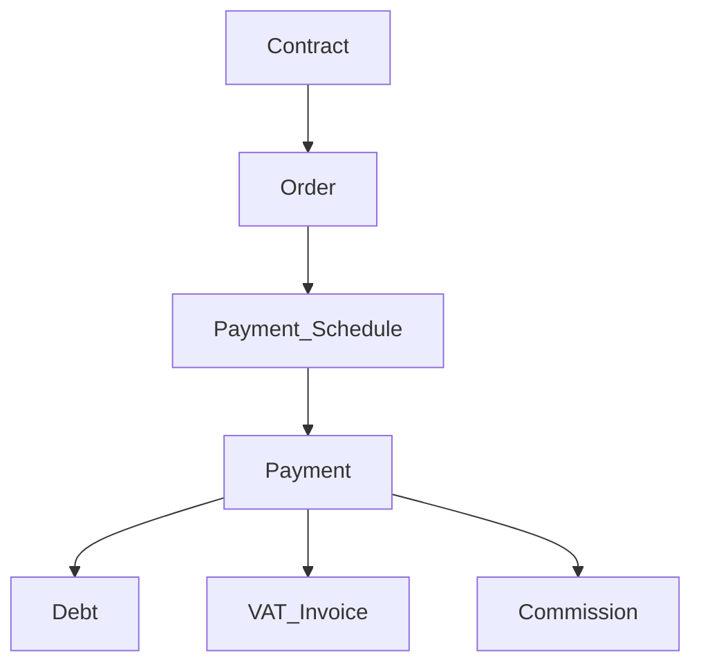
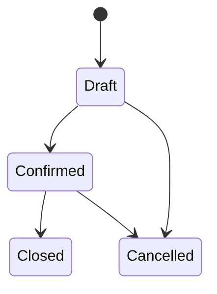
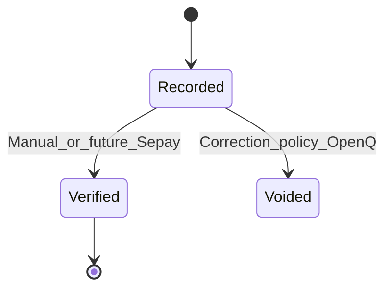
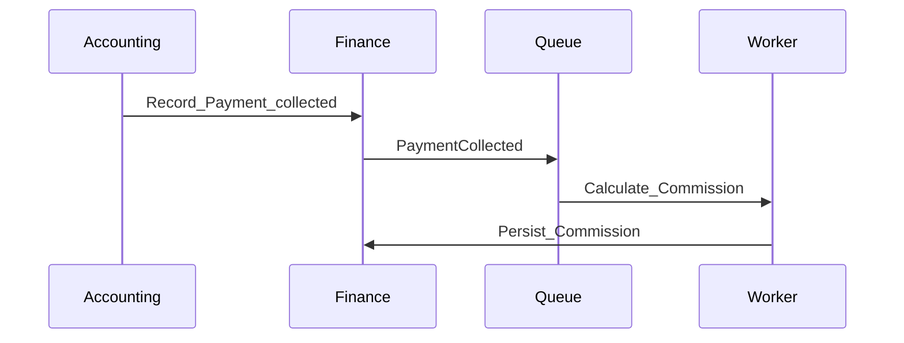
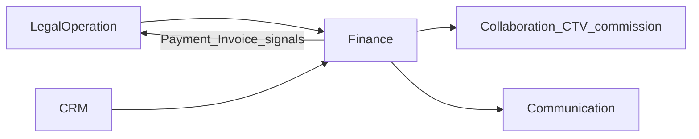
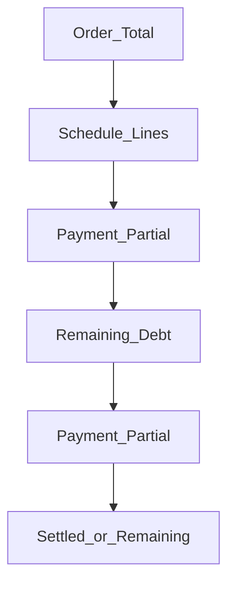
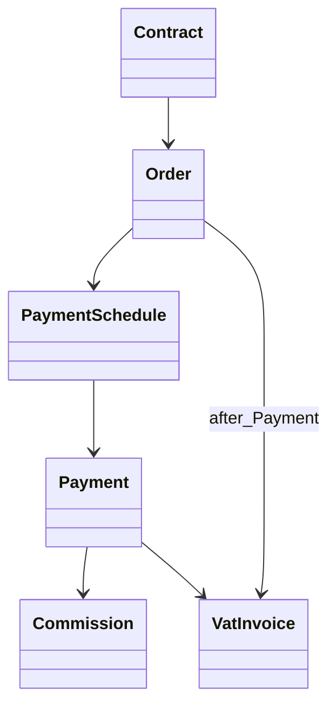

# Finance — DYN CRM

> Vietnamese version: [Finance.vi.md](./Finance.vi.md)

## 1. Purpose

Define the **Finance** capability: monetizing legal work from Contract through Order, payment schedule, payments, debt visibility, VAT invoicing, and commission on collected funds.

## 2. Scope

| In scope | Out of scope |
|----------|--------------|
| Order, Payment Schedule, Payment, Debt, VAT Invoice, Commission | Payment gateways (VNPay/MoMo/Stripe) in MVP |
| Partial payment, VAT 10% exclusive (MVP) | Multi-currency posting |
| Payment verification (manual MVP) | Automated Sepay (future) |
| Commission % of collected payment | Tier/shared/team formulas (roadmap) |

## 3. Business Capability

### Proposed operational flow

### Consistency with Phase 00 (re-locked 2026-08-03)

| Rule | Status |
|------|--------|
| Contract → Order → **Payment Schedule → Payment → Debt → VAT Invoice** → Commission | **Locked** — Invoice **after** Payment |
| Invoice may reference Contract / Milestone / Manual | Locked (timing after Payment) |
| Commission on **collected payment** | Locked |
| VAT 10% exclusive; VND; partial payment | Locked |
| Methods: Cash, Bank Transfer, QR | Locked |
| Schedule & Debt | Locked as MVP finance objects |
## 4. Actors

| Actor | Responsibility |
|-------|----------------|
| Accounting | Orders, schedules, payments, invoices, debt views |
| Manager / Admin | Oversight, configuration of commission % |
| Lawyer | Read context; does not own ledger |
| CTV | Read **own** commission only |

## 5. Business Lifecycle

### 5.1 Order

> Exact Order statuses → Open Questions.

### 5.2 Payment

### 5.3 Commission (async)

## 6. Main Business Objects

| Object | Meaning |
|--------|---------|
| Order | Financial transaction generated from a Contract (Glossary) |
| Payment Schedule | Planned installments / due amounts against an Order |
| Payment | Collected money entry (full or partial) |
| Debt | Remaining obligation view (derived and/or tracked — Open Q) |
| VAT Invoice | Tax invoice document/record (10% exclusive MVP) |
| Milestone | Optional invoice/schedule anchor (Phase 00) |
| Commission | Amount from collected payment × configurable % |
| Payment Method | Cash \| Bank Transfer \| QR |

## 7. Business Rules

1. Order originates from Contract (Phase 00).  
2. Partial payments allowed; remaining balance must be visible (Debt).  
3. VAT MVP: **10% exclusive**, VND only.  
4. Commission base: **actual collected payment**, not contract value (Phase 00).  
5. Commission formula MVP: configurable percentage (Phase 00).  
6. VAT Invoice is issued **after** Payment; it may still reference Contract, Milestone, or Manual as source context.  
7. Sepay automatic verification = future; MVP verification is manual unless Scope adds Sepay.  
8. Refund / credit note / void policies → Open Questions (not invented).
## 8. Permission Matrix

| Permission (illustrative) | Accounting | Manager | Admin | Lawyer | CTV |
|---------------------------|------------|---------|-------|--------|-----|
| `order.write` | Y | Open Q | Y | N | N |
| `payment.record` | Y | Open Q | Y | N | N |
| `payment.verify` | Y | Y | Y | N | N |
| `invoice.write` | Y | Open Q | Y | N | N |
| `debt.read` | Y | Y | Y | Limited | N |
| `commission.read` | Y | Y | Y | N | own only |
| `commission.config` | N | Open Q | Y | N | N |

## 9. Business Events

| Event | Downstream |
|-------|------------|
| `OrderCreated` | Schedule planning |
| `ScheduleUpdated` | Reminders |
| `PaymentRecorded` | Debt recalculation |
| `PaymentCollected` / verified | Commission job, Legal requirements, Communication |
| `InvoiceIssued` | Legal requirement signals, Communication |
| `CommissionCalculated` | CTV portal visibility |

## 10. Interaction with Other Domains

## 11. Future Extension

| Item | Notes |
|------|-------|
| Sepay auto verification | Explicit future |
| VNPay / MoMo / Stripe | Roadmap |
| Multi-currency | Ready design later |
| Tier / shared / team commission | Roadmap |
| E-invoice authority integration | Open Question |

## 12. Mermaid Diagrams

### 12.1 Partial payment & debt

### 12.2 Objects

## 13. Open Questions

1. Is Debt a stored balance, a derived view, or both?  
2. Order status enum?  
3. When does commission fire — on Recorded vs Verified payment?  
4. Void/refund/credit note rules?  
5. Who configures commission % (Admin only)?  
6. E-invoice (HĐĐT) mandatory in MVP?  
7. Must every Payment produce a VAT Invoice, or optional/batched?

## 14. TODO

- [x] Re-lock finance chain: Invoice **after** Payment (2026-08-03)  
- [ ] Lock Debt model  
- [ ] Lock payment verification states  
- [ ] Lock commission trigger (recorded vs verified)  
- [ ] Confirm VAT invoice numbering rules (legal)  
- [ ] Confirm 1:1 vs N:1 Payment→Invoice policy  
