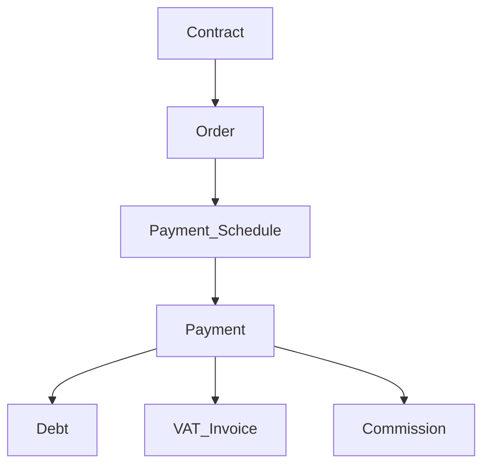
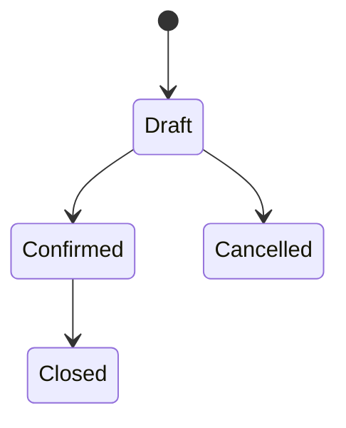
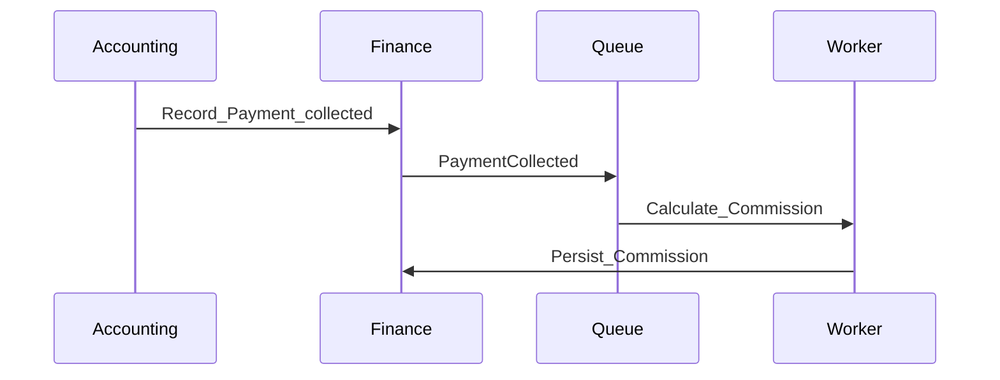
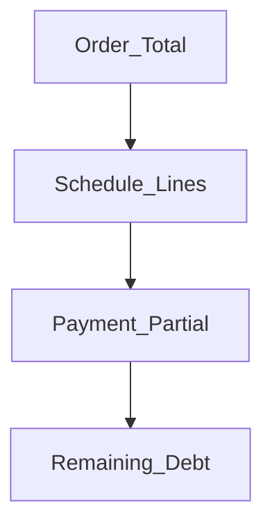

# Finance — DYN CRM

> Bản tiếng Việt của [Finance.md](./Finance.md). Canonical: English.

## 1. Mục đích

Định nghĩa năng lực **Finance**: moneti hóa từ Contract qua Order, lịch thanh toán, payment, nợ, hóa đơn VAT, hoa hồng trên tiền đã thu.

## 2. Phạm vi

Order, Payment Schedule, Payment, Debt, VAT Invoice, Commission; partial; VAT 10% exclusive; xác minh thủ công MVP. Ngoài: cổng thanh toán MVP; đa tiền tệ; Sepay tự động; hoa hồng tier/shared.

## 3. Năng lực

**Nhất quán (khóa 2026-08-03):** Contract → Order → Payment Schedule → Payment → Debt → **VAT Invoice** → Commission. Hóa đơn VAT **sau** Payment. Hoa hồng trên **tiền đã thu**.

## 4. Actor

Accounting; Manager/Admin; Lawyer (đọc); CTV (hoa hồng của mình).

## 5. Vòng đời

## 6. Đối tượng chính

Order, Payment Schedule, Payment, Debt, VAT Invoice, Milestone, Commission, Payment Method (Cash/Bank Transfer/QR).

## 7. Quy tắc

Order từ Contract; partial + hiện dư nợ; VAT 10% exclusive VND; commission % cấu hình trên tiền thu; nguồn Invoice Contract/Milestone/Manual; Sepay future; refund/credit note chưa bịa.

## 8. Permission

`order.write`, `payment.record/verify`, `invoice.write`, `debt.read`, `commission.read/config` — CTV chỉ `commission.read` own.

## 9. Events

`OrderCreated`, `ScheduleUpdated`, `PaymentRecorded`, `PaymentCollected`, `InvoiceIssued`, `CommissionCalculated`.

## 10. Tương tác

Legal → Finance → Collaboration (commission) + Communication; CRM cung cấp Customer.

## 11. Mở rộng

Sepay; VNPay/MoMo/Stripe; multi-currency; tier commission; HĐĐT.

## 12. Sơ đồ

## 13. Open Questions

1. Debt lưu hay derive?  
2. Enum status Order?  
3. Commission khi Recorded hay Verified?  
4. Void/refund/credit note?  
5. Ai cấu hình % hoa hồng?  
6. HĐĐT bắt buộc MVP?  
7. Mỗi Payment có bắt buộc ra VAT Invoice không (1:1 vs gộp)?

## 14. TODO

- [x] Khóa chuỗi: Invoice **sau** Payment (2026-08-03)  
- [ ] Khóa mô hình Debt / verify / trigger commission / đánh số HĐ  

## 15. Aggregate Boundaries

| Aggregate Root | Con / thành phần | Quy tắc ranh giới |
|----------------|------------------|-------------------|
| **Order** | Link Contract; tổng; sở hữu schedule | Order sở hữu tiền kế hoạch cho ngữ cảnh Contract |
| **Payment Schedule** | Dòng / kỳ thanh toán | Thuộc Order |
| **Payment** | Số tiền, phương thức, trạng thái verify | Gắn Order/Schedule; không mồ côi |
| **Debt** | Nghĩa vụ còn lại (view và/hoặc lưu — Open Q) | Derive từ Order vs Payments |
| **VAT Invoice** | Chứng từ thuế sau Payment | Sau Payment; có thể neo Contract/Milestone/Manual |
| **Commission** | % tiền đã thu; người hưởng | Chỉ từ Payment đã thu |

## 16. Domain Invariants

| ID | Invariant |
|----|-----------|
| FIN-I1 | Số tiền Payment không vượt dư nợ còn lại (partial trong phần còn) |
| FIN-I2 | Commission chỉ tính từ **tiền đã thu**, không từ giá trị Contract đơn thuần |
| FIN-I3 | VAT Invoice phát hành **sau** Payment (chuỗi đã khóa) |
| FIN-I4 | Order phát sinh từ Contract |
| FIN-I5 | Payment Verified là tín hiệu collected đáng tin (Recorded vs Verified → Open Q) |
| FIN-I6 | MVP: VND; VAT 10% exclusive |

## 17. Primary Business Use Cases

| ID | Use case |
|----|----------|
| UC01 | Tạo Order từ Contract |
| UC02 | Tạo / cập nhật Payment Schedule |
| UC03 | Ghi nhận Payment (đủ hoặc một phần) |
| UC04 | Verify Payment |
| UC05 | Phát hành VAT Invoice |
| UC06 | Tính Commission |
| UC07 | Xem Debt / dư nợ |
| UC08 | Cấu hình % hoa hồng |

## 18. Ownership Matrix

| Đối tượng | Domain sở hữu | Được tham chiếu bởi |
|-----------|---------------|---------------------|
| Order | Finance | Legal (context), Communication |
| Payment Schedule | Finance | Communication (reminder) |
| Payment | Finance | Legal (tín hiệu), Communication, Collaboration |
| Debt | Finance | Dashboard |
| VAT Invoice | Finance | Legal (tín hiệu), Communication |
| Commission | Finance | Collaboration (CTV xem), Communication |

## 19. Domain Event Matrix

| Event | Producer | Consumers |
|-------|----------|-----------|
| `OrderCreated` | Finance | Communication (tuỳ chọn) |
| `ScheduleUpdated` | Finance | Communication |
| `PaymentRecorded` | Finance | Debt, Communication |
| `PaymentCollected` / verified | Finance | Legal, Collaboration, Communication, job Commission |
| `InvoiceIssued` | Finance | Legal, Communication |
| `CommissionCalculated` | Finance | Collaboration, Communication |

## 20. Business Constraints

| Ràng buộc |
|-----------|
| Payment Verified không sửa tùy tiện — điều chỉnh qua void/refund (Open Q) |
| Không tính lại commission chỉ từ phí Contract |
| Đánh số VAT Invoice theo chính sách pháp lý khi đã khóa |
| CTV chỉ xem hoa hồng của mình — không xem sổ nhân sự |

## 21. Dynamic Features

| Tính năng | Lập trường |
|-----------|------------|
| % hoa hồng | Cấu hình được; MVP = % tiền đã thu |
| Phương thức TT | Cash, Bank Transfer, QR (cố định MVP) |
| Sepay auto-verify | Tín hiệu tự động hóa tương lai |

## 22. Business Metrics

| Metric | Mục đích |
|--------|----------|
| Doanh thu (đã thu) | Hiệu quả kinh doanh |
| Dư nợ outstanding | Rủi ro thu hồi |
| Tỷ lệ thu | Schedule vs đã thu |
| Invoice đã phát hành | Khối lượng tuân thủ thuế |
| Commission trả / ghi nhận | Chi phí đối tác |

## 23. Cross Domain Dependency

| | Domain |
|--|--------|
| **Phụ thuộc** | Identity, LegalOperation (Contract), CRM (tham chiếu Customer) |
| **Cung cấp cho** | Legal (tín hiệu payment/invoice), Collaboration (commission), Communication, Dashboard |
| **Không sở hữu** | Vòng đời Contract, master Customer |
