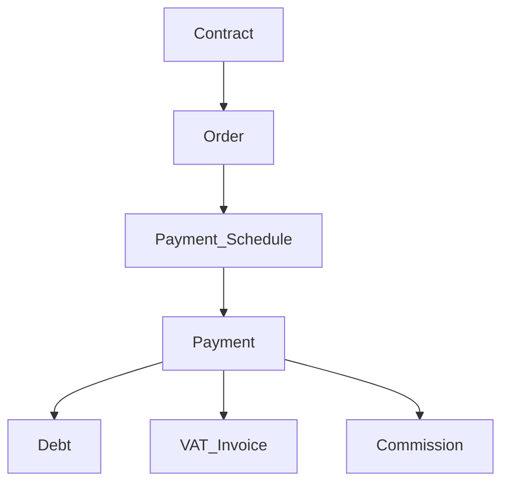
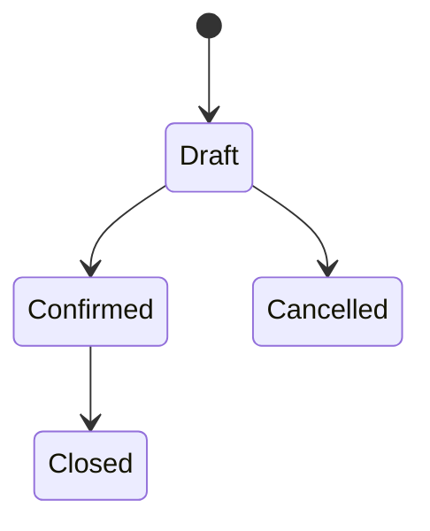
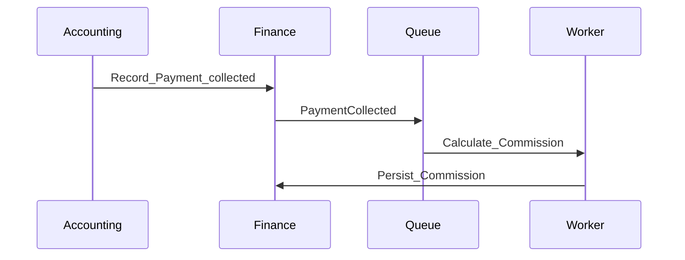
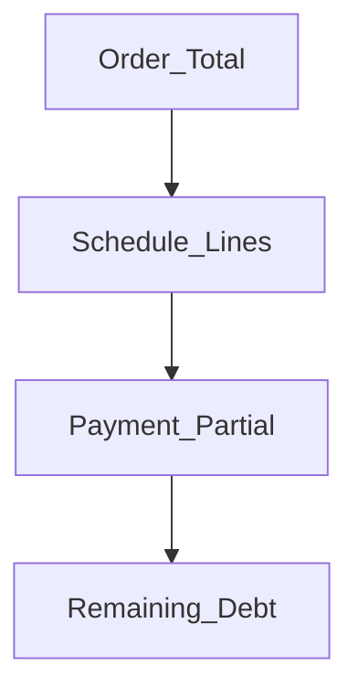

# Finance — DYN CRM

> Bản tiếng Việt của [Finance.md](./Finance.md). Canonical: English.

## 1. Mục đích

Định nghĩa năng lực **Finance**: moneti hóa từ Contract qua Order, lịch thanh toán, payment, nợ, hóa đơn VAT, hoa hồng trên tiền đã thu.

## 2. Phạm vi

Order, Payment Schedule, Payment, Debt, VAT Invoice, Commission; partial; VAT 10% exclusive; xác minh thủ công MVP. Ngoài: cổng thanh toán MVP; đa tiền tệ; Sepay tự động; hoa hồng tier/shared.

## 3. Năng lực

**Nhất quán (khóa 2026-08-03):** Contract → Order → Payment Schedule → Payment → Debt → **VAT Invoice** → Commission. Hóa đơn VAT **sau** Payment. Hoa hồng trên **tiền đã thu**.

## 4. Actor

Accounting; Manager/Admin; Lawyer (đọc); CTV (hoa hồng của mình).

## 5. Vòng đời

## 6. Đối tượng chính

Order, Payment Schedule, Payment, Debt, VAT Invoice, Milestone, Commission, Payment Method (Cash/Bank Transfer/QR).

## 7. Quy tắc

Order từ Contract; partial + hiện dư nợ; VAT 10% exclusive VND; commission % cấu hình trên tiền thu; nguồn Invoice Contract/Milestone/Manual; Sepay future; refund/credit note chưa bịa.

## 8. Permission

`order.write`, `payment.record/verify`, `invoice.write`, `debt.read`, `commission.read/config` — CTV chỉ `commission.read` own.

## 9. Events

`OrderCreated`, `ScheduleUpdated`, `PaymentRecorded`, `PaymentCollected`, `InvoiceIssued`, `CommissionCalculated`.

## 10. Tương tác

Legal → Finance → Collaboration (commission) + Communication; CRM cung cấp Customer.

## 11. Mở rộng

Sepay; VNPay/MoMo/Stripe; multi-currency; tier commission; HĐĐT.

## 12. Sơ đồ

## 13. Open Questions

1. Debt lưu hay derive?  
2. Enum status Order?  
3. Commission khi Recorded hay Verified?  
4. Void/refund/credit note?  
5. Ai cấu hình % hoa hồng?  
6. HĐĐT bắt buộc MVP?  
7. Mỗi Payment có bắt buộc ra VAT Invoice không (1:1 vs gộp)?

## 14. TODO

- [x] Khóa chuỗi: Invoice **sau** Payment (2026-08-03)  
- [ ] Khóa mô hình Debt / verify / trigger commission / đánh số HĐ  
