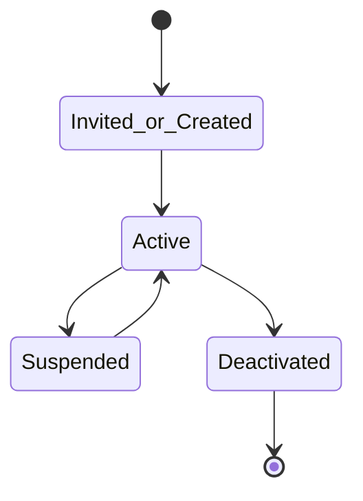
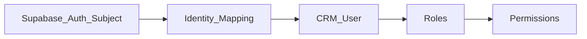
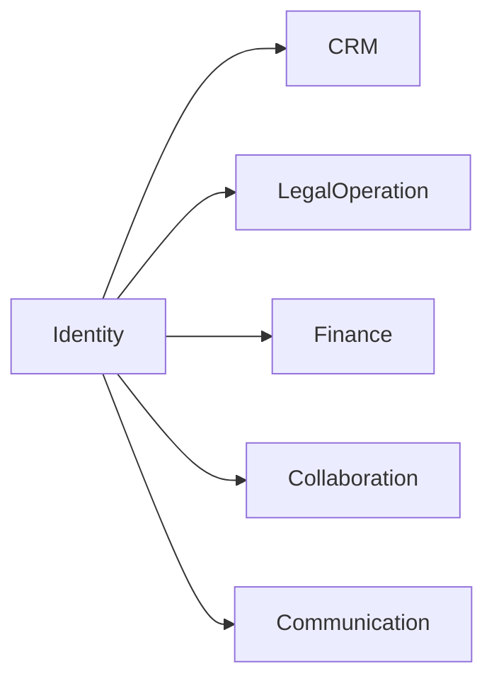
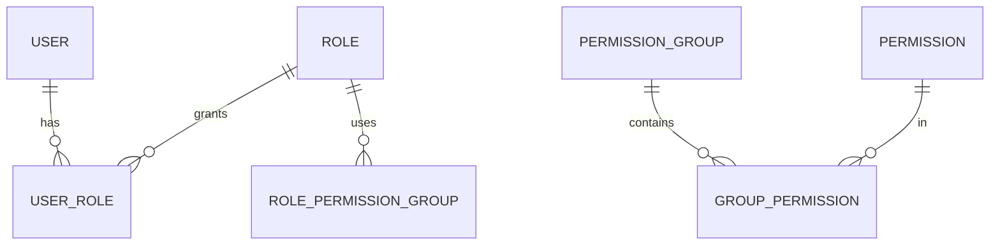
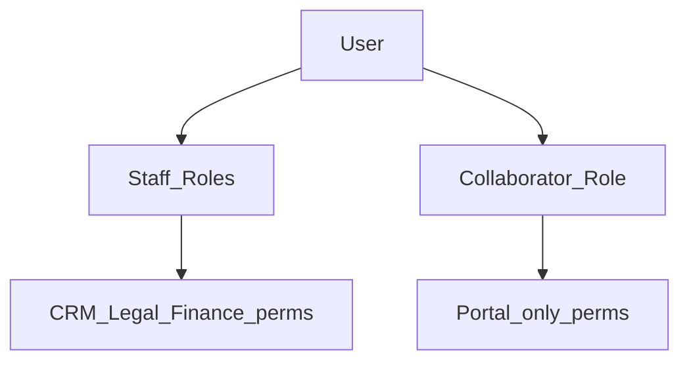

# Identity — DYN CRM

> Vietnamese version: [Identity.vi.md](./Identity.vi.md)

## 1. Purpose

Define the **Identity** business capability: users, authentication subjects, roles, permissions, permission groups, and extension points for organization/department structure that is **not finalized**.

## 2. Scope

| In scope | Out of scope |
|----------|--------------|
| User lifecycle, roles, permissions | ABAC / policy engine |
| Permission naming `resource.action` | Page-based permission design |
| Org/Department as **extension points** | Final org chart (unknown) |
| Mapping to Supabase Auth subject | Cookie/JWT implementation (Security.md) |

## 3. Business Capability

| Capability | MVP |
|------------|-----|
| User management | Yes |
| Role assignment | Yes |
| Permission checks | Yes (RBAC) |
| Permission Group (bundle) | Yes (recommended for admin UX) |
| Organization / Department | Extension point only — structure TBD |
| CTV vs staff principals | Yes (role-based) |

Roles remain **configurable** (assignable permission sets), while MVP ships the Glossary role names as initial bundles.

## 4. Actors

| Actor | Notes |
|-------|-------|
| Super Admin | Full identity administration |
| Admin | User/role administration within policy |
| All staff roles | Consume permissions |
| CTV | Collaborator role; portal-scoped permissions |

## 5. Business Lifecycle

### 5.1 User

> Provisioning flows (invite-only vs self-register) → Open Questions (Security TODO).

### 5.2 Auth subject ↔ User

## 6. Main Business Objects

| Object | Meaning |
|--------|---------|
| User | CRM principal |
| Role | Named Glossary role or custom configurable role |
| Permission | `resource.action` code |
| Permission Group | Bundle of permissions assignable to roles |
| Organization | Future container (extension) |
| Department | Future unit (extension) |
| Auth subject link | Provider user id mapping |

### Permission examples (by function)

| Permission |
|------------|
| `customer.read` |
| `customer.update` |
| `contract.approve` |
| `invoice.export` |
| `payment.record` |
| `commission.read_own` |
| `user.manage` |

## 7. Business Rules

1. Simple **RBAC only** — no ABAC in MVP (brief).  
2. Permission by **function**, not by UI page.  
3. Unknown permission ⇒ deny (Security).  
4. Deactivated user cannot use the system even if IdP login succeeds (Security).  
5. CTV role must not receive staff CRM permission bundles (Security / Collaboration).  
6. Organization/Department **not required** for MVP authorization; leave nullable extension fields/concepts for later.  
7. Roles listed in Phase 00 remain the starter set; additional custom roles allowed if Admin configures permissions carefully.

## 8. Permission Matrix (identity administration)

| Permission | Super Admin | Admin | Manager | Others |
|------------|-------------|-------|---------|--------|
| `user.manage` | Y | Y | N | N |
| `role.manage` | Y | Y | N | N |
| `permission.manage` | Y | Open Q | N | N |
| `org.manage` | Future | Future | — | — |

Operational permission matrices for CRM/Legal/Finance live in those domain docs.

## 9. Business Events

| Event | When |
|-------|------|
| `UserCreated` / `UserActivated` / `UserDeactivated` | Lifecycle |
| `RoleAssigned` / `RoleRevoked` | Access change |
| `PermissionGroupChanged` | Bundle edits |
| `UserLoggedIn` / `UserLoginFailed` | Auth signals (also Communication/Monitoring) |

## 10. Interaction with Other Domains

Every domain references `userId` for Owner, Assignee, Actor — never embeds IdP SDK types (Phase 01).

## 11. Future Extension

| Item | Notes |
|------|-------|
| Organization / Department hierarchy | When org model locked |
| ABAC / attribute rules | Explicitly deferred |
| SSO enterprise IdP | AuthPort swap |
| Multi-tenant org isolation | SaaS phase |

## 12. Mermaid Diagrams

### 12.1 RBAC model

### 12.2 Staff vs CTV

## 13. Open Questions

1. Staff provisioning: admin invite only?  
2. CTV provisioning flow?  
3. Are custom roles allowed in MVP beyond the eight Glossary roles?  
4. Is Permission Group mandatory or can permissions attach directly to roles?  
5. Minimum Organization/Department fields to reserve for future without implementing UI?  
6. Owner vs Follower permission difference (cross-cut with CRM/Security)?

## 14. TODO

- [ ] Lock provisioning flows  
- [ ] Publish MVP role → permission group bundles  
- [ ] Confirm Permission Group modeling choice  
- [ ] Document reserved org/department extension without requiring MVP screens  
