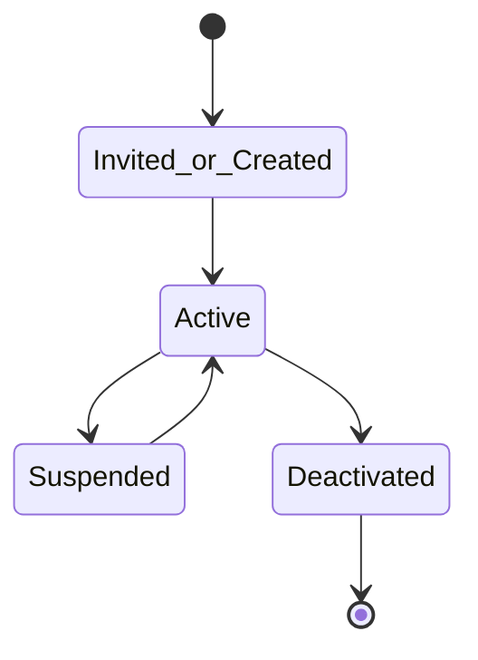
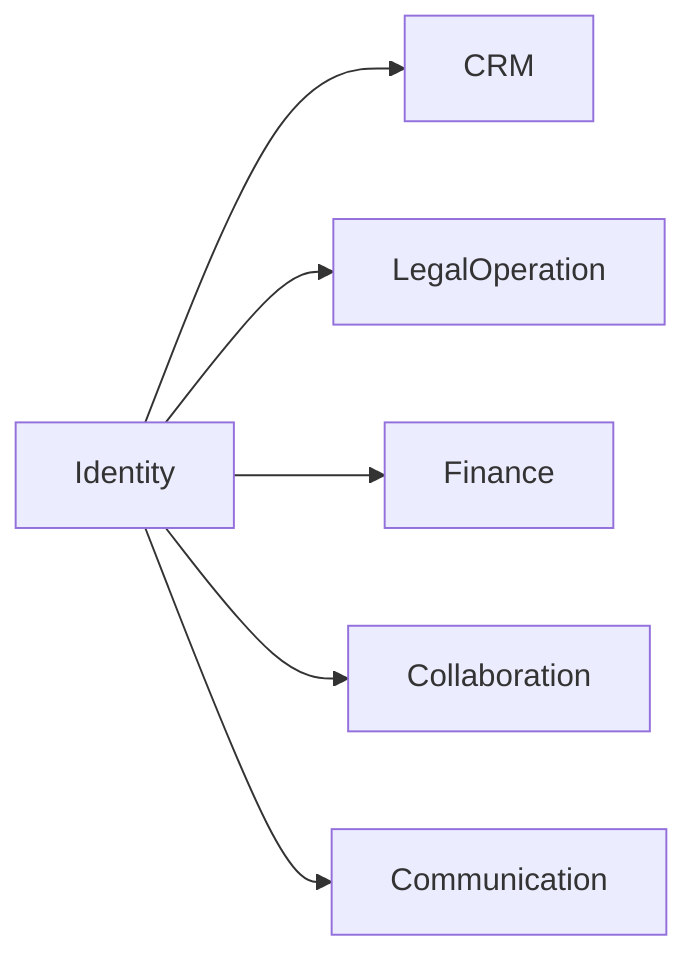
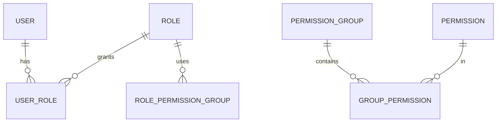
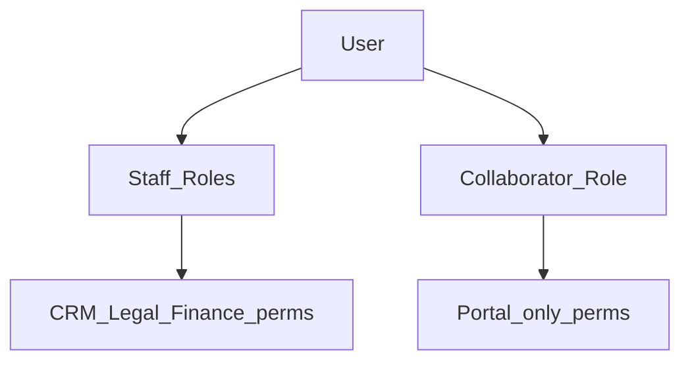

# Identity — DYN CRM

> Vietnamese version: [Identity.vi.md](./Identity.vi.md)

## 1. Purpose

Define the **Identity** business capability: users, authentication subjects, roles, permissions, permission groups, and extension points for organization/department structure that is **not finalized**.

## 2. Scope

| In scope | Out of scope |
|----------|--------------|
| User lifecycle, roles, permissions | ABAC / policy engine |
| Permission naming `resource.action` | Page-based permission design |
| Org/Department as **extension points** | Final org chart (unknown) |
| Mapping to Supabase Auth subject | Cookie/JWT implementation (Security.md) |

## 3. Business Capability

| Capability | MVP |
|------------|-----|
| User management | Yes |
| Role assignment | Yes |
| Permission checks | Yes (RBAC) |
| Permission Group (bundle) | Yes (recommended for admin UX) |
| Organization / Department | Extension point only — structure TBD |
| CTV vs staff principals | **Re-lock** — `COLLABORATOR` not assumed after 2026-08-17 |

Roles remain **configurable** (assignable permission sets), while MVP ships the Glossary role names as initial bundles.

### Configurable permission philosophy

```text
Permission  →  Permission Group  →  Role  →  User
```

| Layer | Responsibility |
|-------|----------------|
| **Permission** | Atomic `resource.action` capability (deny if unknown) |
| **Permission Group** | Admin-friendly bundle of related permissions |
| **Role** | Assignable named set (Glossary starters + custom later) |
| **User** | Principal receiving one or more roles |

Philosophy: configure **functions**, not pages; keep bundles editable without redeploying product code. Isolate any future partner bundles from staff CRM/Legal/Finance bundles **if** a partner role is re-approved.

## 4. Actors

| Actor | Notes |
|-------|-------|
| Super Admin | Full identity administration |
| Admin | User/role administration within policy |
| All staff roles | Consume permissions |
| Chi approver (“Nhi”) | Finance expense approval — **not a Glossary role yet** (Open Q) |
| CTV / Collaborator | **Not an MVP login principal** unless Collaboration S6 is reversed |

## 5. Business Lifecycle

### 5.1 User



> Provisioning flows (invite-only vs self-register) → Open Questions (Security TODO).

### 5.2 Auth subject ↔ User


## 6. Main Business Objects

| Object | Meaning |
|--------|---------|
| User | CRM principal |
| Role | Named Glossary role or custom configurable role |
| Permission | `resource.action` code |
| Permission Group | Bundle of permissions assignable to roles |
| Organization | Future container (extension) |
| Department | Future unit (extension) |
| Auth subject link | Provider user id mapping |

### Permission examples (by function)

| Permission |
|------------|
| `customer.read` |
| `customer.update` |
| `contract.approve` |
| `invoice.export` |
| `payment.record` |
| `commission.read_own` |
| `user.manage` |

## 7. Business Rules

1. Simple **RBAC only** — no ABAC in MVP (brief).  
2. Permission by **function**, not by UI page.  
3. Unknown permission ⇒ deny (Security).  
4. Deactivated user cannot use the system even if IdP login succeeds (Security).  
5. Do not ship a `COLLABORATOR` portal bundle unless Collaboration is re-approved (2026-08-17).  
6. Organization/Department **not required** for MVP authorization; leave nullable extension fields/concepts for later.  
7. Roles listed in Phase 00 remain the starter set **except** Collaborator pending Scope re-lock; additional custom roles allowed if Admin configures permissions carefully.  
8. Expense approval must be a **permission** (and optionally a named user) — do not hard-code the person “Nhi” in domain code.

## 8. Permission Matrix (identity administration)

| Permission | Super Admin | Admin | Manager | Others |
|------------|-------------|-------|---------|--------|
| `user.manage` | Y | Y | N | N |
| `role.manage` | Y | Y | N | N |
| `permission.manage` | Y | Open Q | N | N |
| `org.manage` | Future | Future | — | — |

Operational permission matrices for CRM/Legal/Finance live in those domain docs.

## 9. Business Events

| Event | When |
|-------|------|
| `UserCreated` / `UserActivated` / `UserDeactivated` | Lifecycle |
| `RoleAssigned` / `RoleRevoked` | Access change |
| `PermissionGroupChanged` | Bundle edits |
| `UserLoggedIn` / `UserLoginFailed` | Auth signals (also Communication/Monitoring) |

## 10. Interaction with Other Domains



Every domain references `userId` for Owner, Assignee, Actor — never embeds IdP SDK types (Phase 01).

## 11. Future Extension

| Item | Notes |
|------|-------|
| Organization / Department hierarchy | When org model locked |
| ABAC / attribute rules | Explicitly deferred |
| SSO enterprise IdP | AuthPort swap |
| Multi-tenant org isolation | SaaS phase |

## 12. Mermaid Diagrams

### 12.1 RBAC model



### 12.2 Staff vs CTV



## 13. Open Questions

1. Staff provisioning: admin invite only?  
2. Is `COLLABORATOR` role removed from MVP? (schema-critical with S6)  
3. Are custom roles allowed in MVP beyond the remaining Glossary roles?  
4. Is Permission Group mandatory or can permissions attach directly to roles?  
5. Minimum Organization/Department fields to reserve for future without implementing UI?  
6. Owner vs Follower permission difference (cross-cut with CRM/Security)?  
7. How is Chi approver “Nhi” represented (named User vs Role vs permission assignment)?

## 14. TODO

- [ ] Confirm `COLLABORATOR` role removed vs restored with S6  
- [ ] Map expense approver to User/Role/permission (do not hard-code a person)  
- [ ] Lock provisioning flows  
- [ ] Publish MVP role → permission group bundles  
- [ ] Confirm Permission Group modeling choice  
- [ ] Document reserved org/department extension without requiring MVP screens  

## 15. Aggregate Boundaries

| Aggregate Root | Children / parts | Boundary rule |
|----------------|------------------|---------------|
| **User** | Status, auth-subject link, role assignments | Owns principal lifecycle |
| **Role** | Links to Permission Groups (and/or permissions — Open Q) | Configurable named access set |
| **Permission** | `resource.action` code | Atomic; catalog-owned |
| **Permission Group** | Set of Permissions | Bundle for admin UX |
| **Organization / Department** | Extension only | Not required for MVP auth decisions |

## 16. Domain Invariants

| ID | Invariant |
|----|-----------|
| ID-I1 | Unknown permission ⇒ **deny** |
| ID-I2 | Disabled / deactivated user cannot access the system |
| ID-I3 | Permission codes are unique |
| ID-I4 | Do not grant a partner portal bundle unless Collaboration is re-approved |
| ID-I5 | Authorization is RBAC only in MVP (no ABAC) |
| ID-I6 | Permissions are function-based (`resource.action`), not page-based |

## 17. Primary Business Use Cases

| ID | Use case |
|----|----------|
| UC01 | Create / invite User |
| UC02 | Activate / suspend / deactivate User |
| UC03 | Assign / revoke Role |
| UC04 | Manage Permission Group |
| UC05 | Publish role → permission bundles |
| UC06 | Map Auth subject ↔ User |
| UC07 | Enforce permission check on business actions |

## 18. Ownership Matrix

| Business Object | Owner Domain | Referenced By |
|-----------------|--------------|---------------|
| User | Identity | All domains |
| Role / Permission / Permission Group | Identity | All domains (consume checks) |
| Auth subject link | Identity | Security (technical) |
| Organization / Department | Identity (future) | — |

## 19. Domain Event Matrix

| Event | Producer | Consumers |
|-------|----------|-----------|
| `UserCreated` / `UserActivated` / `UserDeactivated` | Identity | Communication, all domains (access) |
| `RoleAssigned` / `RoleRevoked` | Identity | Communication (optional), audit |
| `PermissionGroupChanged` | Identity | Audit / admin notify |
| `UserLoggedIn` / `UserLoginFailed` | Identity | Communication, Monitoring |

## 20. Business Constraints

| Constraint |
|------------|
| Permission code must be unique |
| Deactivated user retains history but cannot act |
| Staff vs partner bundles remain isolated **if** a partner role exists |
| Org/Department not required to authorize MVP actions |

## 21. Dynamic Features

| Feature | Stance |
|---------|--------|
| Permission → Group → Role → User | Core configurable hierarchy (§3) |
| Custom roles | Open Q for MVP breadth |
| Org chart | Extension point only |

## 22. Business Metrics

| Metric | Purpose |
|--------|---------|
| Active users by role | Capacity / licensing later |
| Failed login rate | Security health |
| Role assignment churn | Access governance |
| CTV vs staff active count | **N/A** unless Collaborator role restored |

## 23. Cross Domain Dependency

| | Domains |
|--|---------|
| **Depends on** | — (foundation; AuthPort is infrastructure) |
| **Provides to** | CRM, Legal, Finance, Communication |
| **Does not own** | Business object lifecycles (Customer, Contract, Payment, …) |
