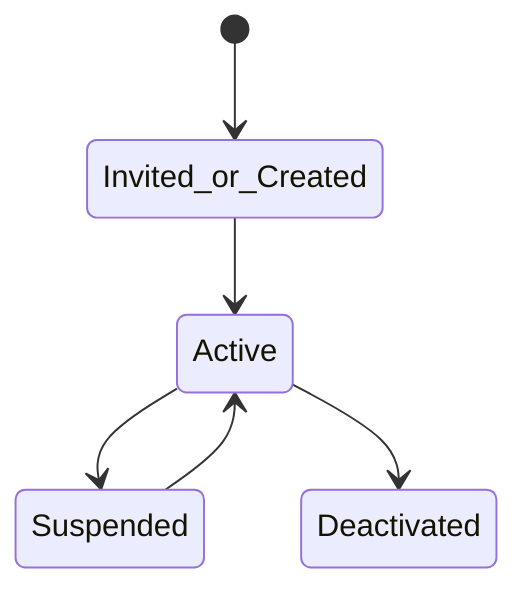
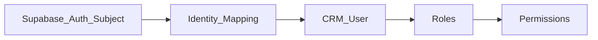
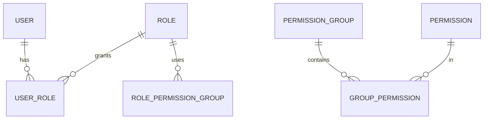

# Identity — DYN CRM

> Bản tiếng Việt của [Identity.md](./Identity.md). Canonical: English.

**2026-08-17:** Role `COLLABORATOR` **không giả định** trừ khi S6 đảo. Người duyệt Chi (“Nhi”) **chưa** là role Glossary — map User/Role/permission **OPEN**; không hard-code tên người trong domain.

## 1. Mục đích

Định nghĩa năng lực **Identity**: user, subject xác thực, role, permission, permission group, và điểm mở rộng Organization/Department (**chưa chốt** cấu trúc tổ chức).

## 2. Phạm vi

User/role/permission; đặt tên `resource.action`; org/department chỉ extension. Ngoài: ABAC; permission theo trang UI; sơ đồ tổ chức cuối.

## 3. Năng lực

Quản lý user; gán role; RBAC; Permission Group (khuyến nghị); Organization/Department = extension; phân biệt CTV vs nhân sự.

Role **cấu hình được**; MVP đi kèm bộ role Glossary ban đầu.

### Triết lý permission cấu hình được

```text
Permission  →  Permission Group  →  Role  →  User
```

| Lớp | Trách nhiệm |
|-----|-------------|
| **Permission** | Năng lực nguyên tử `resource.action` (unknown ⇒ deny) |
| **Permission Group** | Bundle thân thiện Admin |
| **Role** | Tập đặt tên gán được (Glossary + custom sau) |
| **User** | Principal nhận một hoặc nhiều role |

Cấu hình theo **chức năng**, không theo trang; bundle sửa được không redeploy; cô lập bundle portal CTV khỏi CRM/Legal/Finance nhân sự.

## 4. Actor

Super Admin; Admin; mọi role nhân sự; CTV (portal).

## 5. Vòng đời





## 6. Đối tượng chính

User, Role, Permission, Permission Group, Organization (future), Department (future), Auth subject link.

Ví dụ permission: `customer.read`, `customer.update`, `contract.approve`, `invoice.export`, …

## 7. Quy tắc

RBAC only; permission theo function; deny mặc định; user deactivated vẫn bị chặn dù IdP login; CTV không nhận bundle CRM nhân sự; Org/Department không bắt buộc MVP.

## 8. Permission (quản trị identity)

`user.manage`, `role.manage`, `permission.manage` — Super Admin/Admin; `org.manage` future.

## 9. Events

`UserCreated/Activated/Deactivated`, `RoleAssigned/Revoked`, `PermissionGroupChanged`, `UserLoggedIn/LoginFailed`.

## 10. Tương tác

Mọi domain tham chiếu `userId` (Owner, Assignee, Actor).

## 11. Mở rộng

Cây Organization/Department; ABAC; SSO; multi-tenant.

## 12. Sơ đồ



## 13. Open Questions

1. Provision nhân sự: chỉ invite admin?  
2. Role `COLLABORATOR` có gỡ khỏi MVP không? (schema-critical với S6)  
7. “Nhi” duyệt Chi: User định danh, Role, hay chỉ gán permission?  
3. Cho phép custom role ngoài 8 role Glossary trong MVP?  
4. Permission Group bắt buộc hay gắn trực tiếp role?  
5. Field org/department dự trữ?  
6. Owner vs Follower?

## 14. TODO

- [ ] Khóa luồng provision  
- [ ] Công bố bundle role → permission MVP  
- [ ] Chốt mô hình Permission Group  
- [ ] Ghi extension org/department không bắt UI MVP  

## 15. Aggregate Boundaries

| Aggregate Root | Con / thành phần | Quy tắc ranh giới |
|----------------|------------------|-------------------|
| **User** | Status, link auth-subject, gán role | Sở hữu vòng đời principal |
| **Role** | Link Permission Group (và/hoặc permission — Open Q) | Tập truy cập đặt tên cấu hình được |
| **Permission** | Mã `resource.action` | Nguyên tử; catalog sở hữu |
| **Permission Group** | Tập Permission | Bundle UX Admin |
| **Organization / Department** | Chỉ extension | Không bắt buộc cho quyết định auth MVP |

## 16. Domain Invariants

| ID | Invariant |
|----|-----------|
| ID-I1 | Permission không biết ⇒ **deny** |
| ID-I2 | User disabled / deactivated không truy cập hệ thống |
| ID-I3 | Mã permission là duy nhất |
| ID-I4 | Role CTV không nhận bundle CRM/Legal/Finance nhân sự |
| ID-I5 | MVP chỉ RBAC (không ABAC) |
| ID-I6 | Permission theo chức năng (`resource.action`), không theo trang |

## 17. Primary Business Use Cases

| ID | Use case |
|----|----------|
| UC01 | Tạo / mời User |
| UC02 | Activate / suspend / deactivate User |
| UC03 | Gán / thu hồi Role |
| UC04 | Quản lý Permission Group |
| UC05 | Công bố bundle role → permission |
| UC06 | Map Auth subject ↔ User |
| UC07 | Enforce kiểm tra permission trên hành động nghiệp vụ |

## 18. Ownership Matrix

| Đối tượng | Domain sở hữu | Được tham chiếu bởi |
|-----------|---------------|---------------------|
| User | Identity | Mọi domain |
| Role / Permission / Permission Group | Identity | Mọi domain (tiêu thụ check) |
| Auth subject link | Identity | Security (kỹ thuật) |
| Organization / Department | Identity (tương lai) | — |

## 19. Domain Event Matrix

| Event | Producer | Consumers |
|-------|----------|-----------|
| `UserCreated` / `UserActivated` / `UserDeactivated` | Identity | Communication, mọi domain (access) |
| `RoleAssigned` / `RoleRevoked` | Identity | Communication (tuỳ chọn), audit |
| `PermissionGroupChanged` | Identity | Audit / thông báo admin |
| `UserLoggedIn` / `UserLoginFailed` | Identity | Communication, Monitoring |

## 20. Business Constraints

| Ràng buộc |
|-----------|
| Mã permission phải duy nhất |
| User deactivated giữ lịch sử nhưng không hành động |
| Bundle nhân sự vs CTV giữ cô lập |
| Org/Department không bắt buộc để authorize MVP |

## 21. Dynamic Features

| Tính năng | Lập trường |
|-----------|------------|
| Permission → Group → Role → User | Hierarchy cấu hình cốt lõi (§3) |
| Custom role | Open Q về độ rộng MVP |
| Sơ đồ org | Chỉ extension point |

## 22. Business Metrics

| Metric | Mục đích |
|--------|----------|
| User active theo role | Capacity / licensing sau |
| Tỷ lệ login thất bại | Sức khỏe bảo mật |
| Churn gán role | Quản trị truy cập |
| Số CTV vs nhân sự active | Mix đối tác / nội bộ |

## 23. Cross Domain Dependency

| | Domain |
|--|--------|
| **Phụ thuộc** | — (nền tảng; AuthPort là hạ tầng) |
| **Cung cấp cho** | CRM, Legal, Finance, Collaboration, Communication |
| **Không sở hữu** | Vòng đời đối tượng nghiệp vụ (Customer, Contract, Payment, …) |
