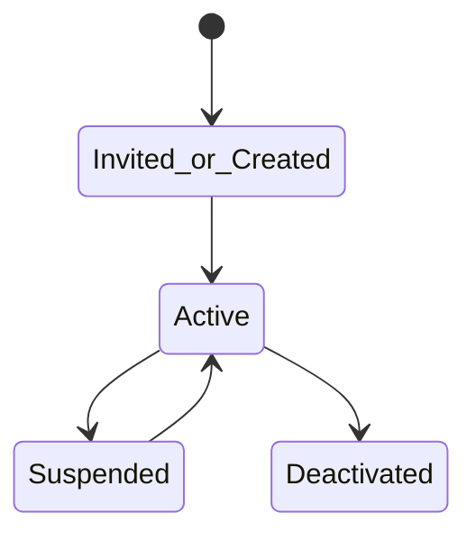
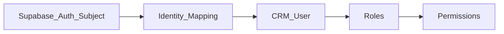
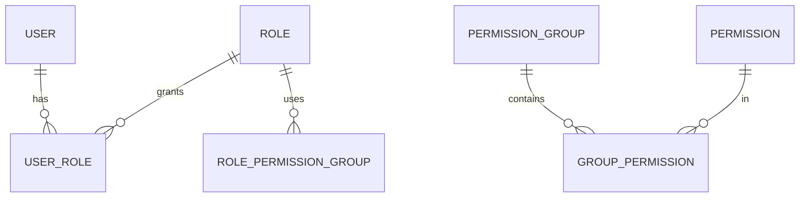

# Identity — DYN CRM

> Bản tiếng Việt của [Identity.md](./Identity.md). Canonical: English.

## 1. Mục đích

Định nghĩa năng lực **Identity**: user, subject xác thực, role, permission, permission group, và điểm mở rộng Organization/Department (**chưa chốt** cấu trúc tổ chức).

## 2. Phạm vi

User/role/permission; đặt tên `resource.action`; org/department chỉ extension. Ngoài: ABAC; permission theo trang UI; sơ đồ tổ chức cuối.

## 3. Năng lực

Quản lý user; gán role; RBAC; Permission Group (khuyến nghị); Organization/Department = extension; phân biệt CTV vs nhân sự.

Role **cấu hình được**; MVP đi kèm bộ role Glossary ban đầu.

## 4. Actor

Super Admin; Admin; mọi role nhân sự; CTV (portal).

## 5. Vòng đời

## 6. Đối tượng chính

User, Role, Permission, Permission Group, Organization (future), Department (future), Auth subject link.

Ví dụ permission: `customer.read`, `customer.update`, `contract.approve`, `invoice.export`, …

## 7. Quy tắc

RBAC only; permission theo function; deny mặc định; user deactivated vẫn bị chặn dù IdP login; CTV không nhận bundle CRM nhân sự; Org/Department không bắt buộc MVP.

## 8. Permission (quản trị identity)

`user.manage`, `role.manage`, `permission.manage` — Super Admin/Admin; `org.manage` future.

## 9. Events

`UserCreated/Activated/Deactivated`, `RoleAssigned/Revoked`, `PermissionGroupChanged`, `UserLoggedIn/LoginFailed`.

## 10. Tương tác

Mọi domain tham chiếu `userId` (Owner, Assignee, Actor).

## 11. Mở rộng

Cây Organization/Department; ABAC; SSO; multi-tenant.

## 12. Sơ đồ

## 13. Open Questions

1. Provision nhân sự: chỉ invite admin?  
2. Provision CTV?  
3. Cho phép custom role ngoài 8 role Glossary trong MVP?  
4. Permission Group bắt buộc hay gắn trực tiếp role?  
5. Field org/department dự trữ?  
6. Owner vs Follower?

## 14. TODO

- [ ] Khóa luồng provision  
- [ ] Công bố bundle role → permission MVP  
- [ ] Chốt mô hình Permission Group  
- [ ] Ghi extension org/department không bắt UI MVP  
