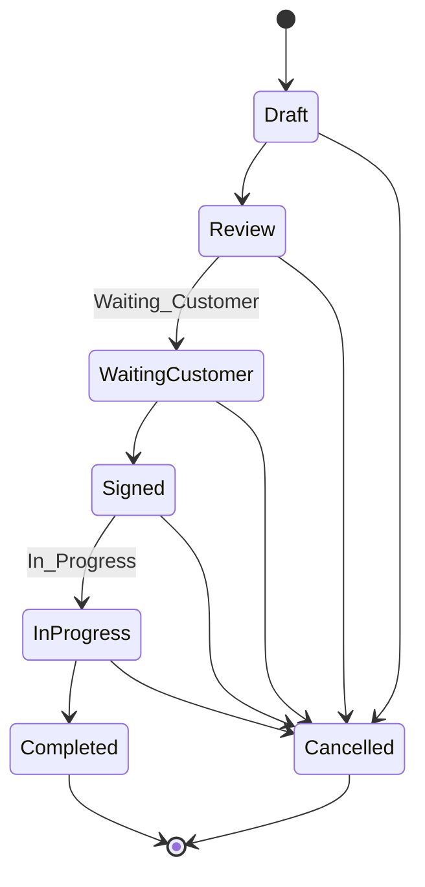
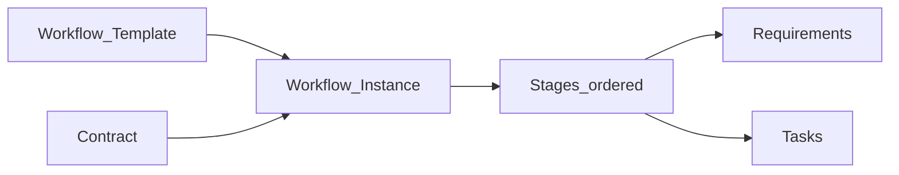
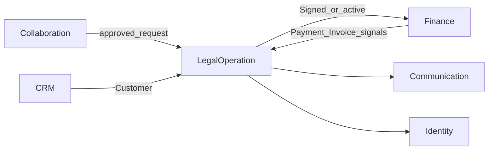
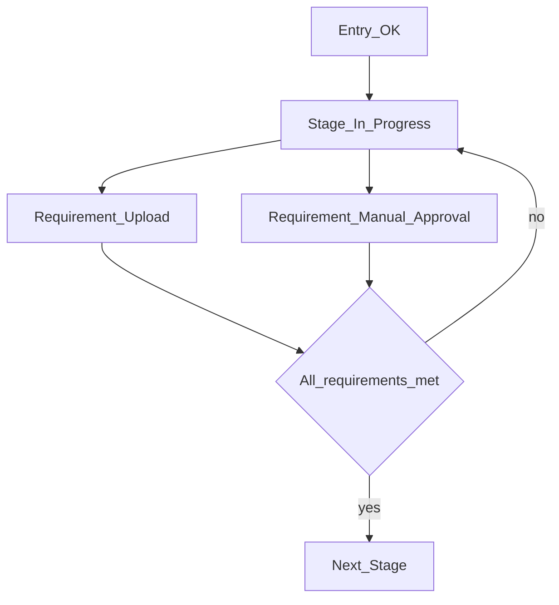
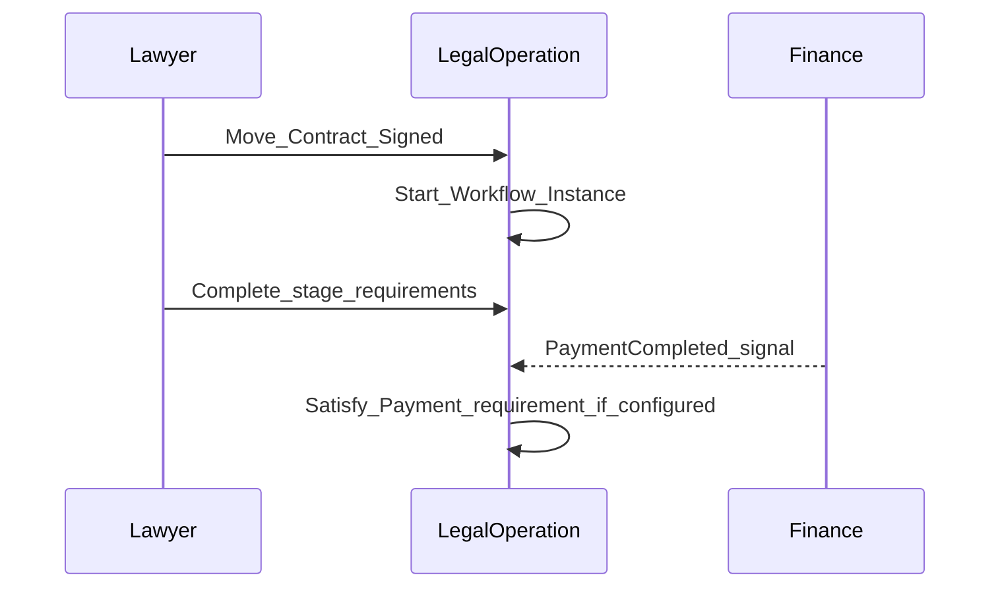
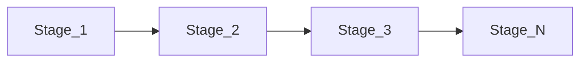

# Legal Operation — DYN CRM

> Vietnamese version: [LegalOperation.vi.md](./LegalOperation.vi.md)

## 1. Purpose

Define the **Legal Operation** capability: official Contract lifecycle, configurable Workflow/Kanban (not BPMN), Tasks, Documents, and Timeline for legal delivery.

## 2. Scope

| In scope | Out of scope |
|----------|--------------|
| Contract statuses and transitions | Practice-area specialization packs |
| Workflow templates, stages, requirements | Full BPMN / rule engine |
| Tasks, documents, Kanban | Finance ledger (Finance.md) |
| Link from approved Contract Request | CTV portal UX |

## 3. Business Capability

| Capability | MVP |
|------------|-----|
| Contract lifecycle | Yes |
| Configurable workflow templates | Yes |
| Kanban by stages | Yes |
| Stage requirements | Yes (configurable types) |
| Tasks + due dates + assignees | Yes |
| Documents (metadata + storage via port) | Yes |
| Timeline / activity | Yes |

Admin configures: template, stages, stage order, stage requirements.

### Requirement type examples (configurable)

| Requirement type | Meaning |
|------------------|---------|
| Upload Contract | Document uploaded |
| Manual Approval | Named role/user approves |
| Payment Completed | Signal from Finance (collected) |
| Invoice Issued | Signal from Finance |
| Task Completed | Linked tasks done |
| Sepay Verification | **Future** automatic verification |

## 4. Actors

| Actor | Responsibility |
|-------|----------------|
| Admin | Workflow templates & requirements |
| Lawyer | Contract progress, tasks, documents |
| Legal Assistant | Task/document support |
| Manager | Oversight / approvals when configured |
| Accounting | Provides finance signals; does not own contract text |
| CTV | May origin via Contract Request only — no official contract create |

## 5. Business Lifecycle

### 5.1 Contract statuses (Phase 00 locked labels)

> **Open Question:** Exact Cancelled transition matrix still not product-locked (Phase 00 TODO). Diagram is a working assumption.

### 5.2 Workflow instance vs Contract

**Architect note (Phase 00/01):** Contract status = commercial/legal lifecycle. Workflow = operational execution. Auto-complete Contract from Workflow is **forbidden** until an explicit rule is locked.

## 6. Main Business Objects

| Object | Meaning |
|--------|---------|
| Contract | Official legal agreement with Customer |
| Workflow Template | Admin-defined stage configuration |
| Workflow Instance | Template applied to a Contract (or work context) |
| Stage | Ordered step with entry/exit conditions |
| Stage Requirement | Gate on a stage |
| Task | Assignable work with due date |
| Document / File metadata | Attachment linked to Contract/work |
| Timeline entry | Legal activity history |

### Stage definition pattern

| Aspect | Content |
|--------|---------|
| Entry condition | What must be true to enter |
| Exit condition | What must be true to leave |
| Responsible role | Role(s) accountable |

## 7. Business Rules

1. Contract status labels follow Glossary / Phase 00.  
2. Official Contract created by staff (optionally after Collaboration approval).  
3. Workflow configurable by Admin — no BPMN engine (Phase 00).  
4. Tasks support Assignee, Due Date, Reminder (Phase 00).  
5. File bytes via StoragePort; Legal owns metadata for contract/work files (Phase 01 Module).  
6. Sepay Verification is a requirement **type placeholder** for future — not MVP automation unless Scope adds it.  
7. Do not silently set Contract=`Completed` when workflow tasks finish without a locked rule.

## 8. Permission Matrix

| Permission (illustrative) | Admin | Lawyer | Legal Assistant | Manager | CTV |
|---------------------------|-------|--------|-----------------|---------|-----|
| `workflow_template.manage` | Y | N | N | Open Q | N |
| `contract.read` | Y | Y | Y | Y | N |
| `contract.write` | Y | Y | Limited | Open Q | N |
| `contract.approve` / status transition | Policy | Y | Limited | Y | N |
| `task.write` | Y | Y | Y | Y | N |
| `document.upload` | Y | Y | Y | Y | Request only* |

\*CTV attachments on Contract Request belong to Collaboration until promoted.

## 9. Business Events

| Event | When |
|-------|------|
| `ContractCreated` | Official contract created |
| `ContractStatusChanged` | Status transition |
| `WorkflowStarted` | Instance created |
| `StageEntered` / `StageCompleted` | Stage movement |
| `RequirementSatisfied` | Gate cleared |
| `TaskCreated` / `TaskCompleted` / `TaskOverdue` | Task lifecycle |
| `DocumentUploaded` | File attached |

## 10. Interaction with Other Domains

## 11. Future Extension

| Item | Notes |
|------|-------|
| Practice-area templates | Labor, Civil, Business, IP, Litigation |
| Sepay auto verification | Requirement automation |
| Court/litigation calendars | Out of MVP |

## 12. Mermaid Diagrams

### 12.1 Stage with requirements

### 12.2 Contract and workflow parallelism

### 12.3 Kanban view (conceptual)

## 13. Open Questions

1. Final Cancelled transition matrix from each status?  
2. Rule linking Contract `Completed` to workflow completion (mandatory tasks vs manager override)?  
3. Which finance signals are first-class requirements in MVP templates?  
4. Default template for “general legal consulting”?  
5. Can multiple workflow instances exist per Contract?  
6. Document retention / versioning policy?

## 14. TODO

- [ ] Lock Cancelled matrix  
- [ ] Lock Contract↔Workflow completion rule  
- [ ] Publish default MVP template (stages + requirements)  
- [ ] Confirm Sepay as future-only vs MVP stub  
