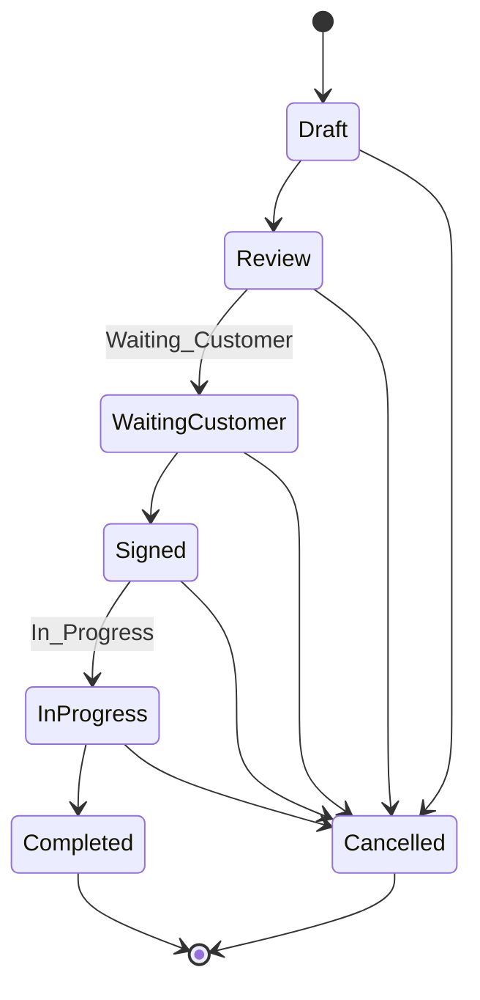
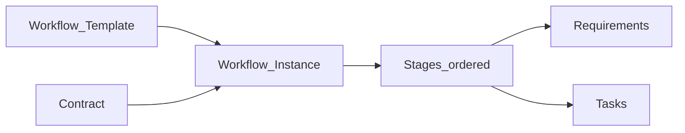
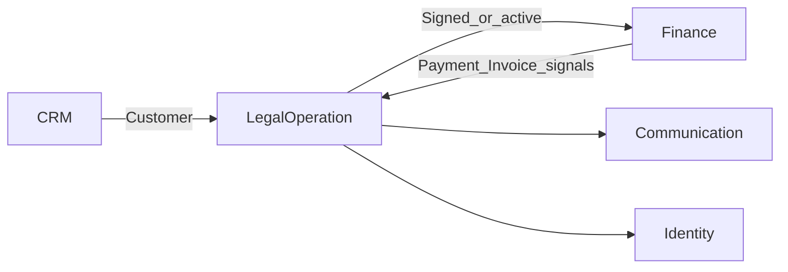
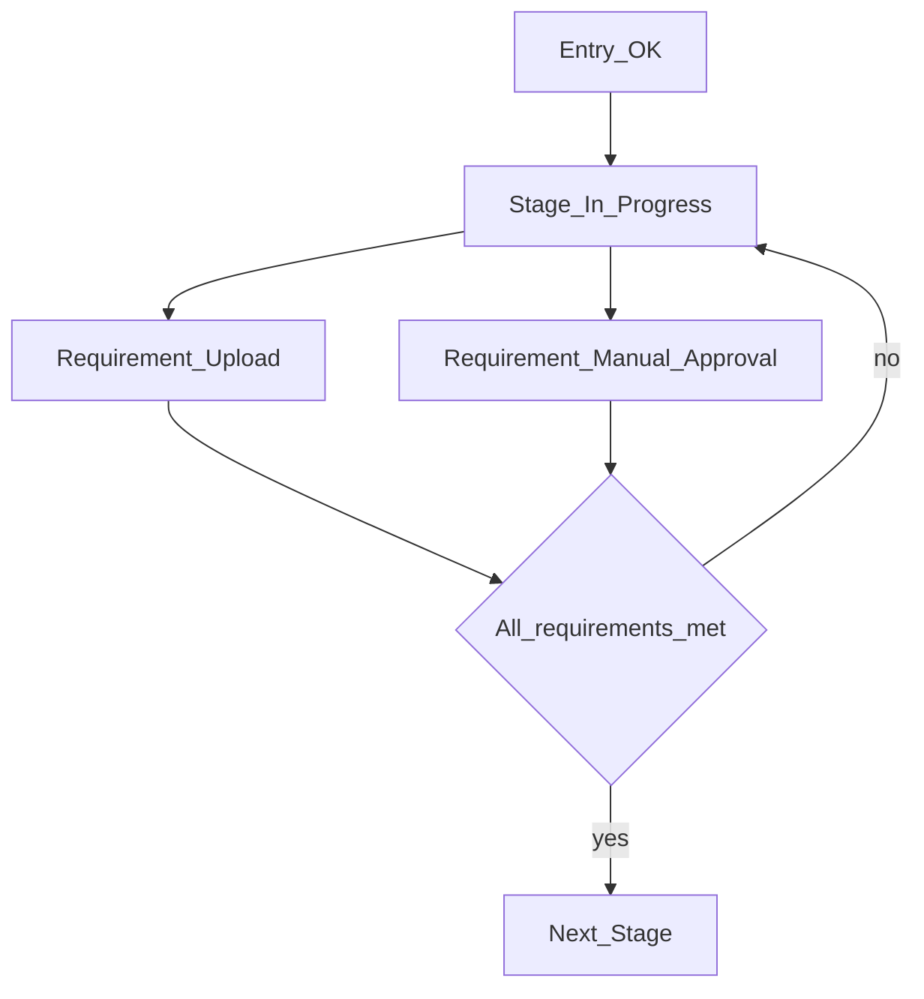
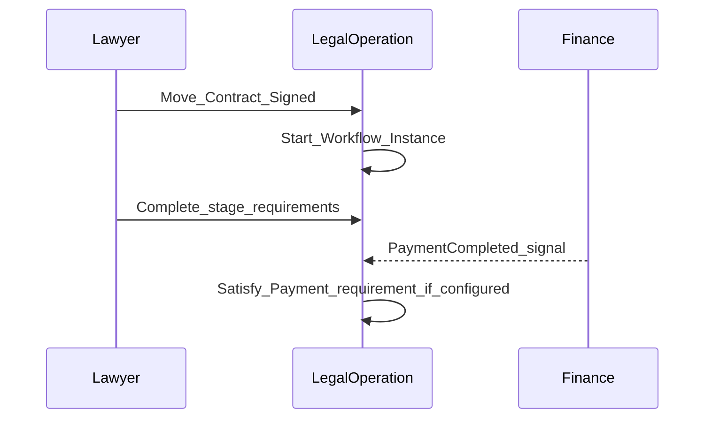

# Legal Operation — DYN CRM

> Vietnamese version: [LegalOperation.vi.md](./LegalOperation.vi.md)

## 1. Purpose

Define the **Legal Operation** capability: official Contract lifecycle, configurable Workflow/Kanban (not BPMN), Tasks, Documents, and Timeline for legal delivery.

## 2. Scope

| In scope | Out of scope |
|----------|--------------|
| Contract statuses and transitions | Practice-area specialization packs |
| Workflow templates, stages, requirements | Full BPMN / rule engine |
| Tasks, documents, Kanban (configurable columns) | Finance ledger (Finance.md) |
| Unique contract number | CTV Contract Request / portal — **SUPERSEDED 2026-08-17** |

## 3. Business Capability

| Capability | MVP |
|------------|-----|
| Contract lifecycle | Yes |
| Configurable workflow templates | Yes |
| Kanban by stages | Yes |
| Stage requirements | Yes (configurable types) |
| Tasks + due dates + assignees | Yes |
| Documents (metadata + storage via port) | Yes |
| Timeline / activity | Yes |
| Unique contract number | Yes (2026-08-17) |
| Configurable Kanban columns | Yes — **as Workflow Stages unless re-locked as Contract Status** |

Admin configures: template, stages, stage order, stage requirements. Authorized users may **add/edit Kanban columns**.

### Contract Status vs Workflow Stage (do not collapse)

| Concept | Meaning | Persistence guidance |
|---------|---------|----------------------|
| **Contract Status** | Legal/commercial lifecycle (Glossary labels: Draft → … → Completed / Cancelled) | Locked labels today. Making these user-configurable is a **business-rule change** — do not treat as a Prisma enum *if* stakeholders mean editable lifecycle. |
| **Workflow Stage / Kanban column** | Operational board column | **Configurable data**, not a hard-coded Prisma enum |

**OPEN (schema-critical):** Are Kanban columns **Workflow Stages** or **actual Contract lifecycle statuses**?

Preferred direction until re-lock: keep Contract Status as the legal lifecycle; Kanban shows configurable **Workflow Stages**.

### Requirement type examples (configurable)

Workflow gates are **typed requirements**, not BPMN. Admin selects types per stage; the engine only checks satisfaction — it does not run process models.

| Requirement type | Meaning | MVP |
|------------------|---------|-----|
| File Upload | Required document(s) uploaded | Yes |
| Manual Approval | Named role/user approves | Yes |
| Payment Completed | Signal from Finance (collected) | Yes (signal) |
| Invoice Issued | Signal from Finance | Yes (signal) |
| Task Completed | Linked tasks done | Yes |
| Signature | Contract/customer signature captured | Yes (manual/process) |
| Custom Boolean | Admin-defined yes/no gate | Yes (simple) |
| External Verification (e.g. SePay) | Automatic verification signal | Candidate via Finance PaymentProviderPort — **OPEN** if a Legal requirement |

## 4. Actors

| Actor | Responsibility |
|-------|----------------|
| Admin | Workflow templates & requirements |
| Lawyer | Contract progress, tasks, documents |
| Legal Assistant | Task/document support |
| Manager | Oversight / approvals when configured |
| Accounting | Provides finance signals; does not own contract text |
| CTV | **Not an actor** unless Collaboration is re-approved (2026-08-17) |

## 5. Business Lifecycle

### 5.1 Contract statuses (Phase 00 locked labels)

> **Open Question:** Exact Cancelled transition matrix still not product-locked (Phase 00 TODO). Diagram is a working assumption.

### 5.2 Workflow instance vs Contract

**Architect note (Phase 00/01):** Contract status = commercial/legal lifecycle. Workflow = operational execution. Auto-complete Contract from Workflow is **forbidden** until an explicit rule is locked.

## 6. Main Business Objects

| Object | Meaning |
|--------|---------|
| Contract | Official legal agreement with Customer |
| Contract number | Business identifier — **must be unique** (2026-08-17) |
| Workflow Template | Admin-defined stage configuration |
| Workflow Instance | Template applied to a Contract (or work context) |
| Stage | Ordered step with entry/exit conditions |
| Stage Requirement | Gate on a stage |
| Task | Assignable work with due date |
| Document / File metadata | Attachment linked to Contract/work |
| Timeline entry | Legal activity history |

### Stage definition pattern

| Aspect | Content |
|--------|---------|
| Entry condition | What must be true to enter |
| Exit condition | What must be true to leave |
| Responsible role | Role(s) accountable |

## 7. Business Rules

1. Contract status labels follow Glossary / Phase 00 **until** stakeholders re-lock them as configurable (see Kanban Open Question).  
2. Official Contract is created by staff. Contract Request origin is **not** in MVP unless Collaboration is restored.  
3. Workflow configurable by authorized users — no BPMN engine (Phase 00). Kanban columns are **data**, not a hard-coded enum.  
4. Tasks support Assignee, Due Date, Reminder (Phase 00).  
5. File bytes via StoragePort; Legal owns metadata for contract/work files (Phase 01 Module).  
6. SePay is a Finance **PaymentProviderPort** concern; Legal may consume a verification signal as a requirement type — not a SePay SDK.  
7. Do not silently set Contract=`Completed` when workflow tasks finish without a locked rule.  
8. **Contract number must not be duplicated.** Database uniqueness is mandatory; application-only checks are **not** sufficient. Duplicate attempt is **rejected** (business error). Numbering algorithm (manual vs generated) is **OPEN** — do not invent one.

## 8. Permission Matrix

| Permission (illustrative) | Admin | Lawyer | Legal Assistant | Manager |
|---------------------------|-------|--------|-----------------|---------|
| `workflow_template.manage` | Y | N | N | Open Q |
| `kanban_column.configure` | Y | Open Q | N | Open Q |
| `contract.read` | Y | Y | Y | Y |
| `contract.write` | Y | Y | Limited | Open Q |
| `contract.approve` / status transition | Policy | Y | Limited | Y |
| `task.write` | Y | Y | Y | Y |
| `document.upload` | Y | Y | Y | Y |

CTV contract-request attachments are **out** unless Collaboration is restored.

## 9. Business Events

| Event | When |
|-------|------|
| `ContractCreated` | Official contract created |
| `ContractStatusChanged` | Status transition |
| `WorkflowStarted` | Instance created |
| `StageEntered` / `StageCompleted` | Stage movement |
| `RequirementSatisfied` | Gate cleared |
| `TaskCreated` / `TaskCompleted` / `TaskOverdue` | Task lifecycle |
| `DocumentUploaded` | File attached |

## 10. Interaction with Other Domains

> Collaboration → Legal handoff is **not** in the implementation path unless S6 is reversed.

## 11. Future Extension

| Item | Notes |
|------|-------|
| Practice-area templates | Labor, Civil, Business, IP, Litigation |
| SePay auto verification | Finance PaymentProviderPort; optional Legal requirement |
| Court/litigation calendars | Out of MVP |

## 12. Mermaid Diagrams

### 12.1 Stage with requirements

### 12.2 Contract and workflow parallelism

### 12.3 Kanban view (conceptual)

## 13. Open Questions

### Schema-critical

1. **Are Kanban columns Workflow Stages or actual Contract lifecycle statuses?**  
2. If Contract Status itself must be configurable, confirm this as a **business-rule change** to Glossary §4.3.  
3. Contract number: **manual entry** vs **generated**? (Uniqueness is locked.)  
4. Final Cancelled transition matrix from each status?  
5. Rule linking Contract `Completed` to workflow completion (mandatory tasks vs manager override)?  
6. Can multiple workflow instances exist per Contract?

### Non-schema-critical

7. Which finance signals are first-class requirements in MVP templates?  
8. Default template for “general legal consulting”?  
9. Document retention / versioning policy?

## 14. TODO

- [ ] Lock Kanban = Stage vs Status  
- [ ] Lock contract-number allocation (manual vs generated)  
- [ ] Lock Cancelled matrix  
- [ ] Lock Contract↔Workflow completion rule  
- [ ] Publish default MVP template (stages + requirements)  
- [x] Unique contract number invariant (2026-08-17)  
- [x] Configurable Kanban columns (data, not Prisma enum) — pending Stage vs Status lock  

## 15. Aggregate Boundaries

| Aggregate Root | Children / parts | Boundary rule |
|----------------|------------------|---------------|
| **Contract** | Status, **unique contract number**, parties reference (Customer), timeline | Owns official agreement lifecycle |
| **Workflow Template** | Stages, stage requirements, order | Admin-owned configuration; instances copy/apply |
| **Workflow Instance** | Current stage, requirement satisfaction state | Bound to one Contract (multi-instance → Open Q) |
| **Task** | Assignee, due date, completion | Owned under Legal work context / Contract |
| **Document metadata** | Link to Contract/work; bytes via StoragePort | Metadata ownership in Legal; storage is infrastructure |

## 16. Domain Invariants

| ID | Invariant |
|----|-----------|
| LEG-I1 | Contract cannot become **Completed** before **Signed** |
| LEG-I2 | Workflow completion must not silently force Contract=`Completed` without locked rule |
| LEG-I3 | Official Contract is created only by staff |
| LEG-I4 | Stage exit requires all configured requirements satisfied (unless explicit override policy) |
| LEG-I5 | Workflow remains configurable templates — **not** BPMN |
| LEG-I6 | Tasks with reminders remain assignable work items, not process engines |
| LEG-I7 | **Contract number is unique** — duplicate create/update is rejected |

## 17. Primary Business Use Cases

| ID | Use case |
|----|----------|
| UC01 | Create Official Contract (staff) |
| UC02 | Transition Contract status |
| UC03 | Configure Workflow Template / stages / Kanban columns / requirements |
| UC04 | Start Workflow Instance on Contract |
| UC05 | Advance stage / satisfy requirement |
| UC06 | Create / complete Task |
| UC07 | Upload Document |
| UC08 | Kanban view by stages |
| UC09 | Cancel Contract (per locked matrix) |

## 18. Ownership Matrix

| Business Object | Owner Domain | Referenced By |
|-----------------|--------------|---------------|
| Contract | LegalOperation | Finance, Communication |
| Workflow Template / Instance | LegalOperation | Communication |
| Stage Requirement | LegalOperation | Finance (signals only) |
| Task | LegalOperation | Communication |
| Document metadata | LegalOperation | — |

## 19. Domain Event Matrix

| Event | Producer | Consumers |
|-------|----------|-----------|
| `ContractCreated` | LegalOperation | Finance, Communication |
| `ContractStatusChanged` | LegalOperation | Finance, Communication, Dashboard |
| `WorkflowStarted` | LegalOperation | Communication |
| `StageEntered` / `StageCompleted` | LegalOperation | Communication, Dashboard |
| `RequirementSatisfied` | LegalOperation | Communication |
| `TaskCreated` / `TaskCompleted` / `TaskOverdue` | LegalOperation | Communication |
| `DocumentUploaded` | LegalOperation | Communication (optional) |

## 20. Business Constraints

| Constraint |
|------------|
| Workflow Template **in use** cannot remove stages that active instances depend on without migration policy |
| Signed / InProgress Contract is not casually hard-deleted |
| Cancelled Contract does not invent refund rules (Finance owns money corrections) |
| Requirement type catalog is extendable; BPMN modeling is out of scope |
| Duplicate contract number is rejected at persistence, not only in the UI |

## 21. Dynamic Features

| Feature | Stance |
|---------|--------|
| Stage Requirement Types | Expandable catalog (§3) — File Upload, Manual Approval, Payment Completed, Invoice Issued, Task Completed, Signature, Custom Boolean, future External Verification |
| Kanban columns | Configurable by authorized users — persist as Stage **data**; do **not** use a Prisma enum for column names |
| Workflow Template | Admin-configurable stages/order/requirements — **not BPMN** |

## 22. Business Metrics

| Metric | Purpose |
|--------|---------|
| Active Contracts | Workload / capacity |
| Contracts by status | Pipeline of legal delivery |
| Stage bottlenecks | Time-in-stage / blocked requirements |
| Overdue Tasks | Delivery risk |
| Template usage | Which workflows dominate |

## 23. Cross Domain Dependency

| | Domains |
|--|---------|
| **Depends on** | Identity, CRM (Customer) |
| **Provides to** | Finance (Contract readiness), Communication, Dashboard |
| **Consumes signals from** | Finance (`PaymentCompleted`, `InvoiceIssued` as requirement inputs) |
