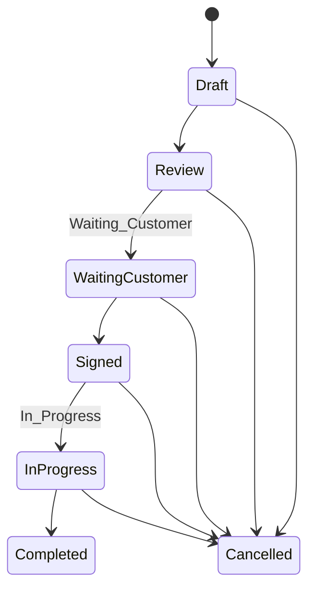
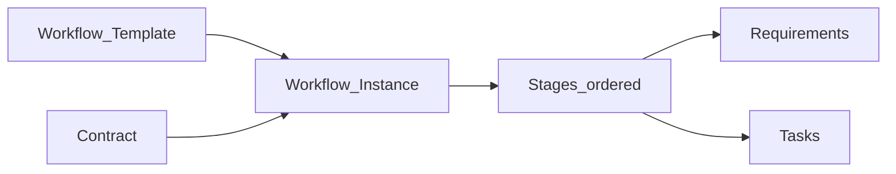
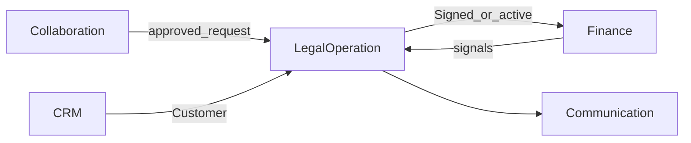
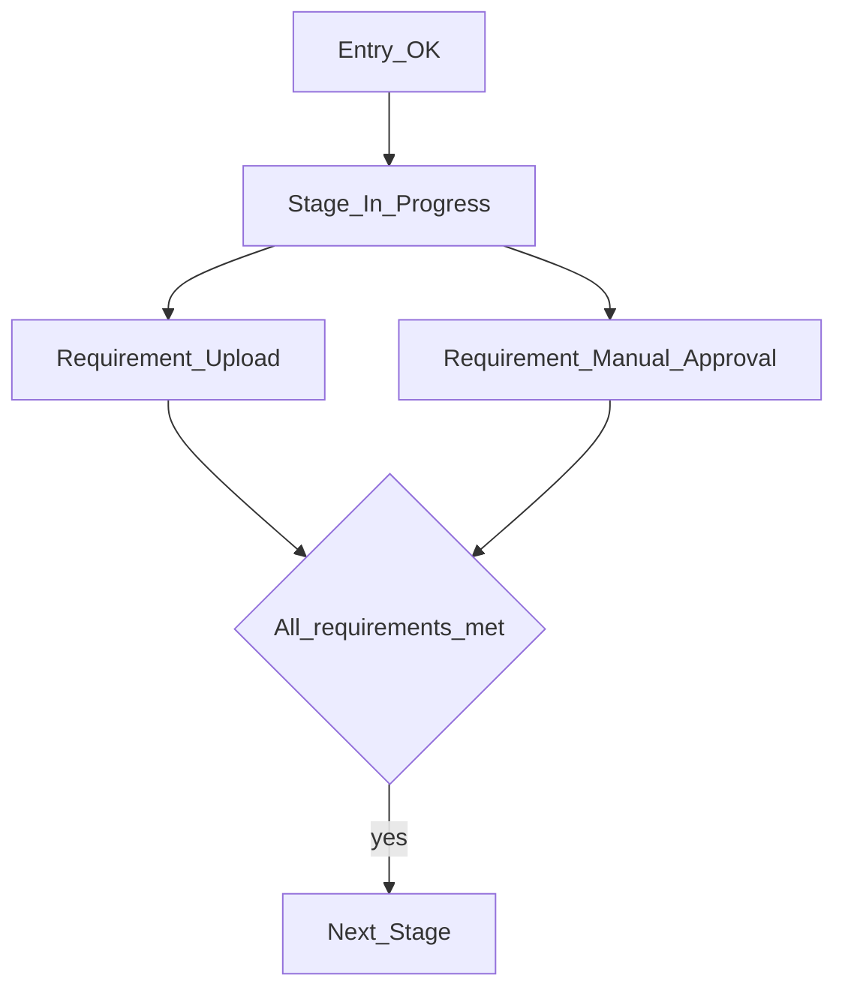

# Legal Operation — DYN CRM

> Bản tiếng Việt của [LegalOperation.md](./LegalOperation.md). Canonical: English.

## 1. Mục đích

Định nghĩa năng lực **Legal Operation**: vòng đời Contract chính thức, Workflow/Kanban cấu hình được (không BPMN), Task, Document, Timeline giao hàng pháp lý.

## 2. Phạm vi

Contract & transition; template workflow; task; tài liệu; liên kết Contract Request đã duyệt. Ngoài: gói lĩnh vực, BPMN, sổ finance.

## 3. Năng lực

Vòng đời hợp đồng; template cấu hình; Kanban; requirement theo stage; task + hạn + assignee; document; timeline.

Admin cấu hình: template, stage, thứ tự, requirement.

Loại requirement ví dụ: Upload Contract, Manual Approval, Payment Completed, Invoice Issued, Task Completed, Sepay Verification (**tương lai**).

## 4. Actor

Admin (template); Lawyer; Legal Assistant; Manager; Accounting (tín hiệu finance); CTV không tạo Official Contract.

## 5. Vòng đời

**Lưu ý:** Không auto `Completed` Contract khi workflow xong nếu chưa có rule khóa.

## 6. Đối tượng chính

Contract, Workflow Template/Instance, Stage, Stage Requirement, Task, Document metadata, Timeline.

Mỗi stage: entry condition, exit condition, responsible role.

## 7. Quy tắc

Status theo Phase 00; Official Contract do staff; workflow không BPMN; task có Assignee/Due/Reminder; StoragePort cho byte; Sepay là placeholder tương lai; cấm silent complete.

## 8. Permission

`workflow_template.manage`, `contract.read/write/approve`, `task.write`, `document.upload` — xem bảng EN; CTV không có quyền contract chính thức.

## 9. Events

`ContractCreated`, `ContractStatusChanged`, `WorkflowStarted`, `StageEntered/Completed`, `RequirementSatisfied`, `Task*`, `DocumentUploaded`.

## 10. Tương tác

## 11. Mở rộng

Template theo lĩnh vực; Sepay auto; lịch tranh tụng — ngoài MVP.

## 12. Sơ đồ

## 13. Open Questions

1. Ma trận Cancelled?  
2. Rule Completed vs workflow?  
3. Signal finance nào trong template MVP?  
4. Template mặc định tư vấn tổng quát?  
5. Nhiều workflow / Contract?  
6. Chính sách lưu trữ/version tài liệu?

## 14. TODO

- [ ] Khóa ma trận Cancelled  
- [ ] Khóa rule Contract↔Workflow  
- [ ] Công bố template MVP mặc định  
- [ ] Xác nhận Sepay chỉ future  
