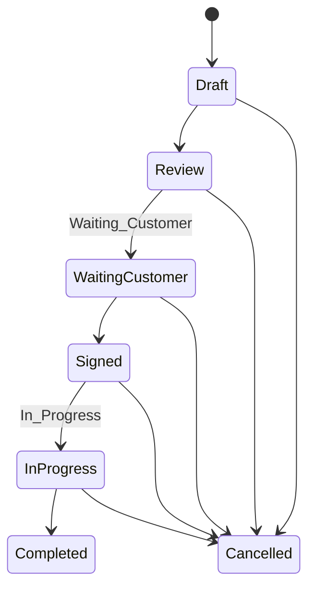
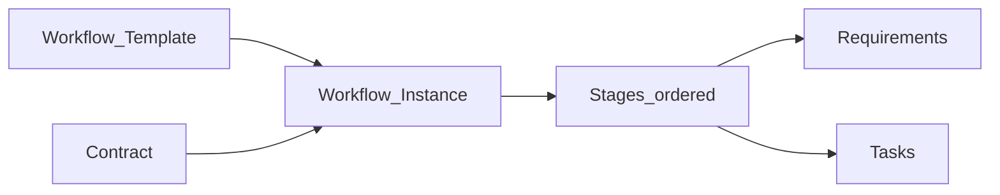
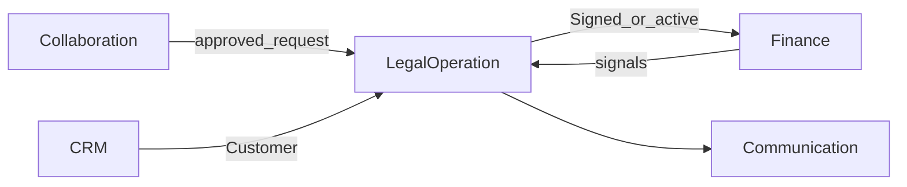
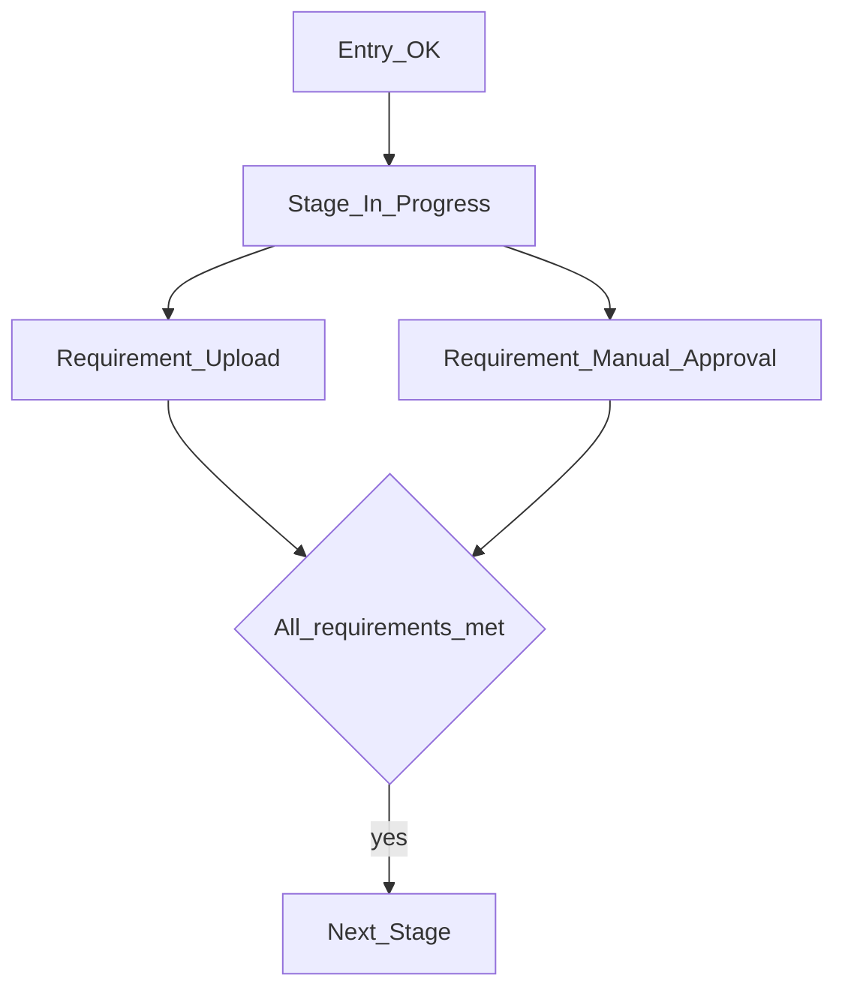

# Legal Operation — DYN CRM

> Bản tiếng Việt của [LegalOperation.md](./LegalOperation.md). Canonical: English.

## 1. Mục đích

Định nghĩa năng lực **Legal Operation**: vòng đời Contract chính thức, Workflow/Kanban cấu hình được (không BPMN), Task, Document, Timeline giao hàng pháp lý.

## 2. Phạm vi

Contract & transition; template workflow; task; tài liệu; liên kết Contract Request đã duyệt. Ngoài: gói lĩnh vực, BPMN, sổ finance.

## 3. Năng lực

Vòng đời hợp đồng; template cấu hình; Kanban; requirement theo stage; task + hạn + assignee; document; timeline.

Admin cấu hình: template, stage, thứ tự, requirement.

Loại requirement (cấu hình được — **không BPMN**):

| Loại | Ý nghĩa | MVP |
|------|---------|-----|
| File Upload | Tài liệu bắt buộc đã tải | Có |
| Manual Approval | Role/user phê duyệt | Có |
| Payment Completed | Tín hiệu Finance (đã thu) | Có (signal) |
| Invoice Issued | Tín hiệu Finance | Có (signal) |
| Task Completed | Task liên kết xong | Có |
| Signature | Chữ ký / xác nhận ký | Có (thủ công) |
| Custom Boolean | Cổng yes/no do Admin định nghĩa | Có (đơn giản) |
| External Verification (vd. Sepay) | Xác minh tự động tương lai | Tương lai |

## 4. Actor

Admin (template); Lawyer; Legal Assistant; Manager; Accounting (tín hiệu finance); CTV không tạo Official Contract.

## 5. Vòng đời

**Lưu ý:** Không auto `Completed` Contract khi workflow xong nếu chưa có rule khóa.

## 6. Đối tượng chính

Contract, Workflow Template/Instance, Stage, Stage Requirement, Task, Document metadata, Timeline.

Mỗi stage: entry condition, exit condition, responsible role.

## 7. Quy tắc

Status theo Phase 00; Official Contract do staff; workflow không BPMN; task có Assignee/Due/Reminder; StoragePort cho byte; Sepay là placeholder tương lai; cấm silent complete.

## 8. Permission

`workflow_template.manage`, `contract.read/write/approve`, `task.write`, `document.upload` — xem bảng EN; CTV không có quyền contract chính thức.

## 9. Events

`ContractCreated`, `ContractStatusChanged`, `WorkflowStarted`, `StageEntered/Completed`, `RequirementSatisfied`, `Task*`, `DocumentUploaded`.

## 10. Tương tác

## 11. Mở rộng

Template theo lĩnh vực; Sepay auto; lịch tranh tụng — ngoài MVP.

## 12. Sơ đồ

## 13. Open Questions

1. Ma trận Cancelled?  
2. Rule Completed vs workflow?  
3. Signal finance nào trong template MVP?  
4. Template mặc định tư vấn tổng quát?  
5. Nhiều workflow / Contract?  
6. Chính sách lưu trữ/version tài liệu?

## 14. TODO

- [ ] Khóa ma trận Cancelled  
- [ ] Khóa rule Contract↔Workflow  
- [ ] Công bố template MVP mặc định  
- [ ] Xác nhận Sepay chỉ future  

## 15. Aggregate Boundaries

| Aggregate Root | Con / thành phần | Quy tắc ranh giới |
|----------------|------------------|-------------------|
| **Contract** | Status, tham chiếu Customer, timeline | Sở hữu vòng đời thỏa thuận chính thức |
| **Workflow Template** | Stage, requirement, thứ tự | Cấu hình Admin; instance áp dụng |
| **Workflow Instance** | Stage hiện tại, trạng thái requirement | Gắn một Contract (nhiều instance → Open Q) |
| **Task** | Assignee, hạn, hoàn thành | Thuộc ngữ cảnh Legal / Contract |
| **Document metadata** | Link Contract/work; byte qua StoragePort | Metadata thuộc Legal; storage là hạ tầng |

## 16. Domain Invariants

| ID | Invariant |
|----|-----------|
| LEG-I1 | Contract không thành **Completed** trước **Signed** |
| LEG-I2 | Workflow xong không được âm thầm ép Contract=`Completed` nếu chưa khóa rule |
| LEG-I3 | Official Contract chỉ do staff tạo (CTV không tự tạo) |
| LEG-I4 | Thoát stage cần đủ requirement đã cấu hình (trừ override tường minh) |
| LEG-I5 | Workflow là template cấu hình — **không** BPMN |
| LEG-I6 | Task + reminder là việc giao, không phải process engine |

## 17. Primary Business Use Cases

| ID | Use case |
|----|----------|
| UC01 | Tạo Official Contract (tuỳ từ Request đã duyệt) |
| UC02 | Chuyển status Contract |
| UC03 | Cấu hình Workflow Template / stage / requirement |
| UC04 | Khởi tạo Workflow Instance trên Contract |
| UC05 | Tiến stage / thỏa requirement |
| UC06 | Tạo / hoàn thành Task |
| UC07 | Upload Document |
| UC08 | Xem Kanban theo stage |
| UC09 | Hủy Contract (theo ma trận đã khóa) |

## 18. Ownership Matrix

| Đối tượng | Domain sở hữu | Được tham chiếu bởi |
|-----------|---------------|---------------------|
| Contract | LegalOperation | Finance, Collaboration, Communication |
| Workflow Template / Instance | LegalOperation | Communication |
| Stage Requirement | LegalOperation | Finance (chỉ tín hiệu) |
| Task | LegalOperation | Communication |
| Document metadata | LegalOperation | — |
| Contract Request | Collaboration | Legal (tiêu thụ duyệt) |

## 19. Domain Event Matrix

| Event | Producer | Consumers |
|-------|----------|-----------|
| `ContractCreated` | LegalOperation | Finance, Communication |
| `ContractStatusChanged` | LegalOperation | Finance, Communication, Dashboard |
| `WorkflowStarted` | LegalOperation | Communication |
| `StageEntered` / `StageCompleted` | LegalOperation | Communication, Dashboard |
| `RequirementSatisfied` | LegalOperation | Communication |
| `TaskCreated` / `TaskCompleted` / `TaskOverdue` | LegalOperation | Communication |
| `DocumentUploaded` | LegalOperation | Communication (tuỳ chọn) |

## 20. Business Constraints

| Ràng buộc |
|-----------|
| Template **đang dùng** không gỡ stage mà instance phụ thuộc nếu chưa có chính sách migrate |
| Contract Signed / InProgress không xóa cứng tùy tiện |
| Contract Cancelled không bịa rule hoàn tiền (Finance sở hữu điều chỉnh tiền) |
| Catalog loại requirement mở rộng được; BPMN ngoài phạm vi |

## 21. Dynamic Features

| Tính năng | Lập trường |
|-----------|------------|
| Stage Requirement Types | Catalog mở rộng (§3) — File Upload, Manual Approval, Payment Completed, Invoice Issued, Task Completed, Signature, Custom Boolean, External Verification tương lai |
| Workflow Template | Admin cấu hình stage/thứ tự/requirement — **không BPMN** |
| Kanban | View vị trí stage, không phải process engine riêng |

## 22. Business Metrics

| Metric | Mục đích |
|--------|----------|
| Contract đang active | Workload / capacity |
| Contract theo status | Pipeline giao hàng pháp lý |
| Nghẽn stage | Thời gian trong stage / requirement bị block |
| Task quá hạn | Rủi ro giao hàng |
| Mức dùng template | Workflow nào chiếm ưu thế |

## 23. Cross Domain Dependency

| | Domain |
|--|--------|
| **Phụ thuộc** | Identity, CRM (Customer), Collaboration (Request đã duyệt — tuỳ chọn) |
| **Cung cấp cho** | Finance (Contract sẵn sàng), Communication, Dashboard |
| **Tiêu thụ tín hiệu từ** | Finance (`PaymentCompleted`, `InvoiceIssued`) |
