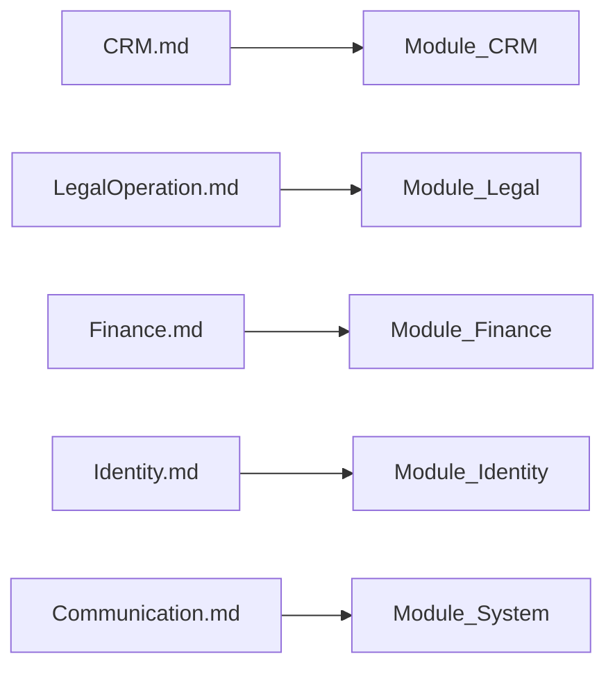

# Phase 02 — Domain Documentation Index

> Vietnamese version: [README.vi.md](./README.vi.md)  
> **Canonical:** English. Sync EN/VI in the same change set.

## 1. Purpose

This folder is the **business-domain source of truth** for DYN CRM after Phase 00 (product) and Phase 01 (architecture). It defines *what the business does* so Phase 03 (Database) and Phase 04 (Development) can proceed without obsolete assumptions.

**Status (2026-08-17):** Domain baseline complete. **Re-locking** stakeholder changes (especially CTV / Thu-Chi / SePay / Kanban / Order expiry).

## 2. Scope

| In scope | Out of scope |
|----------|--------------|
| Business capabilities and lifecycles | NestJS / Prisma / SQL / REST / DTO / UI |
| Actors, permissions (business level), events | Exact API routes and table DDL |
| Cross-domain interactions | Coding conventions |

**Rule:** Do not invent business rules. Missing items → Open Questions / TODO. Scope changes must be marked explicitly (see 2026-08-17 CTV removal).

## 3. Background

DYN CRM is a **Legal Operations Platform with CRM capability** for a law firm. MVP: ~30 concurrent users, pragmatic configurable workflows (not BPMN), modular monolith (Phase 01).

## 4. Document map

| Document | Business capability |
|----------|---------------------|
| [BusinessCapabilityMap.md](./BusinessCapabilityMap.md) | Cross-capability map and end-to-end value chain |
| [CRM.md](./CRM.md) | Lead, Customer, Contact, import, follow-up, export |
| [Collaboration.md](./Collaboration.md) | **SUPERSEDED portal** — CTV money → Finance only |
| [LegalOperation.md](./LegalOperation.md) | Contract, configurable workflow/Kanban, tasks, documents |
| [Finance.md](./Finance.md) | Order, schedule, payment, debt, VAT invoice, thu/chi |
| [Identity.md](./Identity.md) | User, role, permission, org extension points |
| [Communication.md](./Communication.md) | Notification, reminder, email (non-marketing) |

## 5. Alignment to Phase 01 modules

Collaboration / Commission modules are **not** in the implementation path unless S6 is reversed.

## 6. Reading order

1. BusinessCapabilityMap  
2. Identity  
3. CRM → LegalOperation → Finance  
4. Communication  
5. Collaboration **only** as the CTV scope-change record

## 7. Consistency gates

| Locked source | Must respect |
|---------------|--------------|
| Phase 00 Scope / Glossary | Lead ≠ Customer; Contract ≠ Order; Invoice **after** Payment |
| Phase 00 Scope (2026-08-17) | CTV portal **SUPERSEDED**; thu/chi or note only — **re-lock** |
| Phase 01 Module / Security | NestJS RBAC; PaymentProviderPort for SePay; no vendor in domain |

## 8. Standard sections (domain docs)

Each domain document follows sections **1–14** plus architectural reference **15–23** where useful. Finance adds **24–27** for 2026-08-17 topics.

## 9. Schema-critical vs non-schema-critical

Not every Open Question blocks all code. See [`OVERVIEW.md`](../../OVERVIEW.md).

**Schema-critical examples:** CTV removal, Income/Expense model, Order statuses/dates, Kanban Stage vs Status, unique contract number allocation, Customer date/industry/used-service, SePay boundary, Permission Group.

**Non-schema-critical examples:** email vs in-app, alert recipients, dashboard widgets, UI copy.

## 10. TODO (phase-level)

- [ ] Stakeholder re-lock of 2026-08-17 items (S6 first)  
- [x] Domain baseline §15–23 (prior review)  
- [ ] Proceed to Phase 03 models for Identity → CRM → Legal → Finance → Communication (**skip Collaboration** unless restored)  
